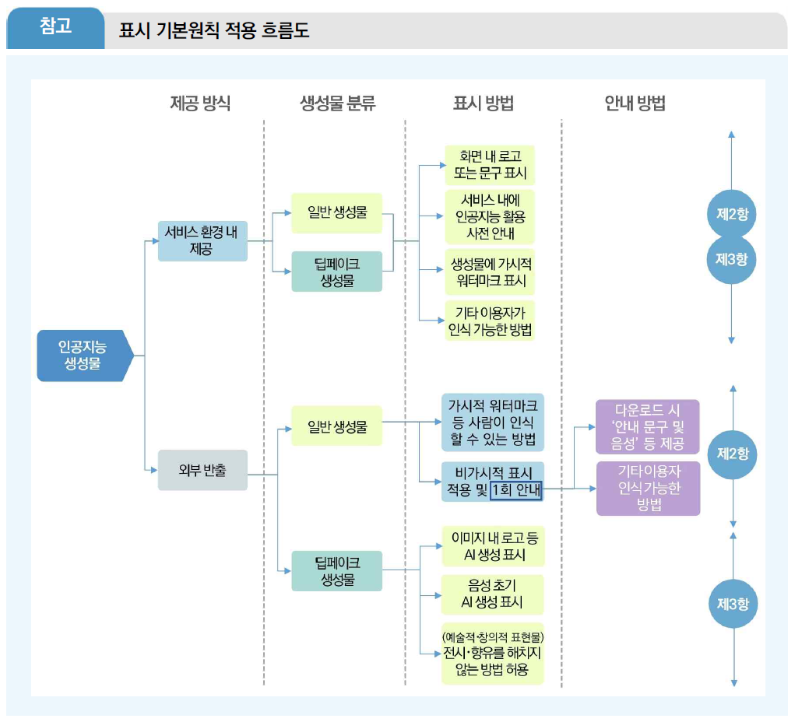

---

[1] AI 투명성 확보 가이드라인(과학기술정보통신부) 
[2] AI 안전성 확보 가이드라인(과학기술정보통신부) 
[3] 고영향 AI 판단 가이드라인(과학기술정보통신부) 
[4] 고영향 AI 사업자 책무 가이드라인(과학기술정보통신부) 
[5] AI 영향평가 가이드라인(과학기술정보통신부) 

---

---
# [1] AI 투명성 확보 가이드라인(과학기술정보통신부)

## [1-1] 투명성 확보 의무 개요
**투명성 확보 의무의 취지**  
이용자가 인공지능 기반 제품･서비스를 이용하고 있다는 사실과, 제공되는 결과물이 인공지능에 의해 생성된 것임을 명확히 인식할 수 있도록 함 
정보 이용 과정에서의 혼동과 오인 방지 및 사회적 신뢰를 제고하기 위한 제도적 장치를 마련하는 데 목적이 있음 

**투명성 확보 의무 내용**  
인공지능 기본법 제 31조 “인공지능 투명성 확보 의무”의 주요 의무 사항 
(제1항) 고영향 인공지능이나 생성형 인공지능을 이용한 제품･서비스의 AI 기반 운용 사실을 사전 고지 
(제2항,제3항) 인공지능 생성 결과물이 생성형 인공지능 또는 인공지능 시스템에 의해 생성되었다는 사실을 고지 및 표시 

**적용 대상 및 범위**  
인공지능 투명성 확보 의무는 이용자에게 최종적으로 AI 제품 및 서비스를 제공하는 인공지능사업자에게 부과 

파운데이션 모델 개발자가 직접 이용자에게 AI 제품·서비스를 제공하는 경우에는 직접적인 투명성 확보 의무가 발생 
해외 사업자라도 우리 국민에게 영향을 미치면 적용 대상 
단순히 AI 제품·서비스를 이용한 결과물을 자신의 서비스 등에 활용하는 자는 인공지능사업자에 해당하지 않으며 투명성 확보 의무 적용 대상이 아님 

**인공지능사업자의 구분**  
(AI개발사업자) 인공지능 제품이나 인공지능 서비스에 활용되는 인공지능을 <ins>개발</ins>하여 <ins>제공</ins>하는 자를 의미 
 <ins>개발</ins> : 인공지능 또는 인공지능 기술을 직접 개발하거나, 그 성능에 중대한 영향을 줄 정도로 수정･변경･개량한 것을 의미 
 <ins>제공</ins> : 유료로 제공하는 것 외에도 무상(공공서비스, 오픈소스 등)의 제공도 포함 
(AI이용사업자) AI개발사업자가 제공한 인공지능을 <ins>이용</ins>하여 인공지능 제품 또는 인공지능 서비스를 <ins>제공</ins>하는 자를 의미 
 <ins>이용</ins> : AI개발사업자로부터 직접 제공받은 경우는 물론, 다른 인공지능 이용사업자를 통해 제공받은 경우도 포함 
 <ins>제공</ins> : 인공지능에 기반한 기능을 수행하거나 직접 실행하는 제품을 이용자에게 제공하거나, 또는 인공지능을 활용한 서비스를 이용자의 이용에 제공하는 것으로, 이용자에 대한 제공 행위가 필수적으로 있어야 해당 

 

## [1-2] 투명성 조항별 설명
**사전 고지의무** : 인공지능을 이용한 ‘제품/서비스’에 관한 것이며 생성 결과물과는 무관 
AI사업자가 고영향 AI나 생성형 AI를 이용한 제품･서비스를 제공하려는 경우 해당하며, 제품･서비스가 AI에 기반하여 운용된다는 사실을 이용자에게 사전에 고지해야 함(법 제 31조 제 1항) 

	 사전에 고지하는 방법 (시행령 제23조 제1항)
	 1. 제품 등에 직접 기재하거나, 계약서, 사용설명서, 이용약관 등에 기재
	 2. 이용자의 화면 또는 단말기 등에 표시
	 3. 제품 등을 제공하는 장소(해당 장소와 합리적으로 관련된 범위의 장소를 포함한다)에 인식하기 쉬운 방법으로 게시
	 4. 그 밖에 제품 등의 특성을 고려하여 과학기술정보통신부장관이 인정하는 방법
 
**표시 의무** : AI사업자는 생성형 AI를 활용한 제품･서비스를 제공하는 경우, 그 결과물이 생성형 AI에 의해 생성되었다는 사실을 표시해야 함(법 제31조 제 2항) 

	 표시하는 방법 (시행령 제23조 제2항)
	 1. 표시 방법은 사람이 인식할 수 있는 방법과 기계가 판독할 수 있는 방법이 있음
	 2. 기계가 판독할 수 있는 방법을 사용할 경우에는 최소 1회 이상 안내 문구･음성 등을 제공해야 함

**결과물이 딥페이크인 경우의 표시 의무**  
AI사업자는 AI 시스템을 이용해 딥페이크 결과물을 제공하는 경우 해당 결과물이 AI에 의해 생성되었다는 사실을 이용자가 명확히 인식할 수 있는 방식으로 고지 또는 표시해야 함(법 제31조 제 3항) 
<ins>딥페이크란 “실제와 구분하기 어려운 가상의 음향, 이미지 또는 영상 등의 결과물”을 의미하며, 텍스트는 해당되지 않음</ins> 

	 표시와 관련하여 고려할 사항 (시행령 제23조 제3항)
	 1. 이용자가 시각, 청각 등을 통하거나 소프트웨어 등을 이용하여 쉽게 내용을 확인할 수 있는 방법으로 고지 또는 표시할 것
	 2. 주된 이용자의 연령, 신체적･사회적 조건 등을 고려하여 고지 또는 표시할 것

예술적･창의적 표현물에 해당하는 경우 전시･향유를 저해하지 않는 방식으로 고지 또는 표시할 수 있음(법 제 31조 제 3항) 
예술적･창의적 표현물이란 미술, 영화, 문학, 사진, 출판, 만화, 게임, 애니메이션 등 창의적 표현 활동에 따른 결과물 

 

## [1-3] 사전고지 방법
**사전고지 취지** : 제품･서비스가 고영향 또는 생성형AI에 기반되어 운용되는 것임을 사전에 알려 이용자가 주의를 기울일 수 있도록 함 
(이용약관･계약서 활용) 제공하는 서비스의 이용약관, 서비스 가입 절차 및 계약서에 생성형AI 또는 고영향AI를 활용함을 명시 
(화면 표시) S/W, 모바일 어플리케이션 등을 통해 서비스 제공시 화면상에 생성형AI 또는 고영향AI를 활용함을 명시 
(제공장소에 게시) 오프라인 서비스의 경우 이용 전 충분히 인식할 수 있는 관련 장소에 게시 

 

## [1-4] 표시방법
**표시 기본원칙** : AI 생성 결과물이 AI에 의해 생성되었다는 사실을 인지할 수 있도록 표시하여야 하며, 제품·서비스를 직접 이용하는 이용자를 대상으로는 서비스 이용 환경을 통한 표시가 가능 

서비스 내 제공 단계에서 UI 등에 표시를 하였더라도, 다운로드·공유 등 외부 반출 기능 제공 시에는 결과물을 통해 생성 사실을 알 수 있도록 결과물 내에 표시하여야 함 
여러 유형의 결과물을 생성할 수 있는 경우(ex. 텍스트･이미지 모두 출력할 수 있는 범용 AI 등) 각 결과물의 유형에 따른 표시 방법을 적용 
단순 편집 등 ‘생성형 AI’의 본질적 기능이 사용되지 않은 경우 표시 대상에서 제외(동일 제품･서비스 내에서라도 생성형 AI 연계 기능을 적용하지 않고 다른 일반적인 편집기능(이미지 자르기 등)만 사용된 경우) 

	(딥페이크) 이용자의 입력, 조작 등에 따라 실제와 구분하기 어려운 가상의 결과물을 생성할 수 있는
	AI 제품･서비스의 경우 인공지능사업자가 해당 여부를 판단하여 표시 방법을 적용하여야 하며, 
	이를 판단･통제할 수 없는 경우 딥페이크의 기준을 적용(ex.이미지 생성 서비스가 일반적인 풍경, 
	캐릭터 생성뿐만 아니라, 실제 사람과 유사한 이미지를 생성할 가능성이 있는 경우) 

**서비스내 제공 표시방법**

	(대상) 서비스 이용 환경(UI 등) 내에서 제한적으로 결과물이 표현되는 경우
	(유의점) 해당 AI 생성 결과물을 다운로드･공유 등 서비스 외부로 반출하는 
	         기능을 제공하는 경우 결과물에 표시를 하여야 함 
	
|구분|내용|표시방법|
|---|---|---|
|일반 생성물 |실제와 구분하기 어려운 수준에 해당하지 않는 AI 생성물(딥페이크 생성물과의 구분을 위해 새롭게 정의된 내용)|결과물 내 또는 서비스 내(화면 등) 정보의 표출 등으로 AI 생성물임을 충분히 인지할 수 있는 방법으로 표시(단, 서비스 이용 환경 내에서 기계가 판독할 수 있는 방법을 적용 시 별도 1회 이상 안내 문구･음성 등을 제공),최종 결과물 이전에 이용자가 프롬프트 입력, 생성 이미지 선택 등 편집 과정의 모든 중간 생성물에 각각 표시할 의무는 없으며 결과물 제공(추출, 저장 등) 단계에서 표시|
|딥페이크 생성물 |실제와 구분하기 어려운 가상의 음향, 이미지 또는 영상 등의 결과물|일반 생성물과 동일한 표시방법 적용|

**외부 반출 표시방법 예시**
	(대상) 다운로드, 공유 등 AI 생성 결과물을 외부로 반출하는 기능을 제공하는 경우
	(유의점) 이용자의 입력, 조작에 따라 실제와 구분하기 어려운 결과물을 생성하여
	외부로 반출하는 기능을 제공하는 AI 제품･서비스의 경우 인공지능사업자가 해당 여부를 
	판단하여 표시 방법을 적용하여야 하며, 이를 판단･통제할 수 없는 경우 딥페이크의 기준을 적용

|구분|내용|표시방법|
|---|---|---|
|일반 생성물 |실제와 구분하기 어려운 수준에 해당하지 않는 AI 생성물(딥페이크 생성물과의 구분을 위해 새롭게 정의된 내용)|결과물에 로고 삽입 등 사람이 인식할 수 있는 방법 또는 기계가 판독할 수 있는 방법을 적용(단, 서비스 이용 환경 내에서 기계가 판독할 수 있는 방법을 적용 시 1회 이상 안내 문구･음성 등을 제공, 최종 결과물 이전에 이용자가 프롬프트 입력, 생성 이미지 선택 등 편집 과정의 모든 중간 생성물에 각각 표시할 의무는 없으며 결과물 제공(추출, 저장 등) 단계에서 표시(실제와 구분하기 어려운 결과물을 제공할 가능성이 없을 것으로 사업자가 명확하게 판단할 수 있는 AI제품･서비스의 경우(예: 웹툰･캐릭터･애니메이션 전용 저작도구 등), 일반 생성물의 표시 기준을 적용 가능)|
|딥페이크 생성물 |실제와 구분하기 어려운 가상의 음향, 이미지 또는 영상 등의 결과물|사람이 직관적으로 인식할 수 있는 표시 방법 적용（인물의 특성 합성, 딥페이크 등 오인･혼동 또는 피해 발생의 위험성이 있는 결과물의 경우, 해당 위험성을 고려한 추가적인 조치 필요)|
||예술적･창의적 표현물|전시･향유를 저해하지 않는 방법으로 완화된 표시 방법을 허용(시간적으로 주요 콘텐츠와 차이를 두어 표시하거나 비가시적인 표시 방법 적용 등)|

 

## [1-5] 참고자료
**이미지 기반 서비스**  
인공지능 기술에 기반하여 예술 작품이나 사실적인 사진, 복잡한 이미지나 효과를 적용하는 등의 방식으로 새로운 이미지를 창작 및 수정 
대표적인 이미지 인공지능 콘텐츠 생성 서비스로 DALL･E(OpenAI), FireFly(Adobe), Stable Diffusion(Stability AI) 등의 플랫폼이 존재 

**동영상 기반 서비스**  
영상을 생성하거나 영상의 변환･편집 등 작업을 수행하며1), 주로 사용자가 작성한 각본(Script)과 입력한 명령어에 따라 영상을 자동으로 생성 
텍스트(Text-To-Video) 혹은 이미지(Image-To-Video)를 바탕으로 동영상을 생성하는 서비스는 Sora(OpenAI), VideoFx/Veo3Google, Stable Video Diffusion(Stability AI) 등의 플랫폼이 존재 

**텍스트 기반 서비스**  
대규모 텍스트 데이터를 기반으로 한 언어 모델을 활용해 인간과 유사한 레벨에서 언어를 이해하고 생성 및 응답함으로써 높은 성능을 발휘 
대표적으로 ChatGPTOpenAI, GeminiGoogle, ClaudeClaude, HyperCLOVAXNaver 등의 서비스가 존재 

**오디오 기반 서비스**  
인공지능 기술을 사용하여 사람의 목소리나 음악을 학습하여 새로운 음성이나 오디오 생성 
텍스트(Text-To-Speech)를 바탕으로 가상 비서, 음성 보조 기기 등에 활용되고 있으며, WaveNetGoogle, AI SpeechMicrosoft Azure, Amazon PollyAWS 등이 존재 

**가짜뉴스 생성(1)**  
가짜뉴스는 뉴스 형태로 제시된 허위 또는 오해의 소지가 있는 정보이며, 종종 개인이나 단체의 평판을 손상시키거나 광고 수익을 통해 돈을 벌려는 목적을 포함 
가짜뉴스에 대한 시민의 인식을 확인하기 위한 통계 조사 결과, 가짜뉴스를 경험해 보았다는 비율이 43.3%에 달하고, 인공지능이 발달하면서 가짜뉴스 피해도 심화될 것이라는 전망에 84.2%가 동의 ⇒ 통계 사례로 볼 수 있듯이 가짜뉴스는 이미 대중의 생활 곳곳에 침투하고 있어, 이에 대한 대책 마련이 시급 

2023년 5월 미국에서 펜타곤이 폭발하는 사진이 소셜미디어인 트위터에서 언론까지 광범위하게 퍼지며 큰 혼란을 야기 
펜타곤 대변인은 "펜타곤은 공격받지 않았다."고 밝혔고, 펜타곤 주변을 관할하는 경찰과 소방 당국 역시 "펜타곤 보호구역이나 근처에서 폭발이나 사고가 발생하지 않았으며 대중에게 위험은 없다."고 전하며 해당 사진은 인공지능 생성물임을 공개 
그러나, 사진이 유포되자 S&P500 지수가 한때 0.3% 하락하는 등 증시는 출렁였고, 유사시 안전 자산으로 꼽히는 미 국채와 금값도 잠시 상승 

**가짜뉴스 생성(2)**  
생성형 인공지능의 활용은 동영상, 이미지, 오디오 등 선거 운동에 필요한 다양한 콘텐츠 제작을 가능하게 하며 선거에 영향력 행사 
가짜 인공지능 생성 콘텐츠는 유권자들 사이에서 혼란을 야기하고, 특정 후보에 대한 부정적인 인식을 심어줄 수 있는 가능성 존재 

**美 대통령 선거 딥페이크 이미지 유포 사건**  
2023년 미국 선거기간에 해당 후보의 지지자들은 흑인 유권자들을 공략하기 위해 흑인들이 후보를 지지한다는 취지의 사진을 인공지능으로 생성하여 공유 
후보자를 비방하기 위해서 생성형 AI 모델인 ‘미드저니’를 이용해 후보자가 체포되는 장면과 형을 선고받아 투옥되는 장면 등을 제작한 뒤 소셜미디어에 게시 

**디지털 성범죄**  
생성형 인공지능을 오남용하여 성적 허위 영상물(성착취물)을 제작 및 유포하는 행위가 발생하고 있으며, 연예인이나 지인의 얼굴을 음란물과 합성해 유포하는 디지털 성범죄가 빈번히 발생 
이미지의 유포･합성･소비의 가능성을 무한대로 확장시키기 때문에 디지털 성범죄는 피해와 가해의 구도가 1대 N을 이루고, 생산자와 소비자의 경계가 불분명 

**생성형 인공지능 활용 아동 성착취물 제작자 기소**  
2023년 4월, 생성형 인공지능 서비스에 ‘나체’, ‘어린이’ 등의 텍스트를 입력하여 360개의 아동 성착취물을 제작한 사건이 발생 
우리나라 법원에서는 해당 행위가 아동･청소년의 성보호에 관한 법률에 위반되었다고 판시하여 징역 2년6개월 선고 
피고인은 유포할 목적이 없었고, 가상의 이미지를 가지고 있는 것은 처벌 대상이 아니라고 생각했다고 진술했으나 재판부는 피해자가 없다고 해도 성적 표현물 자체가 명백하게 아동으로 인식될 수 있다면 아동청소년보호법 위반에 해당할 수 있다고 판시 

**생성형 인공지능의 AI 표절**  
생성형 인공지능이 학술논문, 자기소개서, 기사, 논문에 사용하는 그림 등을 생성하여 활용하는 사례가 증가하면서 공동 저자로 등록하고, 서로 다른 논문임에도 유사한 그림, 글이 무분별하게 양산 

**과학기술 저널에 등재된 공동 저자 ‘ChatGPT’**  
ChatGPT가 2023년 한해 책/저널을 발표하여 저작권을 보유하고 있는 경우 200여 권이 확인, 네이처의 발표에 따르면 최소 4편 이상이 연구논문에 공동 저자로 등록 

(과학계) ChatGPT가 공동 저자로 등록하는 것이 표절 문제를 동반한다면 최소한의 윤리 지침을 지켜야 한다고 지적하며 네이처 등에서는 저자로서 인정 불가 의사 표시 

 

## [1-6] 참고자료
**AI 서울 정상회의(2024.5)**  
'안전하고 혁신적이며 포용적인 AI를 위한 서울 선언'과 '프론티어 AI 안전 서약'이 체결 
구글, LG AI연구소, 세일즈포스, KT, 마이크로소프트, 삼성전자, 앤스로픽, SK텔레콤, IBM, 네이버, 코히어, 카카오, 오픈AI, 어도비 등 총 14개 기업이 서약에 서명하였으며 주요 내용은 다음과 같다. 

	AI 안전 연구소 간 네트워크 확대 및 글로벌 협력 촉진
	워터마크 등 인공지능이 생성하는 콘텐츠 식별을 위한 조치와 국제표준 개발 협력 강화
	AI 모델에 대한 위협 평가를 위한 레드팀 구성 및 안전성 접근 방식을 투명하게 공유

**히로시마 AI 프로세스 행동강령 발표(2023.12)**  
G7(회원국은 미국･일본･독일･영국･프랑스･이탈리아･캐나다이며, EU는 참가국 자격 활동)은 2023년 5월 일본에서 개최된 히로시마 정상회의에서 인공지능의 위험을 관리하는 국제규범인 ‘히로시마 AI 프로세스’ 수립에 대해 합의 
개발자가 가짜정보의 확산과 프라이버시 침해 위험을 완화하는 방안을 검증받고, 인공지능 콘텐츠에 대한 워터마크 삽입하는 등의 ‘히로시마 AI 프로세스 행동강령’ 발표 ⇒ 기술적으로 가능한 경우 워터마크 또는 ‘인공지능 콘텐츠임을 알 수 있도록 하는 기타 기술적 조치’ 등 인공지능 콘텐츠의 진본성 및 출처 체제를 개발 이행할 것을 요구 

**독일 뮌헨안보회의(MSC) 딥페이크 공동 대응 논의(2024.2)**
독일 뮌헨안보회의(MSC)에서 20개 글로벌 빅테크 기업들이 공동으로 인공지능 기술을 악용해 선거에 영향을 끼치는 행위에 공동 대응하기로 합의했다고 발표 
합의문의 제목은 ‘2024년 선거에서 인공지능의 기만적 사용을 방지하기 위한 기술 협약’(Tech Accord to Combat Deceptive Use of AI in 2024 Elections) ⇒ 해당 합의문에는 선거에 영향을 미치는 인공지능 사기 콘텐츠를 막기 위한 기술 개발, 인공지능 사기 콘텐츠와 관련하여 발새알 수 있는 위험 평가 모델 수립 등에 대한 조약 

---
# [2] AI 안전성 확보 가이드라인(과학기술정보통신부)

---
# [3] 고영향 AI 판단 가이드라인(과학기술정보통신부)

---
# [4] 고영향 AI 사업자 책무 가이드라인(과학기술정보통신부)

---
# [5] AI 영향평가 가이드라인(과학기술정보통신부)
