 

 

 

 

 

---

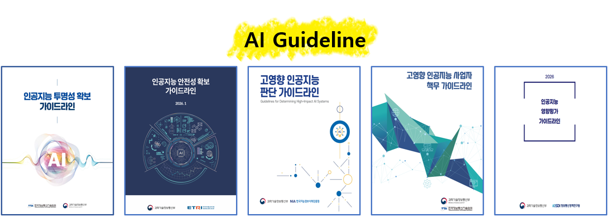

**[1] AI 투명성 확보 가이드라인(과학기술정보통신부)** : AI 사용·생성 결과를 사용자에게 명확히 알림 

**[2] AI 안전성 확보 가이드라인(과학기술정보통신부)** : 위험관리·리스크 완화 체계 구축 

**[3] 고영향 AI 판단 가이드라인(과학기술정보통신부)** : 어떤 AI가 고영향 AI인지 판정하는 기준 제공 

**[4] 고영향 AI 사업자 책무 가이드라인(과학기술정보통신부)** : 고영향 AI 운영자에 대한 구체적 책임 규정 

**[5] AI 영향평가 가이드라인(과학기술정보통신부)** : 기본권·사회적 영향의 사전·사후 평가 
 
https://www.sw.or.kr/AI_act_helpdesk/board.jsp?bcIdx=64993 

---

# [1] AI 투명성 확보 가이드라인(과학기술정보통신부)
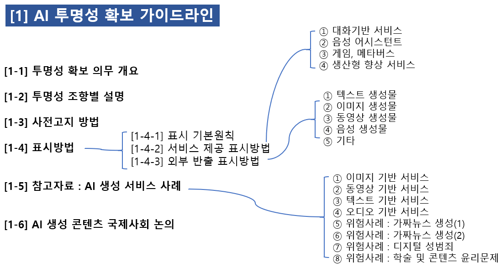

이용자가 인공지능 기반 제품 및 서비스를 이용하고 있다는 사실과, 제공되는 결과물이 인공지능에 의해 생성된 것임을 명확히 인식할 수 있도록 하고, 정보 이용 과정에서의 혼동과 오인 방지 및 사회적 신뢰를 제고하기 위한 제도적 장치를 마련 

https://github.com/YangGuiBee/AIG/blob/main/TextBook-06/AIG_guide1.pdf

---

# [1-1] 투명성 확보 의무 개요
## 투명성 확보 의무의 취지
이용자가 인공지능 기반 제품･서비스를 이용하고 있다는 사실과, 제공되는 결과물이 인공지능에 의해 생성된 것임을 명확히 인식할 수 있도록 함 
정보 이용 과정에서의 혼동과 오인 방지 및 사회적 신뢰를 제고하기 위한 제도적 장치를 마련하는 데 목적이 있음 

## 투명성 확보 의무 내용
인공지능 기본법 제 31조 “인공지능 투명성 확보 의무”의 주요 의무 사항 
(제1항) 고영향 인공지능이나 생성형 인공지능을 이용한 제품･서비스의 AI 기반 운용 사실을 사전 고지 
(제2항,제3항) 인공지능 생성 결과물이 생성형 인공지능 또는 인공지능 시스템에 의해 생성되었다는 사실을 고지 및 표시 
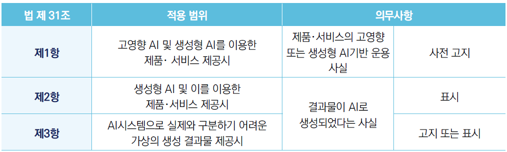

## 적용 대상 및 범위
인공지능 투명성 확보 의무는 이용자에게 최종적으로 AI 제품 및 서비스를 제공하는 인공지능사업자에게 부과 
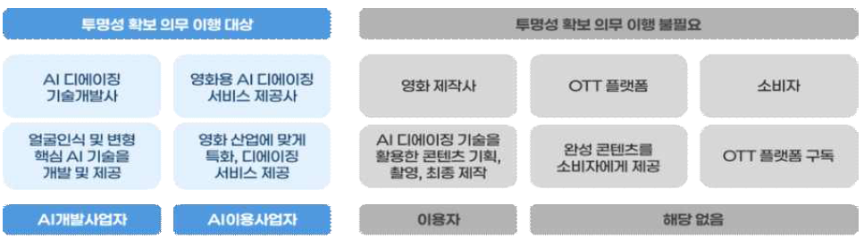

파운데이션 모델 개발자가 직접 이용자에게 AI 제품·서비스를 제공하는 경우에는 직접적인 투명성 확보 의무가 발생 
해외 사업자라도 우리 국민에게 영향을 미치면 적용 대상 
단순히 AI 제품·서비스를 이용한 결과물을 자신의 서비스 등에 활용하는 자는 인공지능사업자에 해당하지 않으며 투명성 확보 의무 적용 대상이 아님 

## 인공지능사업자의 구분
**(AI개발사업자)** 인공지능 제품이나 인공지능 서비스에 활용되는 <ins>인공지능을 개발하여 제공하는 자</ins>를 의미 
 <ins>개발</ins> : 인공지능 또는 인공지능 기술을 직접 개발하거나, 그 성능에 중대한 영향을 줄 정도로 수정･변경･개량한 것을 의미 
 <ins>제공</ins> : 유료로 제공하는 것 외에도 무상(공공서비스, 오픈소스 등)의 제공도 포함 
**(AI이용사업자)** AI개발사업자가 제공한 <ins>인공지능을 이용하여 인공지능 제품 또는 인공지능 서비스를 제공하는 자</ins>를 의미 
 <ins>이용</ins> : AI개발사업자로부터 직접 제공받은 경우는 물론, 다른 인공지능 이용사업자를 통해 제공받은 경우도 포함 
 <ins>제공</ins> : 인공지능에 기반한 기능을 수행하거나 직접 실행하는 제품을 이용자에게 제공하거나, 또는 인공지능을 활용한 서비스를 이용자의 이용에 제공하는 것으로, 이용자에 대한 제공 행위가 필수적으로 있어야 해당 

 

---
# [1-2] 투명성 조항별 설명
## 사전 고지의무
인공지능을 이용한 ‘제품/서비스’에 관한 것이며 생성 결과물과는 무관 
AI사업자가 고영향 AI나 생성형 AI를 이용한 제품･서비스를 제공하려는 경우 해당하며, 제품･서비스가 AI에 기반하여 운용된다는 사실을 이용자에게 사전에 고지해야 함(법 제 31조 제 1항) 

	 사전에 고지하는 방법 (시행령 제23조 제1항)
	 1. 제품 등에 직접 기재하거나, 계약서, 사용설명서, 이용약관 등에 기재
	 2. 이용자의 화면 또는 단말기 등에 표시
	 3. 제품 등을 제공하는 장소(해당 장소와 합리적으로 관련된 범위의 장소를 포함한다)에 인식하기 쉬운 방법으로 게시
	 4. 그 밖에 제품 등의 특성을 고려하여 과학기술정보통신부장관이 인정하는 방법
 
## 표시 의무
AI사업자는 생성형 AI를 활용한 제품･서비스를 제공하는 경우, 그 결과물이 생성형 AI에 의해 생성되었다는 사실을 표시해야 함(법 제31조 제 2항) 

	 표시하는 방법 (시행령 제23조 제2항)
	 1. 표시 방법은 사람이 인식할 수 있는 방법과 기계가 판독할 수 있는 방법이 있음
	 2. 기계가 판독할 수 있는 방법을 사용할 경우에는 최소 1회 이상 안내 문구･음성 등을 제공해야 함

## 결과물이 딥페이크인 경우의 표시 의무
AI사업자는 AI 시스템을 이용해 딥페이크 결과물을 제공하는 경우 해당 결과물이 AI에 의해 생성되었다는 사실을 이용자가 명확히 인식할 수 있는 방식으로 고지 또는 표시해야 함(법 제31조 제 3항) 
<ins>딥페이크란 “실제와 구분하기 어려운 가상의 음향, 이미지 또는 영상 등의 결과물”을 의미하며, 텍스트는 해당되지 않음</ins> 

	 표시와 관련하여 고려할 사항 (시행령 제23조 제3항)
	 1. 이용자가 시각, 청각 등을 통하거나 소프트웨어 등을 이용하여 쉽게 내용을 확인할 수 있는 방법으로 고지 또는 표시할 것
	 2. 주된 이용자의 연령, 신체적･사회적 조건 등을 고려하여 고지 또는 표시할 것

예술적･창의적 표현물에 해당하는 경우 전시･향유를 저해하지 않는 방식으로 고지 또는 표시할 수 있음(법 제 31조 제 3항) 
예술적･창의적 표현물이란 미술, 영화, 문학, 사진, 출판, 만화, 게임, 애니메이션 등 창의적 표현 활동에 따른 결과물 

 

---
# [1-3] 사전고지 방법
## 사전고지 취지
제품･서비스가 고영향 또는 생성형AI에 기반되어 운용되는 것임을 사전에 알려 이용자가 주의를 기울일 수 있도록 함 
(이용약관･계약서 활용) 제공하는 서비스의 이용약관, 서비스 가입 절차 및 계약서에 생성형AI 또는 고영향AI를 활용함을 명시 
(화면 표시) S/W, 모바일 어플리케이션 등을 통해 서비스 제공시 화면상에 생성형AI 또는 고영향AI를 활용함을 명시 
(제공장소에 게시) 오프라인 서비스의 경우 이용 전 충분히 인식할 수 있는 관련 장소에 게시 
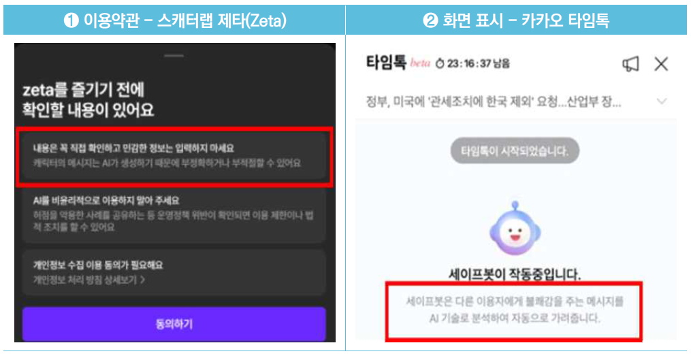

 

---
# [1-4] 표시방법
## [1-4-1] 표시 기본원칙
AI 생성 결과물이 AI에 의해 생성되었다는 사실을 인지할 수 있도록 표시하여야 하며, 제품·서비스를 직접 이용하는 이용자를 대상으로는 서비스 이용 환경을 통한 표시가 가능 
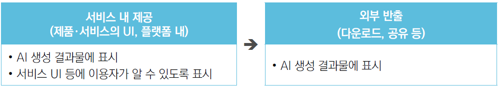

서비스 내 제공 단계에서 UI 등에 표시를 하였더라도, 다운로드·공유 등 외부 반출 기능 제공 시에는 결과물을 통해 생성 사실을 알 수 있도록 결과물 내에 표시하여야 함 
여러 유형의 결과물을 생성할 수 있는 경우(ex. 텍스트･이미지 모두 출력할 수 있는 범용 AI 등) 각 결과물의 유형에 따른 표시 방법을 적용 
단순 편집 등 ‘생성형 AI’의 본질적 기능이 사용되지 않은 경우 표시 대상에서 제외(동일 제품･서비스 내에서라도 생성형 AI 연계 기능을 적용하지 않고 다른 일반적인 편집기능(이미지 자르기 등)만 사용된 경우) 

	(딥페이크) 이용자의 입력, 조작 등에 따라 실제와 구분하기 어려운 가상의 결과물을 생성할 수 있는
	AI 제품･서비스의 경우 인공지능사업자가 해당 여부를 판단하여 표시 방법을 적용하여야 하며, 
	이를 판단･통제할 수 없는 경우 딥페이크의 기준을 적용(ex.이미지 생성 서비스가 일반적인 풍경, 
	캐릭터 생성뿐만 아니라, 실제 사람과 유사한 이미지를 생성할 가능성이 있는 경우) 

## [1-4-2] 서비스 제공 표시방법
**① 대화기반 서비스**  
**② 음성 어시스턴트**  
**③ 게임, 메타버스**  
**④ 생산형 향상 서비스**  

	(대상) 서비스 이용 환경(UI 등) 내에서 제한적으로 결과물이 표현되는 경우
	(유의점) 해당 AI 생성 결과물을 다운로드･공유 등 서비스 외부로 반출하는 
	         기능을 제공하는 경우 결과물에 표시를 하여야 함 
	
|구분|내용|표시방법|
|---|---|---|
|일반 생성물 |실제와 구분하기 어려운 수준에 해당하지 않는 AI 생성물(딥페이크 생성물과의 구분을 위해 새롭게 정의된 내용)|결과물 내 또는 서비스 내(화면 등) 정보의 표출 등으로 AI 생성물임을 충분히 인지할 수 있는 방법으로 표시(단, 서비스 이용 환경 내에서 기계가 판독할 수 있는 방법을 적용 시 별도 1회 이상 안내 문구･음성 등을 제공),최종 결과물 이전에 이용자가 프롬프트 입력, 생성 이미지 선택 등 편집 과정의 모든 중간 생성물에 각각 표시할 의무는 없으며 결과물 제공(추출, 저장 등) 단계에서 표시|
|딥페이크 생성물 |실제와 구분하기 어려운 가상의 음향, 이미지 또는 영상 등의 결과물|일반 생성물과 동일한 표시방법 적용|

### ① 대화기반 서비스
(적용대상) AI 챗봇, 대화창 등 지속적 상호작용을 통해 결과물이 서비스 이용 환경에 제공되는 경우 
(서비스 예시) 어도비 파이어플라이, 챗GPT, 제미나이, 클로바 X등 
채팅창 등 연속적 대화를 통해 명확히 인식할 수 있는 초기 안내 또는 지속 로고 표출 등(반복적 표시 불필요) 
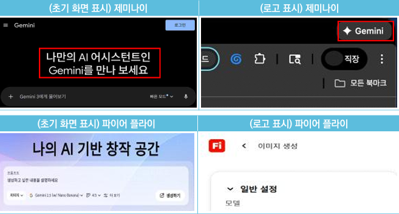

서비스 화면에서 ‘AI 모델이 실시간 데이터를 생성함’을 표시 
문구 표기 영역이 충분하지 않은 경우 툴팁 등으로 표시 

### ② 음성 어시스턴트
(적용대상) AI와 음성 대화를 기반으로 제공되는 서비스 
(서비스 예시) Siri, Google assistant, SKT Nugu, 음성 기반 가전 
이용 전 이용자가 인식할 수 있는 음성 또는 화면 문구 등으로 안내 
이용자가 호출하여 시작되는 서비스의 경우 개별 음성마다 반복적인 안내 불필요 
음성 가전 등 실물이 있는 제품의 경우 겉면에 AI를 기반으로 운용됨을 표시 
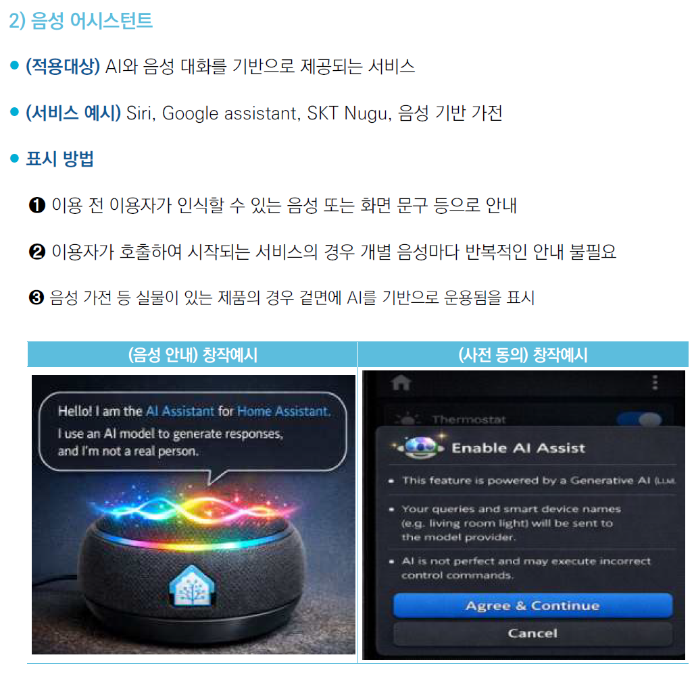

### ③ 게임, 메타버스
(적용대상) AI와 상호작용 또는 동적인 AI 콘텐츠 생성 기능이 적용된 게임, 메타버스(단순히 생성형 AI 결과물(그림, 음악, 코드 등)을 게임 제작에 활용한 경우 외 AI가 구성요소로 포함되어 그 자체로 AI 제품･서비스로 볼 수 있는 경우) 
(서비스 예시) 미르5, 인조이, 던전앤파이터, 언더커버 스모킹건, 마인크래프트 등 
(게임 내 구성요소에 AI 활용) 이용자가 상호작용하는 캐릭터･NPC명에 AI 캐릭터･NPC임을 알리거나 혹은 초기 대화 시 안내 
(AI 기반 음성 서비스) 게임 내 이용자가 로그인 등 플레이 활성화 할 경우 서비스 초기에 AI 기반 음성임을 안내 
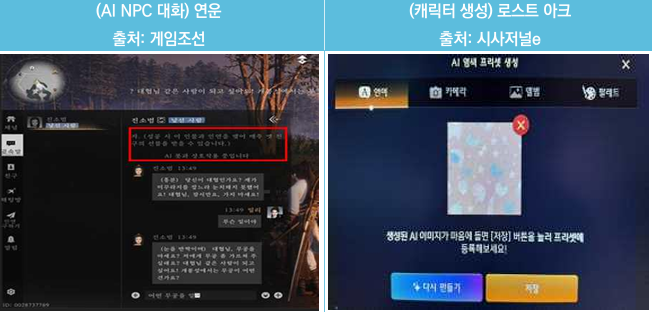

### ④ 생산형 향상 서비스
(적용대상) 생성형 AI를 보조적 수단으로 활용하는 문서 작성 지원 서비스 
(서비스 예시) Google workspace (gemini), MS Copilot 기반의 파워포인트(PPT)/워드(docs), 네이버 클로바 노트 등 AI 지원 서비스 
이용 화면 내 로고 표출, 이용 전 안내 등으로 인공지능 활용 여부 표시하며, 개별 결과물에 대해 표시 불필요(단, 실시간으로 동기화되어 파일 등으로 저장하는 경우 ‘서비스 외부 반출 시 표시 방법’에 대한 추가적인 적용 필요) 
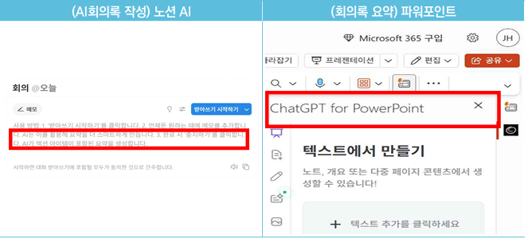

## [1-4-3] 외부 반출 표시방법
**① 텍스트 생성물**  
**② 이미지 생성물**  
**③ 동영상 생성물**  
**④ 음성 생성물**  
**⑤ 기타**  

	(대상) 다운로드, 공유 등 AI 생성 결과물을 외부로 반출하는 기능을 제공하는 경우
	(유의점) 이용자의 입력, 조작에 따라 실제와 구분하기 어려운 결과물을 생성하여
	외부로 반출하는 기능을 제공하는 AI 제품･서비스의 경우 인공지능사업자가 해당 여부를 
	판단하여 표시 방법을 적용하여야 하며, 이를 판단･통제할 수 없는 경우 딥페이크의 기준을 적용

|구분|내용|표시방법|
|---|---|---|
|일반 생성물 |실제와 구분하기 어려운 수준에 해당하지 않는 AI 생성물(딥페이크 생성물과의 구분을 위해 새롭게 정의된 내용)|결과물에 로고 삽입 등 사람이 인식할 수 있는 방법 또는 기계가 판독할 수 있는 방법을 적용(단, 서비스 이용 환경 내에서 기계가 판독할 수 있는 방법을 적용 시 1회 이상 안내 문구･음성 등을 제공, 최종 결과물 이전에 이용자가 프롬프트 입력, 생성 이미지 선택 등 편집 과정의 모든 중간 생성물에 각각 표시할 의무는 없으며 결과물 제공(추출, 저장 등) 단계에서 표시(실제와 구분하기 어려운 결과물을 제공할 가능성이 없을 것으로 사업자가 명확하게 판단할 수 있는 AI제품･서비스의 경우(예: 웹툰･캐릭터･애니메이션 전용 저작도구 등), 일반 생성물의 표시 기준을 적용 가능)|
|딥페이크 생성물 |실제와 구분하기 어려운 가상의 음향, 이미지 또는 영상 등의 결과물|사람이 직관적으로 인식할 수 있는 표시 방법 적용（인물의 특성 합성, 딥페이크 등 오인･혼동 또는 피해 발생의 위험성이 있는 결과물의 경우, 해당 위험성을 고려한 추가적인 조치 필요)|
||예술적･창의적 표현물|전시･향유를 저해하지 않는 방법으로 완화된 표시 방법을 허용(시간적으로 주요 콘텐츠와 차이를 두어 표시하거나 비가시적인 표시 방법 적용 등)|

### ① 텍스트 생성물
(적용대상) 문자･부호로 구성된 텍스트 결과물 다운로드･공유 등 기능 제공 시(이용자가 클립보드(Copy & Paste) 기능을 이용하는 경우는 해당하지 않음) 
(서비스 예시) ChatGPT, 클로드, 제미니, 하이퍼 클로바 등 
(파일 형태로 제공 시) 문서의 머리말, 파일 메타데이터로 표시(메타데이터 등 비가시적인 방법을 적용할 경우 다운로드 시 문구·음성 등으로 AI로 생성되었음을 1회 이상 안내) 
(코드 생성 도구) 프로젝트 설명, 코드 내 주석 등으로 표시(프로젝트 활용 및 코드 실행에 영향을 미치지 않는 주석 형식의 코드 내 표시 또는 .md 파일 등에 명시) 
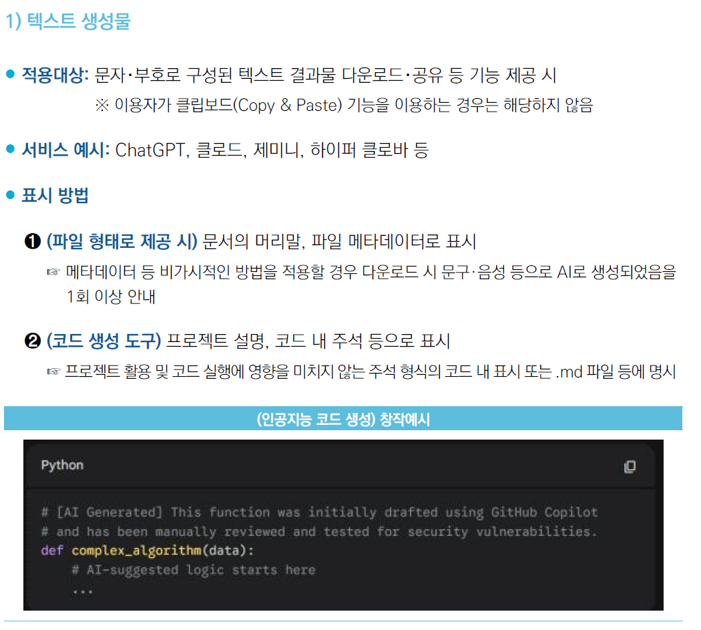

### ② 이미지 생성물
(서비스 예시) Sora, 미드저니, 달리, 나노바나나 
(사람이 인식할 수 있는 방법) 이미지 내 로고 삽입 등을 통한 가시적인 방법(실제와 구분하기 어려운 생성물(딥페이크)은 명확하게 인식할 수 있는 방법으로써 사람이 인식할 수 있는 방법만을 적용) 
(기계가 판독할 수 있는 방법) 디지털 워터마킹, 메타데이터 등을 활용한 비가시적인 방법(비가시적인 방법을 사용할 경우 다운로드 시 문구·음성 등으로 인공지능 기반 생성 사실에 대해 1회 이상 안내) 
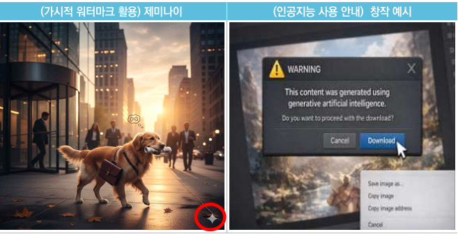

### ③ 동영상 생성물
(서비스 예시) Runway, Sora, Pika Labs 등 
(사람이 인식할 수 있는 방법) 화면 영역 일부에 로고 등을 표출하거나, 영상 시작 부분에 AI 생성 사실을 안내하는 방법 등(실제와 구분하기 어려운 생성물(딥페이크)은 명확하게 인식할 수 있는 방법으로써 사람이 인식할 수 있는 방법만을 적용하되, AI로 생성된 재생구간 전체에 로고 표출 등으로 AI 생성 사실을 표시하여야 함) 
(기계가 판독할 수 있는 방법) 디지털 워터마킹, 메타데이터 등을 활용한 비가시적인 방법(비가시적인 방법을 사용할 경우 다운로드 시 문구·음성 등으로 인공지능 기반 생성 사실에 대해 1회 이상 안내) 

### ④ 음성 생성물
(서비스 예시) Suno 등 
(사람이 인식할 수 있는 방법) 음성 시작 부분에 AI 생성 사실을 안내하는 방법 등(실제와 구분하기 어려운 생성물(딥페이크)은 명확하게 인식할 수 있는 방법으로써 사람이 인식할 수 있는 방법만을 적용)  
이용자가 해당 콘텐츠가 생성형AI를 통해 생성된 것임을 인식할 수 있도록 재생 초기에 안내(재생시간 전체에 표시할 필요는 없으며, 오디오 콘텐츠 시작 부분에 AI로 생성되었음을 멘트로 간단히 안내)  
인공지능이 생성한 텍스트 대본을 인공지능이 음성으로 읽는 경우, ‘AI가 생성한 음성입니다.’ 등의 가청적 방법을 비롯한 이용자가 명확히 알 수 있는 방법으로 표시  
(기계가 판독할 수 있는 방법) 사후 식별 가능한 음성 워터마킹 기술, 메타데이터 등을 활용한 비가시적인 방법(비가시적인 방법을 사용할 경우 다운로드 시 문구·음성 등으로 인공지능 기반 생성 사실에 대해 1회 이상 안내)  

### ⑤ 기타
(적용대상) 이외 파일 형식(슬라이드, PDF 등)의 결과물을 제공하는 경우 
(서비스 예시) Canva, Gamma 등 
(사람이 인식할 수 있는 방법) 파일 포맷의 특성을 고려하여 적합한 방법으로 표시(머리말 또는 작성 영역 초반(문서), 첫 슬라이드의 일부 영역(시트 형식) 등에 AI 생성 사실을 표시) 
(기계가 판독할 수 있는 방법) 메타데이터 활용 
파일 작성자 등 메타데이터 영역에 AI 생성물임을 표시 
비가시적인 방법을 사용할 경우 다운로드 시 문구·음성 등으로 인공지능 기반 생성 사실에 대해 1회 이상 안내 
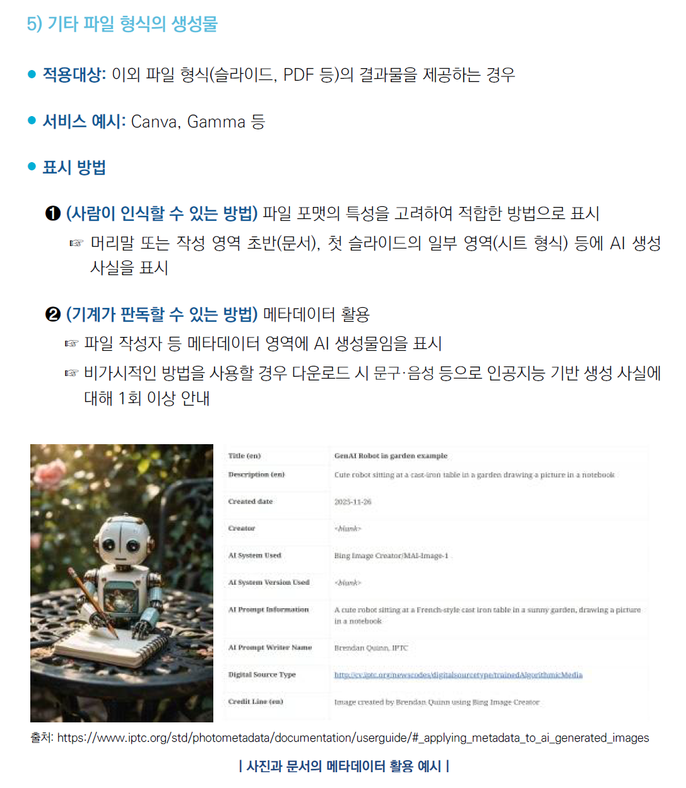

 

---
# [1-5] 참고자료 : AI 생성 서비스 사례
**① 이미지 기반 서비스**  
**② 동영상 기반 서비스**  
**③ 텍스트 기반 서비스**  
**④ 오디오 기반 서비스**  
**⑤ 위험사례 : 가짜뉴스 생성(1)**  
**⑥ 위험사례 : 가짜뉴스 생성(2)**  
**⑦ 위험사례 : 디지털 성범죄**  
**⑧ 위험사례 : 학술 및 콘텐츠 윤리문제**  

---

### ① 이미지 기반 서비스
인공지능 기술에 기반하여 예술 작품이나 사실적인 사진, 복잡한 이미지나 효과를 적용하는 등의 방식으로 새로운 이미지를 창작 및 수정 
대표적인 이미지 인공지능 콘텐츠 생성 서비스로 DALL･E(OpenAI), FireFly(Adobe), Stable Diffusion(Stability AI) 등의 플랫폼이 존재 

### ② 동영상 기반 서비스
영상을 생성하거나 영상의 변환･편집 등 작업을 수행하며1), 주로 사용자가 작성한 각본(Script)과 입력한 명령어에 따라 영상을 자동으로 생성 
텍스트(Text-To-Video) 혹은 이미지(Image-To-Video)를 바탕으로 동영상을 생성하는 서비스는 Sora(OpenAI), VideoFx/Veo3Google, Stable Video Diffusion(Stability AI) 등의 플랫폼이 존재 

### ③ 텍스트 기반 서비스
대규모 텍스트 데이터를 기반으로 한 언어 모델을 활용해 인간과 유사한 레벨에서 언어를 이해하고 생성 및 응답함으로써 높은 성능을 발휘 
대표적으로 ChatGPTOpenAI, GeminiGoogle, ClaudeClaude, HyperCLOVAXNaver 등의 서비스가 존재 
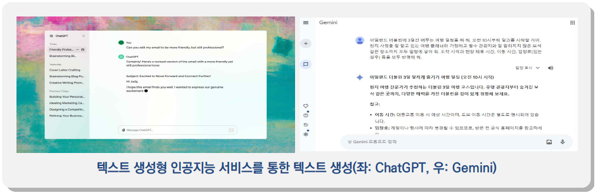

### ④ 오디오 기반 서비스
인공지능 기술을 사용하여 사람의 목소리나 음악을 학습하여 새로운 음성이나 오디오 생성 
텍스트(Text-To-Speech)를 바탕으로 가상 비서, 음성 보조 기기 등에 활용되고 있으며, WaveNetGoogle, AI SpeechMicrosoft Azure, Amazon PollyAWS 등이 존재 

### ⑤ 위험사례 : 가짜뉴스 생성(1)
가짜뉴스는 뉴스 형태로 제시된 허위 또는 오해의 소지가 있는 정보이며, 종종 개인이나 단체의 평판을 손상시키거나 광고 수익을 통해 돈을 벌려는 목적을 포함 
가짜뉴스에 대한 시민의 인식을 확인하기 위한 통계 조사 결과, 가짜뉴스를 경험해 보았다는 비율이 43.3%에 달하고, 인공지능이 발달하면서 가짜뉴스 피해도 심화될 것이라는 전망에 84.2%가 동의 ⇒ 통계 사례로 볼 수 있듯이 가짜뉴스는 이미 대중의 생활 곳곳에 침투하고 있어, 이에 대한 대책 마련이 시급 
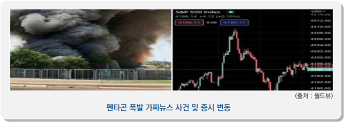

2023년 5월 미국에서 펜타곤이 폭발하는 사진이 소셜미디어인 트위터에서 언론까지 광범위하게 퍼지며 큰 혼란을 야기 
펜타곤 대변인은 "펜타곤은 공격받지 않았다."고 밝혔고, 펜타곤 주변을 관할하는 경찰과 소방 당국 역시 "펜타곤 보호구역이나 근처에서 폭발이나 사고가 발생하지 않았으며 대중에게 위험은 없다."고 전하며 해당 사진은 인공지능 생성물임을 공개 
그러나, 사진이 유포되자 S&P500 지수가 한때 0.3% 하락하는 등 증시는 출렁였고, 유사시 안전 자산으로 꼽히는 미 국채와 금값도 잠시 상승 

### ⑥ 위험사례 : 가짜뉴스 생성(2)
생성형 인공지능의 활용은 동영상, 이미지, 오디오 등 선거 운동에 필요한 다양한 콘텐츠 제작을 가능하게 하며 선거에 영향력 행사 
가짜 인공지능 생성 콘텐츠는 유권자들 사이에서 혼란을 야기하고, 특정 후보에 대한 부정적인 인식을 심어줄 수 있는 가능성 존재 
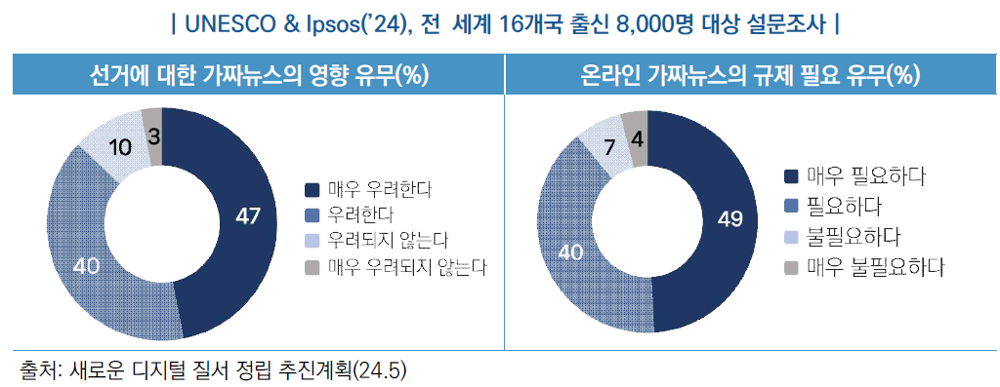

2023년 미국 선거기간에 해당 후보의 지지자들은 흑인 유권자들을 공략하기 위해 흑인들이 후보를 지지한다는 취지의 사진을 인공지능으로 생성하여 공유 
후보자를 비방하기 위해서 생성형 AI 모델인 ‘미드저니’를 이용해 후보자가 체포되는 장면과 형을 선고받아 투옥되는 장면 등을 제작한 뒤 소셜미디어에 게시 
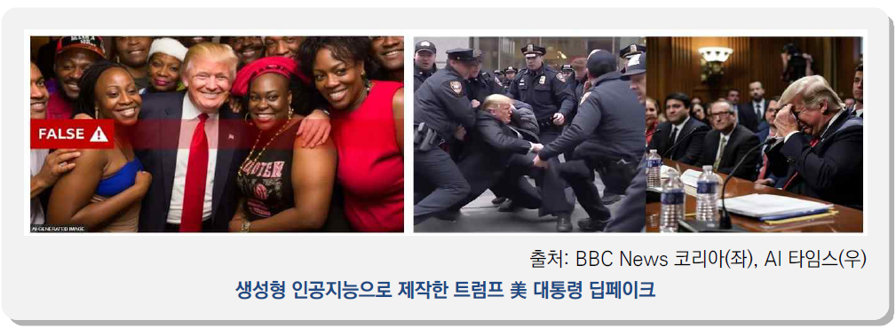

### ⑦ 위험사례 : 디지털 성범죄
생성형 인공지능을 오남용하여 성적 허위 영상물(성착취물)을 제작 및 유포하는 행위가 발생하고 있으며, 연예인이나 지인의 얼굴을 음란물과 합성해 유포하는 디지털 성범죄가 빈번히 발생 
이미지의 유포･합성･소비의 가능성을 무한대로 확장시키기 때문에 디지털 성범죄는 피해와 가해의 구도가 1대 N을 이루고, 생산자와 소비자의 경계가 불분명 
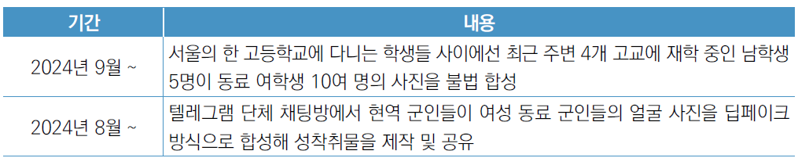

2023년 4월, 생성형 인공지능 서비스에 ‘나체’, ‘어린이’ 등의 텍스트를 입력하여 360개의 아동 성착취물을 제작한 사건이 발생 
우리나라 법원에서는 해당 행위가 아동･청소년의 성보호에 관한 법률에 위반되었다고 판시하여 징역 2년6개월 선고 
피고인은 유포할 목적이 없었고, 가상의 이미지를 가지고 있는 것은 처벌 대상이 아니라고 생각했다고 진술했으나 재판부는 피해자가 없다고 해도 성적 표현물 자체가 명백하게 아동으로 인식될 수 있다면 아동청소년보호법 위반에 해당할 수 있다고 판시 

### ⑧ 위험사례 : 학술 및 콘텐츠 윤리문제
생성형 인공지능이 학술논문, 자기소개서, 기사, 논문에 사용하는 그림 등을 생성하여 활용하는 사례가 증가하면서 공동 저자로 등록하고, 서로 다른 논문임에도 유사한 그림, 글이 무분별하게 양산 
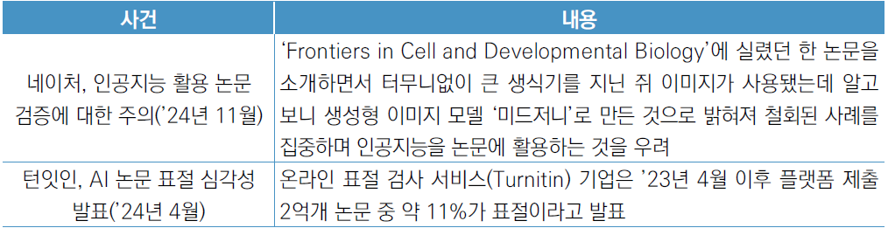

ChatGPT가 2023년 한해 책/저널을 발표하여 저작권을 보유하고 있는 경우 200여 권이 확인, 네이처의 발표에 따르면 최소 4편 이상이 연구논문에 공동 저자로 등록 
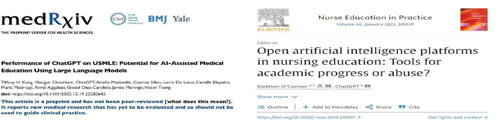

(과학계) ChatGPT가 공동 저자로 등록하는 것이 표절 문제를 동반한다면 최소한의 윤리 지침을 지켜야 한다고 지적하며 네이처 등에서는 저자로서 인정 불가 의사 표시 
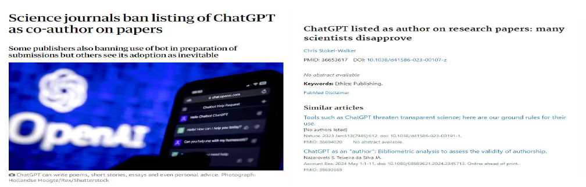

 

---
# [1-6]  AI 생성 콘텐츠 국제사회 논의
### AI 서울 정상회의(2024.5)
'안전하고 혁신적이며 포용적인 AI를 위한 서울 선언'과 '프론티어 AI 안전 서약'이 체결 
구글, LG AI연구소, 세일즈포스, KT, 마이크로소프트, 삼성전자, 앤스로픽, SK텔레콤, IBM, 네이버, 코히어, 카카오, 오픈AI, 어도비 등 총 14개 기업이 서약에 서명하였으며 주요 내용은 다음과 같다. 

	AI 안전 연구소 간 네트워크 확대 및 글로벌 협력 촉진
	워터마크 등 인공지능이 생성하는 콘텐츠 식별을 위한 조치와 국제표준 개발 협력 강화
	AI 모델에 대한 위협 평가를 위한 레드팀 구성 및 안전성 접근 방식을 투명하게 공유

### 히로시마 AI 프로세스 행동강령 발표(2023.12)
G7(회원국은 미국･일본･독일･영국･프랑스･이탈리아･캐나다이며, EU는 참가국 자격 활동)은 2023년 5월 일본에서 개최된 히로시마 정상회의에서 인공지능의 위험을 관리하는 국제규범인 ‘히로시마 AI 프로세스’ 수립에 대해 합의 
개발자가 가짜정보의 확산과 프라이버시 침해 위험을 완화하는 방안을 검증받고, 인공지능 콘텐츠에 대한 워터마크 삽입하는 등의 ‘히로시마 AI 프로세스 행동강령’ 발표 ⇒ 기술적으로 가능한 경우 워터마크 또는 ‘인공지능 콘텐츠임을 알 수 있도록 하는 기타 기술적 조치’ 등 인공지능 콘텐츠의 진본성 및 출처 체제를 개발 이행할 것을 요구 

### 독일 뮌헨안보회의(MSC) 딥페이크 공동 대응 논의(2024.2)
독일 뮌헨안보회의(MSC)에서 20개 글로벌 빅테크 기업들이 공동으로 인공지능 기술을 악용해 선거에 영향을 끼치는 행위에 공동 대응하기로 합의했다고 발표 
합의문의 제목은 ‘2024년 선거에서 인공지능의 기만적 사용을 방지하기 위한 기술 협약’(Tech Accord to Combat Deceptive Use of AI in 2024 Elections) ⇒ 해당 합의문에는 선거에 영향을 미치는 인공지능 사기 콘텐츠를 막기 위한 기술 개발, 인공지능 사기 콘텐츠와 관련하여 발새알 수 있는 위험 평가 모델 수립 등에 대한 조약 

---

# [2] AI 안전성 확보 가이드라인(과학기술정보통신부, ETRI)
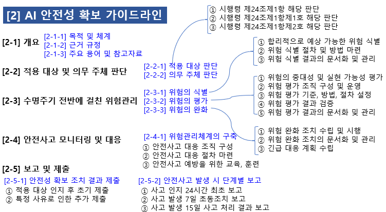

「인공지능 발전과 신뢰 기반 조성 등에 관한 기본법」 제32조 및 시행령 제24조에 따라 제정된「인공지능 안전성 확보 의무의 이행방법 등에 관한 고시」에서 규정한 인공지능 안전성 확보 의무를 실제 인공지능을 개발/운영하는 인공지능사업자가 이행하는 데 필요한 기준과 절차를 체계적으로 정리한 참고 문서 

https://github.com/YangGuiBee/AIG/blob/main/TextBook-06/AIG_guide2.pdf

---

# [2-1] 개요
## [2-1-1] 목적 및 체계
▣ 제1장 [2-1] : 가이드라인의 개요에 관한 사항으로, 고시 제1조 및 제2조에 근거하여 가이드라인의 목적, 적용 범위 및 활용 방법을 설명하고, 본 가이드라인 전반에 걸쳐 사용되는 주요 용어의 의미를 정리 
▣ 제2장 [2-2] : 적용 대상 및 의무 주체 판단에 관한 장으로, 고시 제3조를 중심으로 인공지능 안전성 확보 의무의 적용 대상이 되는 인공지능의 범위와 판단 기준을 다루며, 학습 누적연산량 기준, 최첨단 인공지능기술 적용 인공지능 해당 여부, 시행령 제24조제1항제2호 해당 여부 등 적용 대상 판단에 관한 사항과 함께, 개발자 또는 실질적 변경을 가한 자 중 안전성 확보 의무를 부담하는 주체를 판단하는 기준을 설명 
▣ 제3장 [2-3] : 인공지능 수명주기 전반에 걸친 위험관리에 관한 장으로, 고시 제4조부터 제6조까지의 규정을 바탕으로 위험의 식별, 위험의 평가, 위험의 완화에 관한 책무를 단계적으로 설명하고, 인공지능의 개발-배포-운영-폐기에 이르는 전 과정에서 인공지능사업자가 수행하여야 할 위험관리 절차와 각 단계별 이행 기준을 구체적으로 제시 
▣ 제4장 [2-4] : 안전사고의 모니터링 및 대응에 관한 장으로, 고시 제7조에 따라 안전사고를 상시적으로 관리하기 위한 위험관리체계의 구축 및 운영에 관한 사항을 다루며, 안전사고 대응 조직의 구성, 사고 발생 시 대응 절차의 마련, 사고 예방을 위한 교육훈련 등 조직적/관리적 차원의 책무를 포함 
▣ 제5장 [2-5] : 보고 및 제출에 관한 장으로, 고시 제8조에 근거하여 인공지능 안전성 확보 조치의 이행 결과를 제출하는 절차와 안전사고 발생 시 단계별 보고 의무를 설명하고 적용 대상 인지 후의 초기 제출, 특정 사유 발생 시의 추가 제출, 사고 발생 시 단계별 보고 등 기한과 사유에 따른 보고f제출 책무를 체계적으로 정리 
 
## [2-1-2] 근거 규정
<ins>『인공지능 발전과 신뢰 기반 조성 등에 관한 기본법』 제32조(인공지능 안전성 확보 의무)</ins> 
① 인공지능사업자는 학습에 사용된 누적 연산량이 대통령령으로 정하는 기준 이상인 인공지능시스템의 안전성을 확보하기 위해 다음 각 호의 사항을 이행해야 한다. 
1. 인공지능 수명주기 전반에 걸친 위험의 식별ㆍ평가 및 완화 
2. 인공지능 관련 안전사고를 모니터링하고 대응하는 위험관리체계 구축 
② 인공지능사업자는 제1항 각 호에 따른 사항의 이행 결과를 과학기술정보통신부장관에게 제출해야 한다. 
③ 과학기술정보통신부장관은 제1항 각 호에 따른 사항의 구체적인 이행 방식 및 제2항에 따른 결과 제출 등에 필요한 사항을 정해 고시해야 한다. 
 
<ins>『인공지능 발전과 신뢰 기반 조성 등에 관한 기본법 시행령』 제24조(인공지능 안전성 확보 의무)</ins> 
① 법 제32조제1항에서 “대통령령으로 정하는 기준 이상인 인공지능시스템”이란 다음 각 호의 기준을 모두 충족하는 인공지능시스템을 말한다. 
1. 학습에 사용된 누적 연산량이 10의 26승 부동소수점연산 이상일 것 
2. 인공지능기술의 발전 수준을 고려할 때 현재 인공지능시스템에 활용되는 인공지능기술 중 최첨단의 인공지능기술을 적용하여 구성ㆍ운영되고 있을 것 
3. 인공지능시스템의 위험도가 사람의 생명, 신체의 안전 및 기본권에 광범위하고 중대한 영향을 미칠 우려가 있을 것 

② 제1항제1호에 따른 학습에 사용된 누적 연산량의 구체적인 산정 방식은 과학기술정보통신부장관이 정하여 고시한다. 
 
<ins>『인공지능 안전성 확보 의무의 이행방법 등에 관한 고시(안)』(과학기술정보통신부 고시 제2026-126호)</ins> 
https://www.msit.go.kr/bbs/view.do?sCode=user&mId=109&mPid=103&pageIndex=1&bbsSeqNo=84&nttSeqNo=3186337&searchOpt=ALL&searchTxt=%EC%9D%B8%EA%B3%B5%EC%A7%80%EB%8A%A5
 
제1조(목적) 
제2조(정의) 
제3조(적용 대상) 
제4조(위험의 식별) 
제5조(위험의 평가 등) 
제6조(위험의 완화 조치) 
제7조(위험관리체계의 구축) 
제8조(결과 제출) 
제9조(재검토 기한) 
 

## [2-1-3] 주요 용어 및 참고자료
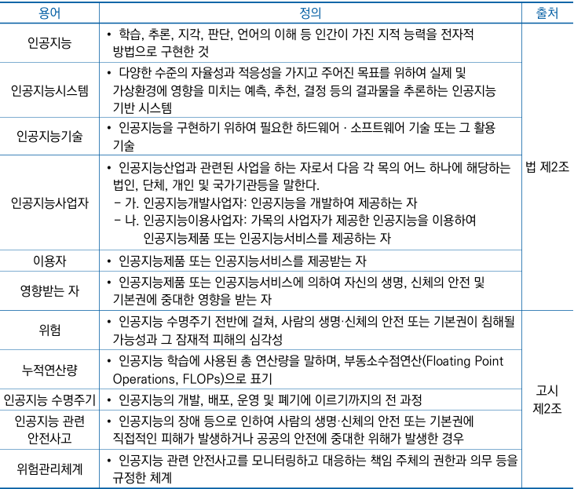
 
(1) NIST - Artificial Intelligence Risk Management Framework 1.0 
https://nvlpubs.nist.gov/nistpubs/ai/NIST.AI.100-1.pdf 
(2) European Commission, AI Office - General-Purpose AI Code of Practice 
https://digital-strategy.ec.europa.eu/en/policies/contents-code-gpai 
(3) UK AI Safety Institute (UK AISI) - International AI Safety Report 
https://internationalaisafetyreport.org 

---

# [2-2] 적용 대상 및 의무 주체 판단
## [2-2-1] 적용 대상 판단
본 가이드라인은 아래의 요건을 모두 충족하는 인공지능에 적용 
(1) 학습에 사용된 누적 연산량이 $10^26$ FLOPs 이상일 것 
(2) 인공지능기술 발전 수준을 고려할 때, 최첨단의 인공지능기술을 적용하여 구성 운영될 것 
(3) 위험도를 고려할 때, 사람의 생명f신체의 안전 또는 기본권, 공공의 안전에 광범위하고 중대한 영향을 미칠 가능성이 있을 것 
위 요건 중 어느 하나라도 충족되지 않는 경우에는 안전성 확보 의무의 적용 대상에 해당하지 않으며, 이하에서는 각 요건별 판단 기준과 고려사항을 순차적으로 설명 

### ① 시행령 제24조제1항 해당 판단

**(1) 누적 연산량 판단 기준** 
학습에 사용된 총 연산량이 10의 26승 FLOPs 이상인지 여부를 기준으로 판단 
누적 연산량은 이론적 계산식, 하드웨어 사용 로그 등 객관적인 자료에 기반한 실측 또는 이에 준하는 방식으로 산정 
 
**(2) 학습 과정에 대한 모니터링** 
연산량은 학습 과정에서 동적으로 변동될 수 있으므로, 실제 연산 사용량에 대한 실시간 또는 주기적인 모니터링 체계를 유지 
초기 설계 단계에서의 연산량 추정 결과가 기준치에 미달하더라도, 후속 학습이나 추가 학습으로 인해 누적 연산량이 기준치를 초과하는 경우에는 해당 기준을 충족한 것으로 판단 
 
**(3) 누적 연산량의 포함 범위** 
누적 연산량에는 인공지능 구성과 성능에 실질적으로 기여한 모든 학습 연산을 포함 
ㅇ사전학습, 사후학습, 파인튜닝 등 모델 성능에 직접 기여하는 기본 학습 연산 
ㅇ모델 병합, 가중치 평균, 혼합전문가(MoE) 구조 등 여러 모델을 통합한 경우의 각 구성 모델 학습 연산량 
ㅇ학습용 합성 데이터 생성에 사용된 연산량으로서, 가능한 범위에서 외부 기관 또는 제3자가 제공한 합성 데이터의 생성 연산량을 포함한 경우 
 
**(4) 누적 연산량의 제외 범위** 
실제 성능 향상에 실질적으로 기여하지 않는 경우 누적 연산량에서 제외 
ㅇ프로토타입 개발, 탐색적 실험, 하이퍼파라미터 튜닝, 레드팀 평가 등 실험적 성격의 연산 
ㅇ증류용 부모 모델, 가치 함수, 보상 모델 등 직접적인 성능 발휘 주체가 아닌 보조 모델의 학습 연산 
 
**(5) 누적 연산량의 산정 및 추정** 
실제 연산량 확인이 불가능하거나 현저히 어려운 경우에는 합리적인 추정을 통해 누적 연산량을 산정 
대표적인 계산 방법론이나 공개된 벤치마크를 활용하여 합리적인 추정치를 산출할 수 있으며, 산정 결과에는 계산 과정, 근거, 전제 조건 및 불확실성 범위를 함께 제시 
추정 방식, 산정 대상, 근거 수치 및 보정 계수 등은 문서화하여 보존하고, 필요 시 제3자의 검증이 가능하도록 관리 

▣ 사업자는 누적 연산량 측정방식의 활용 가능 정보, 정확도, 외부 검증 가능성, 자원 및 기술적 제약 등을 고려해서 자율적으로 측정 방식을 선택. 다만, 어떤 방식을 사용하든 추정치는 가능한 최선의 판단을 반영하여 오차 범위를 최소화 
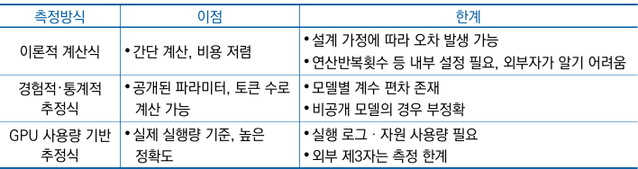

(1) <ins>이론적 계산식</ins> : 인공지능 모델의 설계 정보나 모델 구조를 바탕으로 수학적으로 연산량을 추정하는 방식
|구분|계산식|특징|
|---|---|---|
|설계 정보 기반 방식| 누적 연산량(C) = N(파라미터 수) × D(토큰 수) × 연산반복횟수| 단순하고 비용이 거의 들지 않으며, 설계 정보가 명확한 경우 빠르게 계산할 수 있다는 장점이 있으나, 연산반복횟수나 실제 사용된 데이터 크기 등 내부 정보가 외부에 공개되지 않은 경우 오차가 발생|
|모델 구조 기반 방식| C = 2 × 모델 내 연산 연결 수 × 3 × 학습 예제 수 × 연산반복횟수|구조 분석이 가능할 경우 비교적 정밀한 추정이 가능하나, 고도의 기술적인 정보가 요구된다는 한계|

(2) <ins>경험적 ･통계적 추정식</ins> : 학계나 산업계에서 관찰된 경험적 수치를 기반으로 파라미터 수, 토큰 수 등 일부 지표만으로 연산량을 예측하는 방식 
|구분|계산식|특징|
|---|---|---|
|경험적 계수 기반 방식|C = 6(역전파를 고려한 계수) × N(파라미터 수) × D(토큰 수)|단점으로는 경험적 계수가 모델마다 다를 수 있고, 비공개 모델에는 적용에 한계|
|시퀸스 기반 방식|C = 3 × (시퀸스당 부동소수점연산 수) × D(토큰 수) / n_ctx(시퀸스 길이)|모델의 구조적 효율성과 데이터 사용 균형을 반영한 연산량을 추정. 이는 시퀀스당 부동소수점연산 수, 토큰 수, 시퀀스 길이 등을 변수로 활용|

(3) <ins>GPU 사용량 기반 추정식</ins> : 가장 실측에 가까운 방식으로 GPU 또는 TPU와 같은 하드웨어 자원의 실제 사용량을 기반으로 연산량을 계산하는 방식 
|구분|계산식|특징|
|---|---|---|
|단일 GPU 장비 기반 방식| C = 𝜏(GPU 또는 TPU 성능, FLOPs/s) × 𝑇(총 사용시간) |단순하면서도 실행 기록만 확보하면 정확도가 높은 방식|
|다중 GPU 장비 기반 방식|C = 학습시간 × GPU 또는 TPU 수 × 1대당 최대 FLOPs/s × 평균 가동률|전체 학습 시간, 사용된 GPU 또는 TPU 수, 각 장비의 최대 FLOPs/s 성능, 그리고 평균 가동률을 모두 고려해 총 연산량을 계산|

(4) <ins>보조적 방법</ins>: 합리적인 연산량 추정을 위한 다양한 보조적 방법이 존재 
클라우드 서비스 제공업체의 사용량 기반 과금 정보, 실행 로그나 시스템 모니터링 툴, 또는 
단위 전력당 연산량을 기준으로 하는 에너지 사용 기반 추정 등이 있다. 이러한 방식은 직접 측정이 어려운 경우 간접적인 수단으로 활용 가능 

**▣ 누적 연산량의 산정 및 추정 자가점검 체크리스트**

	□ 학습에 사용된 누적 연산량이 기준치(10의26승FLOPs)를 초과하는지 여부를 판단하였는가?
	□ 누적 연산량 산정 또는 추정을 위한 자료와 근거를 확보하였는가?
	□ 누적 연산량에 포함f제외되는 연산의 범위를 정리하였는가?
	□ 학습 과정에서 연산량 변동을 확인하기 위한 모니터링 체계를 유지하고 있는가?
	□ 초기 추정 이후 추가 학습에 따른 누적 연산량 변화를 반영하였는가?
	□ 산정 또는 추정 결과와 그 근거가 문서화되어 있으며, 사후 검증이 가능한가?

▣ EU AI Act 부속서(Annex): 범용 인공지능 모델의 훈련 연산량(Training compute of general-purpose AI models) 

 

### ② 시행령 제24조제1항제1호 해당 판단
해당 인공지능이 인공지능기술의 발전 수준을 고려할 때 최첨단의 인공지능기술을 적용하여 구성 및 운영되고 있는지 여부를 합리적이고 객관적인 근거에 따라 판단 
**(1) 판단 시점**
최첨단 인공지능기술 적용 인공지능 해당 여부는 학습 착수 또는 인공지능 설계 단계에서 선제적으로 판단 
이후 대규모 추가 학습, 모델 구조 변경, 활용 범위의 실질적 확장 등으로 기술적 성격이 변경된 경우에는 해당 판단을 재검토 
 
**(2) 최첨단(State-of-the-Art, SOTA) 지향성에 대한 설계 목표**
최첨단 인공지능기술 해당 여부를 판단함에 있어, 해당 인공지능이 동시점의 인공지능 기술 발전 수준 대비 SOTA에 도달하거나 이에 근접한 기술적 위치를 목표로 설계 개발되었는지 여부를 고려 
다음과 같은 경우에는 SOTA 지향적 설계로 간주 
ㅇ동시점의 최고 성능 모델을 명시적인 비교 기준(reference)으로 설정한 경우 
ㅇ특정 벤치마크 또는 과제에서 기존 최고 성능을 달성하거나 초과하는 것을 목표로 설정한 경우 
ㅇ기존 SOTA 모델의 한계를 극복하기 위한 새로운 아키텍처, 학습 방식 또는 결합 기법을 채택한 경우 
ㅇ성능의 상한을 탐색하거나 기술적 한계를 확장하는 것을 주요 개발 목표로 설정한 경우 
 
**(3) 기술적 구현 수준(SOTA급 수단의 적용)**  
설계 목표를 달성하기 위하여 다음과 같은 기술적 요소가 적용되었는지 여부를 종합적으로 고려 
ㅇ최신 또는 고도화된 모델 아키텍처 및 구조 
ㅇ대규모 파라미터 규모 또는 이에 준하는 고급 효율화 확장 기법 
ㅇ대규모 고품질 데이터 또는 독자적인 데이터 파이프라인 
ㅇ대규모 분산 학습, 강화학습 기반 미세조정(RLHF), 합성 데이터 활용 등 최신 학습 기법 
 
**(4) 결과 단계에서의 상대적 기술 위치**  
공개 벤치마크, 내부 평가 또는 비교 분석을 통해, 해당 인공지능이 동시점의 최고 수준 기술과 동급 또는 그에 근접한 성능f범용성f기술적 영향력을 보유하고 있는지 여부를 고려 
공개되지 않은 모델의 경우에도, 내부 평가 결과나 기술적 특성을 근거로 SOTA급 모델과의 비교 가능성이 합리적으로 설명되는 경우에는 이를 고려 
 
**(5) 요건 충족 판단**  
위 사항을 종합적으로 검토한 결과, 해당 인공지능이 기술적 측면에서 인공지능 기술 발전의 최전선에 위치한다고 합리적으로 판단되는 경우에는 최첨단 인공지능기술 적용 인공지능에 해당 
이 판단은 기술의 절대적 우열이 아니라, 동시점 대비 상대적 위치와 설계 의도, 구현 수준을 함께 고려 
 

**▣ 최첨단 인공지능기술 판단 자가점검 체크리스트**

	□ 해당 인공지능에 대해 최첨단 인공지능기술 적용 인공지능 해당 여부를 판단할 필요성이 있는가?
	□ 학습 착수 또는 설계 단계에서 동시점의 SOTA(State of the Art) 모델 또는 기술을 비교 기준으로 설정하고 기술적 목표를 수립하였는가?
	□ 해당 목표를 달성하기 위하여 최신 또는 고급 인공지능 아키텍처, 학습 방식, 데이터 구성 등 SOTA급 기술 수단을 적용하였는가?
	□ 공개 벤치마크, 내부 평가 또는 비교 분석을 통해 동시점의 최고 수준 기술과의 상대적 위치(SOTA 도달 또는 근접 여부)를 검토하였는가?
	□ 위 검토 결과를 종합하여, 해당 인공지능이 기술 발전의 최전선에 위치한다고 합리적으로 판단하였는가?
	□ 최첨단 인공지능기술 적용 인공지능 해당 여부에 대한 판단 결과와 근거가 문서화되어 있으며, 사후 검증이 가능한가?

 

### ③ 시행령 제24조제1항제2호 해당 판단
해당 인공지능이 사람의 생명 및 신체의 안전 또는 기본권, 공공의 안전에 광범위하고 중대한 영향을 미칠 가능성이 있는지 여부를 합리적이고 구조적인 방식으로 사전 판단 

**(1) 판단 시점 및 판단의 성격**  
시행령 제24조제1항제2호 해당 여부는 학습 착수 또는 인공지능 설계 단계에서, 합리적으로 예상 가능한 위험을 중심으로 구조적으로 판단 
이 판단은 인공지능의 위험성을 확정적으로 규명하는 것이 아니라, 중대한 위험 가능성의 존재 여부를 사전적으로 식별 및 판단하는 단계 
이 판단은 정식 위험 식별f평가f완화 절차에 앞서 이루어지는 사전적 위험 판단으로서, 이후 수행되는 정식 위험관리 절차를 대체하는 것은 아님 
 
**(2) 판단 기준(위험 영향의 범위와 심각성)**  
시행령 제24조제1항제2호 해당 여부는 다음과 같은 요소를 종합적으로 고려하여 판단 
ㅇ인공지능의 사용 목적 및 적용 분야 
ㅇ인공지능의 오용 또는 악용 가능성(합리적으로 예측 가능한 수준) 
ㅇ유사한 인공지능 또는 기존 시스템에서 발생한 위험 사례 
ㅇ잠재적 피해의 범위, 지속성 및 회복 가능성 
ㅇ사람의 생명 및 신체의 안전, 기본권 또는 공공의 안전에 미칠 영향의 심각성 
 
**(3) ‘광범위하고 중대한 영향’의 해석**  
고시에서 말하는 “광범위하고 중대한 영향”이란, 특정 개인이나 제한된 상황에 국한되지 아니하고, 다수의 이용자 또는 사회 전반에 걸쳐 중대한 피해가 발생할 가능성을 의미 
위험이 특정 영역에 한정되지 않고, 다양한 맥락에서 반복적 또는 연쇄적으로 발생할 가능성이 있는 경우에 이에 해당되는 것으로 판단 
 
**(4) 사전 검토 및 공적 대응 준비**  
정식 위험 평가 이전이라 하더라도, 중대한 위험 가능성이 예상되는 경우에는 관계기관에 대한 자문 요청, 사전 통지 또는 내부 보고 절차를 준비 
이는 위험을 확정하는 행위가 아니라, 불확실성이 큰 광범위하고 중대한 영향에 대한 관리 책임을 선제적으로 이행하기 위한 조치 
 
**(5) 판단 대상의 범위(인공지능 단위 판단)**  
시행령 제24조제1항제2호 해당 여부는 개별 모델이나 단일 기술 요소뿐만 아니라, 구체적인 목적과 기능을 가지고 구현f운영되는 인공지능을 단위로 판단 
동일한 모델이 사용되더라도, 인공지능의 목적, 설계, 기능 결합 방식, 입출력 구조 등에 따라 서로 다른 인공지능으로 간주 

**▣ 사람의 생명 등에 광범위하고 중대한 영향 판단 자가점검 체크리스트**

	□ 해당 인공지능에 대해 사람의 생명/신체의 안전 또는 기본권, 공공의 안전에 미칠 위험을 사전적으로 검토할 필요성이 있는가?
	□ 해당 판단이 개별 모델이 아니라 구체적인 인공지능의 목적, 기능, 운영 방식 전체를 기준으로 이루어졌는가?
	□ 사용 목적, 적용 분야, 오용 가능성 등을 고려하여 잠재적 위험을 구조적으로 검토하였는가?
	□ 잠재적 피해가 특정 상황에 국한되지 않고 광범위하게 발생할 가능성이 있는지 검토하였는가?
	□ 위험이 발생할 경우 그 영향이 중대하다고 볼 합리적 근거가 있는가?
	□ 시행령 제24조제1항제2호 해당 여부에 대한 판단 결과와 근거가 문서화되어 있으며, 이후 위험관리 절차와 연계될 수 있는가?

 

## [2-2-2] 의무 주체 판단
### ① 개발 또는 실질적 변경 해당 판
적용 대상 인공지능에 대하여 인공지능 안전성 확보 조치의 이행 결과를 제출하여야 하는 의무 주체가 누구인지, 즉 해당 인공지능을 개발한 사업자인지 또는 기존 인공지능을 실질적으로 변경한 사업자인지를 명확히 판단 

**(1) 의무 주체 판단의 기본 원칙**  
인공지능 안전성 확보 조치 이행 결과 제출 의무는 해당 인공지능이 적용 대상 인공지능에 해당하게 된 원인 행위를 수행한 사업자에게 귀속 
이에 따라, 적용 대상 인공지능을 처음부터 개발하여 타인에게 제공한 경우와 기 개발된 인공지능을 실질적으로 변경하여 적용 대상 인공지능에 해당하게 한 경우를 구분하여 판단 
ㅇ인공지능이 개발되어 타인에게 제공되는 시점부터 적용 대상 인공지능에 해당하는 경우에는 해당 인공지능이 적용 대상 인공지능에 해당하게 된 원인이 개발 단계의 설계/학습/구현 행위에 있는 것으로 보아 인공지능개발사업자를 의무 주체로 판단 
ㅇ사업자의 변경 행위로 인해 인공지능이 새롭게 적용 대상 인공지능에 해당하게 된 경우에는 기존 인공지능에 실질적 변경을 가한 인공지능사업자를 인공지능 안전성 확보 조치 이행 결과 제출 의무의 주체로 간주 
 
**(2) 실질적 변경의 판단**  
실질적 변경은 변경의 내용과 효과에 비추어 인공지능의 누적 연산량, 기술 수준, 또는 위험 특성이 본질적으로 변화한 경우를 지칭 
다음 중 어느 하나에 해당하는 경우에는 실질적 변경에 해당 
ㅇ기존 인공지능의 파라미터 일부(예. 1/3 이상) 또는 전부를 재학습하거나, 전체 학습량의 상당 부분을 추가 학습하여 기능 또는 성능에 중대한 변화가 발생한 경우 
ㅇ특정 목적 또는 고영향 분야에의 활용을 위하여 지속적/체계적인 파인튜닝을 수행함으로써, 인공지능의 적용 범위 또는 위험 특성이 실질적으로 변경된 경우 
ㅇ인공지능의 입출력 구조, 추론 방식 또는 의사결정 흐름이 변경되어 기능적 성격이 달라진 경우 
고영향 인공지능, 자율 실행 시스템 또는 외부 서비스와의 결합으로 인해 인공지능의 위험 수준이나 통제 요건이 중대하게 변동된 경우 
배포/운영 구조 또는 활용 환경의 변경으로 인공지능의 사용 방식이 본질적으로 확대/전환된 경우 
실질적 변경 여부는 변경 전후 인공지능의 목적, 기능, 성능, 위험 특성 및 적용 범위를 종합적으로 고려하여, 해당 변경으로 인해 사실상 새로운 인공지능으로 평가될 수 있는지 여부를 기준으로 판단 
 
**(3) 공동 관여 또는 책임 중첩 가능성**  
인공지능의 개발 및 변경 과정에 복수의 사업자가 관여한 경우에는 각 사업자의 역할과 책임 범위를 명확히 구분하여 의무 주체를 판단 
필요한 경우, 관련 사실관계를 문서로 정리하여 책임 귀속의 근거로 활용 
 

▣ 실질적 변경 시나리오

	① 최초 개발 단계에서 이미 적용 대상인 경우
	A사는 시행령 제24조제1항제1호이 적용된 10의 25승 FLOPs 규모의 인공지능을 설계하였으나, 
	학습 단계에서 누적 연산량이 10의 26승 FLOPs 규모로 늘어나 기준을 초과하였고, 내부 검토 결과 중대한 영향 기준을 충족하는 것으로 판단되었다. 
	이 경우, 인공지능 안전성 확보 조치 이행 결과 제출 의무의 주체는 A사, 즉 인공지능개발사업자이다.
	
	② 타인이 개발한 비대상 인공지능을 실질적으로 변경하여 대상이 된 경우
	B사는 A사가 개발한 10의 25승 규모의 인공지능을 도입하였다. 해당 모델은 도입 시점에는 누적 연산량 기준을 충족하지 않았고, 
	최첨단 기술이 적용 대상 인공지능에도 해당하지 않았다. 이후 B사는 수개월에 걸쳐 대규모 추가 학습을 실시하여 전체 학습량의 50% 이상을 추가하였고, 
	물리적 시스템과 직접 결합하는 시행령 제24조제1항제1호을 적용해, 금융 신용평가 및 대출 한도 산정에 활용되는 자동 의사결정 시스템을 구축하였다. 
	내부 검토 결과 개인의 경제적 기본권에 광범위하고 중대한 영향을 미칠 가능성이 있는 것으로 판단되었다. 
	이 경우, 인공지능이 새롭게 적용 대상 인공지능에 해당하게 된 원인 행위는 B사의 변경 행위에 있으므로, 
	B사는 실질적 변경을 가한 인공지능사업자로서 의무 주체가 된다.
	
	③ 이미 적용 대상인 AI를 타인이 변경한 경우
	A사가 개발하여 제공한 인공지능은 제공 시점부터 이미 적용 대상 인공지능에 해당하였다. 
	이후 B사는 해당 인공지능을 도입하여 자율 실행 기능을 추가하고, 외부 시스템과의 연계를 통해 독립적으로 의사결정을 수행하도록 변경하였다. 
	이 변경으로 인해 인공지능의 위험 특성과 통제 필요성이 더욱 증대되었다. 
	이 경우, 적용 대상 인공지능에 해당하게 된 초기 원인 행위는 A사의 개발 행위에 있으므로 A사는 여전히 의무 주체에 해당한다. 
	동시에, B사의 변경 행위는 위험 특성의 실질적 변화에 기여하였으므로, 사안에 따라 B사 역시 실질적 변경을 가한 사업자로서 의무 주체로 판단될 수 있다.

 

**▣ 안전성 확보 의무 주체 자가점검 체크리스트**

	□ 해당 인공지능을 처음부터 개발하여 제공한 인공지능개발사업자인지 여부를 검토하였는가?
	□ 기존 인공지능에 대한 변경이 실질적 변경에 해당하는지 여부를 검토하였는가?
	□ 변경 전후 인공지능의 누적 연산량, 성능, 위험 특성을 비교하여 판단하였는가?
	□ 의무 주체 판단 결과와 그 근거를 문서화하였는가?
	□ 복수 사업자가 관여한 경우 책임 귀속 기준을 정리하였는가?

---

# [2-3] 수명주기 전반에 걸친 위험관리
## [2-3-1] 위험의 식별
### ① 합리적으로 예상 가능한 위험 식별
합리적으로 예상 가능한 범위 내의 위험을 사전에 식별하고, 해당 위험에 대한 이해를 축적함으로써 이후 위험 평가 및 위험 완화 조치의 기초를 마련

**(1) 식별 대상 위험의 범위와 성격**  
위험 정의에 따라, 다수의 사람이나 사회 전반에 영향을 미칠 수 있는 위험을 중심으로 위험 후보를 도출하는 데 초점(예: 인공지능의 구조적 특성, 확산 가능성, 자동화, 연동 방식 등으로 인해영향이 누적/증폭되거나 광범위하게 전파될 수 있는 시스템적 위험) 
식별된 위험은 현존 위험과 잠재적 위험으로 구분하여 정리할 수 있으며, 각 위험에 대하여 발생 조건, 관련 단계, 잠재적 피해의 성격 등을 함께 파악함으로써 이후 위험 평가 단계에서 과도하거나 불충분한 대응이 이루어지는 것을 방지 
 
**(2) 위험 식별의 범위**  
위험 식별은 인공지능이 기획f계획에서 종료f폐기까지 거치는 수명주기 전 과정을 대상으로 수행 
주요 단계는 기획f계획, 데이터 수집 및 전처리, 모델 설계 및 학습, 검증 및 평가, 배포 및 통합, 운영 및 유지보수, 종료 또는 철회를 포함 
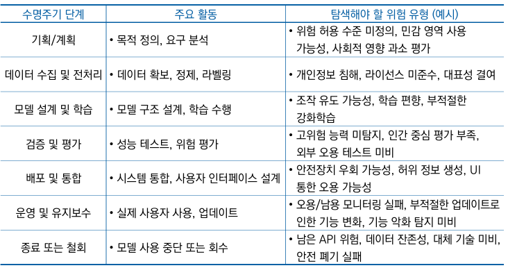

재학습/미세조정은 원칙적으로 운영 단계의 연속으로 볼 수 있지만, 실질적 변경이 이루어진 경우에는 새로운 위험의 출현 가능성이 있으므로 위험 식별을 재실시 
 
**(3) 합리적으로 예상 가능한 범위의 기준**  
고시의 취지에 따라, 위험 식별 책임은 기술적/과학적 근거에 비추어 객관적으로 예측 가능한 범위로 한정됨. 사업자는 다음과 같은 요소를 근거로 객관적으로 예측 가능한 위험을 식별 
ㅇ기술 분석 및 연구 문헌 등 과학적 근거 
ㅇ과거 사고 사례 및 공개된 침해/오남용 사례 
ㅇ동일하거나 유사한 능력을 가진 인공지능에서 확인된 위험 
ㅇ내부/외부 전문가의 의견 및 자문 
ㅇ레드팀 테스트, 위협 모델링 등 공격 관점의 점검 결과 
이러한 근거에 비추어 현실적으로 식별 가능한 위험을 포함하되, 현존 기술 수준이나 운영 환경을 현저히 벗어난 추상적 가설이나 과도한 가정에 기반한 위험은 제외 
최근 발생한 사례(예: 최근 2년 이내), 복수의 연구에서 반복적으로 확인된 위험(예: 3개 이상 연구), 직접적 또는 1차적 간접 인과관계를 가진 위험을 우선 고려. 다만 이는 인공지능의 특성과 적용 분야에 따라 조정/보완 
 
**(4) 위험 식별 시 고려 요소**  
인공지능의 수명주기 및 특수성: 
인공지능은 기획/개발/배포/운영/종료에 이르는 각 단계에서 서로 다른 성격의 위험을 내포 하므로, 특정 단계에 국한하지 않고 전 과정에서 잠재적 위험을 점검 
범용성 여부, 재학습f미세조정의 빈도, 적용 산업 분야, 자율성 및 외부 시스템과의 연동 수준 등에 따라 위험의 유형과 영향 범위는 달라질 수 있음. 이에 따라 사업자는 자사 인공지능의 고유한 특성을 면밀히 분석하여, 일반적으로 알려진 위험 목록 외에도 해당 인공지능에 특화된 위험을 추가로 식별 
|인공지능 특수성|식별위험 예시|
|---|---|
|범용 AI|다양한 전용 가능성으로 예측하기 어려운 위험|
|특화 AI|해당 분야 특유의 고영향 요소 집중 관리|
|의료 AI|오진으로 인한 생명 위험|
|금융 A|잘못된 투자 조언으로 인한 재산 손실|
|자율주행|물리적 안전사고|
|자율성/연동성 높은 시스템|외부 API 연계로 영향 범위 확대|

또한 위험은 그 사용 맥락과 대상 사용자, 기술적 구성에 따라 다르게 발현. 따라서 다음의 특성들을 종합적으로 고려 
|인공지능 특수성|식별위험 예시|
|---|---|
|시스템 기능 및 범용성|범용 생성모델일수록 예측 불가능성과 전이 위험이 높기 때문에, 범용성 및 오용 가능성을 기반으로 위험 범위 확장|
|모델 능력 및 임계치 수준|고도화된 자율성, 자기개선, 조작 능력 등은 위험성 증가 요인이므로, 역량 임계치 기반 위험 시나리오 수립|
|사용자 특성 및 사용 방식|비전문가 사용자, 자동화 환경, 불충분한 사용자 교육은 위험을 증가시킬 수 있으므로, 사용자 오류 가능성과 인간-시스템 상호작용 오류를 포함해 위험 식별|
|상호작용 및 연계성|외부 시스템, API, 툴과의 연결은 새로운 위험 벡터를 제공하기 때문에, 도구 사용 능력 및 방식의 맥락 분석 필요|
|운영 환경 및 사회적 영향|특정 정치 /문화 /법적 환경에서의 위험성이 상이할 수 있으므로, 사회적 맥락 기반 위험 요소를 별도로 식별|

인공지능의 기능적 오류 및 데이터 편향 가능성, 보안 취약점 등 기술적 특성 
ㅇ기능적 오류, 데이터 편향, 보안 취약점과 같은 기술적 한계와 취약점은 인공지능 전반에 공통적으로 나타날 수 있는 주요 위험 요소로서, 체계적인 검토 대상에 포함 
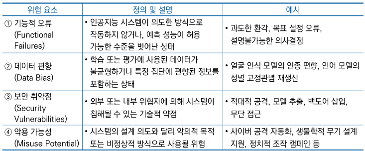

▣ 인공지능의 오남용 및 악용 가능성

ㅇ인공지능은 본래의 설계 목적과 달리 사용되거나 악의적으로 활용될 수 있으므로, 사업자는 이를 합리적으로 예상 가능한 범위에서 위험 식별 대상에 포함 
ㅇ오남용의 예로는 비전문가가 의료/법률 분야 인공지능의 결과를 그대로 활용하여 발생하는 피해가 있으며, 악용의 예로는 딥페이크를 이용한 신원 도용, 자동화된 피싱 공격, 허위정보의 대규모 확산 사례 존재 
ㅇ이러한 위험은 최근 발생 사례의 존재 여부, 기술적 실행 용이성, 경제적/사회적 유인의 존재 여부 등을 종합적으로 고려하여 식별 
ㅇ발생 가능성이 극히 낮거나 실행이 사실상 불가능한 시나리오는 제외할 수 있으나, 이미 유사 사례가 존재하거나 공개 도구를 통해 비교적 손쉽게 실행 가능한 경우에는 반드시 위험 후보로 포함 

**▣ 위험식별 자가점검 체크리스트**

	□ 위험 식별의 범위를 인공지능 수명주기 전 과정으로 설정하고, 단계별 위험 후보를 검토하였는가?
	□ 객관적 근거에 기반하여 "합리적으로 예상 가능한 범위"를 설정하였는가?
	□ 인공지능의 특수성과 기술적 특성을 함께 고려하여 위험을 식별하였는가?
	□ 합리적으로 예상 가능한 오남용/악용 시나리오를 포함하여 위험을 식별하였는가?
	□ 식별된 위험을 현존/잠재로 구분하고, 발생 조건/영향 경로 등 핵심 맥락 정보를 함께 정리하였는가?

 

### ② 위험 식별 절차 및 방법 마련
인공지능의 특성과 수명주기에 적합한 체계적이고 반복 가능한 위험 식별 절차와 방법을 마련 

**(1) 위험 식별 절차의 단계적 구조화**  
위험 식별은 준비에서 갱신에 이르는 단계적 절차로 구성. 예컨대 사업자는 다음의 6단계 절차를 통해 
위험을 식별 
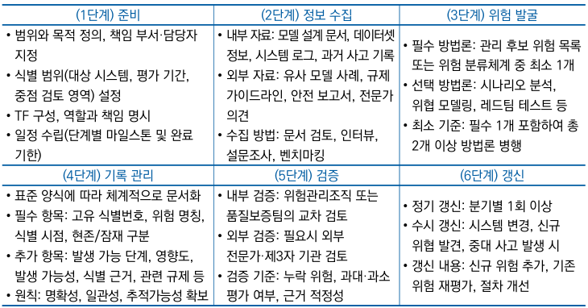

 

**(2) 위험 식별 방법론의 선택과 조합**  
ㅇ인공지능의 위험은 기술적/사회적/운영상 요소가 복합적으로 작용하므로, 단일한 위험 식별 방법론만으로는 불충분 
ㅇ이에 따라 사업자는 사전 정의된 최소 기준을 제공하는 방법론과, 인공지능 특성에 따라 보완적으로 활용되는 방법론을 조합 
ㅇ사업자는 주요 방법론 중 최소 1개 이상을 포함하여 총 2개 이상의 방법론을 병행함으로써, 정적 위험과 동적 위험을 함께 식별. 예를 들어 다음과 같이 구성하여 활용 
ㅇ인공지능 기술의 급속한 발전을 고려하여, 분기별로 방법론의 적절성을 재검토하고 필요시 새로운 방법론을 추가 도입 
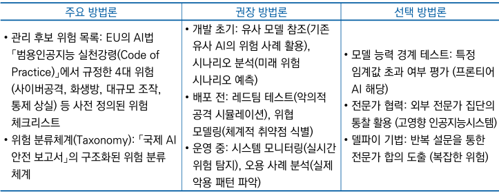

 

**(3) 개발 단계f운영 단계별 방법론의 차별적 적용**  
위험 식별 방법론은 인공지능의 개발 단계와 운영 단계에 따라 달리 적용하는 것이 효과적 
ㅇ개발 초기 단계에서는 유사 인공지능 사례 분석이나 시나리오 분석을 통해 구조적/장기적 위험을 탐색 
ㅇ배포 전 단계에서는 레드팀 테스트나 위협 모델링을 통해 악의적 공격 가능성과 취약점을 집중적으로 점검 
ㅇ운영 단계에서는 시스템 모니터링과 실제 오용 사례 분석을 통해 예상하지 못한 위험을 조기에 탐지 
이러한 단계별 적용은 위험 식별을 일회적 점검이 아닌 동적인 순환 과정으로 만드는 데 기여 
  
**(4) 최소 기준 설정과 절차 운영의 유연성 확보**  
고시의 취지에 부합하도록, 사업자는 위험 식별 절차와 방법에 대해 최소한의 운영 기준을 명확히 설정. 예컨대 절차의 단계 구성, 적용 방법론 수, 정기 갱신 주기 등이 이에 해당 
동시에 인공지능 기술의 급속한 발전과 새로운 위험 유형의 출현을 고려하여, 기존 절차나 방법론을 경직되게 고정하지 않고 필요 시 신속히 보완/확장할 수 있는 유연성을 확보 
이를 위해 분기별 또는 주기적으로 위험 식별 절차와 방법론의 적절성을 재검토 
 
**(5) 책임과 역할의 명확화**  
위험 식별 절차가 형식적으로 운영되지 않도록, 각 단계별 책임 부서와 담당자, 의사결정 권한을 명확히 정의 
특히 위험 식별 결과가 이후 위험 평가 및 위험 완화 단계로 어떻게 연계되는지에 대한 내부 흐름을 명확히 함으로써, 절차 간 단절을 방지 

**▣ 위험 식별 절차 자가점검 체크리스트**

	□ 위험 식별을 위한 단계적 절차가 마련되어 있는가?
	□ 개발/배포/운영 단계별로 적절한 위험 식별 방법론을 차별적으로 적용하고 있는가?
	□ 필수 방법론을 포함하여 최소 2개 이상의 위험 식별 방법론을 병행하고 있는가?
	□ 위험 식별 결과에 대한 내부 검증 또는 교차 검토 절차가 마련되어 있는가?
	□ 위험 식별 절차와 방법론을 정기적으로 재검토/갱신하고 있는가?

 

### ③ 위험 식별 결과의 문서화 및 관리
위험 평가/위험 완화/사고 대응 및 보고 단계까지 연속적으로 활용될 수 있도록 위험 식별 결과를 체계적으로 문서화하고 관리 

**(1) 위험 식별 결과의 표준화된 문서화**
사업자는 자사의 인공지능시스템이 초래할 수 있는 위험을 사전에 식별할 책임이 있으며, 그 식별 과정은 객관성과 검증가능성을 갖추어야 함. 이는 단순한 직관적 판단이나 일회성 점검이 아니라, 구조화된 방법론에 기반해 제3자도 이해 /평가 가능한 방식으로 문서화되어야 함을 의미 
고시에 따라, 사업자는 위험 식별과 관련하여 최소한 다음 각 항목을 포함하여 문서화 
ㅇ위험의 식별번호 및 명칭 
ㅇ위험식별 시점 
ㅇ위험식별 방법 
ㅇ위험식별 결과 
위 항목들은 위험 식별의 존재 여부와 절차적 정당성을 확인하기 위한 최소 요건으로서, 추가적으로 다음과 같은 항목을 포함 
ㅇ위험의 유형 및 관련 수명주기 단계 
ㅇ현존 위험 또는 잠재적 위험 여부 
ㅇ식별 근거(사례, 분석 결과, 테스트 방법 등) 
 
**(2) 고유 식별번호 부여 및 이력 관리**  
각 위험에는 고유한 식별번호를 부여하여야 하며, 이를 통해 동일 위험이 반복적으로 식별/검토되는 경우에도 일관되게 관리 
위험 명칭은 해당 위험의 핵심 내용을 명확하고 직관적으로 나타낼 수 있도록 설정하되, 필요한 경우 간단한 설명을 병기 
ㅇ위험 명칭은 명확하고 직관적인 표현을 사용하되, 국제적으로 통용되는 용어나 표준 분류체계를 참고 
ㅇ조직 차원에서 표준 용어집을 유지/갱신하여 명칭의 일관성을 확보 
동일 위험이 재검토/재식별되는 경우에는 식별번호를 유지하되, 내부 관리상 버전 또는 변경 이력으로 구분하여 관리 
 
**(3) 위험의 구분 및 관리 체계**  
위험 목록은 위험 간의 관계, 중첩 여부, 공통 원인 등을 함께 검토할 수 있도록 구성 
예컨대 식별된 위험은 그 성격에 따라 현존 위험과 잠재적 위험으로 구분하여 관리: 
ㅇ현존 위험은 이미 확인된 위험으로서, 즉각적인 위험 평가 및 대응 계획 수립이 필요한 대상 
ㅇ잠재적 위험은 현재는 발생하지 않았으나 합리적으로 예상 가능한 위험으로서, 지속적인 모니터링과 정기적 재검토 대상 
 
**(4) 위험 목록의 정기적 갱신 및 변경 관리**  
위험 목록은 인공지능의 변경, 운영 환경 변화, 신규 위협 등장 등에 따라 지속적으로 관리/갱신되는 대상으로 취급 
이에 따라 사업자는 정기적으로(예: 분기별 1회 이상) 위험 목록을 재검토하고, 신규 위험 추가, 기존 위험의 재정의, 삭제 또는 통합 등의 변경 사항을 반영 
시스템의 실질적 변경, 신규 기능 추가, 외부 환경 변화, 사고 발생 등 중대한 사유가 있는 경우에는 정기 주기와 무관하게 수시 갱신을 수행 
갱신이 이루어진 경우에는 갱신 사유와 시점을 함께 기록하여, 위험 관리 과정의 연속성과 투명성을 확보 
 
**(5) 위험 식별 결과의 활용과 연계**  
문서화된 위험 식별 결과는 이후 단계인 위험의 평가, 위험의 완화, 안전사고 대응, 보고 및 제출의 공통 기초 자료로 활용 
이를 위해 위험 식별 문서와 위험 평가/완화 문서 간의 연계성을 확보하고, 동일 위험에 대해 일관된 식별번호와 명칭을 사용 
 
**(6) 보관 및 접근 관리**  
위험 식별과 관련된 문서는 인공지능 운영 종료 이후에도 일정 기간 보관(예: 3년)하는 것이 바람직하며, 관련 법령에서 별도로 보관 기간이 규정된 경우, 해당 규정 우선 적용 
문서에 대한 접근 권한은 업무 필요성에 따라 관리하되, 내부 검토/외부 검증/감독기관 요청 등에 대응할 수 있도록 적정한 접근성과 보존성을 함께 고려 

**▣ 위험식별 결과 문서관리 자가점검 체크리스트**

	□ 식별된 각 위험에 대해 위험 식별번호 및 명칭, 위험식별 시점, 위험식별 방법, 위험식별 결과를 포함하여 문서화하고 있는가?
	□ 동일 위험이 반복적으로 식별/재검토되는 경우, 식별번호를 유지한 채 이력 또는 버전 관리가 이루어지고 있는가?
	□ 위험 식별 결과가 해당 위험의 핵심 내용과 발생 맥락을 이해할 수 있도록 정리되어 있는가?
	□ 인공지능의 변경, 운영 환경 변화, 신규 위협 등장 시 위험 목록을 정기 또는 수시로 갱신하고 그 사유를 기록하고 있는가?
	□ 위험 식별 결과가 이후 위험 평가, 위험 완화, 안전사고 대응 및 보고 단계에서 활용될 수 있도록 연계되어 관리되고 있는가?

 

## [2-3-2] 위험의 평가
### ① 위험의 중대성 및 실현 가능성 평가
식별된 각 위험을 종합적으로 평가함으로써, 해당 위험이 인공지능의 안전성 확보 측면에서 갖는 상대적 중요도를 판단하고 이후 완화 방안을 합리적으로 설계 

**(1) 평가 대상의 범위와 기준**  
위험 평가는 2-1 단계에서 식별되어 문서화된 위험을 대상으로 하며, 위험 식별번호를 기준으로 개별 위험 단위별로 수행 
동일 위험에 대해 과거 평가 이력이 있는 경우에는, 이전 평가 결과와 이후의 기술적/운영상 변화, 신규 사고 사례 또는 외부 환경 변화를 함께 고려 
 
**(2) 평가 항목의 구성**  
고시에 따라, 사업자는 다음의 요소들을 중심으로 위험을 평가:
ㅇ영향의 심각성: 위험이 현실화될 경우 사람의 생명/신체의 안전 또는 기본권, 공공의 안전에 미칠 수 있는 피해의 크기 
ㅇ중대성: 위험이 실현될 경우 사회적/경제적/윤리적으로 미칠 수 있는 파급력의 범위와 정도 
ㅇ실현 가능성: 위험이 실제로 발생할 수 있는 가능성으로서, 기술적 전제조건의 충족 여부, 악용 또는 오남용의 용이성, 과거 발생 사례 등을 종합적으로 고려 
ㅇ빈도: 위험이 일회성에 그치지 않고 반복적으로 발생할 가능성 
ㅇ관리 가능성: 위험 발생 시 기술적/조직적 수단을 통해 통제/완화할 수 있는 정도 
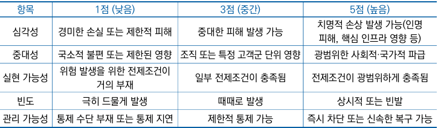

이러한 요소들은 상호 연관되어 있으므로, 단일 항목만을 기준으로 판단하기보다는 종합적 관점에서 평가 
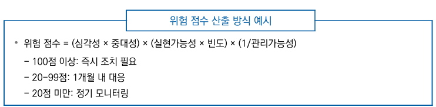

**(3) 평가의 수준과 방식**  
위험의 성격과 영향 범위에 따라, 모든 위험을 동일한 수준의 정밀도로 평가 불필요 
다만, 사람의 생명/신체, 기본권 또는 공공의 안전에 중대한 영향을 미칠 가능성이 있는 위험에 대해서는 보다 보수적이고 정교한 평가 필요 
평가 결과는 위험 간의 상대적 수준을 비교하고, 고위험/중위험/저위험 등으로 구분할 수 있는 정도의 명확성 필요 
 
**(4) 평가 결과의 활용 방향**  
위험의 중대성 및 실현 가능성에 대한 평가는 위험 완화 조치의 수립/시행, 안전사고 모니터링 및 대응 체계 구축, 보고 및 제출 여부/시점 판단의 기초 자료로 활용 
특히 중대성이 높거나 실현 가능성이 큰 위험으로 평가된 경우에는, 후속 단계에서 우선적으로 관리/대응 

**▣ 위험 평가 자가점검 체크리스트**

	□ 식별된 각 위험에 대해 평가를 수행하였는가?
	□ 위험 평가 시 심각성, 중대성, 가능성, 빈도, 관리/통제 가능성 등을 고려하였는가?
	□ 사람의 생명/신체, 기본권 또는 공공의 안전에 중대한 영향을 미칠 가능성이 있는 위험에 대해 보다 보수적이거나 정밀한 평가를 수행하였는가?
	□ 평가 결과를 통해 위험 간 상대적 수준(우선순위 또는 등급)을 구분할 수 있는가?
	□ 위험 평가 결과가 이후 위험 완화 조치, 안전사고 대응, 보고, 판단의 기초 자료로 활용될 수 있도록 정리되어 있는가?

 

### ② 위험 평가 조직 구성 및 운영
식별된 위험을 객관적이고 신뢰성 있게 평가하기 위하여, 위험 평가를 전담하는 조직을 구성/운영하고, 필요한 경우 외부 기관 또는 전문가의 참여를 통해 위험 평가의 정당성과 신뢰성을 확보 

**(1) 위험 평가 조직의 설치 및 역할**  
인공지능사업자는 식별된 위험을 평가하기 위하여 위험 평가를 전담하는 조직(이하 “위험평가 조직”)을 구성 
위험평가조직은 위험 평가의 기획/수행, 평가 결과의 정리 및 내부 보고, 필요 시 외부 검토 연계를 
담당하는 핵심적 관리 주체로 기능 
 
**(2) 구성 원칙 및 전문성 확보**  
인공지능 위험은 기술적 복잡성과 사회적/윤리적 민감성을 동시에 지니므로, 위험평가조직은 다학제적 관점이 반영된 구성 필요 
예를 들어 다음과 같은 전문성이 조직 내에 포함: 
ㅇ모델 아키텍처, 학습 데이터, 성능 평가를 이해할 수 있는 기술 전문가 
ㅇ인권, 개인정보 보호, 사회적 영향 등을 검토할 수 있는 정책/윤리 전문가 
ㅇ보안 취약점과 악용 가능성을 평가할 수 있는 사이버보안 전문가 
이를 통해 위험 평가가 특정 부서나 단일 관점에 편중되지 않도록 하는 것이 중요 
 
**(3) 조직의 독립성 및 객관성 확보**  
위험평가조직은 기술 개발 부서, 사업 운영 부서, 마케팅 부서 등과 조직적으로 분리된 위치에서 운영 필요 
특히 평가 결과가 사업 일정이나 성과 압박에 의해 왜곡되지 않도록, 평가 결과를 최고책임자 또는 독립된 의사결정 라인에 직접 보고할 수 있는 체계를 마련하는 것이 중요 
아울러 평가자와 평가 대상 간의 이해 충돌을 방지하기 위해, 평가자가 자신이 직접 관여한 개발 프로젝트를 평가하지 않도록 하는 내부 기준을 마련하거나 평가 기준과 절차를 표준화하여 개인적 판단의 영향을 최소화하는 방식도 고려 
 
**(4) 외부 기관 또는 전문가의 참여**  
사업자는 필요한 경우 외부 기관 또는 전문가를 위험평가조직에 참여시킬 수 있으며, 다음과 같은 주체를 포함 
ㅇ독립적인 감사기관 또는 연구기관 
ㅇ학계 전문가 
ㅇ법률/인권/윤리 분야 전문가 
ㅇ소비자 보호 또는 시민사회 분야 전문가 
외부 참여는 모든 위험 평가에 필수적인 것은 아니나, 위험의 사회적 파급력이 크거나 기술적 판단을 넘어선 가치 판단이 요구되는 경우에 유용 
 
**(5) 외부 자문 절차의 운영**  
사업자는 위험 평가 결과에 대한 해석이 기술 영역을 넘어 사회적 판단을 필요로 하는 경우, 외부 전문가의 의견을 수렴하기 위해 노력 
이를 위해 외부 자문위원회 또는 위험 해석 자문단을 운영할 수 있으며, 자문은 서면 의견서, 간담회, 평가 보고서 검토 등의 방식 활용 
외부 자문 결과는 최종 평가 결과에 어떻게 반영되었는지, 또는 반영하지 않은 경우 그 사유를 함께 문서화하여 관리 
 
**(6) 운영의 투명성과 기록 관리**  
위험평가조직의 구성, 역할, 운영 방식, 외부 참여 여부 등은 내부 규정이나 운영 문서로 명확히 정리 
또한 평가 과정에서 사용된 기준, 판단 근거, 의사결정 이력은 이후 검증이나 재평가 시 참고할 수 있도록 기록/관리 

**▣ 위험 평가 조직 자가점검 체크리스트**

	□ 위험 평가를 전담하는 조직 또는 이에 준하는 체계를 구성/운영하고 있는가?
	□ 위험평가조직이 기술/윤리/정책/보안 등 다양한 관점을 반영할 수 있는 전문성을 갖추고 있는가?
	□ 위험평가조직이 개발/사업 부서로부터 조직적/의사결정상 독립성을 유지하도록 설계되어 있는가?
	□ 평가자와 평가 대상 간의 이해 충돌을 방지하기 위한 기준이나 절차를 마련하고 있는가?
	□ 위험의 성격에 따라 외부 기관 또는 전문가의 참여/자문을 활용할 수 있는 절차를 갖추고 있는가?
	□ 위험평가조직의 운영 방식과 평가 과정이 투명하게 기록/관리되고 있는가?

 

### ③ 위험 평가 기준, 방법, 절차 설정
식별된 위험을 객관적이고 일관되게 평가하기 위하여 위험 평가 기준, 평가 방법 및 평가 절차를 사전에 마련하고, 이를 체계적으로 적용 

**(1) 평가 체계 설정의 기본 원칙**  
현 시점에서 인공지능 위험을 평가하는 통일되거나 지배적인 단일 방법은 존재하지 않음 
이에 따라 사업자는 위험의 성격, 영향 범위, 데이터 가용성 등을 고려하여, 전통적 위험관리 기법과 인공지능에 특화된 평가 방법, 그리고 미래 지향적 접근법을 적절히 선택/조합 
다만, 어떠한 평가 체계를 선택하더라도 위험 평가는 명확한 기준과 절차에 근거하여 수행되어야 하며, 선택/배제의 사유 설명 필요 
 
**(2) 평가 방법의 선택 및 병행 적용**  
사업자는 위험 평가 시 정성/서열 평가, 준정량 점수화, 정량 분석, 시나리오 기반 분석 중 최소 1종 이상의 평가 방법을 적용 
사람의 생명/신체, 기본권 또는 공공의 안전에 중대한 영향을 미칠 가능성이 있는 고위험 사안에 대해서는 2종 이상의 평가 방법을 병행 
대표적인 평가 방법의 예시: 
ㅇ정성/서열 평가: 초기 스크리닝 단계나 전문가 판단이 필요한 경우에 적합하며, 등급 또는 색상 기반 리스크 매트릭스를 활용 
ㅇ준정량 점수화: 복수 위험 요소를 비교하기 위해 항목별 가중치와 산식을 사전에 설정하여 위험 점수 산출 
ㅇ정량 분석: 벤치마크 결과, 레드팀 테스트 성공률, 운영 로그 등 객관적 데이터를 활용하여 통계적 근거를 제시 
ㅇ시나리오 기반 분석: Bow-tie 분석, FTA, FMEA 등 기법을 활용하여 원인-사건-결과 및 통제 수단을 구조적으로 분석 
 
**(3) 평가 방법 적용 요건 및 근거 관리**  
평가 방법을 선택하거나 제외한 경우에는 그 사유를 기록 
평가에 사용된 모든 증거에 대해 출처, 신뢰도, 수집 시점을 명시하고, 데이터 품질의 한계(대표성, 최신성, 편향 등)를 함께 기록. 예를 들어: 
ㅇ데이터가 부족하거나 새로운 유형의 위험인 경우에는 정성/서열 평가와 시나리오 기반 분석을 병행 
ㅇ운영 로그와 정량 지표가 충분한 경우에는 정량 분석과 준정량 점수화를 결합하여 적용 
ㅇ논쟁적이거나 중대한 고위험 사안에 대해서는 정량 또는 준정량 방법을 최소 1종 포함하여 2종 이상을 적용하고, 내부 테스트 결과/외부 사례를 활용한 삼각 검증을 수행 
 
**(4) 평가 절차의 단계적 구성**  
위험 평가는 위와 같은 단계적 절차를 참고하여 수행할 수 있으며, 위험의 성격/규모/영향 범위에 따라 일부 단계는 통합하거나 반복하여 적용 
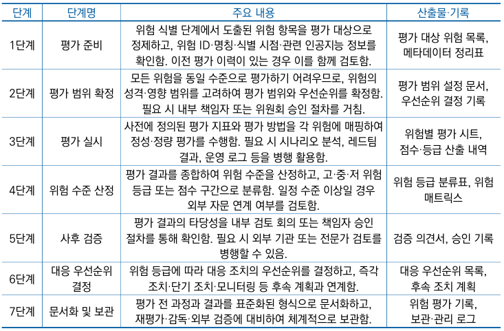

**(5) 품질 보증 및 평가의 일관성 확보**  
평가의 신뢰성과 재현성을 확보하기 위해, 평가자 간 기준 해석의 차이를 줄이기 위한 캘리브레이션 또는 상호 검토 절차를 운영 
모든 평가 결과는 리스크 매트릭스나 점수표 등 가시화된 형태로 제시하고, 평가 기준, 방법 선택 사유, 데이터 품질 한계 및 주요 판단 근거를 함께 문서화 

**▣ 위험 평가 기준 자가점검 체크리스트**

	□ 위험 평가를 위한 기준, 방법 및 절차를 사전에 정의하고 있는가?
	□ 위험 평가 절차가 단계적으로 구성되어 있고 일관되게 적용되고 있는가?
	□ 위험 평가 시 최소 1종 이상의 평가 방법을 적용하고 있는가?
	□ 평가 방법 선택/제외 사유와 데이터 품질 한계를 기록하고 있는가?
	□ 평가 결과가 가시화된 형태로 정리되어 후속 대응에 활용 가능한가?

 

### ④ 위험 평가 결과 검증
위험 평가 결과의 객관성/신뢰성/정당성을 확보하기 위하여, 평가 과정과 결론이 합리적인 기준과 근거에 따라 도출되었는지를 검증하는 체계를 마련 

**(1) 검증의 범위와 대상**  
위험 평가 결과 검증은 개별 위험의 평가 점수뿐만 아니라, 평가 기준의 적용 적정성, 사용된 데이터와 증거의 타당성, 평가 방법 선택의 합리성 등을 포함 
특히 고위험으로 분류된 위험, 사회적/윤리적 판단이 수반되는 위험, 이해관계자에게 중대한 영향을 미칠 수 있는 위험은 우선적인 검증 대상 
동일한 위험이 반복적으로 평가되는 경우에는 이전 평가 결과와의 일관성 여부 또한 검증 대상에 포함 
 
**(2) 내부 검증 절차의 마련**  
사업자는 위험평가조직 또는 이에 준하는 내부 검토 주체를 통해 평가 결과에 대한 교차 검토 (cross-check)를 수행 
내부 검증 과정에서는 평가자 간 판단 편차, 평가 기준 오적용 여부, 과대/과소 평가 가능성 등을 중점적으로 점검 
평가에 관여하지 않은 부서 또는 인력이 검증에 참여하도록 함으로써 이해충돌을 최소화하고 객관성을 보완 
 
**(3) 외부 기관 또는 전문가를 통한 검증**  
고시에 따라, 사업자는 위험 평가 결과의 검증을 위하여 외부 기관 또는 전문가 활용 가능 
외부 검증은 내부 평가만으로는 판단의 정당성을 충분히 확보하기 어려운 경우, 또는 기술적 판단을 넘어 사회적/법적/윤리적 고려가 요구되는 경우에 유용 
외부 검증 주체는 학계/연구기관, 법률/윤리/인권 전문가, 보안 전문기관 등 위험의 성격에 적합한 주체로 구성 
 
**(4) 검증 방식과 기준**  
검증은 서면 검토, 평가 보고서 리뷰, 질의/응답, 회의 또는 워크숍 등 다양한 방식으로 수행 
이 과정에서 사전에 설정된 평가 기준/방법/절차에 대한 적합성 여부, 증거의 신뢰도, 결론 도출의 논리적 일관성 등을 검증 기준으로 설정 
외부 검증 결과가 내부 평가와 상이한 경우에는 그 사유를 검토하고, 필요 시 평가 결과를 수정하거나 보완 
 
**(5) 검증 결과의 반영 및 기록**  
검증 결과는 최종 위험 평가 결과에 반영 여부와 그 사유를 명확히 구분하여 기록 
검증 과정에서 제시된 권고사항, 이견, 보완 요구 사항 등은 이후 위험 완화 조치 수립 및 재평가 시 중요한 참고 자료로 활용 
검증의 전 과정은 문서화하여 관리함으로써, 감독기관의 요청이나 외부 감사 시 평가 결과의 정당성을 설명 

**▣ 위험평가 결과 검증 자가점검 체크리스트**

	□ 위험 평가 결과에 대해 사전에 정의된 검증 대상과 범위가 설정되어 있는가?
	□ 검증 과정에서 평가 기준 적용의 적정성, 증거의 신뢰도, 결론의 논리적 일관성이 점검되었는가?
	□ 위험 평가에 직접 관여하지 않은 내부 주체에 의한 교차 검증 절차가 마련되어 있는가?
	□ 필요 시 외부 기관 또는 전문가 참여를 통한 검증 절차를 가동할 수 있는 체계가 마련되어 있는가?
	□ 검증 과정 전반이 문서화되어 추후 재평가/외부 점검/감독기관 요청에 대응 가능한 상태로 관리되고 있는가?

 

### ⑤ 위험 평가 결과의 문서화 및 관리
인공지능 위험 평가의 절차와 결과를 명확한 형식에 따라 문서화하고 체계적으로 관리함으로써, 위험 평가의 객관성/추적 가능성/재현성을 확보하고, 이후 위험 완화, 안전사고 대응, 보고 및 제출 단계에서 신뢰 가능한 근거 자료로 활용 

**(1) 고유 식별 번호**  
위험 평가 기록은 위험 식별 단계에서 부여된 고유 식별번호를 기준으로 연계하여 관리 
동일 위험에 대해 반복적 평가 또는 재검토가 이루어진 경우에는, 식별번호를 유지하되 버전 또는 회차 정보를 추가하여 관리 필요(예: R-2025-A00001-v2, R-2025-A00001-2025Q3) 
식별번호 체계는 조직 내에서 표준화되어야 하며, 임의로 변경되거나 중복되지 않도록 관리. 이를 통해 위험 관리 전 과정의 추적 가능성을 확보 
 
**(2) 평가 시점**  
위험 평가 기록에는 평가가 실제로 수행된 날짜와 시간, 또는 최종 의사결정이 확정된 시점을 명확히 기재 
추가적으로 평가 주체(담당 부서, 책임자, 외부 참여자 여부), 평가 유형(정기 평가 또는 수시 평가)을 함께 기록함으로써, 평가 맥락을 명확화 
재평가가 이루어진 경우에는 이전 평가 시점과의 관계를 명확히 구분하여 기록 
 
**(3) 평가 방법**  
위험 평가 결과에는 실제로 적용된 평가 방법을 구체적으로 기록 
여기에는 사용된 평가 체계(예: 내부 AI 위험 평가 매트릭스, 국제 표준 기반 체계), 평가 지표(예: 발생 가능성, 피해 규모, 관리 가능성 등), 분석 도구(예: 체크리스트, 시뮬레이션 도구, 외부 검증 도구 등)가 포함 
복수의 평가 방법을 병행한 경우에는 각 방법의 적용 범위와 역할을 구분하여 기록하고, 특정 방법을 선택하거나 제외한 사유도 함께 문서화하는 것이 필요 
 
**(4) 평가 결과**  
위험 평가 기록에는 평가를 통해 도출된 결론을 명확히 기재 
여기에는 위험 수준 등급(예: 낮음/중간/높음 또는 수치화된 등급), 대응 우선순위(예: 즉시 조치, 단기 조치, 모니터링 대상), 권고되는 조치 사항(예: 모델 수정, 사용 제한, 사용자 고지 강화 등)이 포함 
외부 기관 또는 전문가의 검토가 이루어진 경우에는 그 여부와 주요 의견을 함께 기록하여야 하며, 외부 검토를 실시하지 않은 경우에도 그 사유를 명시 
 
**(5) 기록의 갱신/보관 및 접근 관리**  
위험 평가 기록은 인공지능의 변경, 운영 환경 변화, 신규 위험 등장 등에 따라 갱신될 수 있는 살아있는 문서로 관리 
재평가 또는 변경이 이루어진 경우에는 변경 사유와 변경 내용을 함께 기록하여 이력을 관리 
위험 평가 관련 문서는 인공지능 운영 종료 이후에도 일정 기간 보관하여야 하며, 관련 법령에서 정한 보관 기간이 있는 경우 이를 준수 
문서 접근 권한은 업무 필요성에 따라 관리하되, 내부 감사, 외부 검증, 감독기관 요청 등에 적절히 대응할 수 있도록 관리 체계를 유지 

**▣ 위험 평가 결과 문서화 자가점검 체크리스트**

	□ 위험 평가 기록이 위험 식별 단계의 고유 식별번호와 연계되어 관리되고 있는가?
	□ 평가 시점, 평가 주체, 평가 유형이 명확히 기록되어 있는가?
	□ 실제로 적용된 평가 방법과 사용된 지표/도구가 구체적으로 문서화되어 있는가?
	□ 위험 수준, 대응 우선순위, 권고 조치가 평가 결과로 명확히 제시되어 있는가?
	□ 평가 기록이 갱신/보관/접근 관리 체계 하에 지속적으로 관리되고 있는가?

 

## [2-3-3] 위험의 완화
### ① 위험 완화 조치 수립 및 시행
위험 평가 결과에 따라 식별된 인공지능 위험을 수용 가능한 수준으로 제거하거나 완화하기 위한 조치를 체계적으로 수립/시행함으로써, 인공지능의 안전한 개발/배포/운영을 보장 

**(1) 위험 평가 결과에 기반한 조치 수립**  
위험 완화 조치는 반드시 위험 평가 결과와 직접적으로 연계되어야 하며, 직관이나 관행이 아닌 평가 지표와 우선순위에 근거하여 수립 
사업자는 위험의 심각성/중대성/실현 가능성/빈도/관리 가능성을 종합적으로 고려하여, 고위험으로 평가된 위험부터 우선적으로 조치 
동일 수준의 위험이 다수 존재하는 경우에는 취약계층에 대한 영향, 핵심 인프라 또는 공공 안전에 대한 파급 가능성을 추가 기준으로 삼아 우선순위를 설정 
위험이 원인-사건-결과의 연쇄 구조를 갖는 경우에는, 예방/탐지/대응 중 어느 단계에서 제거 또는 완화할 것인지를 명확히 설정 
 
**(2) 조치의 시급성/효과/실행 가능성 종합 고려**  
위험 완화 조치를 설계할 때에는 다음 요소를 종합적으로 검토: 
ㅇ시급성: 즉각적 피해 발생 가능성, 확산 속도, 노출 규모 
ㅇ효과성: 위험 감소 폭, 재발 방지 가능성, 목표 지표 달성 여부 
ㅇ실행 가능성: 비용/인력/기술적 한계, 일정/운영 제약, 규제 준수 여부 
시급성과 효과가 모두 높은 조치를 최우선으로 시행하되, 조치로 인한 성능 저하, 공정성 저해, 가용성 감소 등 부작용도 함께 평가하여 균형 있는 결정 필요 
즉각적인 완화가 곤란한 경우에는 위험 노출 범위 축소, 기능 제한, 인간 검토 강화 등 임시 조치를 병행 
 
**(3) 조직적 책임 구조 및 승인 절차**  
• 위험 완화 조치는 책임 주체와 승인 절차가 명확히 설정된 상태에서 시행 
• 위험 수준에 따라 다음과 같은 차등적 승인 구조를 설정: 
ㅇ저위험/중위험: 실무 부서 책임자 승인 후 즉시 시행 
ㅇ고위험: 위험관리전담부서 검토 → 위험관리위원회 또는 경영진 최종 승인 후 시행 
ㅇ긴급 상황: 실무 부서가 임시 조치를 우선 시행하되, 사후에 공식 승인 절차를 진행 
이러한 승인 체계는 사전에 문서화되어야 하며, 실제 운영 과정에서 반복적으로 적용/점검 
 
**(4) 수명주기 전반을 고려한 완화 조치 설계**  
위험 완화 조치는 인공지능의 특정 단계에 국한되지 않고, 개발/배포/운영 전반에 걸쳐 설계/이행하되, 다음과 같은 접근을 병행: 
ㅇ모델 설계 단계: 위험한 기능 제한, 유해 요청 거부 학습, 안전 중심 설계 
ㅇ보안 강화: 접근 통제, 암호화, 내부자 위협 대응, 보안 감사 
ㅇ배포 전략: 제한적 공개, 단계적 롤아웃, 조건부 기능 활성화 
ㅇ운영 단계: 실시간 모니터링, 위협 모델 갱신, 사용자 신고 채널 운영 
위험 완화는 사전 예방과 사후 대응이 결합된 다층적 구조로 설계되어야 하며, 단발성 조치가 아닌 지속적 관리 체계로 운영 
 
**(5) 조치 이후 효과 확인 및 재평가**  
위험 완화 조치 시행 이후에는 동일 위험에 대해 위험 평가를 재실시하여, 실제로 위험 수준이 감소하였는지를 확인 
재평가는 기존 평가 지표를 기준으로 수행하되, 필요 시 추가 지표를 활용 
조치 후에도 잔여 위험이 수용 가능 수준을 초과하는 경우에는 추가 조치 또는 조치 방식의 수정/보완이 필요 

**▣ 위험 완화 조치 자가점검 체크리스트**

	□ 위험 완화 조치가 위험 평가 결과와 명확히 연계되어 수립되었는가?
	□ 완화 조치가 인공지능 수명주기 전반을 고려하여 설계되었는가?
	□ 조치의 시급성, 효과, 실행 가능성이 종합적으로 검토되었는가?
	□ 위험 수준에 따른 책임 주체와 승인 절차가 명확히 설정/운영되고 있는가?
	□ 조치 시행 이후 위험 수준 재평가가 이루어졌는가?

 

### ② 위험 완화 조치의 문서화 및 관리
인공지능 위험 완화 조치의 수립/시행 내역과 그 결과를 체계적으로 문서화하고 관리함으로써, 위험 관리의 연속성/추적 가능성/책임성을 확보하고, 향후 위험 재평가, 유사 사례 대응, 외부 점검 및 감독기관 보고에 활용 

**(1) 위험 식별번호 연계 및 관리 일관성 확보**  
위험 완화 조치 기록은 반드시 해당 위험의 고유 식별번호와 연계하여 관리 
이 식별번호는 위험 식별 및 위험 평가 단계에서 사용된 번호 체계를 그대로 유지함으로써, 동일 위험에 대한 식별-평가-완화-사후 관리 전 과정을 하나의 연속된 흐름으로 추적 
동일 위험에 대해 복수의 완화 조치가 단계적으로 이루어진 경우에는, 각 조치를 구분하여 기록하되 식별번호의 일관성을 유지 
 
**(2) 위험 완화 조치 시행 시점의 명확한 기록**  
위험 완화 조치가 실제로 시행된 날짜와 시점을 명확히 기록 
다단계 조치 또는 단계적 롤아웃 방식이 적용된 경우에는 각 단계별 시행 시점을 구분하여 기록 
조치 시행 이전에 사전 승인, 시험 적용, 임시 조치가 이루어진 경우에도 해당 내역을 함께 기록하여, 조치의 시의성과 적정성을 입증 
 
**(3) 위험 완화/제거 방법의 구체적 기술**  
위험 완화 조치 기록에는 어떤 방식의 조치가 이루어졌는지를 구체적으로 기술 
조치는 그 성격에 따라 다음과 같이 구분하여 기록:
ㅇ기술적 조치: 기능 제한, 프롬프트 필터링, 알고리즘 수정, 모델 재학습 등 
ㅇ운영적 조치: 사용자 접근 제한, API 사용 정책 변경, 서비스 범위 축소 등 
ㅇ조직적/제도적 조치: 외부 전문가 자문, 승인 체계 강화, 위험 게이팅 적용 등 
조치의 책임 부서, 담당자, 승인 경로를 함께 기록함으로써 조치 책임 소재 명확화 
 
**(4) 위험 완화 조치 결과 및 잔여 위험 관리**  
위험 완화 조치 이후에는 해당 조치가 실제로 위험 수준을 얼마나 감소시켰는지를 평가하여 그 결과를 기록 
조치 전후의 위험 수준을 동일한 평가 지표로 비교하는 것을 원칙으로 하되, 필요 시 보조 지표를 추가 
완화 이후에도 잔여 위험이 존재하는 경우에는, 그 수준이 수용 가능한지 여부와 추가 조치 또는 모니터링 계획을 함께 기록 
고위험군에 해당하는 조치의 경우에는 테스트 로그, 모니터링 결과, 사용자 반응 등 객관적 증거 자료를 함께 확보/보존 
 
**(5) 기록의 보관/접근 및 활용 관리**  
위험 완화 조치 관련 문서는 단순한 이력 기록이 아니라, 향후 위험 재평가 및 유사 위험 예방을 위한 핵심 관리 자산으로 취급 
관련 문서는 인공지능 운영 종료 이후에도 일정 기간 보관하는 것이 바람직하며, 관련 법령에서 별도로 정한 보관 기간이 있는 경우 이를 준수 
문서 접근 권한은 업무 필요성에 따라 관리하되, 내부 감사, 외부 검증, 감독기관 요청 등에 대응할 수 있도록 적정한 접근성과 보존성을 확보 

**▣ 위험 완화 조치 문서화 자가점검 체크리스트**

	□ 위험 완화 조치 기록이 해당 위험의 고유 식별번호와 연계되어 있는가?
	□ 위험 완화 조치의 시행 시점과 단계가 명확히 기록되어 있는가?
	□ 완화/제거 방법이 기술적/운영적/조직적 측면에서 구체적으로 기술되어 있는가?
	□ 조치 이후 위험 수준 변화 및 잔여 위험이 평가/기록되었는가?
	□ 완화 조치 기록이 향후 재평가/외부 점검에 활용 가능하도록 관리되고 있는가?

 

### ③ 긴급 대응 계획 수립
위험 완화 조치를 신속히 시행하기 어려운 상황에서도 인공지능으로 인한 피해를 최소화할 수 있도록, 사전에 실행 가능한 긴급 대응 계획을 수립/유지 

**(1) 긴급 대응 계획의 적용 대상 및 발동 조건**  
긴급 대응 계획은 고위험으로 평가된 위험이 현실화될 우려가 있거나, 위험의 실현 속도가 빠르거나 파급 범위가 큰 경우가 주요 적용 대상 
특히 기술적 수정, 모델 재학습, 구조적 변경 등 근본적 완화 조치에 시간이 소요되는 위험에 대해 우선적으로 마련 
사업자는 긴급 대응 계획의 발동 조건을 사전에 정의하여, 위험 발생 징후가 확인되는 즉시 대응 
발동 조건에는 이상 사용 패턴 탐지, 레드팀/모니터링 결과, 외부 제보, 사고 발생 등이 포함 
 
**(2) 대응 우선순위 및 피해 최소화 전략**  
긴급 대응 계획 수립 시에는 위험의 실현 가능성, 피해 규모, 확산 속도를 기준으로 대응 우선순위를 설정 
대응 전략에는 다음과 같은 피해 최소화 조치를 포함: 
ㅇ고위험 기능의 일시적 비활성화 또는 사용 제한 
ㅇ특정 사용자군 또는 사용 맥락에 대한 접근 차단 
ㅇ입력/출력 제한, 프롬프트 차단, 응답 강도 축소 
ㅇ서비스 범위 축소 또는 임시 중단 
이러한 조치는 근본적 위험 완화 조치가 완료될 때까지의 임시적 통제 수단으로 설계 
 
**(3) 의사결정 체계 및 책임 분장**  
긴급 상황에서는 신속한 의사결정이 가능하도록 책임자, 승인 권한, 보고 체계를 사전에 명확히 정의 
대응 계획에는 위기 발생 시점의 의사결정 책임자, 기술/보안 담당자의 역할, 내부 보고 라인, 외부 통지 절차 포함 
특히 광범위하고 중대한 영향의 경우, 외부 전문가 또는 관계 기관과의 협력 체계를 사전에 설정하여 대응의 실효성 확보 필요 
 
**(4) 실행 가능성 중심의 계획 설계 및 문서화**  
긴급 대응 계획은 실제 운영 환경에서 즉시 실행 가능한 절차와 행동 요령을 포함 
계획 문서에는 다음 사항이 포함:- 대응 단계별 조치 내용과 실행 조건- 담당 조직 및 담당자의 연락 체계- 내부/외부 커뮤니케이션 채널- 조치 이후의 점검 및 후속 보고 절차 
이러한 계획은 정형화된 문서로 관리되어야 하며, 관련 구성원이 접근/이해할 수 있도록 공유 
 
**(5) 점검/훈련 및 지속적 보완 
긴급 대응 계획은 수립 이후에도 정기적으로 점검/갱신 
모의 훈련, 테이블탑 연습 등을 통해 실제 상황에서 계획이 작동 가능한지를 점검하고, 발견된 문제점을 반영하여 보완 
인공지능의 기능 변경, 운영 환경 변화, 신규 위험 식별 시에는 긴급 대응 계획도 함께 재검토 

**▣ 긴급 대응 계획 자가점검 체크리스트**

	□ 즉각적 위험 완화가 어려운 상황을 전제로 한 긴급 대응 계획이 마련되어 있는가?
	□ 긴급 대응 계획의 발동 조건과 적용 대상이 사전에 명확히 정의되어 있는가?
	□ 피해 최소화를 위한 임시 통제 수단과 대응 우선순위가 설정되어 있는가?
	□ 긴급 상황에서의 의사결정 책임자와 보고/승인 체계가 명확한가?
	□ 대응 계획이 실제 운영 환경에서 즉시 실행 가능한 수준으로 문서화되어 있는가?
	□ 긴급 대응 계획에 대한 정기적 점검/훈련 및 갱신이 이루어지고 있는가?

 

---

# [2-4] 안전사고 모니터링 및 대응
## [2-4-1] 위험관리체계의 구축
### ① 안전사고 대응 조직 구성
안전사고를 예방/탐지/대응하기 위한 조직적 기반을 마련하기 위하여, 사업자가 안전사고 대응 조직을 체계적으로 구성/운영 

**(1) 대응 조직 구성의 기본 원칙**  
안전사고 대응 조직은 인공지능시스템의 설계, 개발, 배포, 운영 전반에서 발생 가능한 사고를 종합적으로 관리할 수 있도록 구성 
인공지능의 비가시성, 자율성, 예측 불가능성을 고려할 때, 대응 조직은 기술 부서에 한정되지 않고 윤리, 법률, 정책, 보안, 사용자 보호 등 다양한 관점을 통합하는 다학제적 구조 필요 
조직 구성 시 사고 대응의 신속성과 책임성을 확보할 수 있도록 역할과 권한을 명확히 정의 
 
**(2) 책임 구조 및 최고 책임자의 지정**  
안전사고 대응의 최종 책임은 최고위 정책결정자, 최고 인공지능 책임자(CAIO) 또는 최고 인공지능 안전 책임자(CAISO) 등 명확한 책임 주체에게 부여 
해당 책임자는 안전사고 대응 조직의 구축/운영에 대한 총괄 책임을 지며, 사고 발생 시 대응 여부, 시스템 중단, 외부 보고 등 주요 의사결정을 수행 
책임자의 권한과 책임 범위는 내부 규정 또는 대응 매뉴얼을 통해 명확히 문서화 
 
**(3) 전담 조직 및 현장 대응 체계의 구축**  
안전사고의 중요성과 복잡성을 고려할 때, 전담 대응 조직 별도 설치 권장 
전담 조직은 안전사고 모니터링, 사고 분석, 대응 조치 설계 및 이행 관리 등 핵심 기능을 수행할 수 있도록 구성 
아울러, 개발/운영 부서별로 안전 담당자를 지정하여 현장 중심의 1차 대응자 역할을 수행하도록 함으로써, 위험 징후의 조기 식별과 신속한 보고 수행 
 
**(4) 조직의 독립성 및 판단 자율성 보장**  
안전사고 대응 조직은 개발 일정, 사업 성과, 마케팅 목표 등과 같은 내부 이해관계로부터 독립적으로 판단할 수 있도록 운영 필요 
이는 단순한 조직도상의 분리를 넘어, 대응 조직이 안전을 이유로 한 서비스 중단/제한, 기능 비활성화 등의 결정을 실질적으로 제안/권고할 수 있는 자율성 보장 
대응 조직이 최고 책임자에게 직접 보고할 수 있는 체계를 마련하는 것은 이러한 독립성을 제도적으로 확보하는 하나의 방식 
 
**(5) 외부 협력 구조의 포함**  
안전사고의 성격상 내부 조직만으로 모든 위험을 충분히 판단하기 어려운 경우가 있으므로, 외부 기관 또는 전문가와의 협력 구조를 마련 
외부 협력 대상에는 학계/연구기관, 법률/인권 전문가, 사이버보안 전문기관, 시민사회 또는 소비자 보호 단체 등이 포함 
이러한 외부 협력은 상시 조직 구성원으로 참여시키는 방식뿐 아니라, 특정 사고나 고위험 사안 발생 시 자문 또는 검토를 요청하는 방식으로도 운영 
 
**(6) 지속적 운영 및 점검 체계**  
안전사고 대응 조직은 일회성 점검이나 형식적 구성에 그치지 않고, 지속적으로 운영/점검되는 체계로 설계 
이를 위해 조직의 역할, 대응 절차, 협업 구조를 정기적으로 검토/개선하고, 조직 구성원에 대한 교육/훈련을 병행 
이러한 지속적 운영 체계는 이후 안전사고 모니터링, 사고 대응, 사후 예방 조치로 자연스럽게 연계 

**▣ 안전사고 대응 조직 자가점검 체크리스트**

	□ 안전사고를 전담하거나 총괄하는 대응 조직 또는 기능이 공식적으로 지정되어 있는가?
	□ 안전사고 대응에 대한 최종 책임자 및 의사결정 권한이 명확히 설정되어 있는가?
	□ 보안/법률/윤리/정책 등 다양한 관점이 대응 조직 또는 협업 구조에 반영되어 있는가?
	□ 대응 조직이 내부 이해관계로부터 독립적으로 안전 판단을 내릴 수 있는 구조인가?
	□ 사고 징후를 신속히 인지하고 대응 조직으로 보고할 수 있는 내부 전달 체계가 마련되어 있는가?
	□ 외부 전문가 또는 전문기관과 협력할 수 있는 절차가 사전에 준비되어 있는가?

 

### ② 안전사고 대응 절차 마련
안전사고 또는 그 징후가 식별된 경우, 조직이 즉각적이고 일관된 방식으로 대응할 수 있도록 사고 대응 절차를 사전에 정의/정비 

**(1) 안전사고의 범위 및 대응 개시 기준 설정**  
안전사고는 단순한 정보보안 침해에 한정되지 않고, 시스템 오작동, 비의도적 기능 발현, 알고리즘적 편향, 오남용/악용으로 인한 피해 가능성 등 인공지능 특유의 위험을 포함한다는 점을 전제 
사업자는 어떤 상황을 ‘안전사고’ 또는 ‘대응이 필요한 사고 징후’로 간주할 것인지 사전에 정의하고, 대응 절차가 개시되는 기준을 명확히 설정 
이 기준에는 실제 피해 발생뿐 아니라, 피해가 발생하지 않았더라도 생명/신체/기본권 침해로 이어질 수 있는 합리적인 위험 징후가 포함 
 
**(2) 단계별 사고 대응 절차의 구조화**  
사고 대응 절차는 일반적으로 사고 인지 → 초기 판단 → 조치 결정 → 실행 → 사후 점검의 단계로 구성 
각 단계별로 수행해야 할 핵심 행위와 판단 기준을 명확히 하여, 사고 대응이 특정 개인의 경험이나 재량에 과도하게 의존하지 않도록 유의 
특히 초기 판단 단계에서는 사고의 심각성, 확산 가능성, 시스템 관여 정도 등을 신속히 분류할 수 있는 기준을 마련 
 
**(3) 중단/제한/통제 조치에 대한 사전 규칙 마련**  
안전사고 대응 절차에는 시스템의 전면 중단, 기능 제한, 접근 통제, 배포 중단, 롤백 등 가능한 조치 유형과 그 적용 조건을 사전에 포함 
이러한 조치는 “사후 책임 회피”가 아니라 피해 최소화를 위한 예방적 수단이라는 점에서, 보수적 기준을 적용하는 것이 허용 
조치 결정 시에는 즉시성, 가역성, 최소 권한 원칙을 함께 고려하여 과도한 대응과 대응 지연을 모두 방지 
 
**(4) 내부 보고/의사결정/기록 절차의 연계**  
사고 대응 절차는 단순한 기술적 조치에 그치지 않고, 내부 보고 및 의사결정 구조와 유기적으로 연결 
사고 인지 시점, 판단 결과, 조치 내용, 책임자, 근거 등은 즉시 기록되어야 하며, 이는 이후 사고 분석/외부 보고/재발 방지의 기초 자료로 활용 
특히 고위험 사고의 경우, 최고 책임자 또는 지정된 의사결정 라인으로 신속히 보고되도록 절차를 명시 
 
**(5) 외부 통지/보고 절차와의 정합성 확보**  
안전사고 대응 절차는 과학기술정보통신부 보고, 관계 기관 통지, 이용자 안내 등 외부 대응 절차와 충돌하지 않도록 사전에 정합성을 확보 
내부 대응이 종료된 이후에야 외부 보고를 검토하는 구조가 아니라, 사고 유형에 따라 내부 대응과 외부 보고가 병행될 수 있도록 설계 
이를 통해 사고 대응 과정에서의 혼선, 책임 공백, 보고 지연을 예방 

**▣ 안전사고 대응 절차 자가점검 체크리스트**

	□ 안전사고 및 대응 대상이 되는 사고 징후의 범위가 사전에 정의되어 있는가?
	□ 사고 인지부터 조치 실행까지의 단계별 대응 절차가 명확히 구분되어 있는가?
	□ 사고의 심각도에 따라 중단/제한/통제 조치를 선택할 수 있는 기준이 마련되어 있는가?
	□ 사고 대응 과정에서의 내부 보고 및 의사결정 절차가 명확히 정리되어 있는가?
	□ 사고 대응 과정의 주요 판단과 조치가 기록/관리되도록 설계되어 있는가?

 

### ③ 안전사고 예방을 위한 교육, 훈련
 안전사고 대응 조직과 절차가 실제 상황에서 효과적으로 작동할 수 있도록, 관련 인력에 대한 교육/훈련을 정기적으로 실시함으로써 사고 예방 역량과 대응 숙련도를 조직 전반에 내재화 

**(1) 교육/훈련 대상의 범위 설정**  
안전사고 예방을 위한 교육/훈련은 특정 기술 인력이나 대응 조직에만 한정되지 않고, 인공지능 시스템의 설계/개발/운영/배포에 직간접적으로 관여하는 인력을 폭넓게 포함 
특히 사고 대응의 1차 접점이 되는 개발자, 운영 담당자, 고객 대응 인력, 정책/법무 담당자 등은 역할에 맞는 차등화된 교육 필요 
고위험의 경우, 경영진 및 의사결정 책임자에 대한 교육도 포함하여 조직 차원의 책임 인식을 확보 
 
**(2) 교육 내용의 구조화 및 역할별 차별화**  
교육/훈련 내용은 안전사고의 개념, 유형, 발생 경로, 조직의 대응 원칙 등 공통 기초 교육과, 역할별로 요구되는 전문 교육으로 구분하여 구성 
예컨대 기술 인력에게는 시스템 오작동, 편향, 보안 취약점 등 기술적 위험에 대한 교육이, 운영/관리 인력에게는 사고 인지, 보고, 사용자 안내 절차에 대한 교육이 중점적으로 제공 
이를 통해 교육이 형식적 전달에 그치지 않고 실제 업무 수행과 연결되도록 노력 
 
**(3) 시나리오 기반 모의 훈련의 도입**  
교육은 단순한 이론 전달을 넘어, 실제 사고 상황을 가정한 시나리오 기반 훈련을 포함 
이러한 훈련을 통해 사고 인지부터 조치 결정, 내부 보고, 외부 소통에 이르는 전 과정을 점검하고, 절차상의 미비점이나 의사결정 지연 가능성을 사전에 확인 
특히 고위험 시나리오나 과거 실제 사고 사례를 활용한 훈련은 조직의 대응 현실성 제고에 효과적  
 
**(4) 교육/훈련의 정기성 및 갱신 체계**  
인공지능 기술과 활용 환경은 빠르게 변화하므로, 안전사고 예방 교육/훈련은 일회성으로 종료되어서는 안 되며 정기적으로 실시 필요 
신규 인력에 대한 초기 교육, 기존 인력에 대한 정기 교육, 시스템 변경 또는 사고 발생 이후의 보완 교육 등을 구분하여 운영 
교육 내용 역시 신규 위험 유형, 내부 사고 사례, 외부 환경 변화 등을 반영하여 주기적으로 갱신 
 
**(5) 교육/훈련 결과의 평가 및 개선 연계 
교육/훈련의 효과는 단순한 이수 여부가 아니라, 실제 사고 대응 역량의 향상 여부를 기준으로 평가 
훈련 과정에서 드러난 문제점, 혼선, 절차 미숙 등은 기록하여 사고 대응 절차 및 위험관리체계의 개선으로 환류 
이를 통해 교육f훈련이 위험관리체계의 지속적 개선을 촉진하는 기능을 수행 

**▣ 안전사고 예방을 위한 교육 자가점검 체크리스트**

	□ 안전사고 예방을 위한 교육/훈련 대상 범위가 역할별로 적절히 설정되어 있는가?
	□ 교육 내용이 공통 교육과 역할별 전문 교육로 구조화되어 있는가?
	□ 실제 사고 상황을 가정한 시나리오 기반 모의 훈련이 포함되어 있는가?
	□ 교육/훈련이 일회성이 아닌 정기적/지속적으로 운영되고 있는가?
	□ 시스템 변경이나 사고 발생 이후 교육 내용이 적시에 보완/갱신되고 있는가?
	□ 교육/훈련 결과가 사고 대응 절차 및 위험관리체계 개선으로 연계되고 있는가?

---

# [2-5] 보고 및 제출
## [2-5-1] 안전성 확보 조치 결과 제출
### ① 적용 대상 인지 후 초기 제출
인공지능이 적용 대상에 해당한다고 사업자가 인지한 경우, 안전성 확보 조치 이행 사항을 문서로 작성하여 과학기술정보통신부장관에게 제출 

**(1) 제출 의무의 발생 요건 및 인지 시점**  
제출 의무는 사업자가 해당 인공지능이 요건을 충족한다고 인지한 날을 기준으로 발생 
여기서 '인지'란 적용 대상에 해당한다고 합리적으로 판단한 경우를 의미 
사업자는 적용 대상 해당 여부를 판단한 시점과 그 근거를 내부적으로 기록/관리하여, 제출 기산일의 명확성을 확보 
 
**(2) 제출 기한의 준수**  
적용 대상에 해당함을 인지한 날로부터 3개월 이내에 안전성 확보 조치 사항을 문서로 작성하여 제출 
해당 기한은 안전성 확보 조치의 완결을 요구하는 것이 아니라, 인지 시점까지 이행한 조치와 계획을 포함하여 성실히 정리/제출할 것을 요구하는 것으로 이해 
 
**(3) 제출 대상 내용의 범위**  
제출 문서는 다음 사항을 포괄: 
ㅇ위험의 식별/평가/완화 조치의 이행 내용 
ㅇ인공지능 안전사고 모니터링 및 대응체계의 구축/운영 현황 
ㅇ관련 조직, 절차, 문서화 및 관리 체계 
각 항목은 실제 이행 여부와 수준을 확인할 수 있도록 구체적으로 기술. 
다만, 영업비밀 등 다른 법령에 따라 보호되는 정보는 해당 범위 내에서 제출 대상에서 제외 
 
**(4) 제출 전 내부 검토 및 승인**  
안전성 확보 조치 결과 제출은 사업자의 공식적 책임 행위에 해당하므로, 제출 전에 내부 검토 및 승인 절차 필요 
내부 검토 과정에서는 다음 사항을 점검: 
ㅇ제출 내용의 사실성 및 최신성 
ㅇ고시상 책무와의 대응 관계 
ㅇ문서화의 충실도 및 근거 자료의 존재 여부 
필요 시 법무/기술/정책/경영 부문 간 교차 검토를 통해 제출 문서의 정확성과 책임성을 확보 
 
**(5) 제출 형식 및 제출 이후 관리**  
제출 문서는 체계적인 양식에 따라 작성/제출 
제출 이후에도 해당 문서와 근거 자료는 특정 사유로 인한 추가 제출 또는 안전사고 보고에 대비하여 체계적으로 보관/관리 

**▣ 적용 대상 인지 자가점검 체크리스트**

	□ 해당 인공지능이 제3조제1항에 해당함을 인지한 시점과 근거가 내부적으로 기록되어 있는가?
	□ 적용 대상 인지일을 기준으로 3개월 이내 제출 기한이 관리되고 있는가?
	□ 제출 문서에 제4조부터 제7조까지의 안전성 확보 조치가 모두 반영되어 있는가?
	□ 제출 전 내부 검토 및 승인 절차가 실질적으로 이루어졌는가?
	□ 제출 문서가 공식 양식과 지정된 제출 경로를 준수하고 있는가?
	□ 제출 이후 추가 보고나 사고 보고에 대비한 문서 관리 체계가 마련되어 있는가?

 

### ② 특정 사유로 인한 추가 제출
인공지능의 실질적 변경 또는 새로운 위험의 발생/예상이 확인된 경우, 기존에 제출한 안전성 확보 조치의 적정성을 재점검하고 변경된 위험 수준을 반영한 추가 조치 이행 결과를 과학기술정보 통신부장관에게 적시에 제출 

**(1) 추가 제출 의무의 발생 사유**  
고시 제8조 제1항에 따른 결과를 제출한 이후, 다음 각 사유가 발생한 경우 추가 제출 의무가 발생:- 인공지능에 대한 실질적 변경으로 인해 위험의 증가가 수반되는 경우- 기존에 식별되지 않았던 새로운 위험이 발생하거나 발생할 것이 예상되는 경우 
여기서 '실질적 변경'이란, 단순한 유지보수나 경미한 조정이 아니라, 인공지능의 기능, 성능, 적용 범위 또는 위험 특성에 중대한 영향을 미치는 변경을 의미 
'새로운 위험'에는 기존 위험과 질적으로 다른 위험뿐 아니라, 기존에는 합리적으로 예상되지 않았으나 기술f운영 환경 변화로 새롭게 인지된 위험도 포함 
 
**(2) 제출 기산점과 제출 기한**  
추가 제출은 다음 각 사유별 기산일을 기준으로 1개월 이내: 
ㅇ실질적 변경의 경우: 해당 변경이 이루어진 날 
ㅇ새로운 위험의 경우: 위험의 발생 또는 발생 가능성을 인지한 날 
사업자는 추가 제출 의무 발생 여부를 판단한 시점과 그 근거를 내부적으로 기록하여, 제출 기한 산정의 명확성을 확보 
 
**(3) 추가 제출 대상 문서의 범위**  
추가 제출 문서는 기존 제출 문서를 전면적으로 다시 작성하는 것을 요구하지 않으며, 변경 또는 신규 위험과 직접적으로 관련된 사항을 중심으로 작성 
특히 다음 사항을 포함: 
ㅇ변경 또는 신규 위험의 내용과 발생 배경 
ㅇ해당 위험에 대한 추가적인 식별/평가 결과 
ㅇ위험 증가에 대응하기 위해 새롭게 수립/이행한 완화 조치 
ㅇ기존 안전사고 모니터링 및 대응체계의 조정 여부 
이미 제출된 내용 중 변경되지 않은 사항은 중복 제출하지 않을 수 있음 
 
**(4) 제출 기한 연장 협의**  
고시에 따라, 사업자에게 부득이한 사정이 있는 경우 과학기술정보통신부장관과 사전 협의를 통해 제출 기한을 연장 
이 경우 사업자는 지연 사유, 예상 제출 시점, 임시 위험관리 조치 현황 등을 명확히 설명 
 
**(5) 내부 관리 및 후속 조치 연계**  
추가 제출 사유에 해당하는 변경 또는 신규 위험은 이후 위험 재평가, 위험 완화 조치, 사고 대응 체계 점검의 주요 트리거로 활용 
사업자는 추가 제출 이력을 기존 위험관리 문서와 연계해 관리함으로써, 동일 또는 유사 위험에 대한 반복적 대응의 일관성을 확보 

**▣ 추가 조치 이행 결과 자가점검 체크리스트**

	□ 인공지능에 대한 실질적 변경 또는 새로운 위험 발생 여부를 점검하는 절차가 마련되어 있는가?
	□ 실질적 변경 또는 신규 위험을 인지한 시점과 판단 근거가 기록되어 있는가?
	□ 추가 제출 문서에 변경/신규 위험과 직접 관련된 사항이 명확히 구분되어 기술되어 있는가?
	□ 기존 제출 내용과의 중복을 최소화하고 변경 사항 중심으로 정리하였는가?
	□ 제출 기한 연장이 필요한 경우 사전 협의 절차가 준비되어 있는가?

 

## [2-5-2] 안전사고 발생 시 단계별 보고
### ① 사고 인지 24시간 최초 보고
안전사고를 인지한 경우, 사고의 확산과 추가 피해를 방지하고 관계기관이 초기 상황을 신속히 파악할 수 있도록 사고 인지 시점으로부터 24시간 이내에 핵심 정보를 중심으로 최초 보고를 이행 

**(1) 최초 보고의 대상이 되는 안전사고의 범위**  
‘안전사고’는 인공지능의 설계/학습/배포/운영 과정에서 발생하여 사람의 생명/신체의 안전, 기본권 또는 공공의 안전에 중대한 영향을 미치는 사고를 의미 
이는 정보통신망법상 해킹 등 전통적 침해사고에 한정되지 않으며, 다음과 같은 인공지능 특유의 사고를 포함: 
ㅇ유해하거나 위법한 출력의 반복적 생성 
ㅇ개인정보/민감정보의 비의도적 노출 
ㅇ시스템 오작동 또는 통제 실패 
ㅇ인공지능 출력에 따른 실제 물리적/사회적 피해 발생 
사고의 법적 책임 귀속이나 원인이 확정되지 않은 단계라도, 일정 수준 이상의 피해 가능성이 합리적으로 인지된 경우 최초 보고 대상에 포함 
 
**(2) 사고 인지 시점의 판단**  
‘사고 인지 시점’은 사업자가 다음 중 어느 하나를 통해 사고 발생 사실 또는 중대한 위험 현실화를 인식한 시점을 의미: 
ㅇ내부 모니터링 또는 점검 결과 
ㅇ임직원, 이용자, 제3자로부터의 신고 또는 제보 
ㅇ언론 보도, 외부 연구자 분석, 감독기관 통지 
최초 보고 기한인 24시간은 사고 발생 시점이 아니라, 사업자가 사고를 인지한 시점을 기준으로 산정 
 
**(3) 최초 보고의 목적과 성격**  
24시간 이내 최초 보고는 사고의 모든 원인과 결과를 확정적으로 보고하는 단계가 아니라, 사고의 개요와 현재까지 확인된 피해 상황을 신속히 공유하기 위한 절차 
따라서 정보가 제한적인 경우에도, 확인된 범위 내에서 사실 중심으로 보고하되, 조사 중인 사항과 미확정 정보는 그 취지를 명확히 표시 
 
**(4) 최초 보고에 포함되어야 할 필수 항목**  
고시에 따라, 최초 보고에는 다음 각 사항을 포함 
ㅇ사고 발생 시점 및 사고를 인지한 시점 
ㅇ사고가 발생한 인공지능의 명칭, 버전 또는 식별 정보 
ㅇ고 유형(예: 유해 출력, 개인정보 노출, 시스템 오작동 등) 
ㅇ보고 시점까지 확인된 피해 내용 및 범위 
추가로, 사고 대응의 맥락을 이해하는 데 필요한 경우 초동 조치의 개요를 함께 포함 
 
**(5) 보고 방식 및 내부 연계**  
최초 보고는 과학기술정보통신부장관이 정한 제출 경로 또는 사전 협의된 방식에 따라 수행 
보고 이전 또는 동시에, 조직 내부의 사고 대응 책임자와 최고 책임자에게 사고 사실과 보고 여부 공유 필요 
최초 보고 내용은 이후 7일 초동조치 보고 및 15일 사고처리 결과 보고의 기초 자료로 활용되므로, 내부 기록과의 정합성을 유지 

**▣ 사고 인지 24시간 최초 보고 자가점검 체크리스트**

	□ 인공지능 안전사고의 범위와 보고 대상 여부를 판단하는 내부 기준이 마련되어 있는가?
	□ 사고 인지 시점을 명확히 판단하고 기록하는 절차가 존재하는가?
	□ 사고 인지 후 24시간 이내 보고 기한을 관리하는 체계가 마련되어 있는가?
	□ 최초 보고에 필수 항목이 모두 포함되어 있는가?
	□ 최초 보고 내용이 이후 단계별 보고와 연계될 수 있도록 내부 기록으로 관리되고 있는가?
	□ 기존 제출 내용과의 중복을 최소화하고 변경 사항 중심으로 정리하였는가?
	□ 제출 기한 연장이 필요한 경우 사전 협의 절차가 준비되어 있는가?

 

### ② 사고 발생 7일 초동조치 보고
안전사고가 발생한 경우, 사고 인지 이후 초기 대응 단계에서 이루어진 조치의 내용과 그 결과를 체계적으로 정리하여 사고 발생 보고일로부터 7일 이내에 보고 

**(1) 초동조치 보고의 위치와 성격**  
초동조치 보고는 24시간 이내 최초 보고 이후 이루어지는 두 번째 단계의 공식 보고로서 실제로 수행된 대응 조치의 내용과 효과를 중심으로 작성 
이 단계에서는 사고의 모든 원인이 확정되지 않았더라도, 사고 대응 체계가 실질적으로 작동했는지 여부와 그 적정성이 핵심 검토 대상 
 
**(2) 보고 기산점과 제출 기한**  
고시에 따라, 초동조치 보고는 최초 사고 발생 보고일로부터 7일 이내에 제출 
사업자는 최초 보고일과 초동조치 보고 기한을 내부 사고 관리 기록에 명확히 연계하여 관리 
 
**(3) 초동조치 보고에 포함되어야 할 주요 내용**  
초동조치 보고에는 다음 사항 포함: 
ㅇ위험관리체계의 구축 및 운영 내역 
ㅇ안전사고 인지 이후 시행한 초동 조치의 구체적 내용 
ㅇ초동 조치의 결과 및 현재까지의 효과 평가 
ㅇ안전사고 대응 과정에서 추가로 필요한 조치 및 향후 사고 처리 계획 
ㅇ관계기관에 대한 지원 요청 여부 및 그 내용 
특히 위험관리체계 운영 내역에는 안전사고 대응 조직의 가동 여부, 의사결정 구조, 책임자 지정, 내부 보고 체계 등이 포함 
 
**(4) 초동조치의 범위와 유형**  
초동조치는 사고의 성격과 심각도에 따라 다음과 같은 기술적/운영적/조직적 조치를 포괄: 
ㅇ문제 기능의 일시 중단 또는 제한 
ㅇ모델 또는 서비스의 부분적/전면적 중단 
ㅇ사용자 접근 제한, 출력 필터 강화 
ㅇ사고 관련 로그 확보 및 증거 보존 
ㅇ이용자 또는 이해관계자에 대한 초기 고지 
사업자는 조치의 선택 근거와 우선순위를 명확히 설명함으로써, 대응의 합리성을 입증 
 
**(5) 향후 처리 계획과의 연계**  
초동조치 보고에는 사고의 원인 분석, 잔여 위험 관리, 재발 방지 조치 등 중장기적 처리 계획의 개요를 포함 
이는 이후 15일 이내에 제출되는 사고처리 결과 보고의 방향성과 범위를 예고하는 기능 수행 
 
**(6) 내부 기록 및 후속 보고와의 정합성**
초동조치 보고의 내용은 내부 사고 대응 기록, 위험관리 문서, 운영 로그 등과 일관되게 관리 
이 단계에서 보고된 사실과 조치는 이후 단계별 보고에서 정정f보완될 수 있으나, 변경이 발생한 경우 그 사유를 명확히 설명 

**▣ 사고 발생 7일 초동조치 보고 자가점검 체크리스트**

	□ 7일 이내 초동조치 보고 기한을 관리하는 체계가 마련되어 있는가?
	□ 사고 대응을 위해 실제로 가동된 위험관리체계의 운영 내역이 명확히 기술되어 있는가?
	□ 시행된 초동 조치의 내용과 선택 근거가 구체적으로 설명되어 있는가?
	□ 초동 조치의 결과와 현재까지의 효과가 평가되어 있는가?
	□ 추가로 필요한 조치와 향후 사고 처리 계획이 포함되어 있는가?
	□ 초동조치 보고 내용이 이후 사고처리 결과 보고와 논리적으로 연계되도록 관리되고 있는가?

 

### ③ 사고 발생 15일 사고 처리 결과 보고
안전사고에 대한 조사/대응/조치 과정을 종합적으로 정리하여, 사고 발생 보고일로부터 15일 이내에 사고의 원인, 피해 규모, 잔존 위험 및 재발 방지 대책을 포함한 최종 처리 결과를 보고 

**(1) 사고 처리 결과 보고의 성격**  
사고 처리 결과 보고는 단계별 보고의 마지막 단계로서, 사고에 대한 종합적 판단과 후속 관리 방안을 제시하는 문서 
이 보고는 사고 대응의 적정성과 위험관리 체계의 개선 가능성을 평가하기 위한 행정적/관리적 보고라는 점을 명확히 인식 
 
**(2) 보고 기산점과 제출 기한**  
고시에 따라, 사고 처리 결과 보고는 최초 사고 발생 보고일로부터 15일 이내에 제출 
사업자는 최초 보고, 7일 초동조치 보고, 15일 결과 보고 간의 시간적/내용적 연계를 명확히 관리 
 
**(3) 사고 처리 결과 보고에 포함되어야 할 핵심 내용**  
고시에 따라, 사고 처리 결과 보고에는 다음 사항을 포함: 
ㅇ사고의 원인에 대한 분석 결과 
ㅇ사고로 인해 발생한 피해의 범위 및 규모 
ㅇ사고 이후에도 잔존하는 위험에 대한 평가 
ㅇ위험 제거 또는 완화를 위해 시행한 후속 조치 내용 
ㅇ향후 동일 또는 유사 사고의 재발을 방지하기 위한 계획 
사고 원인 분석에는 기술적 요인뿐만 아니라, 운영 절차, 조직적 판단, 의사결정 구조 등 비기술적 요인도 함께 포함 
 
**(4) 잔존 위험 및 후속 관리 계획**  
사고 처리 결과 보고에서는 모든 위험이 완전히 제거되지 않았을 수 있음을 전제로, 잔존 위험의 성격과 관리 방안을 명확히 제시 
잔존 위험에 대해서는 추가 모니터링, 재평가 일정, 조건부 운영, 기능 제한 등의 관리 전략을 포함 
 
**(5) 재발 방지 계획과 위험관리 체계 개선**  
재발 방지 계획은 단순한 선언적 조치가 아니라, 기존 위험 식별/평가/완화 절차의 개선 사항을 구체적으로 반영 
필요시 위험 평가 기준의 수정, 완화 조치 강화, 사고 대응 절차 개편, 교육/훈련 보완 등의 계획을 포함. 
이러한 계획은 이후 정기 위험관리 활동 및 차기 안전성 확보 조치 결과 제출 시 반영 
 
**(6) 내부 기록 및 외부 보고의 일관성 확보**  
사고 처리 결과 보고의 내용은 내부 사고 기록, 위험 관리 문서, 완화 조치 이력 등과 정합성을 유지 
단계별 보고 과정에서 내용이 변경되거나 추가된 경우, 그 사유와 경과를 명확히 설명함으로써 보고의 신뢰성을 확보 

**▣ 사고 발생 15일 사고 처리 결과 보고 자가점검 체크리스트**

	□ 15일 이내 사고 처리 결과 보고 기한을 관리하는 체계가 마련되어 있는가?
	□ 사고의 기술적/운영적/조직적 원인이 종합적으로 분석되어 있는가?
	□ 피해 규모와 영향 범위가 가능한 범위 내에서 구체적으로 정리되어 있는가?
	□ 사고 이후 잔존 위험과 그 관리 방안이 명확히 제시되어 있는가?
	□ 재발 방지 계획이 기존 위험관리 체계의 개선으로 연결되고 있는가?
	□ 단계별 보고 내용 간의 불일치가 발생한 경우 그 사유가 명확히 설명되어 있는가?

 

---

# [3] 고영향 AI 판단 가이드라인(과학기술정보통신부)
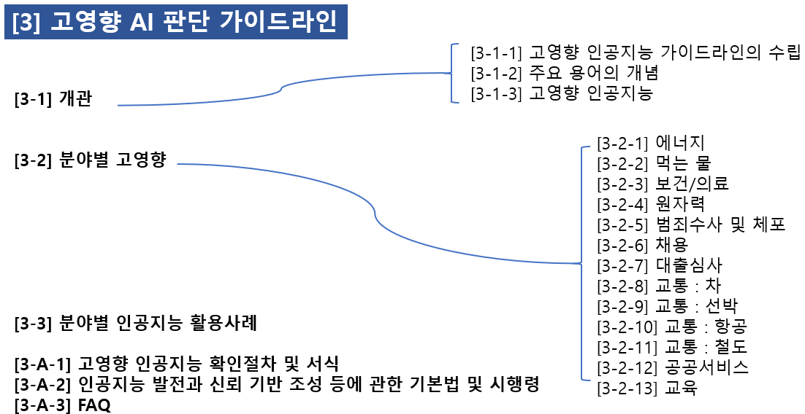

인공지능기본법의 입법목적에 따라 사업자가 책무 유무를 스스로 판단할 수 있도록 고영향 인공지능의 기준과 예시 등을 마련하여 사업자의 예측가능성을 제고하고 산업현장에서의 혼란을 방지 
본 가이드라인을 통하여 인공지능사업자로서의 지위를 확정적으로 판단할 수 없는 경우에는 과학기술정보통신부장관에게 고영향 인공지능 해당여부에 대해 확인을 요청  

https://www.sw.or.kr/AI_act_helpdesk/board.jsp?bcIdx=64993 

---

---

# [4] 고영향 AI 사업자 책무 가이드라인(과학기술정보통신부)
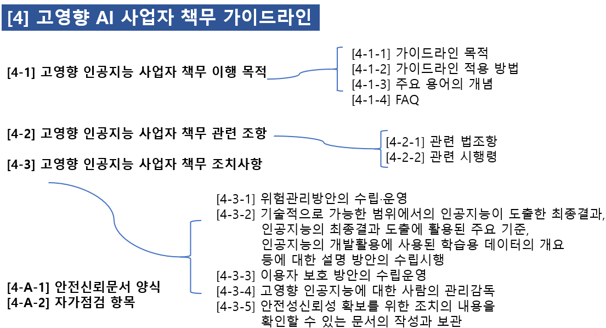

본 가이드라인은 사업자들이 법적 의무를 명확히 이해하고 이행할 수 있도록 지원하며 기준과 예시를 통해 사업자들이 자사의 고영향 인공지능에 대해 적절한 조치를 취함으로써 인공지능 기술의 안전성과 신뢰성을 확보하는 데 기여할 것으로 기대 

https://github.com/YangGuiBee/AIG/blob/main/TextBook-06/AIG_guide4.pdf

---

---

# [5] AI 영향평가 가이드라인(과학기술정보통신부)
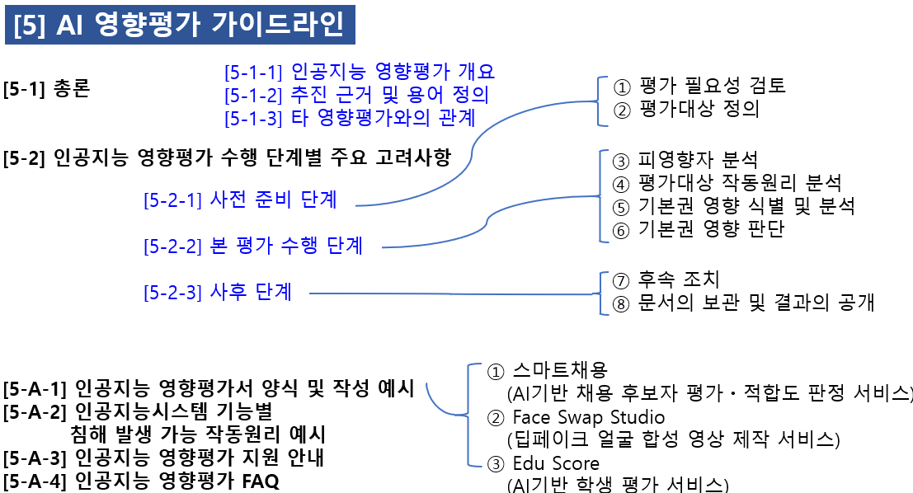

사업자가 영향평가를 통해 인공지능 제품ㆍ서비스가 인간의 존엄성과 기본권에 미치는 잠재적 영향을 사전에 식별·분석하고, 이를 존중ㆍ보호하는 방향으로 스스로 개선방안을 마련ㆍ이행하도록 유도하고 국민의 기본권을 보호함과 동시에 글로벌 상호운용성 확보 

https://github.com/YangGuiBee/AIG/blob/main/TextBook-06/AIG_guide5.pdf

---

