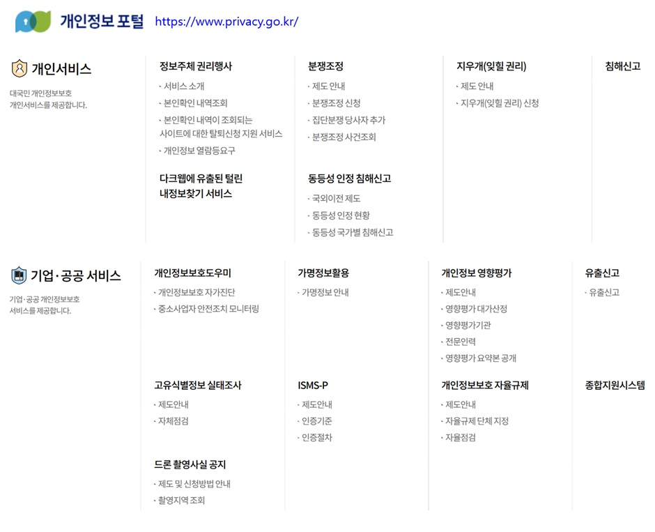
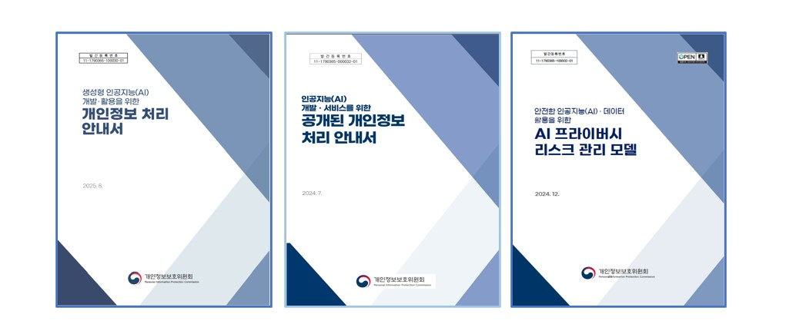

 

 

 

 

 

 

---

## 개인정보란?
「개인정보 보호법」제2조에 따라, “개인정보”란 살아 있는 개인에 관한 정보로서 
성명, 주민등록번호 및 영상 등을 통하여 개인을 알아볼 수 있는 정보 
해당 정보만으로는 특정 개인을 알아볼 수 없더라도 다른 정보와 쉽게 결합하여 알아볼 수 있는 정보 
(이 경우 쉽게 결합할 수 있는지 여부는 다른 정보의 입수 가능성 등 개인을 알아보는 데 소요되는 시간, 비용, 기술 등을 합리적으로 고려) 
가명처리함으로써 원래의 상태로 복원하기 위한 추가 정보의 사용ㆍ결합 없이는 특정 개인을 알아볼 수 없는 정보 
(가명처리란 개인정보의 일부를 삭제하거나 일부 또는 전부를 대체하는 등의 방법으로 추가 정보가 없이는 특정 개인을 알아볼 수 없도록 처리) 

개인정보의 주체는 자연인(自然人)이어야 하며, 법인(法人) 또는 단체의 정보는 해당되지 않음 
따라서 법인의 상호, 영업 소재지, 임원 정보, 영업실적 등의 정보는「개인정보 보호법」에서 보호하는 개인정보의 범위에 해당되지 않음 

## 개인정보의 종류
개인정보는 개인의 성명, 주민등록번호 등 인적 사항에서부터 
사회·경제적 지위와 상태, 교육, 건강·의료, 재산, 문화 활동 및 정치적 성향과 같은 내면의 비밀에 이르기까지 그 종류가 매우 다양하고 폭 넓음. 
또한, 사업자의 서비스에 이용자(고객)가 직접 회원으로 가입하거나 등록할 때  
사업자에게 제공하는 정보뿐만 아니라, 이용자가 서비스를 이용하는 과정에서 생성되는 통화내역, 로그기록, 구매내역 등도 개인정보가 될 수 있음. 

 

 

 

 

 

|구분|인공지능기본법|개인정보보호법|비교내용|
|---|---|---|---|
|**총칙 및 기본원칙**|제4조제1항(인간의 존엄과 가치 및 기본권 보호)|제3조(개인정보 보호 원칙)|개인정보 자기결정권 및 인간 존엄성의 헌법적 가치 구현|
||제4조제2항(개인정보 보호)|제15조(개인정보의 수집ㆍ이용) 제16조(개인정보의 수집 제한)|개인정보 수집·이용의 적법성 및 최소처리 원칙|
||제4조제3항(차별금지 및 공정성)|제3조 제1항 제4호(공정한 처리)|AI·개인정보 처리 전반에서 차별 방지 및 공정성 확보|
||제4조제4항(투명성 및 설명가능성)|제20조(정보주체 이외로부터 수집한 개인정보의 수집 출처 등 고지)|AI 처리 및 개인정보 처리의 투명성 보장|
||제4조제5항(안전성 및 신뢰성)|제29조(안전조치의무)|AI 시스템 및 개인정보 처리 전반의 기술적·관리적 보호|
|**데이터 활용 및 가명·익명정보**|제16조(데이터의 책임 있는 활용)|제15조 제3항(공익 목적 처리)|공익·연구 목적의 데이터 활용 정당화|
||제17조(가명·익명정보 활용 촉진)|제28조의2(가명정보의 처리) 제28조의5(가명정보의 결합)|AI 학습·분석을 위한 가명정보 활용 체계|
|**고위험 인공지능**|제23조(고위험 인공지능의 정의)|제2조 제1호(개인정보의 정의)|고위험 AI 판단 시 개인정보 포함 여부 기준|
||제24조(위험관리체계 구축)|제29조(안전조치의무)|고위험 AI의 위험 예방과 개인정보 보호조치의 연계|
||제25조(영향평가)|제33조(개인정보 영향평가)|AI 영향평가(AIA)와 개인정보 영향평가(PIA)의 구조적 유사성|
||제26조(관리·감독 체계)|제30조(개인정보 처리방침의 수립 및 공개)|AI 운영 전반의 책임성과 투명성 확보|
||제27조(기록 및 보관)|제21조(개인정보의 파기)|AI 처리기록 관리와 개인정보 보유기간 통제|
|**이용자 권리 보호**|제31조 제1항(설명 요구권)|제20조(정보주체의 알 권리)|AI 기반 결정에 대한 정보 제공 및 설명|
||제31조제2항(이의제기 및 구제)|제35조(개인정보의 열람 요구) 제36조(정정·삭제 요구) 제37조(처리정지 요구)|AI 처리 결과에 대한 정보주체의 통제권|
||제31조(자동화된 의사결정 등 이용자 권리 보호)|제37조의2(자동화된 결정에 대한 정보주체의 권리)|AI 자동화 판단에 대한 거부·설명 요구권의 직접적 법적 근거|
|**사업자 및 개발자 책임**|제34조(인공지능사업자의 책임)|제28조(개인정보처리자의 책임)|AI 사업자와 개인정보처리자의 책임 구조 유사|
||제35조(기술적·관리적 조치)|제29조(안전조치의무)|AI 시스템 보안과 개인정보 보호조치의 통합|
||제36조(인공지능 책임자 지정)|제31조(개인정보 보호책임자의 지정)|AI·데이터 거버넌스 책임 주체 명확화|
|**감독 및 제재**|제40조-제45조(감독·시정조치)|제63조(조사 및 검사) 제64조(시정명령)|국가 감독기관의 조사·시정 권한|
||제46조-제49조(벌칙 등)|제70조-제74조(벌칙) 제75조(과징금)|위반 행위에 대한 실효적 제재 수단|

|구분|인공지능기본법|개인정보보호법|비교내용|
|---|---|---|---|
|총칙|제1조(목적)|||
||제2조(정의)|제2조(정의)|법률 적용 대상 개념 규정|
||제3조(국가 등의 책무)|||
||제4조제1항(인간의 존엄과 가치 및 기본권 보호)|제3조(개인정보 보호 원칙)|기본권 보호의 헌법적 기반|
||제4조제2항(개인정보 보호)|제15조(개인정보의 수집·이용) 제16조(개인정보의 수집 제한)|개인정보 최소·적법 처리|
||제4조제3항(차별금지 및 공정성)|제3조 제1항 제4호(공정한 처리)|차별 방지 원칙|
||제4조제4항(투명성 및 설명가능성)|제20조(정보주체 이외로부터 수집한 개인정보의 수집 출처 등 고지)|처리 과정의 투명성|
||제4조제5항(안전성 및 신뢰성)|제29조(안전조치의무)|기술적·관리적 보호|
||제5조(기본계획 수립)|||
||제6조(시행계획 수립)|||
||제7조(실태조사)|||
||제8조(통계 작성)|||
|데이터·기술 기반|제9조(연구개발 촉진)|||
||제10조(표준화)|||
||제11조(전문인력 양성)|||
||제12조(산업 육성)|||
||제13조(국제협력)|||
||제14조(중소기업 지원)|||
||제15조(시험·실증)|||
||제16조(데이터의 책임 있는 활용)|제15조 제3항(공익 목적 처리)|공익·연구 목적 데이터 활용|
||제17조(가명·익명정보 활용 촉진)|제28조의2(가명정보의 처리) 제28조의5(가명정보의 결합)|AI 학습용 데이터 활용|
||제18조(공공데이터 활용)|||
|고위험 인공지능|제19조(위험 기반 접근)|||
||제20조(고위험 인공지능 지정)|||
||제21조(분류 기준)|||
||제22조(사전 조치)|||
||제23조(고위험 인공지능의 정의)|제2조 제1호(개인정보의 정의)|위험 판단 기준|
||제24조(위험관리체계 구축)|제29조(안전조치의무)|사전 위험 통제|
||제25조(인공지능 영향평가)|제33조(개인정보 영향평가)|AIA-PIA 구조적 대응|
||제26조(관리·감독 체계)|제30조(개인정보 처리방침의 수립 및 공개)|운영 책임성|
||제27조(기록 및 보관)|제21조(개인정보의 파기)|보유·기록 관리|
||제28조(사후 관리)|||
||제29조(개선조치)|||
|이용자 권리|제30조(이용자 보호 일반)|||
||제31조제1항 (설명 요구권)|제20조(정보주체의 알 권리)|설명·정보 접근|
||제31조제2항 (이의제기 및 구제)|제35조(개인정보의 열람 요구) 제36조(정정·삭제 요구) 제37조(처리정지 요구)|권리 행사|
||제31조(자동화된 의사결정 등)|제37조의2(자동화된 결정에 대한 정보주체의 권리)|자동화 판단 통제|
||제32조(취약계층 보호)|||
||제33조(이용자 고지)|||
|사업자 책임|제34조(인공지능사업자의 책임)|제28조(개인정보처리자의 책임)|책임 주체 대응|
||제35조(기술적·관리적 조치)|제29조(안전조치의무)|보안 의무|
||제36조(인공지능 책임자 지정)|제31조(개인정보 보호책임자의 지정)|조직 내 책임자|
||제37조(위탁 관리)|||
||제38조(공급망 관리)|||
||제39조(보험 등)|||
|감독·제재|제40조(보고 및 자료 제출)|제63조(조사 및 검사)|감독 권한|
||제41조(현장조사)|||
||제42조(시정권고)|||
||제43조(시정명령)|제64조(시정명령)|행정 시정|
||제44조(공표)|||
||제45조(이행강제금)|||
||제46조(벌칙)|제70조(벌칙)|형사 제재|
||제47조(양벌규정)|제71조(양벌규정)|책임 귀속|
||제48조(과태료)|제75조(과징금)|금전 제재|
||제49조(위임)|||
|개인정보보호법 단독 조항||제4조(국가 등의 책무)|AI기본법에 직접 대응되는 개인정보 보호 책무 규정 없음|
|||제5조(정보주체의 권리)|AI기본법은 권리 열거 방식을 취하지 않음|
|||제6조(다른 법률과의 관계)|개인정보보호법 우선 적용 원칙|
|||제17조(개인정보의 제공)|AI기본법에는 제3자 제공 규율 부재|
|||제18조(개인정보의 목적 외 이용·제공 제한)|목적 구속 원칙은 AI기본법에 직접 규정 없음|
|||제19조(개인정보를 제공받은 자의 이용·제공 제한)|AI 데이터 재이용에 대한 직접 규율 부재|
|||제22조(동의 방법)|AI기본법은 동의 체계를 직접 규율하지 않음|
|||제22조의2(아동의 개인정보 보호)|취약계층 일반 보호 규정만 존재|
|||제23조(민감정보의 처리 제한)|AI기본법에 민감정보 개념 없음|
|||제24조(고유식별정보의 처리 제한)|AI기본법은 식별자 중심 규율 아님|
|||제24조의2(주민등록번호 처리의 제한)|AI기본법 직접 대응 규정 없음|
|||제25조(영상정보처리기기의 설치·운영 제한)|AI기본법은 물리적 감시기기 규율 대상 아님|
|||제26조(영상정보처리기기 운영자의 의무)|동일|
|||제27조(영업양도 등에 따른 개인정보 이전)|AI기본법은 기업결합·양도 규율 부재|
|||제28조(개인정보처리자의 손해배상책임)|AI기본법은 민사책임 일반 규정 없음|
|||제32조(개인정보파일의 등록 및 공개)|AI기본법에 파일 단위 관리 개념 없음|
|||제34조(개인정보 유출 등의 통지·신고)|AI 사고 통지 규정과 구조적으로 분리됨|
|||제39조의3(집단분쟁조정)|AI기본법에 집단적 권리구제 절차 부재|
|||제39조의4(단체소송)|AI기본법에는 집단소송 규정 없음|
|||제58조(적용 제외)|AI기본법은 적용 제외 규정 구조 상이|
|||제59조(비밀유지의무)|AI기본법은 일반적 윤리·책임 중심|

|구분|인공지능기본법|EU AI Act|비교내용|
|---|---|---|---|
|총칙|제1조(목적)|Article 1(Subject matter)|AI 규율의 목적 및 적용 범위 선언|
||제2조(정의)|Article 3(Definitions)|AI 시스템, 제공자, 배포자 등 기본 개념 정의|
||제3조(국가 등의 책무)|Article 4(AI literacy)|국가가 AI 정책 수립·집행의 1차적 책임을 부담한다는 점을 명시한 한국법 특유의 책무 규정|
||제4조제1항(인간의 존엄과 기본권 보호)|Article 1(1), Recital 1|기본권 보호를 AI 규율의 최상위 원칙으로 설정|
||제4조제2항(개인정보 보호)|Article 10(5)(Data governance)|AI 학습·운영 시 개인정보 보호 요구|
||제4조제3항(차별금지 및 공정성)|Article 5(1)(a)-(c)(Prohibited AI practices)|차별적·권리침해적 AI 사용 금지|
||제4조제4항(투명성 및 설명가능성)|Article 13(Transparency and provision of information)|AI 시스템의 투명성·설명 의무|
||제4조제5항(안전성 및 신뢰성)|Article 9(Risk management system)|AI 안전성 확보를 위한 위험관리|
|정책·기반 조성|제5조(기본계획 수립)|Article 56(AI Office)|중앙정부 주도의 중장기 AI 국가전략 수립을 명문화한 한국형 계획행정 규정|
||제6조(시행계획 수립)||기본계획을 구체화하는 연차·부문별 실행계획을 법률로 의무화한 규정(EU에는 계획행정 구조 없음)|
||제7조(실태조사)||국가가 AI 산업·기술·활용 현황을 조사할 수 있는 근거 규정으로, 규제보다는 정책기반 수집 목적|
||제8조(통계 작성)||AI 관련 국가통계 작성·관리 근거를 두어 정책·산업 육성에 활용하려는 한국법 특유 조항|
|연구·산업 진흥|제9조(연구개발 촉진)|Recital 72|국가의 재정·제도적 지원을 통한 AI R&D 촉진을 명시한 산업진흥 중심 규정|
||제10조(표준화)|Article 40(Harmonised standards)|조화표준을 통한 기술 신뢰 확보|
||제11조(전문인력 양성)||AI 인력 수급과 교육을 국가 책임으로 규정한 인적자원 육성 조항|
||제12조(산업 육성)||AI 산업 경쟁력 강화 및 생태계 조성을 목적으로 하는 포괄적 진흥 규정|
||제13조(국제협력)|Article 59(International cooperation)|AI 국제 공조 및 규범 확산|
||제14조(중소기업 지원)|Article 55(SME support)|중소기업·스타트업 지원|
||제15조(시험·실증)|Article 53(AI regulatory sandboxes)|규제 부담 완화를 통한 실증·검증 중심 접근|
||제16조(데이터의 책임 있는 활용)|Article 10(Data and data governance)|학습·검증 데이터 품질 관리|
||제17조(가명·익명정보 활용 촉진)||가명·익명정보를 AI 학습에 적극 활용하도록 장려하는 한국법 특유의 데이터 활용 촉진 규정|
||제18조(공공데이터 활용)||공공데이터를 AI 개발에 개방·활용하도록 하는 국가 주도 데이터 정책 규정|
|고위험 인공지능|제19조(위험 기반 접근)|Article 6(Classification rules for high-risk AI)|위험 기반 규율 구조 채택|
||제20조(고위험 인공지능 지정)|Article 6(2), Annex III|고위험 AI 범주 열거|
||제21조(분류 기준)||고위험 AI 분류 시 고려 요소를 국내 행정체계에 맞게 설정하는 보충 규정|
||제22조(사전 조치)||고위험 AI 도입·운영 전 사전적 관리 조치를 요구하는 일반적 예방 규정|
||제23조(고위험 인공지능의 정의)|Article 6(High-risk AI systems)|고위험 AI 개념 정립|
||제24조(위험관리체계 구축)|Article 9(Risk management system)|사전·사후 위험 관리|
||제25조(인공지능 영향평가)|Article 27(Fundamental rights impact assessment)|AIA-FRIA 대응|
||제26조(관리·감독 체계)|Article 17(Quality management system)|조직적 관리체계|
||제27조(기록 및 보관)|Article 12(Record-keeping)|로그·기록 의무|
||제28조(사후 관리)|Article 61(Post-market monitoring)|사후 감시 체계|
||제29조(개선조치)|Article 62(Corrective actions)|시정 및 개선|
|이용자 권리 보호|제30조(이용자 보호 일반)|Article 13(Transparency obligations)|이용자 보호 원칙|
||제31조제1항(설명 요구권)|Article 13(1)-(3)|AI 사용 사실 및 기능 설명|
||제31조제2항(이의제기 및 구제)|Article 68(Complaints)|권리침해 구제 절차|
||제31조(자동화된 의사결정 등)|Article 22 GDPR 연계, Article 68|자동화 판단 통제|
||제32조(취약계층 보호)|Article 5(1)(b)|아동·취약계층 보호|
||제33조(이용자 고지)|Article 52(Transparency obligations for certain AI systems)|AI 사용 고지|
|사업자 책임|제34조(인공지능사업자의 책임)|Article 16(Obligations of providers)|AI 제공자 책임|
||제35조(기술적·관리적 조치)|Article 15(Accuracy, robustness and cybersecurity)|정확성·보안|
||제36조(인공지능 책임자 지정)||조직 내부에 AI 책임자를 두도록 한 한국법 고유의 내부 거버넌스 규정(EU는 역할별 책임 분산 구조)|
||제37조(위탁 관리)|Article 25(Obligations of deployers)|배포자·사용자 책임|
||제38조(공급망 관리)|Article 24(Traceability)|공급망 투명성|
||제39조(보험 등)||AI로 인한 손해 발생에 대비한 보험·재정적 안전장치 도입을 유도하는 한국법 특유 규정|
|감독·제재|제40조(보고 및 자료 제출)|Article 64(Powers of market surveillance authorities)|감독기관 권한|
||제41조(현장조사)|Article 65(Access to data)|조사 권한|
||제42조(시정권고)||강제 이전의 행정지도적 시정수단을 둔 점에서 EU의 강한 제재 중심 구조와 차별|
||제43조(시정명령)|Article 71(Penalties)|행정 제재|
||제44조(공표)||위반 사실의 공표를 통해 사회적 제재 효과를 노리는 한국형 규율 방식|
||제45조(이행강제금)||행정명령 불이행 시 반복 부과되는 간접강제 수단|
||제46조(벌칙)|Article 71(3)-(5)(Fines)|과징금·벌금|
||제47조(양벌규정)||법인과 개인을 함께 처벌하는 전통적 한국 행정형벌 구조|
||제48조(과태료)||경미한 위반에 대한 질서벌 중심 제재|
||제49조(위임)||하위법령에 세부 사항을 위임하는 일반 규정|
|EU AI Act 단독조항||| |
|| |Article 5(Prohibited AI practices)|사회적 점수화, 잠재적 조작, 취약계층 악용, 실시간 원격 생체인식 등 기본권 침해 AI를 전면 금지하는 절대적 금지 규정|
|| |Article 6(3)-(5)(Exemptions for high-risk AI)|고위험 AI 분류에서 제외되는 예외 규정(보조적 기능, 단순 개선 목적 등)|
|| |Article 7(Amendments to Annex III)|고위험 AI 목록을 EU 차원에서 탄력적으로 개정할 수 있는 권한 규정|
|| |Article 8(Compliance with other Union law)|AI Act와 다른 EU 기본권·안전 법령 간의 관계 정립|
|| |Article 11(Technical documentation)|고위험 AI에 대한 상세 기술문서 작성 의무|
|| |Article 14(Human oversight)|고위험 AI에 대한 인간 개입·감독 의무를 독립 조항으로 규정|
|| |Article 15(Accuracy, robustness and cybersecurity)|정확성·강건성·사이버보안을 법적 요구사항으로 명문화|
|| |Article 18(Obligations of importers)|EU 역외 AI 수입자에 대한 별도 의무 부과|
|| |Article 19(Obligations of distributors)|AI 유통자(distributor)의 독립적 법적 책임 규정|
|| |Article 22(Authorised representatives)|EU 외 사업자를 위한 EU 내 법정대리인 제도|
|| |Article 23(Obligations of deployers)|AI 실제 사용자인 deployer의 책임과 의무 명시|
|| |Article 28(Obligations for high-risk AI systems used by public authorities)|공공기관이 사용하는 고위험 AI에 대한 추가 의무|
|| |Article 29(Fundamental rights impact assessment)|공공부문 고위험 AI에 대해 기본권 영향평가(FRIA) 의무화|
|| |Article 47(Notifying authorities)|적합성 평가를 담당하는 통지기관 제도|
|| |Article 48(Conformity assessment bodies)|AI 적합성 평가기관의 지정·요건|
|| |Article 49(EU declaration of conformity)|EU 적합성 선언 제도(CE 마킹과 연계)|
|| |Article 50(CE marking of AI systems)|AI 시스템에 대한 CE 마킹 의무|
|| |Article 52(Transparency obligations for certain AI systems)|딥페이크, 감정인식, 챗봇 등에 대한 사용 사실 고지 의무|
|| |Article 52a(General-purpose AI models)|범용 AI(GPAI) 모델에 대한 독립 규율 체계|
|| |Article 53(Obligations for GPAI models)|GPAI 제공자의 문서화·정보제공 의무|
|| |Article 54(Systemic risk GPAI)|시스템 리스크를 갖는 GPAI에 대한 강화 규제|
|| |Article 55(Additional obligations for systemic risk GPAI)|대규모 연산, 모델 평가, 사고 대응 의무|
|| |Article 56(AI Office)|EU 집행위원회 산하 중앙 AI 감독기구 설치|
|| |Article 57(Tasks of the AI Office)|AI Office의 조사·조정·집행 권한|
|| |Article 58(Scientific panel of independent experts)|독립적 과학자문 패널 제도|
|| |Article 59(EU database for high-risk AI systems)|고위험 AI의 EU 등록 데이터베이스|
|| |Article 60(Confidentiality)|기업 영업비밀 보호 규정|
|| |Article 66(Union safeguard procedure)|EU 차원의 긴급 위험 대응 절차|
|| |Article 68(Right to lodge a complaint)|개인·단체의 감독기관에 대한 민원 제기권|
|| |Article 69(Whistleblower protection)|AI 내부고발자 보호 규정|
|| |Article 70(Penalties for non-compliance)|위반 유형별 차등 과징금 체계|
|| |Article 71(Administrative fines)|최대 전 세계 매출액 7퍼센트 과징금|
|| |Article 72(Exercise of the delegation)|집행위원회의 위임입법 권한|
|| |Annex I(AI techniques and approaches)|AI 기술 유형 목록(ML, logic-based 등)|
|| |Annex II(Union harmonisation legislation)|다른 EU 안전법령과의 연계 목록|
|| |Annex III(High-risk AI use cases)|고위험 AI 사용 분야 전면 열거|
|| |Annex IV(Technical documentation)|기술문서 필수 기재사항|
|| |Annex V(EU declaration of conformity)|적합성 선언서 형식|
|| |Annex VI(Conformity assessment procedures)|적합성 평가 절차|
|| |Annex VII(Post-market monitoring)|사후 모니터링 요구사항|
|| |Annex VIII(Information for deployers)|사용자 제공 정보 목록|

 

 

 

 

 

### 개인정보보호위원회 업무
개인정보 보호와 관련된 법령 개선, 정책·제도·계획 수립·집행, 권리침해에 대한 조사·처분, 고충처리·권리구제 및 분쟁조정, 국제기구 및 외국의 개인정보 보호기구와의 교류·협력, 법령·정책·제도·실태 등의 조사·연구, 교육, 홍보, 기술개발의 지원·보급 및 전문인력의 양성 등에 대한 업무를 수행(「개인정보 보호법」 제7조의8). 
 
### 개인정보보호위원회 심의·의결 사항
개인정보보호위원회는 개인정보 침해요인 평가(제8조의2), 개인정보 보호 기본계획(제9조) 및 시행계획(제10조), 개인정보 보호 관련 정책·제도·법령, 개인정보 처리 관련 공공기관 간의 의견조정, 개인정보 보호 법령 해석·운용, 개인정보의 목적 외 이용·제공 제한(제18조제2항제5호), 개인정보 영향평가 결과(제33조제3항), 과징금 부과(제28조의6, 제34조의2, 제39조의15), 개인정보 보호 법령 관련 의견제시 및 개인정보 처리 실태에 대한 개선권고(제61조), 개인정보 침해 시 시정조치(제64조), 개인정보 보호 관련 법규 위반 시의 고발 및 징계권고(제65조), 개선권고·시정조치 명령· 고발 또는 징계권고·과태료 부과 내용에 관한 결과 공표(제66조), 과태료 부과(제75조), 개인정보보호위원회 소관 법령 및 규칙의 제정·개정·폐지 등에 관한 사항을 심의·의결합니다(「개인정보 보호법」 제7조의9). 
 
### 개인정보보호위원회 구성
개인정보보호위원회 위원은 총 9명으로 구성되며 대통령이 임명 또는 위촉(「개인정보 보호법」제7조의2). 
상임위원은 위원장, 부위원장으로 국무총리가 제청하며 대통령이 임명(정무직 공무원) 
그 외 위원은 위원장 제청 2인, 정당 교섭단체 추천 5인(여2, 야3)으로 대통령이 위촉 
 
### 개인정보보호위원회 연혁
2011년 9월 30일 「개인정보 보호법」 시행에 따라 개인정보보호위원회 공식 출범 
2016년 7월 26일 개인정보 보호 강화 필요성 증대에 따라 개인정보 침해요인 평가 기능 신설 및 개인정보 분쟁조정 기능 이관 등 조직·정원 확대 
2020년 8월 5일 행정안전부(공공/민간 총괄분야), 방송통신위원회(온라인분야), 금융위원회(상거래기업 개인신용정보 조사·처분)로 분산되어 있던 개인정보보호 감독기능을 통합하여 중앙행정기관으로 출범 
 
### 개인정보 안내서 목록
개인정보위원회(https://www.pipc.go.kr/) 정책·법령>법령정보>안내서>현재안내서 
 
01 개인정보 보호 법령 및 지침·고시 해설 
02 개인정보 처리 통합 안내서(안)  
03 분야별 개인정보보호 안내서  
04 긴급상황 시 개인정보 처리 및 보호수칙  
05 아동·청소년 개인정보보호 가이드라인  
06 인터넷 자기게시물 접근배제요청권 가이드라인  
07 자동화된 결정에 대한 정보주체의 권리 안내서  
08 개인정보의 안전성 확보조치 기준 안내서  
09 생체정보 보호 안내서  
10 고정형 영상정보처리기기 설치·운영 안내서  
11 이동형 영상정보처리기기를 위한 개인영상정보 보호·활용 안내서  
12 합성데이터 활용 가이드라인  
13 스마트도시 개인정보보호 안내서  
14 가명정보 처리 가이드라인  
15 공공분야 가명정보 제공 실무 안내서(부처합동(행안부))  
16 교육분야 가명·익명처리 가이드라인(부처합동(교육부))  
17 보건의료 데이터 활용 가이드라인(부처합동(복지부))  
18 합성데이터 생성 참조모델  
19 자율규제단체 참여사를 위한 업종별 개인정보처리 가이드(공인중개사업, 대중골프장업,렌터카업, 여행업, 학원업, 호텔업) 
20 소상공인을 위한 개인정보보호 핸드북 
21 개인정보 처리방침 작성지침 
22 개인정보 영향평가 수행안내서 
23 개인정보 영향평가 대가 산정가이드 
24 정보보호 및 개인정보보호관리체계(ISMS-P)인증기준 안내서(부처합동(과기부)) 
25 개인정보 보호 교육 업무 안내서 
<ins>26 AI 개발·서비스를 위한 공개된 개인정보 처리 안내서</ins> 
<ins>27 AI 개발·서비스를 위한 개인정보 리스크 평가모델</ins> 
<ins>28 생성형 인공지능(AI) 개발·활용을 위한 개인정보 처리 안내서</ins> 
29 홈페이지 개인정보 노출방지 안내서 
30 개인정보 유출 등 사고대응 매뉴얼 
31 해외사업자의 개인정보 보호법 적용 안내서 
32 개인정보 손해배상책임 보장제도 안내서 
33 개인정보 질의응답 모음집 
34 개인정보 전송요구권 제도 안내서 
35 개인정보관리 전문기관 지정안내서(일반전문기관 편) 
36 개인정보관리 전문기관 지정안내서(특수전문기관 편) 
37 개인정보관리 전문기관 지정안내서(중계전문기관 편) 
38 일반수신자 등재 안내서 
39 전 분야 마이데이터 전송 절차 및 기술 가이드라인 

---
<!--

-->

 

---
## Ⅰ. 개요

### ▣ AI 개발·서비스를 위한 공개된 개인정보 처리 안내서
□ 개인정보 보호법상 공개된 개인정보를 수집·이용할 수 있는 법 해석 기준 제시 
□ 공개된 개인정보의 수집·이용이 적법하기 위한 전제로서 AI 기업 등이 이행할 수 있는 최소한의 안전성 확보 기준을 AI 학습-서비스 주기별로 안내 
□ AI 관련 법·제도·기술이 지속적으로 발전·변화함에 따라 주기적으로 안내서의 수정·보완 가능 
### ▣ '공개된 개인정보'의 범위
□ ‘공개된 개인정보’는 누구나 합법적으로 접근 가능한 개인정보(개인정보보호법 제2조 제1호)로서, 
주로 AI 학습을 위해 웹 스크래핑 기술을 이용하여 공개적으로 접근 가능한 출처에서 수집한 데이터셋에 개인정보가 포함된 경우를 상정함 
□ 공개된 개인정보는 정보주체 스스로 공개한 개인정보에 국한되는 것은 아니며,  
법령에 의해 공시·공개된 개인정보, 출판물, 방송매체 등에 포함된 개인정보도 사안에 따라 본 안내서의 적용 대상에 포함될 수 있음 
□ 공개된 개인정보 수집·이용 관련 다른 법률(정보통신망법, 부정경쟁방지법, 저작권법) 또는 계약상의 의무를 이행했는지 여부에 대해서는 다루지 않음 
### ▣ 단계별 범위 : AI 학습, AI 서비스
□ **AI 학습**은 텍스트, 이미지 등 비정형 데이터를 기계가 학습할 수 있는 형식으로 변환하여 구조, 패턴을 찾는 것으로(예: 토큰화), 그 과정에서 개인 식별성이 낮아질 수 있음. 또한, 기계가 반복학습을 통해 토큰화된 단어(또는 형태소)의 위치, 순서, 구조 등의 배열 방식을 확률적으로 결정한다는 점에서 개인에 대한 식별이 주된 목적이라고 단정할 수는 없음. 다만, 학습이 완료된 AI 모델에는 개인을 식별할 수 있는 정보가 포함되어 있을 수 있고, 암기 리스크, 프롬프트 공격 등에 의하여 학습데이터에 포함된 개인정보가 유·노출될 가능성도 존재 
→ AI 학습은 공개된 개인정보를 포함한 학습데이터 수집, 저장, 가공(토큰화 등 전처리) 등을 수반하므로 개인정보 보호법상 ‘처리’에 해당함 
□ **AI 서비스**는 (i)암기된 개인정보가 원본 그대로 출력되거나 (ii)개인식별 또는 민감정보 추론 목적으로 운용되는 등 AI 학습 단계보다 정보주체 권익침해 측면에서 리스크가 높아질 수 있으며, 이에 따라 AI 학습-서비스 단계별 예견 가능한 개인정보 리스크 차이를 고려하면서 적절한 보호조치를 통해 정보주체에 대한 권익침해를 예방·최소화할 필요 
→ AI 서비스는 (i)이용자가 개인정보를 포함한 프롬프트를 입력하여 개인에 관한 결과값을 제공받을 수 있고, (ii)프롬프트 입력 및 결과값은 다시 AI 학습 목적으로 이용될 수 있다는 점에서 개인정보 ‘처리’에 해당 
### ▣ 적용 대상 : 개인정보처리자의 지위를 갖는 AI 개발자 및 서비스 제공
□ **개인정보처리자**는 업무를 목적으로 개인정보파일을 운용하기 위하여 스스로 또는 다른 사람을 통하여 개인정보를 처리하는 공공기관, 법인, 단체 및 개인 등을 말함(개인정보 처리는 개인정보의 수집, 생성, 연계, 연동, 기록, 저장, 보유, 가공, 편집, 검색, 출력, 정정(訂正), 복구, 이용, 제공, 공개, 파기(破棄), 그 밖에 이와 유사한 행위) 
개인정보처리자 해당 여부는 ‘업무를 목적으로 개인정보파일을 운용하기 위한 개인정보처리’인지를 기준으로 함(개인정보파일은 개인정보를 쉽게 검색할 수 있도록 일정한 규칙에 따라 체계적으로 배열하거나 구성한 개인정보의 집합물) 

	「개인정보 보호법」제15조(개인정보의 수집ㆍ이용) 
	 ① 개인정보처리자는 다음 각 호의 어느 하나에 해당하는 경우에는 개인정보를 수집할 수 있으며 그 수집 목적의 범위에서 이용할 수 있다.
	 1. 정보주체의 동의를 받은 경우
	 2. 법률에 특별한 규정이 있거나 법령상 의무를 준수하기 위하여 불가피한 경우
	 3. 공공기관이 법령 등에서 정하는 소관 업무의 수행을 위하여 불가피한 경우
	 4. 정보주체와 체결한 계약을 이행하거나 계약체결하는 과정에서 정보주체의 요청에 따른 조치를 이행하기 위하여 필요한 경우
	 5. 명백히 정보주체 또는 제3자의 급박한 생명, 신체, 재산의 이익을 위하여 필요하다고 인정되는 경우
	 6. 개인정보처리자의 정당한 이익을 달성하기 위하여 필요한 경우로서 명백하게 정보주체의 권리보다 우선하는 경우. 
	    이 경우 개인정보처리자의 정당한 이익과 상당한 관련이 있고 합리적인 범위를 초과하지 아니하는 경우에 한한다.
	 7. 공중위생 등 공공의 안전과 안녕을 위하여 긴급히 필요한 경우
	 
□ **AI 개발자 및 서비스 제공자**는 직업상 또는 사회생활상의 지위에 기하여 AI 관련 사무·사업을 수행하는 자로서 ‘업무 목적’이 인정됨 
AI 학습은 개인정보가 포함된 데이터의 위치, 순서, 구조 등을 확률 기반 규칙(알고리즘)에 따라 체계적으로 구성하는 과정이고,  
학습이 완료된 AI는 적어도 개인(공인 포함)에 관한 질의에 답변을 제공하거나 답변을 회피하는 등 개인에 관한 정보처리를 수반 
AI 학습과 AI 학습이 완료된 AI 모델을 운용하는 일련의 과정은 일반적으로 ‘개인정보파일을 운용하기 위하여 개인정보를 처리’하는 것에 해당 
대부분의 AI 개발자 및 서비스 제공자는 이미 보유하고 있는 이용자 DB 또는 이용자 프롬프트 입력 데이터 등의 처리를 겸하고 있다는 점에서도 개인정보처리자 지위에 있음 
해외 AI 개발자 및 서비스 제공자의 경우에도 (i)한국 정보주체를 대상으로 재화 또는 서비스를 제공하거나  
(ii)한국인 또는 한국 정보주체의 개인정보를 처리하여 한국 정보주체에게 영향을 미치는 경우 등에는 원칙적으로 본 안내서가 적용 

	□ 이용자가 AI 모델에 입력한 질문(프롬프트)과 답변에는 개인정보가 포함될 수 있고, 
	  AI 개발자 및 서비스 제공자는 해당 데이터를 AI 학습 목적으로 이용할 수 있음
	□ 이용자 입력 데이터를 AI 학습 목적으로 이용하는 경우, 공개된 개인정보와 마찬가지로 개인정보 보호법 제15조를 충족해야 함
	  대규모 웹 스크래핑을 통해 수집한 공개된 개인정보 처리와 달리, 이용자 입력 데이터의 경우
	  이용자와 AI 서비스 제공자 간의 1:1 관계를 전제로 투명한 고지와 동의에 기한 데이터 처리가 가능할 수 있음
	  따라서 이용자 입력 데이터를 AI 학습 목적으로 이용하고자 하는 경우에는 공개된 개인정보와 달리
	  정당한 이익(제Ⅱ장 참고) 요건의 인정 범위가 사실상 제한될 수 있고, 자발적 동의, 계약 등 다른 적법 근거가 더 유효할 수 있음

---
## Ⅱ. 공개된 게인정보 처리의 법적 근거

### ▣ 개인정보처리자의 정당한 이익이 인정될 수 있는 경우
➊ 개인정보처리자의 정당한 이익이 있을 것 
➋ 개인정보 처리가 정당한 이익의 달성을 위하여 필요하고, 상당한 관련성 및 합리성이 인정될 것 
➌ 개인정보처리자의 정당한 이익이 명백하게 정보주체의 권리보다 우선할 것 
### ▣ 목적의 정당성
개인정보처리자의 ‘정당한 이익’은 개인정보 처리에 관한 합법적인 이익으로서, AI 개발자 및 서비스 제공자의 영업상 이익뿐 아니라,  
그로부터 발생하는 사회적 이익 등 다양한 층위의 이익을 포괄할 수 있음 
AI 개발자 및 서비스 제공자는 정당한 이익을 정의함에 있어 합리적으로 예측할 수 있는 범위에서의 사회적 이익과 사회적 비용을 함께 고려해야 함 

정당한 이익은 개인정보 처리를 통해 달성하고자 하는 ‘목적’을 통해 구체화되며, 개인정보 보호법상 목적 명확화 원칙의 구속을 받음 
AI 개발·서비스에 ‘정당한 이익’이 있음을 주장하는 AI 개발자 및 서비스 제공자는 공개된 개인정보의 처리목적을 최대한 구체적으로 정의하는 것이 바람직 
다만, 특정 정보주체를 식별하여 명시적으로 불이익한 효과를 발생시키는 개인정보 처리는 ‘정보주체의 권리’에 우선해야만 성립될 수 있는 ‘정당한 이익’ 조항의 본질을 감안할 때, 일반적으로 인정될 수 없고 예외적으로 명백한 사회적·공익적 이익이 있는 경우에만 가능함 

	「개인정보 보호법」제3조(개인정보 보호 원칙) 정리
	① 개인정보처리자는 개인정보의 처리 목적을 명확히 하고 그 목적에 필요한 범위에서 최소한의 개인정보만을 적법하고 정당하게 수집.
	② 개인정보처리자는 개인정보의 처리 목적에 필요한 범위에서 적합하게 개인정보를 처리하며, 그 목적 외의 용도로 활용해서는 안됨.
	③ 개인정보처리자는 개인정보의 처리 목적에 필요한 범위에서 개인정보의 정확성, 완전성 및 최신성이 보장되도록 함.
	④ 개인정보처리자는 개인정보의 처리 방법 및 종류 등에 따라 정보주체의 권리가 침해받을 가능성과 위험정도를 고려하여 개인정보를 안전하게 관리.
	⑤ 개인정보처리자는 제30조에 따른 개인정보 처리방침 등 개인정보의 처리에 관한 사항을 공개하며, 열람청구권 등 정보주체의 권리를 보장한다.
	⑥ 개인정보처리자는 정보주체의 사생활 침해를 최소화하는 방법으로 개인정보를 처리.
	⑦ 개인정보처리자는 개인정보를 익명 또는 가명으로 처리하여도 개인정보 수집목적을 달성할 수 있는 경우, 
	  익명처리가 가능한 경우에는 익명에 의하여, 익명처리로 목적을 달성할 수 없는 경우에는 가명에 의하여 처리.
	⑧ 개인정보처리자는 이 법 및 관계 법령에서 규정하고 있는 책임과 의무를 준수하고 실천함으로써 정보주체의 신뢰를 얻기 위하여 노력.

### ▣ 처리의 필요성
개인정보처리자의 정당한 이익이 정보주체 권리에 우선하기 위해서는 개인정보 처리의 필요성과 상당성· 합리성이 인정되어야 함 
**(필요성)** 사람의 언어 발화 구조와 맥락 등을 모사하여 정확한 예측을 생성하는 LLM 개발을 위해서는 대규모 학습데이터(LLM이 최소한의 언어적 유창성을 확보하기 위한 어휘는 약 5만~25만 개로, 이를 위해서는 수조 개 이상의 토큰을 학습데이터로 투입)가 필요하며, 이를 위한 현실적 방안으로 인터넷상에 공개된 데이터 활용에 의존하는 실정 
→ 사례 : 일정한 숫자·패턴으로 표현된 긴급신고전화·법인주소·후원계좌, 소설·드라마상의 가상인물 정보 등 실제로는 비개인정보에 해당하는 데이터까지 포괄적으로 제거할 수 있음 
**(상당성·합리성)** AI 개발자 및 서비스 제공자는 공개된 개인정보를 수집·이용하는 경우 정당한 이익과 상당한 관련이 있고, 합리적인 범위를 초과하는지 여부를 스스로 평가해보아야 함 
→ 사례 : 의료진단보조 AI 개발시 개인의 소득·재산 등 관련 없는 정보는 학습 배제 

### ▣ 이익형량
개인정보처리자의 정당한 이익이 정보주체의 권리에 우선하는지 여부를 판단함에 있어 정보주체의 권리 침해 가능성을 심도있게 검토해야 함 
특히, 침해 또는 제한될 수 있는 ‘정보주체의 권리’는 개인정보자기결정권에 국한되지 않고, 개인정보자기결정권의 침해로 인해 제한되거나 침해될 수 있는 헌법상 기본권으로서 인간의 존엄과 가치 및 행복추구권(헌법 제10조), 사생활의 비밀과 자유(헌법 제17조) 등을 포함 
AI 학습·서비스 맥락에서는 공개된 개인정보의 성격, 공개의 대상 범위, 공개된 개인정보의 처리 방식, 정보주체의 예견가능성, 권리보장 방안 등을 고려하여 ‘정보주체 권리’에 대한 침해·제한 정도를 평가 

개인정보 보호법은 개인정보처리자의 정당한 이익이 정보주체의 권리보다 명백히 우선할 것을 요구하는데, 이를 충족하기 위해서는 
(i) 개인정보처리자의 이익이 정보주체 권리에 우선한다는 점이 명백하거나 
(ii) 개인정보처리자의 이익이 정보주체 권리에 명백히 우선하도록  
➊ 정보주체 권리침해 위험을 예방·경감하기 위한 안전성 확보 조치(제Ⅲ장) 및  
➋ 정보주체 권리보장 방안(제Ⅳ장)을 마련·시행하여야 함  
→ 개인정보처리자 이익이 정보주체 권리에 우선함이 명백한 사례 :  
(이 경우도 공개된 개인정보 처리의 필요성과 상당성·합리성 요건이 충족되고, 구체적인 맥락·위험 수준에 비례한 안전성 확보조치 노력필요) 
금융사기 탐지·방지 등 정보주체 또는 제3자의 급박한 생명, 재산 등 이익을 위해 필수적인 경우  
전자통신망에의 무단접근 예방, 정보보안 목적을 위해 반드시 필요한 경우  
범죄행위 또는 공공안보에 대한 위협으로부터의 보호·예방을 위해 필요한 경우  

### ▣ 대법원 판결
대법원은 공개된 개인정보의 특성을 고려하여 정보주체가 이미 공개한 개인정보는 객관적으로 동의 의사가 인정될 수 있는 범위에서 별도 동의 없이 처리할 수 있다고판시함 

---
## Ⅲ. 안전성 확보조치 기준

	기술적 조치
		[1-1] 학습데이터 수집 출처 검증·관리
		[1-2] 개인정보 유·노출 방지
		[1-3] 개인정보의 안전한 저장 및 관리
		[1-4] 미세조정을 통한 안전장치 추가
		[1-5] 프롬프트 및 출력 필터링 적용
		[1-6] 학습결과에서 특정 데이터 삭제(머신 언러닝 등)
		
	관리적 조치
		[2-1] 학습데이터 처리기준 정립 및 개인정보 처리방침에 공개
		[2-2] 개인정보 영향평가 수행 고려
		[2-3] (가칭) AI프라이버시 레드팀 구성·운영
		[2-4] 오픈소스, API 등 개발·배포 특성에 따른 안전 조치

### ▣ 기술적 조치

**[1-1] 학습데이터 수집 출처 검증·관리**
공개 데이터에는 위법하거나 정보주체의 의사와 무관하게 공개된 개인정보가 다수 포함되어 있을 수 있어 데이터 수집 출처검증 노력 필요 
개인정보보호위원회는 한국 정보주체 개인정보 노출 페이지(URL) 삭제·차단 정보를 주기적으로 현행화하여 제공할 예정 
→ 데이터 출처 검증을 위한 고려사항 사례 : 
① 불법 복제물, 아동 성착취물 등 위법 데이터가 거래되거나 거래될 가능성이 높은 도메인(예: 딥웹,다크웹)으로부터 학습데이터 수집 금지 
② 개인정보가 집적되어 있을 개연성이 높은 웹사이트(예: 개인정보 색인·거래 사이트) 배제 
③ 로봇배제표준(robots.txt) 준수 
④ 저작권, 디자인권 등 지식재산권 존중 

**[1-2] 개인정보 유·노출 방지**
일정한 단어 또는 형태소(morpheme) 단위로 토큰화된 학습데이터는 그 자체로 식별성이 낮을 수 있으나, 출력 단계에서 암기된 토큰이 재조립되어 역류(regurgitate)될 가능성이 있어 이를 최소화하기 위한 기술적 조치가 필요 
AI 개발자 및 서비스 제공자는 법에서 처리를 금지 또는 제한하고 있는 고유식별정보(주민등록번호, 운전면허번호, 여권번호) 및 민감정보(종교, 정치이념, 노동조합명, 질병명, 범죄경력자료), 유·노출 시 막대한 경제적 피해를 야기할 수 있는 정보(계좌번호, 신용카드번호) 등의 경우 출력 단계에서의 유·노출을 방지하기 위하여 각별한 주의를 기울일 필요 
LLM 등 AI 모델의 암기 리스크는 학습데이터 내 동일 문장·단어 등이 중복되는 경우, 신뢰할 수 있는 기관에서 배포한 중복제거(de-duplication) 데이터셋을 이용하거나 중복제거 도구를 직접 적용하여 암기 리스크를 줄일 수 있도록 고려 
AI 개발자 및 서비스 제공자는 개인 식별가능성을 줄이거나 제거하기 위한 기술적 방안으로 차분 프라이버시(Differential Privacy) 등 개인정보 보호 강화 기술(Privacy Enhancing Technologies)의 효과를 지속적으로 연구·검증하고 적용할 것이 권장됨 

**[1-3] 개인정보의 안전한 저장 및 관리**
AI 개발자 및 서비스 제공자는 학습데이터가 유·노출되거나 이용자 DB 등과 결합하여 개인을 식별하거나 민감정보를 추론할 수 있는 리스크를 방지·예방하기 위하여 접근제한 등 안전조치를 고려 

	개인정보 보호법
	제3조(개인정보 보호 원칙) ④ 개인정보처리자는 개인정보의 처리 방법 및 종류 등에 따라 정보주체의
	권리가 침해받을 가능성과 그 위험 정도를 고려하여 개인정보를 안전하게 관리하여야 한다.
	
	제29조(안전조치의무) 개인정보처리자는 개인정보가 분실ㆍ도난ㆍ유출ㆍ위조ㆍ변조 또는 훼손되지
	아니하도록 내부 관리계획 수립, 접속기록 보관 등 대통령령으로 정하는 바에 따라 안전성 확보에
	필요한 기술적ㆍ관리적 및 물리적 조치를 하여야 한다.
	
	개인정보의 안전성 확보조치 기준(개인정보보호위원회 고시, 2023.9.22. 시행)
	제3조(안전조치의 적용 원칙) 개인정보처리자는 처리하는 개인정보의 보유 수, 유형 및 정보주체에게
	미치는 영향 등을 고려하여 스스로의 환경에 맞는 개인정보의 안전성 확보에 필요한 조치를 적용하여야 한다.

**[1-4] 미세조정을 통한 안전장치 추가**
학습데이터에는 편향적이거나 부정확한 정보, 민감한 사적정보가 포함될 수 있어 사전 정제 과정이 수반되는 경우가 많으나, 이로써 모든 위험이 예방되는 것은 아니기 때문에 미세조정(fine-tuning)을 통한 추가 안전장치를 마련할 것이 권장됨 
AI 모델이 사람의 의도에 부합하게 안전하고 바람직한 답변을 생성하도록 지도학습 기반 미세조정(Supervised Fine-Tuning, SFT), 사람 피드백 기반 강화학습(Reinforcement Learning with Human Feedback, RLHF)등의 미세조정 기법 적용을 고려 

□ 파라미터 효율 미세조정(Parameter Efficient Fine-Tuning, PEFT) : 사전학습된 모델 파라미터(매개변수)를 동결하고 소수의 파라미터를 의도된 용도에 맞게 미세조정하는 것으로 학습 비용과 시간을 최소화하는 방법 
□ 지도학습 기반 미세조정(Supervised Fine-Tuning, SFT) : 비지도학습으로 만들어진 생성AI를 지도학습적으로 미세조정하는 과정으로, 바람직한 답변을 생성하도록 미리 정제되거나 레이블링된 데이터를 추가 학습 
→ 사례 : 개인의 사생활을 묻는 프롬프트에 대하여 답변을 거부하는 내용의 답안을 학습시킴 
□ 사람 피드백 기반 강화학습(Reinforcement Learning with Human Feedback, RLHF) 보상모델 생성(Reward Model Creation) : AI 모델이 생성한 출력물에 사람(라벨러)이 점수 또는 순위를 부여하고, 이를 토대로 보상모델을 훈련 
→ 사례 : 개인의 사생활을 묻는 프롬프트에 대하여 사생활이 포함된 답변에는 (-1)의 보상을, 회피하는 답변에는 (+1)의 보상을 제공 
정책 최적화(Policy Optimization): 보상모델을 사용하여 AI 모델의 정책을 최적화하는 단계로, 주로 정책 그라디언트 강화학습 알고리즘인 PPO(Proximal Policy Optimization)을 활용하여 미세조정 

 

**[1-5] 프롬프트 및 출력 필터링 적용**
사전 필터(1-2) 및 미세조정(1-4) 등 안전성 확보 조치를 취했더라도 실제 서비스 단계에서 프롬프트 공격 등에 의해 개인정보가 유·노출되는 등의 위험이 발생할 수 있어, 아래의 다양한 필터 조치를 적용하는 것이 바람직 

(프롬프트 필터) 이용자가 프롬프트 입력을 통해 개인을 프로파일링하거나 사생활 침해 우려가 큰 답변 생성을 유도하는 경우, 이에 대한 답변 생성을 거절하거나 프롬프트의 맥락·취지에 따라 미리 정해진 답변을 제공하는 등의 방식을 고려 
(출력 필터) AI 모델이 생성하는 출력물에서도 개인정보가 노출·생성되지 않도록 감지·제거하는 필터 기술을 적용하는 것이 바람직 

**[1-6] 학습결과에서 특정 데이터 삭제(머신 언러닝 등)**
최근 AI 모델에 대한 ‘재훈련’ 없이도 개인정보나 유해한 표현 등을 ‘삭제’해주는 기술로서 ‘머신 언러닝 (machine unlearning)’에 대한 연구가 활발함 
머신 언러닝 기술은 모델 가중치 조정을 통해 문제되는 개인정보를 삭제하는 효과가 있다고 알려져 있어, AI 모델의 재훈련에 소요되는 막대한 비용과 시간을 줄일 수 있는 대안 기술이 될 것으로 기대됨 
머신 언러닝 기술은 기술 성숙도 측면에서 아직 초기 수준이라고 볼 수 있지만, 향후 연구 성과와 기술 개발 추이에 따라 AI 개발자 및 서비스 제공자는 머신 언러닝 기술 적용을 적극 고려할 수 있음 

		
### ▣ 관리적 조치

**[2-1] 학습데이터 처리기준 정립 및 개인정보 처리방침에 공개**
최소 수집, 목적 명확화 등 개인정보 보호법 원칙을 고려하여 학습데이터 수집·이용 기준*을 미리 정하고, 이를 개인정보 처리방침, 기술문서, FAQ 등에 공개하는 것을 권장함 
* AI 시스템 개발에 필요한 데이터 양(volume), 범주(민감정보, 행태정보 등) 등을 고려하여, 공개된 개인정보의 주요
수집 출처, 수집 방법, 안전성 확보 조치 방안 등 포함 
학습데이터 수집·이용 기준은 알기 쉬운 용어로 구체적이고 명확하게 표현하여야 하고, 특히 해외사업자의 경우 국내 이용자가 이해할 수 있는 쉽고 명확한 한국어 정보를 제공하여야 함 

**[2-2] 개인정보 영향평가 수행 고려**
AI 개발자 및 서비스 제공자는 공개된 개인정보 등을 활용하는 경우 개인정보 영향평가 실시를 고려할 수 있음(개인정보 보호법 시행령 제35조, 제38조, 「개인정보 영향평가 수행 안내서」 (2024.4.)) 
AI 학습데이터에 민감한 정보가 포함되어 있을 개연성이 높거나 정보주체 권리·의무에 중대한 영향을 미칠 수 있는 AI 서비스를 개발·운영하는 경우 특히 영향평가 실시를 고려하는 것이 바람직 
공공기관이 아님에도 불구하고 개인정보 보호법 제33조에 따라 영향평가를 수행하는 경우 개인정보 보호법 위반 과징금에 대해 1차 조정 금액의 최대 30%를 추가로 감경받을 수 있는 근거규정 마련·시행 중(개인정보 보호법 위반에 대한 과징금 부과기준 제10조 제2항, 2023.9.15. 제정) 
미국, 영국, 프랑스 등 주요국에서도 웹 스크래핑을 통해 학습데이터를 수집·이용하는 경우, 영향평가 수행을 권고하거나 의무화하는 논의가 진행 중 

**[2-3] (가칭) AI프라이버시 레드팀 구성·운영**
AI 개발자 및 서비스 제공자는 (가칭)AI 프라이버시 레드팀을 구성·운영하여 기획·개발 시 예상하지 못한 개인정보 침해 유형을 시험·확인하고, AI 모델이 배포된 이후 정보주체에 미칠 수 있는 유해한 영향을 최소화하는 것이 권장됨 
(구성) 레드팀은 내·외부 전문가로 구성될 수 있으나, 독립성·객관성 확보를 위해 외부 전문가를 포함 하거나 외부 레드팀 그룹과 협업할 수 있음 
(역할) 악의적 행위자(malicious adversaries)에 의한 내·외부 공격 테스트(멤버십 추론 공격, 모델 반전 공격, 프롬프트 인젝션 공격 등) 외, 일반적인 AI 이용 과정에서 발생할 수 있는 개인정보 유·노출, 거짓정보 생성 등 프라이버시 침해 위험도 주기적으로 식별하고 조치방안을 마련하는 것이 바람직함 
→ OpenAI ‘Red Teaming Network’ 사례 : AI 모델의 안전성을 높이기 위해 과학, 심리, 법률 등 다양한 분야 외부 전문가로 구성(구성원마다 평가 모델 및 기술접근 권한이 다르게 부여되며, 간단한 Q/A 테스트부터 복잡한 시뮬레이션 등 다양한 레드팀 활동 수행, 참여 전문가는 OpenAI와 비밀유지협약(Non-disclosure Agreement, NDA) 체결) 

**[2-4] 오픈소스, API 등 개발·배포 특성에 따른 안전 조치**
오픈소스 모델은 누구나 자유롭게 확인, 수정, 배포할 수 있는 소프트웨어로서 최초 배포 후에는 개발자의 통제력이 약화되는 특성을 가지고 있음 
API 연계를 통한 서비스의 경우에도, API 이용사업자가 미세조정 과정을 통해 개인정보를 침해하거나 데이터 오류·왜곡 등을 초래할 수 있음 
오픈소스 및 API 이용사업자는 개발·배포자의 정책을 준수하면서 책임있는 AI 서비스 제공을 위해 노력하여야 함 

※ ’23.12. 기준 주요 AI 기업 대상 실태점검시 파악한 현황을 토대로 정리한 것으로, 현재 개별 AI 기업이 시행하는 기술적·관리적 안전조치와 일부 차이가 있을 수 있음 
※ 이상의 안전조치 조합 사례는 최소한의 참고 기준이며, AI 개발자 및 서비스 제공자는 AI의 목적·용도·최종 사용자(예:소비자 또는 기업 내부용) 등 다양한 요소를 고려하여 정보주체 권리 침해 위험에 비례하도록 안전조치를 강화하는
것이 바람직함 

---
## Ⅳ. 정보주체 권리보장 방안

### ▣ AI 학습데이터 투명성 제고
정보주체가 권리를 행사하기 위해서는 AI 학습데이터에 본인의 정보가 포함될 수 있음을 명확히 인지할 수 있어야 함 
이에 AI 개발자 및 서비스 제공자는 공개 데이터셋 수집 사실과 주요 출처, 처리 목적 등을 이용자가 쉽게 확인할 수 있는 개인정보 처리방침, 기술문서, FAQ 등에 공개하여 정보주체의 권리행사를 지원하는 것이 권장됨 
이 경우 개인정보 보호법 제20조에 따른 정보주체의 요구에 대하여 개인정보 처리방침 등이 게재된 홈페이지 접속 방법과 주요 내용을 알려줄 수 있음 

### ▣ 정보주체 권리행사 지원
AI 개발자 및 서비스 제공자는 정보주체의 개인정보 열람, 정정·삭제 등 권리행사에 대하여 시간, 비용, 기술을 합리적으로 고려한 범위 내에서 보장하기 위해 노력해야 함 
(개인정보 보호법은 열람, 정정·삭제, 처리정지 요구권에 대하여 원칙적으로 10일 이내 대응하도록 규정하고 있으나, 학습데이터셋 크기, 구성 방식·체계 등을 감안하여 10일 이내 권리행사 보장이 어려운 경우에는 그 사유를 알리고 최대한 성실하게 요구에 응해야 함) 
AI 개발자 및 서비스 제공자가 학습데이터의 파기 또는 토큰화 등 전처리 과정을 통해 개인식별이 기술적으로 불가능함을 입증할 때에는 정보주체의 학습데이터 열람, 정정·삭제 요구 등이 제한될 수 있음 
AI 개발자 및 서비스 제공자는 해당 사실을 정보주체가 이해하기 쉽도록 알려야 하고, 최종적인 입증책임을 부담함 

---
## V. 책임있는 AI개발 활용을 위한 AI 기업 등의 역할

### ▣ AI 프라이버시 관련 내부관리체계 마련
(총괄) AI 기업·기관 등은 AI·데이터 처리의 적법성, 안전성 등을 확보할 수 있도록 ‘(가칭)AI 프라이버시 담당조직’을 구심점으로 하여 내부관리체계를 정비·마련하는 것이 바람직함 
(구성) ‘(가칭)AI 프라이버시 담당조직’의 규모·구성 등은 AI 기업·기관의 여건에 따라 자율적으로 결정할 수 있으나, 개인정보보호책임자(CPO)를 중심으로 구성·운영할 것을 권장함(CPO 중심의 개인정보보호부서가 이미 구성·운영 중인 경우에는, 해당 부서에서 ‘(가칭)AI 프라이버시 담당조직’의 역할을 담당할 수 있음) 
(역할) ‘(가칭)AI 프라이버시 담당조직’은 학습데이터 수집·이용의 적법성을 포함하여 AI·데이터 처리 전반의 개인정보 보호법 준수를 확보해야 함 

### ▣ AI 프라이버시 보호 문화 공유 및 확산
AI 프라이버시 위험에 대한 점검·평가 결과 및 개선조치에 대해서는 개인정보보호책임자(CPO)가 기관 내부의 책임있는 관련 구성원과 공유하여 AI 프라이버시 보호가 기관 내부에 정착할 수 있도록 노력할 필요가 있음 
또한, AI 프라이버시 보호 문화가 기업·기관 내 확산될 수 있도록 교육·홍보 강화 노력도 병행 하는 것이 바람직함 

---

 

---

### ▣ 생성형 AI 개발･활용 단계

 

### ▣ 1. 목적 설정

### ▣ 2. 전략 수립

### ▣ 3. AI 학습 및 개발

### ▣ 4. 시스템 적용 및 관리

### ▣ 5. AI 프라이버시 거버넌스 체계

### ▣ AI 개발･활용 유형별 프라이버시 고려사항

---

 

---

 

 

 

 

 

 

 

 

 

 

 

 

 

 

