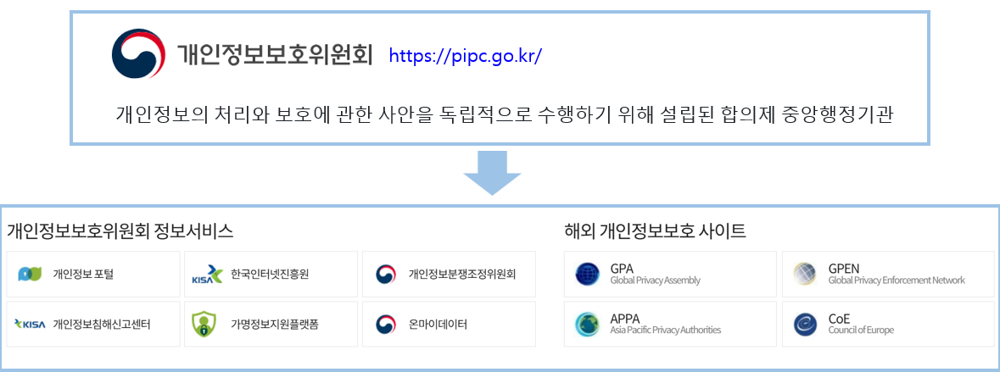
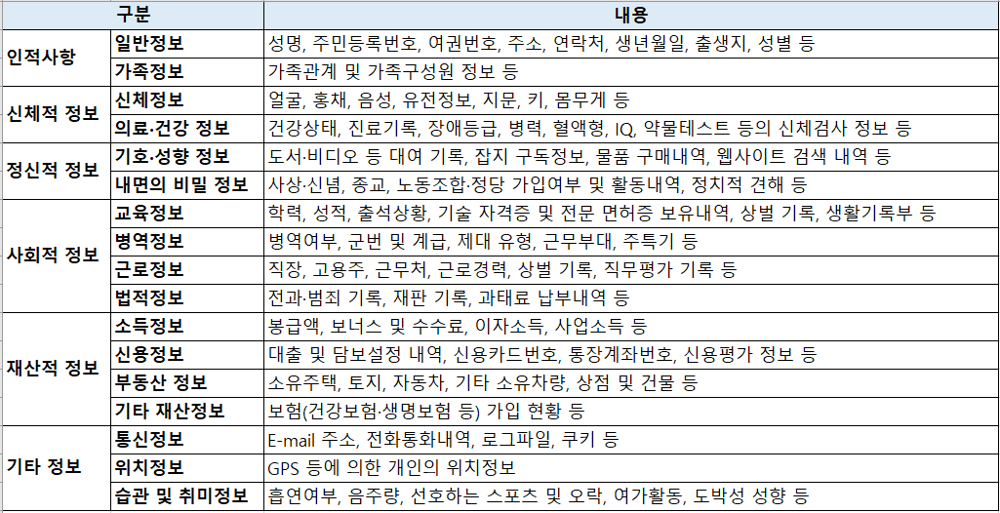

 

 

 

 

 

 

 

 

 

 

### 개인정보보호위원회 업무
개인정보 보호와 관련된 법령 개선, 정책·제도·계획 수립·집행, 권리침해에 대한 조사·처분, 고충처리·권리구제 및 분쟁조정, 국제기구 및 외국의 개인정보 보호기구와의 교류·협력, 법령·정책·제도·실태 등의 조사·연구, 교육, 홍보, 기술개발의 지원·보급 및 전문인력의 양성 등에 대한 업무를 수행(「개인정보 보호법」 제7조의8). 
 
### 개인정보보호위원회 심의·의결 사항
개인정보보호위원회는 개인정보 침해요인 평가(제8조의2), 개인정보 보호 기본계획(제9조) 및 시행계획(제10조), 개인정보 보호 관련 정책·제도·법령, 개인정보 처리 관련 공공기관 간의 의견조정, 개인정보 보호 법령 해석·운용, 개인정보의 목적 외 이용·제공 제한(제18조제2항제5호), 개인정보 영향평가 결과(제33조제3항), 과징금 부과(제28조의6, 제34조의2, 제39조의15), 개인정보 보호 법령 관련 의견제시 및 개인정보 처리 실태에 대한 개선권고(제61조), 개인정보 침해 시 시정조치(제64조), 개인정보 보호 관련 법규 위반 시의 고발 및 징계권고(제65조), 개선권고·시정조치 명령· 고발 또는 징계권고·과태료 부과 내용에 관한 결과 공표(제66조), 과태료 부과(제75조), 개인정보보호위원회 소관 법령 및 규칙의 제정·개정·폐지 등에 관한 사항을 심의·의결합니다(「개인정보 보호법」 제7조의9). 
 
### 개인정보보호위원회 구성
개인정보보호위원회 위원은 총 9명으로 구성되며 대통령이 임명 또는 위촉(「개인정보 보호법」제7조의2). 
상임위원은 위원장, 부위원장으로 국무총리가 제청하며 대통령이 임명(정무직 공무원) 
그 외 위원은 위원장 제청 2인, 정당 교섭단체 추천 5인(여2, 야3)으로 대통령이 위촉 
 
### 개인정보보호위원회 연혁
2011년 9월 30일 「개인정보 보호법」 시행에 따라 개인정보보호위원회 공식 출범 
2016년 7월 26일 개인정보 보호 강화 필요성 증대에 따라 개인정보 침해요인 평가 기능 신설 및 개인정보 분쟁조정 기능 이관 등 조직·정원 확대 
2020년 8월 5일 행정안전부(공공/민간 총괄분야), 방송통신위원회(온라인분야), 금융위원회(상거래기업 개인신용정보 조사·처분)로 분산되어 있던 개인정보보호 감독기능을 통합하여 중앙행정기관으로 출범 
 
### 개인정보 안내서 목록
개인정보위원회(https://www.pipc.go.kr/) 정책·법령>법령정보>안내서>현재안내서 
 
01 개인정보 보호 법령 및 지침·고시 해설 
02 개인정보 처리 통합 안내서(안)  
03 분야별 개인정보보호 안내서  
04 긴급상황 시 개인정보 처리 및 보호수칙  
05 아동·청소년 개인정보보호 가이드라인  
06 인터넷 자기게시물 접근배제요청권 가이드라인  
07 자동화된 결정에 대한 정보주체의 권리 안내서  
08 개인정보의 안전성 확보조치 기준 안내서  
09 생체정보 보호 안내서  
10 고정형 영상정보처리기기 설치·운영 안내서  
11 이동형 영상정보처리기기를 위한 개인영상정보 보호·활용 안내서  
12 합성데이터 활용 가이드라인  
13 스마트도시 개인정보보호 안내서  
14 가명정보 처리 가이드라인  
15 공공분야 가명정보 제공 실무 안내서(부처합동(행안부))  
16 교육분야 가명·익명처리 가이드라인(부처합동(교육부))  
17 보건의료 데이터 활용 가이드라인(부처합동(복지부))  
18 합성데이터 생성 참조모델  
19 자율규제단체 참여사를 위한 업종별 개인정보처리 가이드(공인중개사업, 대중골프장업,렌터카업, 여행업, 학원업, 호텔업) 
20 소상공인을 위한 개인정보보호 핸드북 
21 개인정보 처리방침 작성지침 
22 개인정보 영향평가 수행안내서 
23 개인정보 영향평가 대가 산정가이드 
24 정보보호 및 개인정보보호관리체계(ISMS-P)인증기준 안내서(부처합동(과기부)) 
25 개인정보 보호 교육 업무 안내서 
<ins>26 AI 개발·서비스를 위한 공개된 개인정보 처리 안내서</ins> 
<ins>27 AI 개발·서비스를 위한 개인정보 리스크 평가모델</ins> 
<ins>28 생성형 인공지능(AI) 개발·활용을 위한 개인정보 처리 안내서</ins> 
29 홈페이지 개인정보 노출방지 안내서 
30 개인정보 유출 등 사고대응 매뉴얼 
31 해외사업자의 개인정보 보호법 적용 안내서 
32 개인정보 손해배상책임 보장제도 안내서 
33 개인정보 질의응답 모음집 
34 개인정보 전송요구권 제도 안내서 
35 개인정보관리 전문기관 지정안내서(일반전문기관 편) 
36 개인정보관리 전문기관 지정안내서(특수전문기관 편) 
37 개인정보관리 전문기관 지정안내서(중계전문기관 편) 
38 일반수신자 등재 안내서 
39 전 분야 마이데이터 전송 절차 및 기술 가이드라인 

 

 

---

## 개인정보란?
「개인정보 보호법」에서 정의하는 개인정보는 살아 있는 개인에 관한 정보로 아래에 해당하는 정보 
① 성명, 주민등록번호 및 영상 등을 통하여 개인을 알아볼 수 있는 정보 
② 해당 정보만으로는 특정 개인을 알아볼 수 없더라도 다른 정보와 쉽게 결합하여 알아볼 수 있는 정보 
③ ①또는 ②를 가명처리함으로써 원래의 상태로 복원하기 위한 추가 정보의 사용, 결합 없이는 특정 개인을 알아볼 수 없는 정보(가명정보) 
따라서 개인정보의 주체는 자연인(自然人)이어야 하며, 법인(法人) 또는 단체의 정보는 해당되지 않음 
따라서 법인의 상호, 영업 소재지, 임원 정보, 영업실적 등의 정보는「개인정보 보호법」에서 보호하는 개인정보의 범위에 해당되지 않음 

 

## 개인정보의 종류
개인정보는 개인의 성명, 주민등록번호 등 인적 사항에서부터 
사회·경제적 지위와 상태, 교육, 건강·의료, 재산, 문화 활동 및 정치적 성향과 같은 내면의 비밀에 이르기까지 그 종류가 매우 다양하고 폭 넓음. 
또한, 사업자의 서비스에 이용자(고객)가 직접 회원으로 가입하거나 등록할 때  
사업자에게 제공하는 정보뿐만 아니라, 이용자가 서비스를 이용하는 과정에서 생성되는 통화내역, 로그기록, 구매내역 등도 개인정보가 될 수 있음. 

 

 

 

---

 

 

 

