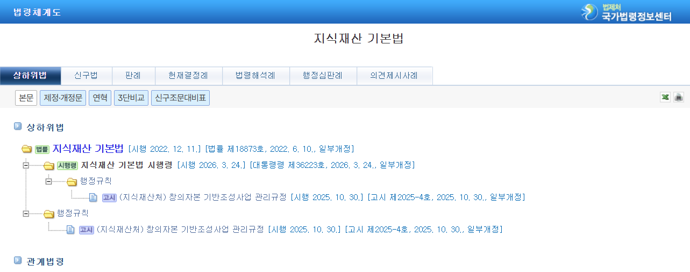

### 지식재산권의 정의
▣ '지식재산' : 인간의 창조적 활동 또는 경험 등에 의하여 창출되거나 발견된 지식ㆍ정보ㆍ기술, 사상이나 감정의 표현, 영업이나 물건의 표시, 생물의 품종이나 유전자원(遺傳資源), 그 밖에 무형적인 것으로서 재산적 가치가 실현될 수 있는 것 
▣ '지식재산권' : 법령 또는 조약 등에 따라 인정되거나 보호되는 지식재산에 관한 권리 
▣ '신지식재산' : 경제ㆍ사회 또는 문화의 변화나 과학기술의 발전에 따라 새로운 분야에서 출현하는 지식재산 

	 「헌법」 제22조 
	 ① 모든 국민은 학문과 예술의 자유를 가진다.
	 ② 저작자ㆍ발명가ㆍ과학기술자와 예술가의 권리는 법률로써 보호한다.

	 「헌법」 제23조 
	 ① 모든 국민의 재산권은 보장된다. 그 내용과 한계는 법률로 정한다.
	 ② 재산권의 행사는 공공복리에 적합하도록 하여야 한다.
	 ③ 공공필요에 의한 재산권의 수용ㆍ사용 또는 제한 및 그에 대한 보상은 법률로써 하되, 정당한 보상을 지급하여야 한다.

### 지식재산권의 기본이념
정부는 지식재산 관련 정책을 다음 각 호의 기본이념에 따라 추진하여야 한다. 
1. 저작자, 발명가, 과학기술자 및 예술가 등 지식재산 창출자가 창의적이고 안정적으로 활동할 수 있도록 함으로써 우수한 지식재산의 창출을 촉진한다. 
2. 지식재산을 효과적이고 안정적으로 보호하고, 그 활용을 촉진하는 동시에 합리적이고 공정한 이용을 도모한다. 
3. 지식재산이 존중되는 사회환경을 조성하고 전문인력과 관련 산업을 육성함으로써 지식재산의 창출ㆍ보호 및 활용을 촉진하기 위한 기반을 마련한다. 
4. 지식재산에 관한 국내규범과 국제규범 간의 조화를 도모하고 개발도상국의 지식재산 역량 강화를 지원함으로써 국제사회의 공동 발전에 기여한다. 
 

### 지식재산권 vs 지적재산권
'지적재산권'은 사람의 지적 창조물, 즉 정신적 창작물 및 연구 결과, 창작된 방법 등을 인정하는 독점적 권리를 말한다. 
정보 사회 및 지식기반 경제 체계가 강화되는 사회 구조 속에서 '지식재산권(知識財産權)'에 대한 공중의 관심과 사회적 중요성이 점차 증가하고 있다. 
지식재산권은 흔히 과거부터 널리 사용해 온 지적재산권과 한 글자 차이로 인해 그 개념에 차이가 있을 것으로 생각되지만,  
실제로는 동일한 의미를 가진 단어로, 국립국어원 표준국어대사전은 '지적재산권을 지식재산권의 전(前) 용어'로 정의하고 있다.  
'지적(知的)'재산권이 '지식(知識)'재산권으로 법령에 근거해 명칭이 변경된 것으로,  
과거에는 지적재산권으로 사용되었고, 현재는 더 포괄적인 의미인 지식재산권을 사용하고 있다. 

<ins>지식재산권 (知識財産權)과 지적재산권 (知的財産權) 모두 영문명은 동일하게 Intellectual Property Rights</ins> 
**Article 53(1) : 범용 AI 모델 제공자의 의무(Obligations for providers of general-purpose AI models)**  
(c) 범용 AI 모델의 제공자는,저작권 및 저작인접권에 관한 유럽연합 법령을 준수하도록 하는 정책을 마련해야 하며, 특히 EU 저작권 지침 제4조 제3항에 따라 표시된 권리 유보를 식별하고 이를 준수해야 하고, 지식재산권을 보호해야 한다.(The provider of a general-purpose AI model shall put in place a policy to ensure compliance with Union law on copyright and related rights, in particular to identify and comply with reservations of rights expressed pursuant to Article 4(3) of Directive (EU) 2019/790, and to protect <ins>intellectual property rights</ins>.) 
(d) 제공자는 범용 AI 모델의 학습에 사용된 데이터에 관하여 그 일반적인 성격을 이해할 수 있을 정도로 충분히 상세한 요약을 공개해야 한다. 다만, 이 요약은 영업비밀 및 지식재산권을 포함한 기타 기밀 정보의 보호 필요성을 고려하여 작성되어야 한다.(The summary shall be sufficiently detailed to enable the public to understand the general nature of the data used, while taking into account the need to protect trade secrets and other confidential information, including <ins>intellectual property rights</ins>.) 
**Article 50(2) : 특정 AI 시스템에 대한 투명성 의무(Transparency obligations for certain AI systems)**  
본 조에 따른 투명성 의무는 지식재산권(영업비밀을 포함한다)의 보호를 침해하지 않는 방식으로 이행되어야 한다.(Those obligations shall be implemented in a manner that does not undermine the protection of <ins>intellectual property rights</ins>, including trade secrets.) 
**Recital 60**  
이 규정은 저작권 및 저작인접권을 포함한 유럽연합의 지식재산권 법령에 영향을 미치지 않아야 한다. 따라서 본 규정은 기존의 지식재산권 보호 체계를 변경하거나 약화시키는 방식으로 해석되어서는 안 된다.(This Regulation should be without prejudice to Union law on <ins>intellectual property rights</ins> and in particular copyright and related rights.) 

### 지식재산권의 유형
**▣ 산업재산권** : 특허권, 실용신안권, 상표권, 디자인권 등 산업 발전을 위한 권리 

  특허권 : 이제까지 없었던 물건, 방법을 최초로 발명한 것에 대한 권리
  실용신안권 : 이미 발명된 것을 개량해 더 유용하도록 물품을 고안한 것에 대한 권리
  디자인권 : 물품의 형상, 모양, 색채 등 시각을 통해 미감을 느끼게 하는 것에 대한 권리
  상표권 : 다른 상품과 식별되도록 사용하는 기호, 문자, 도형으로 타인의 것과 명확히 구분되는 것에 대한 권리
  
**▣ 저작권** : 문화생활 향상을 위한 문학, 예술, 학술 작품에 대한 권리 

  저작인격권 : 정신적인 노력으로 만들어 낸 저작물에 대한 권리(공표권, 성명표시권, 동일성유지권이 해당)
  저작재산권 : 저작물을 이용해 발생하는 경제적 이익을 보호하는 권리(복제권, 공연권, 공중송신권, 전시권, 배포권, 2차적저작물작성권, 대여권이 해당)
  저작인접권 : 실연자의 권리, 음반제작자의 권리, 방송사업자의 권리 등

**▣ 신지식재산권** : 컴퓨터 프로그램, 반도체 배치설계 등 새로운 형태의 지식 재산 

  컴퓨터 프로그램
  데이터베이스
  

### 지식재산권의 주요 특징
▣ 무형재산권: 토지·건물과 달리 형태가 없는 무형의 권리이지만, 경제적 가치가 크며 매매·양도가 가능 
▣ 독점적·배타적 권리: 일정 기간 동안 창작자가 그 결과물을 독점적으로 이용하거나 타인의 무단 사용을 막을 수 있음 
▣ 기간 제한: 영구적이지 않고 법령이 정한 기간 동안만 보호(예: 특허권 20년, 저작권은 원칙적으로 저작자 생존 기간 + 70년 등) 
▣ 등록·창작에 따른 차이: 특허·상표·디자인 등은 등록을 통해 발생하지만, 저작권은 창작과 동시에 발생 

## 지식재산권 법령 체계 및 관계 상세표

| 구분 | 관련 법률 | 주요 보호 대상 및 내용 | 법률 간 주요 관계 및 특징 |
| :--- | :--- | :--- | :--- |
| **기본법** | [지식재산 기본법](https://namu.wiki/w/%EC%A7%80%EC%8B%9D%EC%9E%AC%EC%82%B0%20%EA%B8%B0%EB%B3%B8%EB%B2%95) | 지식재산 정책의 컨트롤타워, 국가 전략 수립 및 기반 조성 | 최상위 지침: 다른 IP 관련 법령 제·개정 시 가이드라인 역할 (제5조) |
| **산업재산권** | [특허법](https://namu.wiki/w/%ED%8A%B9%ED%97%88%EB%B2%95) | 기술적 사상의 창작(발명) 보호 | 실용신안법과 변경출원 가능 (기술의 고도성에 따라 선택) |
| | [실용신안법](https://namu.wiki/w/%EC%8B%A4%EC%9A%A9%EC%8B%A0%EC%95%88%EB%B2%95) | 물품의 형상·구조 등의 고안 보호 | 특허법의 보완적 역할 수행 |
| | [상표법](https://namu.wiki/w/%EC%83%81%ED%91%9C%EB%B2%95) | 상품의 식별표지(로고, 브랜드 등) 보호 | 디자인보호법과 식별성 측면에서 유기적으로 연계 |
| | [디자인보호법](https://namu.wiki/w/%EB%94%94%EC%9E%90%EC%9D%B8%EB%B3%B4%ED%98%B8%EB%B2%95) | 물품의 외관, 심미적 창작물 보호 | 저작권법 및 상표법과 보호 영역이 중첩될 수 있음 |
| **저작권** | [저작권법](https://namu.wiki/w/%EC%A0%80%EC%9E%91%EA%B6%8C%EB%B2%95) | 인간의 사상·감정을 표현한 문학, 예술 저작물 | 상표법 및 부정경쟁방지법과 함께 다각도 권리 보호 |
| **신지식재산** | 영업비밀보호 | 기업의 비공개 경영·기술 정보 보호 | 부정경쟁방지법을 통해 보호 및 침해 단속 |
| | 기타 신분야 | 식물신품종, 반도체집적회로 배치설계 등 | 경제·기술 변화에 따라 새롭게 출현하는 IP 영역 |
| **보호 및 집행** | [관세법](https://namu.wiki/w/%EA%B4%80%EC%84%B8%EB%B2%95) | 국경 단계에서의 지식재산권 보호 | 통합 단속: 위조 상품의 수출입 통관 차단 (모든 IP법과 연계) |

---

### 법률 간 주요 관계 요약
**정책적 통합:** 모든 개별법은 [지식재산 기본법](https://namu.wiki/w/%EC%A7%80%EC%8B%9D%EC%9E%AC%EC%82%B0%20%EA%B8%B0%EB%B3%B8%EB%B2%95)의 기본 이념과 국가 지식재산 전략을 준수 
**입체적 보호:** 하나의 제품에 대해 특허(기술), 디자인(외관), 상표(브랜드)가 동시 적용되어 보호 
**보완적 집행:** 권리 침해 시 각 개별법 외에도 부정경쟁방지법과 관세법이 실효적인 단속 수단을 제공 

## 「지식재산 기본법」 vs 「인공지능기본법」 

| 지식재산 기본법 | 인공지능기본법 | 연계 내용 |
| :--- | :--- | :--- |
| **제1조(목적)**  IP 창출·보호·활용 촉진 및 기반 조성 | **제1조(목적)**  AI 산업 육성 및 신뢰 기반 조성 | 국가 경쟁력 강화를 위한 기술 기반 조성이라는 상위 목적 공유 |
| **제3조(정의)**  지식재산, 신지식재산 정의 | **제2조(정의)**  인공지능, 인공지능기술 등 정의 | AI 생성물을 '신지식재산' 범주 내에서 다룰 수 있는 법적 근거 마련 |
| **제4조(국가 등의 책무)**  종합 시책 마련 및 추진 | **제4조(국가 등의 책무)**  AI 산업 육성 및 이용자 보호 시책 | AI 발전에 따른 새로운 IP 환경 변화에 대한 국가의 선제적 대응 의무 |
| **제6조(국가지식재산위원회)**  IP 정책 컨트롤타워 | **제7조(인공지능위원회)**  AI 정책 심의·조정 컨트롤타워 | 범부처 차원의 정책 조정 기구 운영 (IP와 AI 정책의 유기적 결합) |
| **제8조(국가지식재산 기본계획)**  5년 단위 중장기 전략 수립 | **제5조(인공지능 기본계획)**  3년 단위 기본계획 수립 | AI 기술 발전에 따른 지식재산 전략을 국가 기본계획에 반영 |
| **제18조(신지식재산 창출 지원)**  신분야 IP 현황 조사 및 법령 정비 | **제19조(AI 기술개발 지원)**  연구개발 및 상용화 지원 | AI 알고리즘 및 학습 데이터의 IP적 보호와 창출 지원 |
| **제19조(IP 창출자 보상)**  정당한 보상 환경 마련 | **제21조(AI 전문인력 양성)**  창작자 및 개발자 권익 보호 | AI 개발자 및 AI 활용 창작자에 대한 수익 배분 및 보상 체계 연계 |
| **제23조(IP 침해 대응)**  불법 유출 및 침해 방지 | **제23조(고위험성 AI 확인)**  신뢰성 확보 및 안전조치 | AI에 의한 저작권 침해(학습 데이터 등) 방지 및 기술 보호 조치 |
| **제28조(IP 공정 이용 질서)**  남용 방지 및 불공정 거래 방지 | **제11조(AI 윤리원칙)**  공정성 및 투명성 확보 | 데이터 독과점 방지 및 AI 생성물의 공정한 유통·이용 질서 확립 |
| **제31조(IP 정보 수집·제공)**  IP 정보 유통 촉진 | **제17조(데이터 구축·개방)**  AI 학습용 데이터셋 구축 지원 | AI 학습에 필요한 고품질 데이터(IP)의 합법적 수집 및 개방 체계 |

| 인공지능기본법 | 지식재산 기본법 | 관련 법 | 연계내용 |
| :--- | :--- | :--- | :--- |
| **제1조(목적)**   AI 산업의 건전한 발전 및 신뢰 기반 조성 | **제1조(목적)**   지식재산의 창출·보호·활용 촉진 | 「지식재산 기본법」 전반 | 국가 경쟁력 강화를 위한 기술·지식 기반 조성이라는 상위 목적을 공유 |
| **제2조(정의)**   인공지능, 인공지능기술, 인공지능시스템 | **제3조(정의)**   지식재산 및 신지식재산 정의 | 「저작권법」, 「특허법」 | AI 생성물·알고리즘·학습모델을 신지식재산 범주에서 포섭할 수 있는 개념적 연계 |
| **제4조(국가 등의 책무)**   AI 산업 육성 및 이용자 보호 시책 | **제4조(국가 등의 책무)**   지식재산 종합시책 수립 | 「특허법」, 「저작권법」 | AI 기술 발전에 따른 새로운 지식재산 환경 변화에 대한 국가의 선제적 대응 의무 |
| **제7조(인공지능위원회)**   AI 정책의 심의·조정 | **제6조(국가지식재산위원회)**   IP 정책 컨트롤타워 | 「지식재산 기본법」 전반 | 범부처 차원의 정책 조정 기구 운영을 통해 AI 정책과 IP 정책의 유기적 결합 |
| **제5조(인공지능 기본계획)**   3년 단위 AI 발전 전략 | **제8조(국가지식재산 기본계획)**   5년 단위 IP 전략 | 「특허법」, 「저작권법」 | AI 기술 발전에 따른 지식재산 보호·활용 전략을 국가 기본계획에 반영 |
| **제19조(AI 기술개발 지원)**   연구개발 및 상용화 촉진 | **제18조(신지식재산 창출 지원)**   신분야 IP 육성 | 「특허법」, 「실용신안법」, 「디자인보호법」 | AI 알고리즘, 모델 구조, 응용기술에 대한 특허·실용신안·디자인 보호 연계 |
| **제21조(AI 전문인력 양성)**   AI 인력 및 창작자 보호 | **제19조(IP 창출자 보상)**   정당한 보상체계 마련 | 「저작권법」 | AI 개발자 및 AI 활용 창작자에 대한 저작권 귀속·보상 논의와 연계 |
| **제23조(고위험성 AI의 관리)**   안전성·신뢰성 확보 | **제23조(IP 침해 대응)**   침해 방지 및 보호조치 | 「부정경쟁방지 및 영업비밀보호에 관한 법률」 | AI 학습 데이터·모델 유출 및 영업비밀 침해 방지 조치와 연계 |
| **제11조(AI 윤리원칙)**   공정성·투명성·책임성 | **제28조(IP 공정 이용 질서)**   남용 및 불공정 방지 | 「저작권법」, 「상표법」 | AI 생성물의 공정 이용, 저작권·상표권 침해 방지 및 시장 질서 유지 |
| **제17조(데이터 구축·개방)**   AI 학습용 데이터 지원 | **제31조(IP 정보 수집·제공)**   IP 정보 유통 촉진 | 「저작권법」, 「관세법」 | AI 학습 데이터의 합법적 수집·이용 및 지식재산권 침해 물품의 국경조치 연계 |

---
# AI 지식재산권 관련 최신 연구 동향

---
## AI 생성물의 저작권 귀속 및 저작물성 인정 문제

### [1] 인공지능에 관한 저작권법 개정에 관한 연구(숭실대학교 대학원, 임한규, 2022)
AI에 의해 생성된 저작물이나 발명의 저작권이 누구에게 귀속될 것인지, 그리고 이러한 창작물이 저작권법상 저작물로 인정될 수 있는지에 대한 논의가 활발하다. 현재 대부분의 국가에서는 저작물을 인간의 사상 또는 감정을 표현한 창작물로 규정하여 인간의 개입 없이 AI가 스스로 생성한 결과물은 저작물로 인정하지 않는 경향이 있다. 그러나 영국, 아일랜드, 뉴질랜드, 인도, 홍콩 등 일부 국가에서는 AI 생성물에 저작권을 인정하기도 함. 

### [2] 생성형 AI와 저작권 문제 - 저작권 침해와 저작물성의 사례와 분석-(계간 저작권, 김경숙, 2025)
특히, 인간의 창작성이 개입되지 않은 AI 생성물(AI-generated output)과 인간이 창작적으로 기여한 AI 도구 활용 생성물(AI-assisted output)을 구분하여 저작물성을 판단할 필요성이 제기.

### [3] 인공지능이 생성한 콘텐츠의 저작권 보호(IP & Data 法, 강기봉, 2023)
AI가 생성한 콘텐츠에 대한 법적 보호를 주장하는 기업가들의 요구에 따라, 저작권법 내에서 일반 저작물과 구분하여 보호하거나 독립적인 법률로 보호하자는 견해가 논의되고 있으며, 관련 법률 개정안이 국회에 계류 중.

---
## AI 학습 데이터 활용 과정에서의 저작권 침해 쟁점

### [4] 생성형 AI와 저작권 이슈(방송문화, 구창훈, 2023)
생성형 AI가 인터넷상의 방대한 데이터를 학습하는 과정에서 저작권 침해 문제가 발생할 수 있으며, 이에 대한 공정이용 인정 여부, TDM(Text and Data Mining) 면책 규정 도입 여부, 사적 계약을 통한 해결 방안 등이 검토.

### [2] 생성형 AI와 저작권 문제 - 저작권 침해와 저작물성의 사례와 분석-(계간 저작권, 김경숙, 2025)
AI 학습 단계에서의 무단 복제, 권리관리정보(CMI) 제거 및 변경, 보상 없는 이용 등이 저작권 침해로 문제 되며, 학습에 이용된 저작물과 생성된 콘텐츠 간의 실질적 유사성이 있을 경우 이용 단계에서도 침해가 발생할 수 있음.

### [5] AI 산출물에 의한 저작권 침해에 관한 연구(정보법학, 전응준, 2025)
AI의 확률적 모방성 및 초과 모방성 현상과 같은 기술적 특성으로 인해 AI 산출물에 대한 저작권 침해 여부를 판단하기 위해서는 과학적·기술적 검토가 필요하며, 의거성 입증의 어려움을 해결하기 위한 방안으로 입증책임 전환 등이 논의.

### [6] 생성형 AI의 활용에 따른 저작권 침해와 형사정책적 개선방안(법학연구, 강미영, 2025)
생성형 AI의 학습과 이용이 공정한 이용에 따른 저작권 제한 요건에 해당한다고 보기 어렵다는 의견과 함께, 저작권자의 일방적인 희생을 요구하기보다는 저작권 침해 영역을 명확히 하고, 학습한 저작물 목록 공개 또는 수집 거부 권리 부여 후 면책 규정을 적용해야 한다는 주장.

---
## 법적·제도적 개선 방안 모색

### [7] 인공지능(AI) 창작물의 저작권관계 정립 방향(강원법학, 윤종민, 2023)
AI 산업의 원활한 발전과 AI 창작물의 효과적인 보호 및 활용 체계 구축을 위해 미래지향적인 저작권 제도의 정립이 필요하며, 법리적 해석보다는 입법정책적인 결단을 통해 법과 제도를 정비하는 것이 바람직하다는 의견이 제시.

### [1] 인공지능에 관한 저작권법 개정에 관한 연구(숭실대학교 대학원, 임한규, 2022)
AI 학습 및 창작 과정에서 이용되는 저작물에 대한 정당한 보상금 지급, 불법 이용 및 복제 등 저작권 침해에 대한 책임 강화 및 손해배상, 그리고 인간의 개입 없는 AI 창작물에 대한 별도 규정의 필요성이 제안.
국제적으로는 AI 시대를 선점하기 위해 전략적으로 대응하고 있으며, AI에 대한 저작권 관련 논의가 인간 중심에서 투명하게 발전해나가야 한다는 가치를 담으면서 저작권법 또는 지적재산권법의 구체적인 쟁점 정리와 제·개정에 상당한 진척을 보임. 

### [8] 인공지능 시대의 지식재산 이슈 : USPTO의 「AI와 지식재산 정책에 대한 공공의 견해」를 중심으로(IP Focus, 김아름 외, 2020)
WIPO(세계지식재산기구)에서는 AI-IP 초안을 통해 특허, 저작권, 데이터, 디자인 등 다양한 지식재산권 분야에서 AI 관련 이슈를 다루고 있으며, 발명권과 소유권, 특허 요건 및 심사 지침, 창작권과 소유권, 저작권 침해 및 예외 등을 주요 내용으로 포함.
