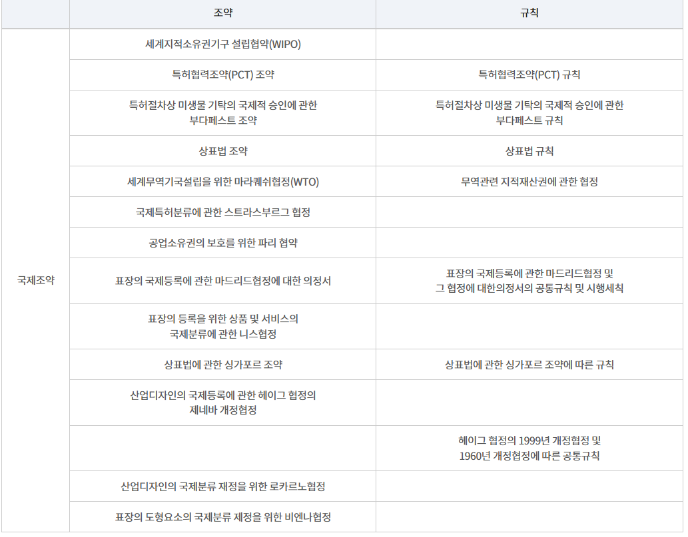
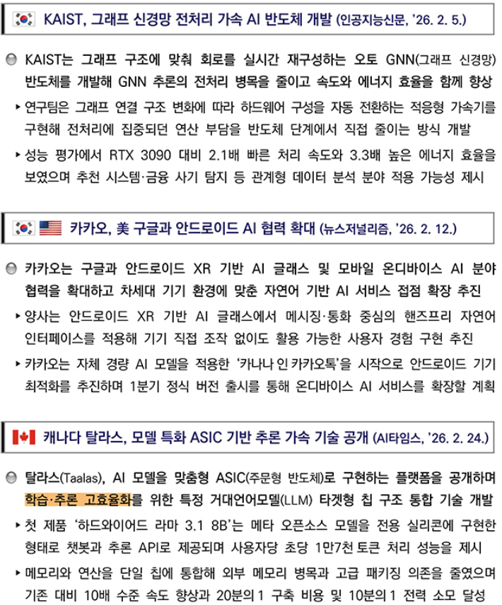
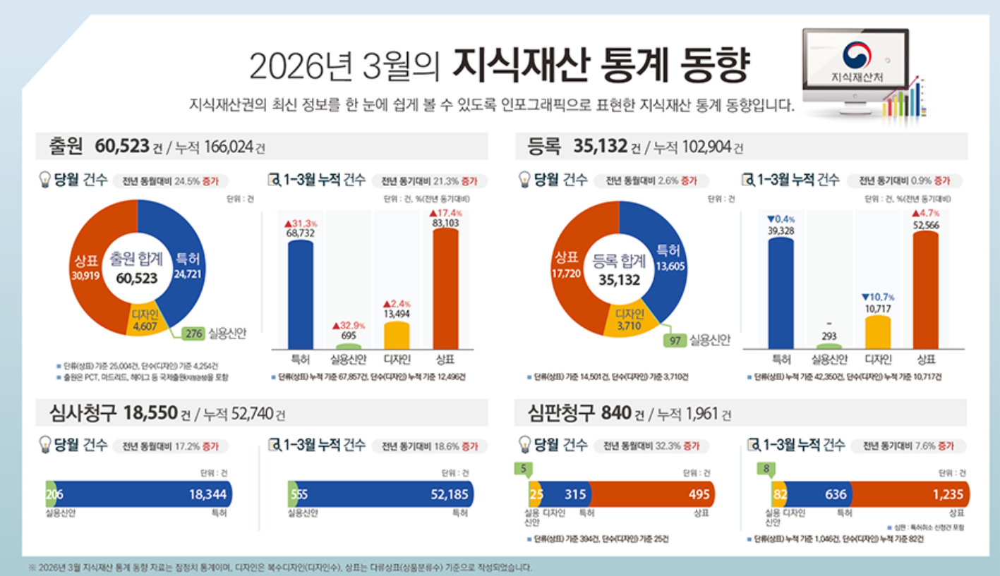
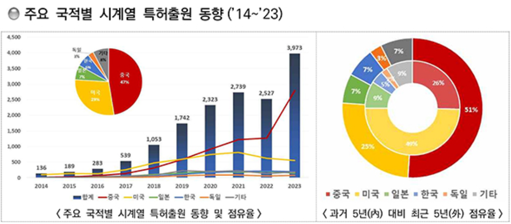
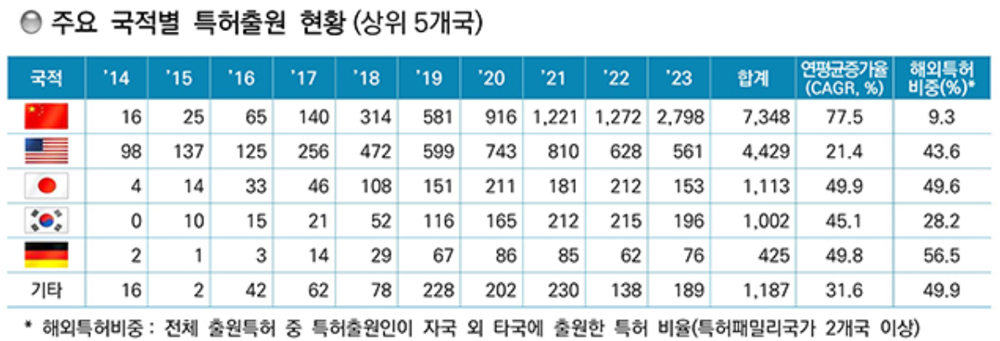
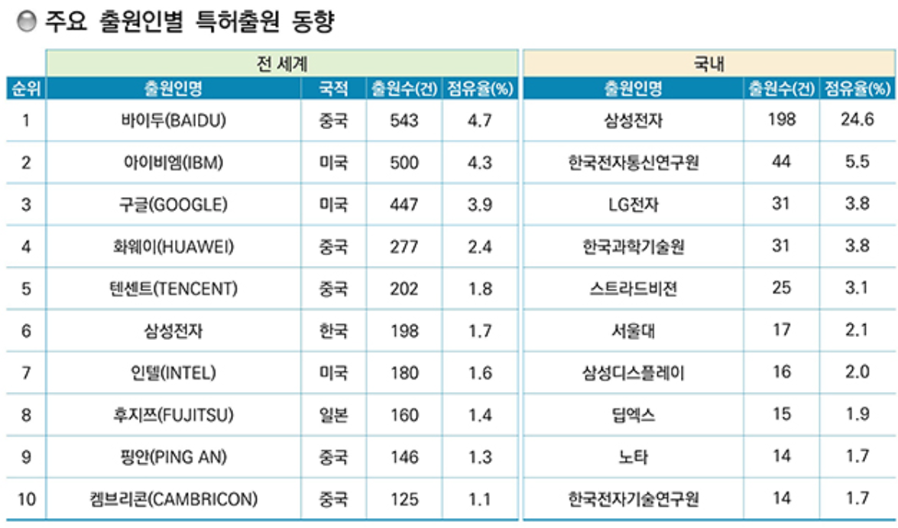

 

 

 

 

 

## 지식재산권의 정의
▣ '지식재산' : 인간의 창조적 활동 또는 경험 등에 의하여 창출되거나 발견된 지식ㆍ정보ㆍ기술, 사상이나 감정의 표현, 영업이나 물건의 표시, 생물의 품종이나 유전자원(遺傳資源), 그 밖에 무형적인 것으로서 재산적 가치가 실현될 수 있는 것 
▣ '지식재산권' : 법령 또는 조약 등에 따라 인정되거나 보호되는 지식재산에 관한 권리 
▣ '신지식재산' : 경제ㆍ사회 또는 문화의 변화나 과학기술의 발전에 따라 새로운 분야에서 출현하는 지식재산 

	 「헌법」 제22조 
	 ① 모든 국민은 학문과 예술의 자유를 가진다.
	 ② 저작자ㆍ발명가ㆍ과학기술자와 예술가의 권리는 법률로써 보호한다.

	 「헌법」 제23조 
	 ① 모든 국민의 재산권은 보장된다. 그 내용과 한계는 법률로 정한다.
	 ② 재산권의 행사는 공공복리에 적합하도록 하여야 한다.
	 ③ 공공필요에 의한 재산권의 수용ㆍ사용 또는 제한 및 그에 대한 보상은 법률로써 하되, 정당한 보상을 지급하여야 한다.

## 지식재산권의 기본이념
정부는 지식재산 관련 정책을 다음 각 호의 기본이념에 따라 추진하여야 한다. 
1. 저작자, 발명가, 과학기술자 및 예술가 등 지식재산 창출자가 창의적이고 안정적으로 활동할 수 있도록 함으로써 우수한 지식재산의 창출을 촉진한다. 
2. 지식재산을 효과적이고 안정적으로 보호하고, 그 활용을 촉진하는 동시에 합리적이고 공정한 이용을 도모한다. 
3. 지식재산이 존중되는 사회환경을 조성하고 전문인력과 관련 산업을 육성함으로써 지식재산의 창출ㆍ보호 및 활용을 촉진하기 위한 기반을 마련한다. 
4. 지식재산에 관한 국내규범과 국제규범 간의 조화를 도모하고 개발도상국의 지식재산 역량 강화를 지원함으로써 국제사회의 공동 발전에 기여한다. 
 

## 지식재산권 vs 지적재산권

| 구분 | 지식재산권(知識財産權) | 지적재산권(知的財産權)|
| :--- | :--- | :--- | 
| 사전적 의미 (표준국어대사전) | 인간의 지적 창작물에 부여된 재산권. 저작권과 산업 재산권 등을 통틀어 이르는 말 | 인간의 지적 활동으로 창달된 유무형의 결과물에 대하여 법령 또는 조약 등에 따라 인정하고 보호하는 권리 | 
| 법률적 정의 | 지식재산 기본법 제3조 제1호 및 제3호 법령 또는 조약 등에 따라 인정되거나 보호되는 지식재산에 관한 권리 | 과거 법령 및 구 국제조약에서 사용하던 용어로, 현재 국내 법체계상 공식 명칭은 '지식재산권'으로 통일됨 | 
| 영문명 | Intellectual Property Rights | Intellectual Property Rights | 

**<ins>Article 53(1) : 범용 AI 모델 제공자의 의무(Obligations for providers of general-purpose AI models)</ins>**  
(c) 범용 AI 모델의 제공자는,저작권 및 저작인접권에 관한 유럽연합 법령을 준수하도록 하는 정책을 마련해야 하며, 특히 EU 저작권 지침 제4조 제3항에 따라 표시된 권리 유보를 식별하고 이를 준수해야 하고, 지식재산권을 보호해야 한다.(The provider of a general-purpose AI model shall put in place a policy to ensure compliance with Union law on copyright and related rights, in particular to identify and comply with reservations of rights expressed pursuant to Article 4(3) of Directive (EU) 2019/790, and to protect <ins>intellectual property rights</ins>.) 
(d) 제공자는 범용 AI 모델의 학습에 사용된 데이터에 관하여 그 일반적인 성격을 이해할 수 있을 정도로 충분히 상세한 요약을 공개해야 한다. 다만, 이 요약은 영업비밀 및 지식재산권을 포함한 기타 기밀 정보의 보호 필요성을 고려하여 작성되어야 한다.(The summary shall be sufficiently detailed to enable the public to understand the general nature of the data used, while taking into account the need to protect trade secrets and other confidential information, including <ins>intellectual property rights</ins>.) 
**<ins>Article 50(2) : 특정 AI 시스템에 대한 투명성 의무(Transparency obligations for certain AI systems)</ins>**  
본 조에 따른 투명성 의무는 지식재산권(영업비밀을 포함한다)의 보호를 침해하지 않는 방식으로 이행되어야 한다.(Those obligations shall be implemented in a manner that does not undermine the protection of <ins>intellectual property rights</ins>, including trade secrets.) 
**<ins>Recital 60</ins>**  
이 규정은 저작권 및 저작인접권을 포함한 유럽연합의 지식재산권 법령에 영향을 미치지 않아야 한다. 따라서 본 규정은 기존의 지식재산권 보호 체계를 변경하거나 약화시키는 방식으로 해석되어서는 안 된다.(This Regulation should be without prejudice to Union law on <ins>intellectual property rights</ins> and in particular copyright and related rights.) 

## 지식재산권의 주요 특징
▣ 무형재산권: 토지·건물과 달리 형태가 없는 무형의 권리이지만, 경제적 가치가 크며 매매·양도가 가능 
▣ 독점적·배타적 권리: 일정 기간 동안 창작자가 그 결과물을 독점적으로 이용하거나 타인의 무단 사용을 막을 수 있음 
▣ 기간 제한: 영구적이지 않고 법령이 정한 기간 동안만 보호(예: 특허권 20년, 저작권은 원칙적으로 저작자 생존 기간 + 70년 등) 
▣ 등록·창작에 따른 차이: 특허·상표·디자인 등은 등록을 통해 발생하지만, 저작권은 창작과 동시에 발생 

## 지식재산권의 유형
### [1] 산업재산권
<ins>: 산업 발전과 기술 혁신을 촉진하기 위하여 보호되는 권리</ins> 
**[1-1] 특허권** : 자연법칙을 이용한 기술적 사상의 창작으로서, 물건 또는 방법에 관한 새로운 발명에 대해 부여되는 권리 
**[1-2] 실용신안권** : 물품의 형상·구조·조합에 관한 고안으로서, 기존 기술을 개량하여 실용적 가치를 높인 것에 대한 권리 
**[1-3] 디자인권** : 물품(또는 화상)의 형상, 모양, 색채 또는 이들의 결합으로 시각을 통해 미감을 일으키는 디자인에 대한 권리 
**[1-4] 상표권** : 자기의 상품 또는 서비스를 타인의 것과 식별하기 위하여 사용하는 기호, 문자, 도형, 입체적 형상, 색채, 소리, 냄새 등에 대해 부여되는 권리 

### [2] 저작권
<ins>: 인간의 사상 또는 감정을 표현한 창작물을 보호하여 문화 및 학술의 향상을 도모하는 권리</ins> 
**[2-1] 저작인격권** : 저작자와 저작물 사이의 인격적·정신적 결합을 보호하는 권리(공표권, 성명표시권, 동일성유지권) 
**[2-2] 저작재산권** : 저작물의 이용으로부터 발생하는 경제적 이익을 보호하는 권리(복제권, 공연권, 공중송신권, 전시권, 배포권, 대여권, 2차적저작물작성권) 
**[2-3] 저작인접권** : 저작물을 전달·매개하는 자의 기여를 보호하는 권리(실연자의 권리, 음반제작자의 권리, 방송사업자의 권리) 

### [3] 신지식재산권
<ins>: 정보기술의 발전과 지식기반 사회의 도래로 등장하였으며, 기존의 산업재산권이나 저작권 체계만으로는 충분히 보호하기 어려운 새로운 형태의 지식·정보 자산을 포괄하는 권리 개념</ins> 
**[3-1] 컴퓨터프로그램저작권** : 컴퓨터에서 사용될 수 있도록 명령어 또는 기호의 체계로 표현된 창작물을 보호하는 권리(저작권법에 의해 보호) 
**[3-2] 데이터베이스 제작자의 권리** : 데이터의 체계적 배열·구성·선별에 창작적 요소 또는 상당한 투자가 있는 경우, 그 데이터베이스를 보호하는 권리 
**[3-3] 반도체 집적회로 배치설계권** : 반도체 집적회로 내에서 회로소자 및 그 연결을 입체적으로 배치한 설계를 보호하는 권리(별도의 특별법에 의해 보호) 
**[3-4] 영업비밀** : 공개되지 아니한 기술상·경영상 정보로서 독립된 경제적 가치를 가지며 합리적으로 비밀 관리되는 정보(부정경쟁방지법에 의해 보호) 

 

| 구분 | 관련 법률 | 주요 보호 대상 및 내용 | 법률 간 주요 관계 및 특징 |
| --- | --- | :--- | :--- |
| 기본법 | 인공지능기본법   https://namu.wiki/w/인공지능기본법 | 인공지능의 안전성·신뢰성·책임성 확보, AI 개발·이용에 관한 기본 원칙과 국가 거버넌스 체계 확립 | 지식재산권을 직접 규율하지는 않으나, AI 생성·활용 과정에서 발생하는 IP 이슈의 정책적 전제 법률. 지식재산 기본법 및 개별 IP 법률과 병렬적 기본법 관계 |
|  | 지식재산 기본법   https://namu.wiki/w/지식재산%20기본법 | 지식재산 정책의 컨트롤타워, 국가 전략 수립 및 기반 조성 | 최상위 지침: 다른 IP 관련 법령 제·개정 시 가이드라인 역할(제5조). AI 기술·성과의 권리화 정책 방향을 총괄 |
| 산업재산권 | 특허법   https://namu.wiki/w/특허법 | 기술적 사상의 창작(발명) 보호 | 실용신안법과 변경출원 가능, AI 기술·AI 발명의 발명성 판단에 직접 적용 |
|  | 실용신안법   https://namu.wiki/w/실용신안법 | 물품의 형상·구조 등의 고안 보호 | 특허법의 보완적 역할, AI 기반 현장 기술개량 보호 |
|  | 상표법   https://namu.wiki/w/상표법 | 상품·서비스의 식별표지(로고, 브랜드 등) 보호 | AI 서비스명·가상캐릭터 보호, 디자인보호법과 식별성 측면에서 연계 |
|  | 디자인보호법   https://namu.wiki/w/디자인보호법 | 물품의 외관, GUI, 심미적 창작물 보호 | AI 생성 디자인·UX/UI 보호, 저작권법과 보호 영역 중첩 가능 |
| 저작권 | 저작권법   https://namu.wiki/w/저작권법 | 인간의 사상·감정을 표현한 문학·예술 저작물 | AI 생성물의 저작물성, 공정이용 판단의 핵심 법률 |
| 신지식재산 | 부정경쟁방지 및 영업비밀보호에 관한 법률   https://www.law.go.kr/법령/부정경쟁방지및영업비밀보호에관한법률 | 영업비밀, 데이터, 성과도용, 부정사용 등 비정형 지식·성과 보호 | 특허·저작권으로 포섭되지 않는 AI 학습데이터·모델·노하우 보호의 핵심 법률 |
|  | 식물신품종 보호법   https://www.law.go.kr/법령/식물신품종보호법 | 신품종 식물 보호 | 기술·산업 변화에 따라 출현한 특수 IP 영역, AI 육종 기술과 연계 |
|  | 반도체집적회로의 배치설계에 관한 법률   https://www.law.go.kr/법령/반도체집적회로의배치설계에관한법률 | 반도체 집적회로 배치설계 보호 | AI 반도체·NPU 설계 보호 등 첨단 산업 특화 IP 제도 |
| 보호집행 | 관세법   https://namu.wiki/w/관세법 | 국경 단계에서의 지식재산권 보호 | 모든 IP 법률과 연계, AI 침해·위조 물품의 수출입 통관 차단 |
| 전문자격제도 | 변리사법   https://www.law.go.kr/법령/변리사법 | 산업재산권 대리·자문을 수행하는 변리사 제도 규율 | 특허·상표·디자인 제도의 실질적 집행 인프라. AI·데이터 발명 시대에 IP 전문인력의 역할 확대 |
| 인재교육 | 발명교육의 활성화 및 지원에 관한 법률   https://www.law.go.kr/법령/발명교육의활성화및지원에관한법률 | 발명·창의교육 진흥, 인재 양성 | AI·디지털 전환 시대의 창의적 기술인력 양성 기반법. 지식재산 기본법의 인적 기반을 보완 |
| 정보데이터 | 산업재산 정보의 관리 및 활용촉진에 관한 법률   https://www.law.go.kr/법령/산업재산정보의관리및활용촉진에관한법률 | 특허·디자인·상표 정보의 관리·개방·활용 | AI 학습데이터로서 특허 데이터 활용의 법적 근거. AI+IP 분석·예측 기술과 직접 연계 |
| 행정체계 | 정부조직법   https://www.law.go.kr/법령/정부조직법 | 행정부 조직 및 소관 사무 규정 | 특허청·문화체육관광부 등 IP·저작권 소관 부처의 법적 근거. AI·IP 거버넌스 구조의 헌법적 토대 |

 

---

	[1] 지식재산권기본법
	[2] 저작권법
	[3] 특허법
	[4] 실용신안법
	[5] 상표법
	[6] 디자인보호법
	[7] 부정경쟁방지 및 영업비밀보호에 관한 법
	[8] 관세법

## [1] 지식재산권기본법
인공지능기본법과 지식재산기본법을 목적·이념·정책수단 측면에서 비교한 결과, 두 법이 기술 발전과 권리 보호를 조화롭게 달성하려는 공통된 국가 전략을 공유하고 있음을 확인할 수 있다. 
<ins>AI기본법은 인공지능 기술의 ‘안전하고 신뢰 가능한 사용’을 규율하는 행위 중심 법이고, 지식재산기본법은 기술·창작의 결과물을 ‘권리로 보호하고 활용’하기 위한 자산 중심 법이다.</ins> 

| 인공지능기본법 | 지식재산기본법 | 연계 내용 |
| :--- | :--- | :--- |
| 제1조(목적)   AI 산업의 육성 및 신뢰 기반 조성 | 제1조(목적)   지식재산의 창출·보호·활용 촉진 | 기술·지식 기반 국가 경쟁력 강화라는 상위 목적 공유 |
| 제2조(정의)   인공지능, 인공지능기술, 인공지능시스템 | 제3조(정의)   지식재산, 신지식재산 | AI 생성물·학습결과를 신지식재산으로 포섭할 수 있는 개념적 연결 |
| 제3조(기본이념)   인간 중심·신뢰 가능한 AI | 제2조(기본이념) | 기술 발전과 공익·권리 보호의 조화라는 규범적 기초 공유 |
| 제4조(국가 등의 책무)   AI 산업 육성 및 이용자 보호 | 제4조(국가 등의 책무) | AI 발전에 따른 지식재산 환경 변화에 대한 국가의 정책적 책임 |
| 제5조(인공지능 기본계획)   3년 단위 AI 기본계획 | 제8조(국가지식재산 기본계획)   5년 단위 IP 중장기 전략 | AI 기술 발전을 지식재산 국가 전략에 반영 |
| 제6조(지방자치단체의 책무) | 제5조(지방자치단체의 책무) | 지역 단위 AI·지식재산 정책 추진의 연계 |
| 제7조(인공지능위원회)   AI 정책 심의·조정 | 제6조(국가지식재산위원회) | 범부처 차원의 AI·IP 정책 컨트롤타워 대응 |
| 제8조(실태조사) | 제7조(실태조사) | AI 기술·지식재산 환경에 대한 기초자료 수집 기능 |
| 제9조(통계의 작성 및 관리) | 제32조(IP 통계의 작성·관리) | AI·지식재산 정책 수립을 위한 통계 기반 공유 |
| 제10조(국제협력) | 제9조(국제협력) | AI·지식재산 국제 규범 및 협력체계 연계 |
| 제11조(AI 윤리원칙)   공정성·투명성·책임성 | 제28조(IP 공정 이용 질서) | AI 활용 과정에서 지식재산 남용 방지 및 공정 이용 |
| 제12조(신뢰성 확보 조치) |  | AI 신뢰성 확보는 IP 기본법의 직접 규율 대상 아님 |
| 제13조(설명 가능성) |  | 설명 가능성은 AI 고유 규율 영역 |
| 제14조(인간의 감독) |  | 인간 통제 원칙은 지식재산 기본법에 대응 규정 없음 |
| 제15조(안전성 확보) |  | 기술 안전성은 IP 정책 범위를 넘어서는 영역 |
| 제16조(보안 확보) |  | 사이버·시스템 보안은 AI 규율 고유 영역 |
| 제17조(데이터 구축·개방)   AI 학습용 데이터 지원 | 제31조(IP 정보 수집·제공) | AI 학습 데이터와 IP 정보의 합법적 수집·유통 연계 |
| 제18조(표준화 지원) | 제10조(표준화 촉진) | AI 기술 표준과 지식재산 표준 전략의 연계 |
| 제19조(AI 기술개발 지원)   연구개발 및 상용화 | 제18조(신지식재산 창출 지원) | AI 알고리즘·모델·데이터의 지식재산적 보호·창출 |
| 제20조(산업 생태계 조성) | 제11조(산업재산 창출 기반 조성) | AI 산업 생태계와 IP 기반 산업정책의 연계 |
| 제21조(AI 전문인력 양성)   개발자·창작자 보호 | 제19조(IP 창출자 보상) | AI 개발자·활용 창작자의 성과 보상 및 권익 보호 |
| 제22조(국민 인식 제고) | 제12조(대국민 인식 확산) | AI·지식재산에 대한 사회적 인식 제고 |
| 제23조(고위험성 AI의 관리)   신뢰성·안전성 확보 | 제23조(IP 침해 대응) | AI 학습·활용 과정에서의 IP 침해 예방 및 대응 |
|  | 제13조(지식재산 보호 기반 조성) | 지식재산 보호 인프라 구축은 AI 기본법에 직접 대응 규정 없음 |
|  | 제14조(지식재산 금융 지원) | IP 금융·담보 제도는 AI 기본법의 규율 범위 아님 |
|  | 제15조(중소기업 지식재산 지원) | 중소기업 IP 지원은 AI 일반 규율과 분리 |
|  | 제16조(공공부문 지식재산 관리) | 공공 IP 관리는 AI 기본법에 직접 대응 규정 없음 |
|  | 제17조(지식재산 평가·활용 촉진) | IP 가치평가·활용 제도는 별도 정책 영역 |
|  | 제20조(분쟁 예방 및 조정) | IP 분쟁 조정은 권리법·절차법 영역 |
|  | 제21조(전문인력 양성) | IP 전문인력 정책은 AI 인력 정책과 부분적으로만 교차 |
|  | 제22조(민간 자율활동 지원) | IP 민간 활동 지원은 AI 기본법에 직접 대응 규정 없음 |

| 비교 | 인공지능기본법 | 지식재산기본법 |
| :--- | :--- | :--- |
|**규율 대상의 차이**|규율 대상: 인공지능 기술·시스템·활용 행위 초점: AI의 개발·이용·확산 과정에서의 위험 관리와 신뢰 확보 대상 예: AI 시스템, 고위험 AI, 학습 데이터, 알고리즘 운영 방식 등|규율 대상: 지식재산 그 자체와 그 창출·보호·활용 체계 초점: 지식·기술·창작물의 권리화와 경제적 활용 대상 예: 특허, 저작권, 신지식재산, 영업비밀 등|
|(요약)|행위와 과정 중심|성과물의 권리와 자산 중심|
|**입법 목적·정책 방향의 차이**|AI 산업 육성과 함께 신뢰성·안전성·윤리성 확보를 핵심 목표로 설정 기술 발전에 따른 사회적 위험의 최소화 중시|지식재산의 창출·보호·활용 선순환 구축 국가 혁신 역량 및 산업 경쟁력 강화에 중점|
|(요약)|통제와 신뢰 확보|보호와 활용 촉진|
|**기본이념·규범 성격의 차이**|인간 중심성, 공정성·투명성·책임성, 설명 가능성, 인간의 감독 등 AI 활용 행위에 대한 윤리·거버넌스 원칙을 직접 규정|창작자 권리 존중, 공정 이용 질서, 기술 발전과 공익의 조화 정책 방향을 제시하는 선언적 원칙 중심|
|(요약)|행위 규범 중심 법률|정책·원칙 선언 중심 법률|
|**위험 관리 vs 권리 보호의 차이**|고위험 AI 관리, 안전성·보안·설명 가능성 확보 인간 개입 요구 등 사전적·예방적 규율|지식재산 침해 예방·분쟁 조정 권리 보호 인프라 구축 등 사후적·권리 중심 대응|
|(요약)|위험 기반 규율|권리 기반 보호|
|**AI와 지식재산 관계 설정의 차이**|AI 생성물·학습 데이터에 대한 직접적 권리 귀속 규정 없음 지식재산 문제는 타 법률과의 연계에 맡김|AI 생성물·데이터·알고리즘을 신지식재산으로 포섭 가능한 정책적 틀 제공 개별 지식재산법의 방향 설정|
|(요약)|IP 문제를 직접 규율하지 않음|AI 성과의 권리화 기반 제공|

 

## [2] 저작권법
인공지능기본법과 저작권법은 모두 AI 기술 발전에 대응하지만, 규율의 초점은 서로 다르다. 
<ins>인공지능기본법은 AI의 개발·이용 과정에서의 신뢰성·윤리성·안전성 확보에 중점을 두는 반면, 저작권법은 AI 학습·생성 과정에서 발생하는 창작물의 보호와 이용 질서를 중심으로 한다.</ins> 
이 비교는 AI 생성물과 학습 데이터가 언제 저작권 문제로 전환되는지를 이해하기 위한 제도적 경계를 보여준다. 

| 인공지능기본법 | 저작권법 | 연계 내용 |
| :--- | :--- | :--- |
| 제1조(목적)   AI 산업의 육성 및 신뢰 기반 조성 | 제1조(목적)   저작물의 공정한 이용과 저작자 보호 | AI 기술 발전과 문화·콘텐츠 산업 보호의 조화 |
| 제2조(정의)   인공지능, 인공지능기술, 인공지능시스템 | 제2조·제4조   저작물·표현의 정의 | AI 생성물의 저작물 해당성 판단을 위한 개념적 접점 |
| 제3조(기본이념)   인간 중심·신뢰 가능한 AI |  | 저작권법은 기본이념보다 권리 구조 중심 |
| 제4조(국가 등의 책무)   AI 산업 육성 및 이용자 보호 | 제3조   저작권 보호 시책 | AI 확산에 따른 저작권 보호를 위한 국가 정책 책임 |
| 제5조(인공지능 기본계획)   3년 단위 AI 기본계획 | 제3조   저작권 정책 방향 | AI 학습데이터·생성물 이슈를 국가 저작권 정책에 반영 |
| 제6조(지방자치단체의 책무) |  | 저작권법은 지방자치단체 책무를 직접 규율하지 않음 |
| 제7조(인공지능위원회)   AI 정책 심의·조정 |  | 저작권법에는 정책 조정기구 규정 없음 |
| 제8조(실태조사) |  | 저작권법은 권리 발생·침해 판단 중심 |
| 제9조(통계의 작성 및 관리) | 제102조   저작권 통계 | 저작권 통계와 AI 정책 수립을 위한 기초자료 연계 |
| 제10조(국제협력) | 제131조   국제조약 | AI 콘텐츠의 국제 유통과 저작권 국제 규범 연계 |
| 제11조(AI 윤리원칙)   공정성·투명성·책임성 | 제35조의3   공정이용 | AI 학습·생성 과정에서 저작물 공정이용 판단 기준 |
| 제12조(신뢰성 확보 조치) |  | 저작권법은 기술 신뢰성 자체를 규율하지 않음 |
| 제13조(설명 가능성) |  | 설명 가능성은 저작권 보호 대상 아님 |
| 제14조(인간의 감독) |  | 저작권법은 기술 운용 단계에 개입하지 않음 |
| 제15조(안전성 확보) |  | 안전 규제는 저작권법의 목적 범위 외 |
| 제16조(보안 확보) |  | 사이버·시스템 보안은 저작권법 규율 대상 아님 |
| 제17조(데이터 구축·개방)   AI 학습용 데이터 지원 | 제73조   데이터베이스 제작자의 권리 | AI 학습 데이터 구축과 DB 저작권 보호의 긴장 관계 |
| 제18조(표준화 지원) |  | 저작권법은 기술 표준을 직접 규율하지 않음 |
| 제19조(AI 기술개발 지원)   연구개발 및 상용화 | 제16조~제22조   저작재산권 | AI 생성 콘텐츠의 복제·전송·이용은 저작재산권 판단으로 직결 |
| 제20조(산업 생태계 조성) | 제94조   저작재산권의 양도 | AI 콘텐츠 산업 생태계에서 권리 유통 구조 형성 |
| 제21조(AI 전문인력 양성)   개발자·창작자 보호 | 제9조·제10조   저작자 및 저작권 귀속 | AI 활용 창작물의 저작자성·권리 귀속 판단 |
| 제22조(국민 인식 제고) |  | 저작권법은 인식 제고 규정 없음 |
| 제23조(고위험성 AI의 관리)   신뢰성·안전성 확보 | 제125조   손해배상 | AI 학습·생성 과정에서의 저작권 침해에 대한 사후 책임 |
|  | 제4조   저작물의 예시 | 보호 대상 저작물 범위 규정 |
|  | 제35조의4   저작물 이용의 특례 | 교육·연구 목적 이용에 관한 특례 |
|  | 제93조   저작인접권 | 실연·음반·방송과 AI 활용의 관계 |
|  | 제125조   손해배상 | 침해에 대한 민사적 책임 |
|  | 제136조 이하   벌칙 | 저작권 침해에 대한 형사적 제재 |

| 비교 | 인공지능기본법 | 저작권법 |
| :--- | :--- | :--- |
|**규율 대상의 차이**|규율 대상: 인공지능 기술·시스템·활용 행위 초점: AI의 개발·이용·확산 과정에서의 위험 관리와 신뢰 확보 대상 예: AI 시스템, 고위험 AI, 학습 데이터, 알고리즘 운영 방식 등|규율 대상: 저작물과 그 이용 행위 초점: 인간의 사상·감정이 표현된 창작물의 보호와 공정한 이용 질서 대상 예: 어문·미술·영상 저작물, 데이터베이스, 저작인접물|
|(요약)|행위와 과정 중심|표현된 창작물과 이용 행위 중심|
|**입법 목적·정책 방향의 차이**|AI 산업 육성과 함께 신뢰성·안전성·윤리성 확보를 핵심 목표로 설정 기술 발전에 따른 사회적 위험 최소화 중시|저작자의 권리 보호와 저작물의 공정한 이용을 통해 문화 및 콘텐츠 산업의 건전한 발전 도모|
|(요약)|통제와 신뢰 확보|보호와 공정 이용의 균형|
|**기본이념·규범 성격의 차이**|인간 중심성, 공정성·투명성·책임성, 설명 가능성, 인간의 감독 등 AI 활용 전반에 대한 윤리·거버넌스 원칙을 직접 규정|저작자 보호와 이용자 이익의 조화라는 기본 구조 하에 권리 유형과 이용 허락 범위를 구체적으로 규정|
|(요약)|윤리·거버넌스 규범 중심 법률|권리 구조 중심의 사법적 법률|
|**위험 관리 vs 권리 보호의 차이**|고위험 AI 관리, 안전성·보안·설명 가능성 확보 사전적·예방적 규율 구조|저작권 침해 시 손해배상·형사처벌 등 사후적·권리구제 중심 규율|
|(요약)|위험 기반 사전 규율|권리 침해 사후 구제|
|**AI와 저작권 관계 설정의 차이**|AI 생성물·학습 데이터에 대한 권리 귀속을 직접 규정하지 않음 저작권 문제는 개별 법률 판단에 맡김|AI 생성물이 저작물에 해당하는지, AI 학습이 공정이용 또는 권리 침해에 해당하는지 판단|
|(요약)|저작권 판단을 직접 규율하지 않음|AI 활용의 법적 한계 설정|

 

## [3] 특허법
인공지능기본법과 특허법은 모두 기술혁신을 통한 산업 발전을 목표로 하지만, 규율의 초점과 방식에는 뚜렷한 차이가 있다. 
<ins>인공지능기본법은 AI 기술의 개발·이용 과정에서의 신뢰성·안전성·윤리성 확보를 중심으로 하는 반면, 특허법은 발명의 성립과 권리 부여·보호에 중점을 둔다.</ins> 
이 비교는 AI 기술이 언제, 어떤 조건에서 특허로 보호될 수 있는지를 이해하는 제도적 연결 구조를 보여준다. 

| 인공지능기본법 | 특허법 | 연계 내용 |
| :--- | :--- | :--- |
| 제1조(목적)   AI 산업의 육성 및 신뢰 기반 조성 | 제1조(목적)   발명의 보호·이용 도모 | 기술혁신을 통한 산업발전과 국가 경쟁력 강화라는 목적의 접점 |
| 제2조(정의)   인공지능, 인공지능기술, 인공지능시스템 | 제2조(정의)   발명의 개념 | AI 알고리즘·모델이 자연법칙을 이용한 기술적 사상으로서 발명에 해당하는지 판단 |
| 제3조(기본이념)   인간 중심·신뢰 가능한 AI |  | 특허법은 규범적 이념이 아닌 권리 성립 요건 중심 |
| 제4조(국가 등의 책무)   AI 산업 육성 및 이용자 보호 | 제3조(국가 등의 책무)   발명 진흥 | 국가의 AI 기술 진흥 정책과 발명 진흥 정책의 연계 |
| 제5조(인공지능 기본계획)   3년 단위 AI 기본계획 | 제5조(발명진흥계획) | AI 기술 발전을 특허·발명 중장기 전략에 반영 |
| 제6조(지방자치단체의 책무) |  | 특허법은 지방자치단체 책무를 직접 규율하지 않음 |
| 제7조(인공지능위원회)   AI 정책 심의·조정 |  | 특허법에는 정책 조정기구 규정 없음 |
| 제8조(실태조사) |  | 특허법은 실태조사보다 개별 권리 심사 중심 |
| 제9조(통계의 작성 및 관리) | 제221조   특허공보 | 특허 공개·통계를 통한 기술 정보 제공과 정책 활용 |
| 제10조(국제협력) | 제229조   국제출원 | AI 기술의 국제 보호와 특허 국제출원 제도의 연결 |
| 제11조(AI 윤리원칙)   공정성·투명성·책임성 | 제133조의2   권리남용의 제한 | AI 기술 독점과 특허권 남용 방지라는 공통 규범 |
| 제12조(신뢰성 확보 조치) |  | 특허법은 기술 신뢰성 자체를 규율하지 않음 |
| 제13조(설명 가능성) |  | 설명 가능성은 특허법의 보호 대상 아님 |
| 제14조(인간의 감독) |  | 특허법은 기술 운용 단계에 개입하지 않음 |
| 제15조(안전성 확보) |  | 특허법은 안전 규제가 아닌 권리 부여 법률 |
| 제16조(보안 확보) |  | 사이버·시스템 보안은 특허법 규율 대상 아님 |
| 제17조(데이터 구축·개방)   AI 학습용 데이터 지원 | 제42조   명세서 기재 | 특허 공개를 통한 기술 정보 축적과 AI 학습 활용 |
| 제18조(표준화 지원) | 제10조   표준특허 | AI 기술 표준화와 특허 전략의 결합 |
| 제19조(AI 기술개발 지원)   연구개발 및 상용화 | 제29조·제30조   특허요건 | AI 발명의 신규성·진보성·산업상 이용가능성 판단 |
| 제20조(산업 생태계 조성) | 제94조   특허권의 효력 | 특허권을 통한 AI 산업 생태계 형성 |
| 제21조(AI 전문인력 양성)   개발자·창작자 보호 | 제33조·제34조·제35조   특허를 받을 권리·직무발명 | AI 개발자의 발명자성·권리 귀속 문제 |
| 제22조(국민 인식 제고) |  | 특허법은 대국민 인식 제고 규정 없음 |
| 제23조(고위험성 AI의 관리)   신뢰성·안전성 확보 | 제126조   손해배상 | AI 기술 침해 발생 시 특허 침해 책임의 사후 규율 |
|  | 제29조   특허요건 | 발명 성립 요건은 특허법 고유 영역 |
|  | 제33조   특허를 받을 권리 | 권리 귀속 판단은 특허법이 전담 |
|  | 제94조   특허권의 효력 | 독점적 이용권 부여 규정 |
|  | 제126조   손해배상 | 침해에 대한 민사적 책임 |
|  | 제225조 이하   벌칙 | 특허 침해에 대한 형사적 제재 |

| 비교 | 인공지능기본법 | 특허법 |
| :--- | :--- | :--- |
|**규율 대상의 차이**|규율 대상: 인공지능 기술·시스템·활용 행위 초점: AI의 개발·이용·확산 과정에서의 위험 관리와 신뢰 확보 대상 예: AI 시스템, 고위험 AI, 학습 데이터, 알고리즘 운영 방식 등|규율 대상: 발명 그 자체와 그 권리의 성립·효력·침해 초점: 기술적 사상의 보호와 독점적 이용권 부여 대상 예: 물건·방법 발명, AI 관련 기술 발명|
|(요약)|행위와 과정 중심|기술적 성과물과 권리 중심|
|**입법 목적·정책 방향의 차이**|AI 산업 육성과 함께 신뢰성·안전성·윤리성 확보를 핵심 목표로 설정 기술 발전에 따른 사회적 위험 최소화 중시|발명의 보호 및 이용을 통해 기술 혁신과 산업 발전 도모 발명 공개와 권리 부여의 균형 중시|
|(요약)|통제와 신뢰 확보|보호와 독점적 활용|
|**기본이념·규범 성격의 차이**|인간 중심성, 공정성·투명성·책임성, 설명 가능성, 인간의 감독 등 AI 활용 전반에 대한 윤리·거버넌스 원칙을 직접 규정|윤리 원칙보다는 신규성·진보성·산업상 이용가능성 등 권리 성립 요건과 법적 효과 중심의 기술법|
|(요약)|행위 규범 중심 법률|요건·효과 중심 권리법|
|**위험 관리 vs 권리 보호의 차이**|고위험 AI 관리, 안전성·보안·설명 가능성 확보 사전적·예방적 규율 구조|특허 침해 시 손해배상·금지청구 등 사후적·권리구제 중심 규율|
|(요약)|위험 기반 사전 규율|권리 기반 사후 구제|
|**AI와 특허 관계 설정의 차이**|AI 생성물·알고리즘에 대한 권리 귀속을 직접 규정하지 않음 특허 여부는 개별 법률 판단에 맡김|AI 알고리즘·모델이 자연법칙을 이용한 기술적 사상인지 여부에 따라 발명 성립 및 특허 보호 여부 판단|
|(요약)|특허 판단을 직접 규율하지 않음|AI 기술의 특허 가능성 판단 주체|

 

## [4] 실용신안법
인공지능기본법과 실용신안법은 AI 기술이 산업 현장에 적용되는 과정에서 서로 다른 역할을 수행한다. 
<ins>인공지능기본법은 AI 기술의 개발·이용 전반에서 신뢰성·안전성·윤리성 확보를 목표로 하는 반면, 실용신안법은 AI를 활용한 장치·시스템의 구조적 개량을 신속하게 권리로 보호하는 데 중점을 둔다.</ins> 
이 비교는 AI 기반 기술개량이 언제 실용신안으로 보호될 수 있는지를 이해하는 제도적 기준을 제시한다. 

| 인공지능기본법 | 실용신안법 | 연계 내용 |
| :--- | :--- | :--- |
| 제1조(목적)   AI 산업의 육성 및 신뢰 기반 조성 | 제1조(목적)   고안의 보호 및 이용 촉진 | AI 기반 기술개량과 현장 적용 성과를 신속히 보호하여 산업 경쟁력 강화 |
| 제2조(정의)   인공지능, 인공지능기술, 인공지능시스템 | 제2조(정의)   고안(물품의 형상·구조·조합) | AI 알고리즘이 적용된 장치·시스템의 구조적 개량이 고안에 해당하는지 판단 |
| 제3조(기본이념)   인간 중심·신뢰 가능한 AI |  | 실용신안법은 규범적 이념보다 권리 성립 요건 중심 |
| 제4조(국가 등의 책무)   AI 산업 육성 및 이용자 보호 | 제3조   고안 창작 장려 | AI 활용 현장개선·기술개량 확산에 대한 국가의 보호·지원 책임 |
| 제5조(인공지능 기본계획)   3년 단위 AI 기본계획 | 제4조   실용신안행정 기본방향 | AI 기술의 산업현장 적용 성과를 실용신안 행정·정책에 반영 |
| 제6조(지방자치단체의 책무) |  | 실용신안법은 지방자치단체 책무를 직접 규율하지 않음 |
| 제7조(인공지능위원회)   AI 정책 심의·조정 |  | 실용신안법에는 정책 조정기구 규정 없음 |
| 제8조(실태조사) |  | 실용신안법은 권리 성립·침해 판단 중심 |
| 제9조(통계의 작성 및 관리) | 제56조   실용신안공보 | 공개된 실용신안 정보·통계를 통한 기술 분석 및 정책 활용 |
| 제10조(국제협력) | 제5조   조약과의 관계 | AI 장치·시스템의 국제 보호와 실용신안 국제 규범 연계 |
| 제11조(AI 윤리원칙)   공정성·투명성·책임성 | 제49조   권리행사 제한 | AI 기반 기술개량의 독점 남용 방지 및 공정한 기술 이용 |
| 제12조(신뢰성 확보 조치) |  | 실용신안법은 기술 신뢰성 자체를 규율하지 않음 |
| 제13조(설명 가능성) |  | 설명 가능성은 실용신안 보호 대상 아님 |
| 제14조(인간의 감독) |  | 실용신안법은 기술 운용 단계에 개입하지 않음 |
| 제15조(안전성 확보) |  | 안전 규제는 실용신안법의 목적 범위 외 |
| 제16조(보안 확보) |  | 보안은 실용신안법의 직접 규율 대상 아님 |
| 제17조(데이터 구축·개방)   AI 학습용 데이터 지원 | 제56조   실용신안공보 | 공개된 실용신안 정보의 AI 학습·기술분석 활용과 권리 보호의 균형 |
| 제18조(표준화 지원) |  | 실용신안법은 기술 표준을 직접 규율하지 않음 |
| 제19조(AI 기술개발 지원)   연구개발 및 상용화 | 제5조·제6조   실용신안등록 요건 | AI를 활용한 장치·시스템의 구조적 개량을 실용신안으로 신속 보호 |
| 제20조(산업 생태계 조성) | 제40조   실용신안권의 효력 | 실용신안권을 통한 AI 기반 장치·시스템 산업 생태계 형성 |
| 제21조(AI 전문인력 양성)   개발자·기술인력 보호 | 제35조   직무고안 | AI 개발·운영 과정에서 발생한 직무고안의 권리 귀속 및 보상 문제 |
| 제22조(국민 인식 제고) |  | 실용신안법은 대국민 인식 제고 규정 없음 |
| 제23조(고위험성 AI의 관리)   신뢰성·안전성 확보 | 제45조   실용신안권 침해 | AI 장치·시스템의 무단 모방에 대한 실용신안권 침해 및 사후 책임 |
|  | 제5조·제6조   실용신안등록 요건 | 신규성·진보성(완화) 등 고안 성립 요건 |
|  | 제35조   직무고안 | 종업원 등의 고안에 대한 권리 귀속 |
|  | 제40조   실용신안권의 효력 | 독점적 사용·수익 권한 |
|  | 제45조   실용신안권 침해 | 침해 성립 요건 |
|  | 제49조   권리행사 제한 | 권리 남용 방지 |
|  | 제59조 이하   벌칙 | 실용신안권 침해에 대한 형사적 제재 |

| 비교 | 인공지능기본법 | 실용신안법 |
| :--- | :--- | :--- |
|**규율 대상의 차이**|규율 대상: 인공지능 기술·시스템·활용 행위 초점: AI의 개발·이용·확산 과정에서의 위험 관리와 신뢰 확보 대상 예: AI 시스템, 고위험 AI, 학습 데이터, 알고리즘 운영 방식 등|규율 대상: 고안 및 그 실시 행위 초점: 물품의 형상·구조·조합에 관한 기술적 개량 보호 대상 예: AI 적용 장치, 스마트 설비, 구조 개선된 시스템|
|(요약)|행위와 과정 중심|구조적 기술개량 성과 중심|
|**입법 목적·정책 방향의 차이**|AI 산업 육성과 함께 신뢰성·안전성·윤리성 확보를 핵심 목표로 설정 기술 발전에 따른 사회적 위험 최소화 중시|고안의 보호 및 이용을 통해 현장 기술개량 촉진 신속한 권리 부여로 중소·현장 기술 경쟁력 강화|
|(요약)|통제와 신뢰 확보|신속 보호와 실용성 강화|
|**기본이념·규범 성격의 차이**|인간 중심성, 공정성·투명성·책임성, 설명 가능성, 인간의 감독 등 AI 활용 전반에 대한 윤리·거버넌스 원칙을 직접 규정|윤리 원칙보다는 신규성·진보성(완화) 등 고안 성립 요건과 권리 범위 중심 규율|
|(요약)|윤리·거버넌스 규범 중심 법률|요건 중심의 산업재산권법|
|**위험 관리 vs 권리 보호의 차이**|고위험 AI 관리, 안전성·보안·설명 가능성 확보 사전적·예방적 규율 구조|실용신안권 침해에 대한 금지·손해배상·형사처벌 등 사후적·권리구제 중심 규율|
|(요약)|위험 기반 사전 규율|권리 침해 사후 보호|
|**AI와 실용신안 관계 설정의 차이**|AI 생성·활용 결과물에 대한 실용신안권 귀속이나 성립 요건을 직접 규정하지 않음|AI를 활용한 장치·시스템의 구조적 개량이 고안에 해당하는지 및 침해 여부를 판단|
|(요약)|실용신안 문제를 직접 규율하지 않음|AI 기반 기술개량의 법적 보호 기준 제시|

 

## [5] 상표법
인공지능기본법과 상표법은 모두 AI 기반 산업 환경에서의 신뢰 확보를 목표로 하지만, 규율의 초점과 방식은 상이하다. 
<ins>인공지능기본법은 AI 기술의 개발·이용 과정에서 발생할 수 있는 위험을 관리하고 윤리적·제도적 기준을 제시하는 반면, 상표법은 AI 서비스·플랫폼의 명칭과 표지에 관한 출처 표시와 혼동 방지를 중심으로 한다.</ins> 
이 비교는 AI가 생성·사용하는 표장이 언제 상표 보호 또는 침해 문제로 전환되는지를 이해하는 데 중요한 기준을 제공한다. 

| 인공지능기본법 | 상표법 | 연계 내용 |
| :--- | :--- | :--- |
| 제1조(목적)   AI 산업의 육성 및 신뢰 기반 조성 | 제1조(목적)   상표의 보호 및 산업발전 | AI 기반 서비스·플랫폼의 신뢰 확보와 출처표시 보호의 목적 접점 |
| 제2조(정의)   인공지능, 인공지능기술, 인공지능시스템 | 제2조(정의)   상표, 표장 | AI 서비스명·로고·가상 캐릭터 등이 상표에 해당하는지 판단 |
| 제3조(기본이념)   인간 중심·신뢰 가능한 AI |  | 상표법은 규범적 이념보다 권리 성립·보호 중심 |
| 제4조(국가 등의 책무)   AI 산업 육성 및 이용자 보호 | 제3조   상표제도 발전 | AI 확산에 따른 출처 혼동 방지와 상표 보호를 위한 국가 책무 |
| 제5조(인공지능 기본계획)   3년 단위 AI 기본계획 | 제4조   상표행정 기본방향 | AI 산업 전략에 서비스·플랫폼 브랜드 보호 정책 반영 |
| 제6조(지방자치단체의 책무) |  | 상표법은 지방자치단체 책무를 직접 규율하지 않음 |
| 제7조(인공지능위원회)   AI 정책 심의·조정 |  | 상표법에는 정책 조정기구 규정 없음 |
| 제8조(실태조사) |  | 상표법은 권리 발생·침해 판단 중심 |
| 제9조(통계의 작성 및 관리) | 제216조   상표공보 | 상표 공보·통계를 통한 AI 서비스 명칭·표지 정보 활용 |
| 제10조(국제협력) | 제5조   조약과의 관계 | AI 서비스의 국경 간 제공과 상표 국제 보호 연계 |
| 제11조(AI 윤리원칙)   공정성·투명성·책임성 | 제65조   상표권의 제한 | AI 서비스 명칭·표지 사용에서 공정 경쟁 및 권리 남용 방지 |
| 제12조(신뢰성 확보 조치) |  | 상표법은 기술 신뢰성 자체를 규율하지 않음 |
| 제13조(설명 가능성) |  | 설명 가능성은 상표 보호 대상 아님 |
| 제14조(인간의 감독) |  | 상표법은 기술 운용 단계에 개입하지 않음 |
| 제15조(안전성 확보) |  | 안전 규제는 상표법의 목적 범위 외 |
| 제16조(보안 확보) |  | 사이버·시스템 보안은 상표법 규율 대상 아님 |
| 제17조(데이터 구축·개방)   AI 학습용 데이터 지원 | 제216조   상표공보 | 공개 상표정보의 AI 분석·학습 활용과 권리 보호의 균형 |
| 제18조(표준화 지원) |  | 상표법은 기술 표준을 직접 규율하지 않음 |
| 제19조(AI 기술개발 지원)   연구개발 및 상용화 | 제33조   상표등록 요건 | AI 기반 상품·서비스 명칭, 가상 캐릭터, 메타버스 표지의 상표 등록 가능성 |
| 제20조(산업 생태계 조성) | 제57조   상표권의 효력 | 상표권을 통한 AI 서비스·플랫폼 생태계 형성 |
| 제21조(AI 전문인력 양성)   개발자·운영자 보호 |  | 브랜드 기획·운영 인력 보호는 상표법의 직접 규율 대상 아님 |
| 제22조(국민 인식 제고) |  | 상표법은 대국민 인식 제고 규정 없음 |
| 제23조(고위험성 AI의 관리)   신뢰성·안전성 확보 | 제108조   상표권 침해 | AI가 생성·사용한 표장으로 인한 출처 혼동 및 상표권 침해 책임 |
|  | 제34조   상표등록을 받을 수 없는 상표 | 식별력·공익 침해 여부 판단 |
|  | 제57조   상표권의 효력 | 독점적 사용권의 범위 규정 |
|  | 제65조   상표권의 제한 | 공정 사용·권리 남용 방지 |
|  | 제108조   상표권 침해 | 침해 성립 요건 |
|  | 제110조 이하   벌칙 | 상표권 침해에 대한 형사적 제재 |

| 비교 | 인공지능기본법 | 상표법 |
| :--- | :--- | :--- |
|**규율 대상의 차이**|규율 대상: 인공지능 기술·시스템·활용 행위 초점: AI의 개발·이용·확산 과정에서의 위험 관리와 신뢰 확보 대상 예: AI 시스템, 고위험 AI, 학습 데이터, 알고리즘 운영 방식 등|규율 대상: 상표 및 그 사용 행위 초점: 상품·서비스 출처 표시 기능 보호와 혼동 방지 대상 예: 상품·서비스명, 로고, 가상 캐릭터, 메타버스 표지|
|(요약)|행위와 과정 중심|표지와 출처 표시 중심|
|**입법 목적·정책 방향의 차이**|AI 산업 육성과 함께 신뢰성·안전성·윤리성 확보를 핵심 목표로 설정 기술 발전에 따른 사회적 위험 최소화 중시|상표의 보호를 통해 공정한 경쟁 질서 확립 산업 발전과 소비자 이익 보호에 중점|
|(요약)|통제와 신뢰 확보|출처 보호와 혼동 방지|
|**기본이념·규범 성격의 차이**|인간 중심성, 공정성·투명성·책임성, 설명 가능성, 인간의 감독 등 AI 활용 전반에 대한 윤리·거버넌스 원칙을 직접 규정|윤리 원칙보다는 식별력·사용 관계·침해 판단 등 권리 성립 및 보호 요건 중심 규율|
|(요약)|윤리·거버넌스 규범 중심 법률|권리 요건 중심의 산업재산권법|
|**위험 관리 vs 권리 보호의 차이**|고위험 AI 관리, 안전성·보안·설명 가능성 확보 사전적·예방적 규율 구조|상표권 침해에 대한 금지·손해배상·형사처벌 등 사후적·권리구제 중심 규율|
|(요약)|위험 기반 사전 규율|침해 대응 중심 사후 보호|
|**AI와 상표 관계 설정의 차이**|AI가 생성·사용하는 명칭·표장에 대한 권리 귀속이나 침해 기준을 직접 규정하지 않음|AI 서비스명·로고·가상 캐릭터 등이 상표에 해당하는지 및 침해 여부를 판단|
|(요약)|상표 문제를 직접 규율하지 않음|AI 표장의 법적 한계 설정|

 

## [6] 디자인보호법
인공지능기본법과 디자인보호법은 AI 기술이 결합된 제품·서비스 환경에서 서로 다른 방식으로 산업 경쟁력을 뒷받침한다. 
<ins>인공지능기본법은 AI의 개발·이용 과정에서의 신뢰성·윤리성·안전성 확보에 초점을 두는 반면, 디자인보호법은 AI가 생성·관여한 외관·UI/UX·가상 디자인의 권리 보호를 중심으로 한다.</ins> 
이 비교는 AI 활용 디자인이 언제 디자인권의 보호 또는 침해 문제로 전환되는지를 제도적으로 이해하게 한다. 

| 인공지능기본법 | 디자인보호법 | 연계 내용 |
| :--- | :--- | :--- |
| 제1조(목적)   AI 산업의 육성 및 신뢰 기반 조성 | 제1조(목적)   디자인의 보호·이용을 통한 산업발전 | AI 기반 제품·서비스의 외관·UI/UX 경쟁력 보호라는 목적의 접점 |
| 제2조(정의)   인공지능, 인공지능기술, 인공지능시스템 | 제2조(정의)   디자인, 물품, 물품의 부분 | AI가 생성·설계에 관여한 제품 외관, GUI, 가상공간 오브젝트의 디자인 해당성 판단 |
| 제3조(기본이념)   인간 중심·신뢰 가능한 AI |  | 디자인보호법은 규범적 이념보다 권리 성립 요건 중심 |
| 제4조(국가 등의 책무)   AI 산업 육성 및 이용자 보호 | 제3조   디자인 창작 장려 | AI 활용 디자인 창작 확산에 대응한 국가의 보호·육성 책임 |
| 제5조(인공지능 기본계획)   3년 단위 AI 기본계획 | 제4조   디자인행정 기본방향 | AI 산업 발전 전략에 산업디자인·디지털 디자인 보호 정책 반영 |
| 제6조(지방자치단체의 책무) |  | 디자인보호법은 지방자치단체 책무를 직접 규율하지 않음 |
| 제7조(인공지능위원회)   AI 정책 심의·조정 |  | 디자인보호법에는 정책 조정기구 규정 없음 |
| 제8조(실태조사) |  | 디자인보호법은 권리 성립·침해 판단 중심 |
| 제9조(통계의 작성 및 관리) | 제216조   디자인공보 | 공개 디자인 정보·통계를 통한 정책 수립 및 정보 활용 |
| 제10조(국제협력) | 제5조   조약과의 관계 | AI 디자인의 국제 보호와 헤이그 협정 등 국제 디자인 규범 연계 |
| 제11조(AI 윤리원칙)   공정성·투명성·책임성 | 제121조   권리행사 제한 | AI 생성·활용 디자인의 독점 남용 방지 및 공정 이용 |
| 제12조(신뢰성 확보 조치) |  | 디자인보호법은 기술 신뢰성 자체를 규율하지 않음 |
| 제13조(설명 가능성) |  | 설명 가능성은 디자인 보호 대상 아님 |
| 제14조(인간의 감독) |  | 디자인보호법은 기술 운용 단계에 개입하지 않음 |
| 제15조(안전성 확보) |  | 안전 규제는 디자인보호법의 목적 범위 외 |
| 제16조(보안 확보) |  | 보안은 디자인보호법의 직접 규율 대상 아님 |
| 제17조(데이터 구축·개방)   AI 학습용 데이터 지원 | 제216조   디자인공보 | 공개 디자인 정보의 AI 학습 활용과 디자인권 보호 간의 균형 |
| 제18조(표준화 지원) |  | 디자인보호법은 기술 표준을 직접 규율하지 않음 |
| 제19조(AI 기술개발 지원)   연구개발 및 상용화 | 제33조   디자인등록 요건 | AI를 활용한 제품 외관·GUI·메타버스 오브젝트의 디자인 등록 가능성 |
| 제20조(산업 생태계 조성) | 제96조   디자인권의 효력 | 디자인권을 통한 AI 기반 제품·서비스 생태계 형성 |
| 제21조(AI 전문인력 양성)   개발자·창작자 보호 | 제2조·제96조   창작자 개념·권리 귀속 | AI 디자이너 및 AI 활용 디자이너의 창작 기여 인정과 권리 귀속 문제 |
| 제22조(국민 인식 제고) |  | 디자인보호법은 대국민 인식 제고 규정 없음 |
| 제23조(고위험성 AI의 관리)   신뢰성·안전성 확보 | 제113조   디자인권 침해 | AI가 생성·모방한 디자인으로 인한 디자인권 침해 및 사후 책임 |
|  | 제33조   디자인등록 요건 | 신규성·창작성 등 디자인 성립 요건 |
|  | 제96조   디자인권의 효력 | 독점적 사용·수익 권한 |
|  | 제113조   디자인권 침해 | 침해 성립 요건 |
|  | 제116조   손해배상 | 침해에 대한 민사적 책임 |
|  | 제220조 이하   벌칙 | 디자인권 침해에 대한 형사적 제재 |

| 비교 | 인공지능기본법 | 디자인보호법 |
| :--- | :--- | :--- |
|**규율 대상의 차이**|규율 대상: 인공지능 기술·시스템·활용 행위 초점: AI의 개발·이용·확산 과정에서의 위험 관리와 신뢰 확보 대상 예: AI 시스템, 고위험 AI, 학습 데이터, 알고리즘 운영 방식 등|규율 대상: 디자인 및 그 실시 행위 초점: 물품·화상·GUI·가상공간 디자인의 보호와 이용 대상 예: 제품 외관, UI/UX, 아이콘, 메타버스 오브젝트|
|(요약)|행위와 과정 중심|외관·시각적 성과물 중심|
|**입법 목적·정책 방향의 차이**|AI 산업 육성과 함께 신뢰성·안전성·윤리성 확보를 핵심 목표로 설정 기술 발전에 따른 사회적 위험 최소화 중시|디자인의 보호·이용을 통해 산업 경쟁력 강화 창작 장려와 공정한 디자인 이용 질서 확립|
|(요약)|통제와 신뢰 확보|보호와 산업 경쟁력 강화|
|**기본이념·규범 성격의 차이**|인간 중심성, 공정성·투명성·책임성, 설명 가능성, 인간의 감독 등 AI 활용 전반에 대한 윤리·거버넌스 원칙을 직접 규정|윤리 규범보다는 신규성·창작성 등 디자인권 성립 요건과 권리 범위 중심 규율|
|(요약)|윤리·거버넌스 규범 중심 법률|권리 요건 중심 산업재산권법|
|**위험 관리 vs 권리 보호의 차이**|고위험 AI 관리, 안전성·보안·설명 가능성 확보 사전적·예방적 규율 구조|디자인권 침해에 대한 금지·손해배상·형사처벌 등 사후적·권리구제 중심 규율|
|(요약)|위험 기반 사전 규율|권리 침해 사후 보호|
|**AI와 디자인 관계 설정의 차이**|AI 생성·설계 결과물에 대한 디자인권 귀속이나 성립 요건을 직접 규정하지 않음|AI를 활용해 창작된 외관·GUI·가상 디자인이 디자인에 해당하는지 및 침해 여부를 판단|
|(요약)|디자인권 문제를 직접 규율하지 않음|AI 디자인의 법적 보호 한계 설정|

 

## [7] 부정경쟁방지 및 영업비밀보호에 관한 법
인공지능기본법과 부정경쟁방지 및 영업비밀보호에 관한 법률은 AI 산업 환경에서 혁신 촉진과 공정 경쟁 질서 유지라는 공통 목표를 서로 다른 방식으로 달성한다. 
<ins>인공지능기본법은 AI의 개발·이용 전반에서 신뢰성·윤리성·안전성 확보를 중시하는 반면, 부정경쟁방지법은 AI 학습데이터·모델·운영 노하우의 무단 사용과 성과 편승을 규율하는 데 초점을 둔다.</ins> 
이 비교는 AI 기술 성과가 권리로 등록되지 않더라도 영업비밀·부정경쟁 규제를 통해 보호될 수 있는 제도적 경계를 보여준다. 

| 인공지능기본법 | 부정경쟁방지 및 영업비밀보호에 관한 법률 | 연계 내용 |
| :--- | :--- | :--- |
| 제1조(목적)   AI 산업의 육성 및 신뢰 기반 조성 | 제1조(목적)   부정경쟁 방지 및 영업비밀 보호 | AI 산업 발전 과정에서 데이터·기술 성과의 편승·무임승차를 방지하여 공정 경쟁 질서 확립 |
| 제2조(정의)   인공지능, 인공지능기술, 인공지능시스템 | 제2조(정의)   영업비밀, 부정경쟁행위 | AI 학습데이터, 모델 구조, 운용 노하우를 영업비밀 또는 보호대상 성과로 포섭 |
| 제3조(기본이념)   인간 중심·신뢰 가능한 AI |  | 부정경쟁방지법은 규범 이념보다 행위 규율 중심 |
| 제4조(국가 등의 책무)   AI 산업 육성 및 이용자 보호 | 제3조   부정경쟁행위 방지 시책 | AI 기술 발전에 따른 신유형 부정경쟁행위에 대한 국가의 예방·대응 책임 |
| 제5조(인공지능 기본계획)   3년 단위 AI 기본계획 | 제3조의2   부정경쟁 방지 정책 | AI 산업 성장에 따른 데이터·성과 보호 전략을 국가 부정경쟁 방지 정책에 반영 |
| 제6조(지방자치단체의 책무) |  | 부정경쟁방지법은 지방자치단체 책무를 직접 규율하지 않음 |
| 제7조(인공지능위원회)   AI 정책 심의·조정 |  | 부정경쟁방지법에는 정책 조정기구 규정 없음 |
| 제8조(실태조사) |  | 부정경쟁방지법은 개별 행위 규율·사후 구제 중심 |
| 제9조(통계의 작성 및 관리) |  | 부정경쟁방지법은 통계 작성 규정을 두지 않음 |
| 제10조(국제협력) | 제5조   조약과의 관계 | AI 기술·데이터의 국경 간 이동과 부정경쟁 국제 규범의 연계 |
| 제11조(AI 윤리원칙)   공정성·투명성·책임성 | 제2조 제1호 (카)   공정 경쟁 | AI 기술·데이터 이용 과정에서 성과 편승을 제한하고 공정 경쟁 질서 확보 |
| 제12조(신뢰성 확보 조치) |  | 기술 신뢰성 자체는 부정경쟁방지법의 직접 규율 대상 아님 |
| 제13조(설명 가능성) |  | 설명 가능성은 부정경쟁행위 판단 요소 아님 |
| 제14조(인간의 감독) |  | 기술 운용 통제는 부정경쟁방지법의 목적 범위 외 |
| 제15조(안전성 확보) |  | 안전 규제는 별도의 기술 규제 영역 |
| 제16조(보안 확보) | 제10조   영업비밀 침해 금지 | AI 모델·소스코드·운영 정보에 대한 영업비밀 보호 |
| 제17조(데이터 구축·개방)   AI 학습용 데이터 지원 | 제2조·제18조   영업비밀 보호 범위 | 공개 데이터와 영업비밀의 경계를 설정하여 합법적 데이터 활용과 비밀 보호의 균형 |
| 제18조(표준화 지원) |  | 부정경쟁방지법은 기술 표준을 직접 규율하지 않음 |
| 제19조(AI 기술개발 지원)   연구개발 및 상용화 | 제2조 제1호 (차)·(카)   성과도용·부정사용 | AI 학습 모델·알고리즘 성과의 무단 모방·편취를 부정경쟁행위로 규율 |
| 제20조(산업 생태계 조성) | 제2조 제1호 (카) | AI 산업 생태계 내 성과 편승 방지를 통한 공정 경쟁 기반 조성 |
| 제21조(AI 전문인력 양성)   개발자·운영자 보호 | 제10조   영업비밀 침해 금지 | AI 개발 인력의 기술정보·노하우·소스코드 보호 |
| 제22조(국민 인식 제고) |  | 부정경쟁방지법은 인식 제고 규정 없음 |
| 제23조(고위험성 AI의 관리)   신뢰성·안전성 확보 | 제18조의2·제18조의3   침해행위 금지·손해배상 | AI 시스템의 불법 복제·역설계·정보 유출에 대한 민사적 책임 |
|  | 제2조 제1호 (차)·(카) | 성과도용·부정사용 유형 규정 |
|  | 제10조 | 영업비밀 침해 금지 |
|  | 제14조 | 침해행위에 대한 금지청구 |
|  | 제18조의2·제18조의3 | 손해배상 및 책임 강화 |
|  | 제23조 이하 | 벌칙 규정 |

| 비교 | 인공지능기본법 | 부정경쟁방지 및 영업비밀보호에 관한 법률 |
| :--- | :--- | :--- |
|**규율 대상의 차이**|규율 대상: 인공지능 기술·시스템·활용 행위 초점: AI의 개발·이용·확산 과정에서의 위험 관리와 신뢰 확보 대상 예: AI 시스템, 고위험 AI, 학습 데이터, 알고리즘 운영 방식 등|규율 대상: 부정경쟁행위 및 영업비밀 침해 행위 초점: 타인의 성과·노력에 대한 무단 이용 및 편승 행위 방지 대상 예: 영업비밀, 성과도용, 데이터·모델의 부정사용|
|(요약)|행위와 과정 중심|침해·편승 행위 중심|
|**입법 목적·정책 방향의 차이**|AI 산업 육성과 함께 신뢰성·안전성·윤리성 확보를 핵심 목표로 설정 기술 발전에 따른 사회적 위험 최소화 중시|공정한 경쟁 질서 확립과 영업비밀 보호를 통해 건전한 산업 발전과 혁신 유인 유지|
|(요약)|통제와 신뢰 확보|공정 경쟁과 성과 보호|
|**기본이념·규범 성격의 차이**|인간 중심성, 공정성·투명성·책임성, 설명 가능성, 인간의 감독 등 AI 활용 전반에 대한 윤리·거버넌스 원칙을 직접 규정|추상적 이념보다는 구체적 금지행위 유형을 열거하여 부정경쟁 및 침해 행위를 실질적으로 규율|
|(요약)|윤리·거버넌스 규범 중심 법률|행위 규율 중심의 경쟁질서법|
|**위험 관리 vs 권리 보호의 차이**|고위험 AI 관리, 안전성·보안·설명 가능성 확보 사전적·예방적 규율 구조|영업비밀 침해·성과도용 발생 시 금지청구·손해배상·형사처벌 등 사후적 구제|
|(요약)|위험 기반 사전 규율|침해 대응 사후 규율|
|**AI와 영업비밀·부정경쟁 관계 설정의 차이**|AI 생성물·학습 데이터·모델에 대한 권리 귀속을 직접 규정하지 않음 개별 법률과의 연계를 전제로 함|AI 학습데이터, 모델 구조, 소스코드, 운용 노하우를 영업비밀 또는 성과도용 규제로 보호 가능|
|(요약)|부정경쟁 문제를 직접 규율하지 않음|AI 성과의 비등록 보호 수단 제공|

 

## [8] 관세법
인공지능기본법과 관세법은 AI 산업의 발전을 서로 다른 단계에서 뒷받침하는 법체계이다. 
<ins>인공지능기본법이 AI 기술의 개발·이용 과정에서 신뢰성·안전성·윤리성 확보에 중점을 둔다면, 관세법은 AI 관련 위조·침해 물품을 국경 단계에서 차단함으로써 산업과 소비자를 보호한다.</ins> 
이 비교는 AI 기술 규율이 국내 거버넌스를 넘어 통관·국경 집행 단계까지 확장됨을 보여준다. 

| 인공지능기본법 | 관세법 | 연계 내용 |
| :--- | :--- | :--- |
| 제1조(목적)   AI 산업의 육성 및 신뢰 기반 조성 | 제1조(목적)   관세의 부과·징수 및 통관 질서 확립 | AI 산업의 건전한 발전을 위해 AI 관련 위조·침해 물품의 국경 단계 차단 필요 |
| 제2조(정의)   인공지능, 인공지능기술, 인공지능시스템 | 제2조(정의)   수출입물품, 통관, 세관 | AI 기술이 적용된 물품·시스템이 관세법상 수출입물품에 해당하는지 판단 |
| 제3조(기본이념)   인간 중심·신뢰 가능한 AI |  | 관세법은 이념 규정보다 집행·관리 중심의 법률 |
| 제4조(국가 등의 책무)   AI 산업 육성 및 이용자 보호 | 제3조   관세행정의 기본원칙 | AI 관련 침해·위조 물품 유통 차단을 통한 이용자·소비자 보호라는 국가 책무의 접점 |
| 제5조(인공지능 기본계획)   3년 단위 AI 기본계획 |  | 관세법은 중장기 계획 규정을 직접 두지 않으나, AI 기본계획에 통관·집행 정책 반영 가능 |
| 제6조(지방자치단체의 책무) |  | 관세행정은 중앙정부(관세청) 소관 |
| 제7조(인공지능위원회)   AI 정책 심의·조정 |  | 관세법에는 대응되는 정책 심의기구 규정 없음 |
| 제8조(실태조사) | 제240조   세관장의 조사권 | AI 침해·위조 물품 유통 실태 파악과 통관 단계 조사 권한의 연계 |
| 제9조(통계의 작성 및 관리) | 제321조   무역통계의 작성 | AI 관련 수출입 물품 통계를 통한 산업·침해 동향 분석 |
| 제10조(국제협력) | 제319조   국제 관세 협력 | AI 관련 침해 물품의 국제적 이동에 대응하기 위한 세관 간 협력 |
| 제11조(AI 윤리원칙)   공정성·투명성·책임성 |  | 윤리원칙은 관세법의 직접 규율 대상은 아니나, 집행의 정당성·투명성 확보에 간접적 영향 |
| 제12조(신뢰성 확보 조치) |  | 관세법은 기술 신뢰성 자체보다 물품의 적법성·위법성 판단에 초점 |
| 제13조(설명 가능성) |  | 설명 가능성은 통관·집행 법리의 직접 대상 아님 |
| 제14조(인간의 감독) |  | 관세 집행은 인간 공무원의 판단을 전제로 함 |
| 제15조(안전성 확보) | 제226조   수입 금지·제한 물품 | 안전성 문제를 야기하는 AI 관련 물품의 수입 제한 가능 |
| 제16조(보안 확보) | 제235조   통관 질서 유지 | AI 시스템이 적용된 물품의 불법 반입·보안 위협 차단 |
| 제17조(데이터 구축·개방)   AI 학습용 데이터 지원 |  | 관세법은 데이터 개방보다는 관리·보호 중심 |
| 제18조(표준화 지원) |  | 관세법은 기술 표준 자체를 직접 규율하지 않음 |
| 제19조(AI 기술개발 지원) |  | 관세법은 산업 지원보다는 규제·집행 기능 수행 |
| 제20조(산업 생태계 조성) | 제235조의2   지식재산권 침해물품 통관보류 | AI 산업 생태계 보호를 위해 IP 침해 AI 물품의 국경 차단 |
| 제21조(AI 전문인력 양성) |  | 관세법은 인력 양성 규정 없음 |
| 제22조(국민 인식 제고) |  | 관세법은 대국민 인식 제고보다 집행 중심 |
| 제23조(고위험성 AI의 관리)   신뢰성·안전성 확보 | 제235조의2, 제235조의3   침해물품 통관보류·유치 | 고위험 AI 관련 침해·위조 물품의 통관 단계 차단 |
|  | 제235조의4   권리자 정보제공 | AI 관련 IP 침해 여부 판단을 위한 권리자 협력 |
|  | 제269조 이하   벌칙 | AI 관련 위조·침해 물품 수입에 대한 형사 제재 |

| 비교 | 인공지능기본법 | 관세법 |
| :--- | :--- | :--- |
|**규율 대상의 차이**|규율 대상: 인공지능 기술·시스템·활용 행위 초점: AI의 개발·이용·확산 과정에서의 위험 관리와 신뢰 확보 대상 예: AI 시스템, 고위험 AI, 학습 데이터, 알고리즘 운영 방식 등|규율 대상: 수출입 물품 및 통관 행위 초점: 관세 부과·징수와 통관 질서 유지 대상 예: AI 적용 물품, 위조·침해 의심 수입 물품|
|(요약)|기술 행위와 과정 중심|물품과 국경 집행 중심|
|**입법 목적·정책 방향의 차이**|AI 산업 육성과 함께 신뢰성·안전성·윤리성 확보를 핵심 목표로 설정 기술 발전에 따른 사회적 위험 최소화 중시|적정한 관세 부과와 통관 관리로 국내 산업 보호 및 공정한 무역 질서 확립|
|(요약)|통제와 신뢰 확보|집행과 국경 관리|
|**기본이념·규범 성격의 차이**|인간 중심성, 공정성·투명성·책임성 등 AI 활용에 대한 윤리·거버넌스 원칙을 명시|추상적 이념보다는 조사·보류·유치 등 집행 권한과 절차를 중심으로 규정|
|(요약)|윤리·거버넌스 규범 중심 법률|집행·관리 중심 공법|
|**위험 관리 vs 권리 보호의 차이**|고위험 AI 관리, 안전성·보안·설명 가능성 확보 등 사전적·예방적 규율|침해·위조 물품의 통관보류·유치·처벌을 통한 사후적·국경 단계 차단|
|(요약)|위험 기반 사전 규율|집행 기반 사후 차단|
|**AI와 관세 집행 관계 설정의 차이**|AI 기술·시스템 자체에 대한 규율이 중심이며 국경 통제는 직접 규정하지 않음|AI 관련 위조·침해 물품을 통관 단계에서 식별·차단하는 법적 수단 제공|
|(요약)|통관 문제를 직접 규율하지 않음|AI 성과 보호의 국경 집행 수단 제공|

---

# AI 지식재산권 관련 이슈

---

## 첨단전략산업 글로벌 기술동향과 특허 - 기술분야별 동향 - 인공지능
https://www.kipo.go.kr/ko/kpoContentView.do?menuCd=SCD0201302

 

 

 

 

 

## 지식재산과 혁신(2025년)

 
https://www.kipo.go.kr/ko/publication/kpoPublicationPgmMgmt.do?menuCd=SCD0200659&parntMenuCd2=SCD0200281

	43~61page : 인공지능(AI)의 발명자 적격성(Inventorship)에 대한 소고(지식재산과 혁신, 박재일, 2025) 
	103~123page : 자율주행의 트롤리 딜레마 윤리적, 특허법적 고찰(지식재산과 혁신, 최수혁, 2025) 
	149~171page : AI 시대를 선도할 창의인재 양성을 위한 발명교육 정책 소개 및 발전방향 제언(지식재산과 혁신, 박현철, 2025) 

## 인공지능(AI)의 발명자 적격성(Inventorship)에 대한 소고(지식재산과 혁신, 박재일, 2025) 
<ins>인공지능(AI)이 발명 과정에 실질적으로 관여하거나 인간의 개입 없이 발명을 완성하는 경우, 특허법상 발명자 적격성을 어떻게 판단할 것인지를 중심으로 논의를 전개한다.</ins> 
저자는 현행 특허법이 발명자를 자연인으로 전제하고 있어 AI를 발명자로 인정하지 않는 국내외 공통 입장을 확인하고, 이로 인해 AI 발명이 특허제도 밖으로 밀려나거나 인간을 발명자로 허위 기재하는 문제가 발생할 수 있음을 지적한다. 이러한 상황은 기술혁신 촉진이라는 특허제도의 목적과 충돌할 위험이 있다고 본다. 논문은 <ins>AI 발명과 관련한 쟁점을 발명자 적격성, 진보성 판단, 특허권 존속기간으로 구분하되, 특히 발명자 적격성 문제에 초점을 맞추어 발명자 적격성에 관하여 세 가지 해결 방안을 비교·검토한다.</ins> 
첫째, AI 시스템 자체를 발명자로 인정하는 방안은 AI에 법인격 또는 권리능력을 부여해야 한다는 근본적 한계로 인해 현실성이 낮다고 평가한다. 
둘째, 영국 저작권법의 컴퓨터 생성 저작물(CGW) 개념을 차용하여 AI가 발명하도록 제반 준비를 한 자연인에게 권리를 귀속시키는 방안은, 개발자·사용자·운영자 등 다양한 관련자 중 누구를 권리자로 볼 것인지 불명확하다는 문제가 있다고 지적한다.  
셋째로 제시되는 방안은 민법상의 천연과실 이론을 원용한 ‘최초 소유자’ 귀속 모델이다. 이는 AI가 완성한 발명을 AI 시스템이 산출한 과실로 보고, 그 시스템의 소유자에게 특허를 받을 권리를 인정하는 방식이다. 저자는 이 방안이 기존 발명자 개념을 유지하면서도 권리 귀속의 공백을 최소화할 수 있고, 비교적 간단한 특허법 개정으로 도입 가능하다는 점에서 가장 현실적이고 법리적으로 안정적인 대안이라고 평가한다. 다만, 임차인이나 계약관계에 따른 예외적 귀속 가능성, 허위 출원 방지 장치 마련 등 추가적인 제도 설계의 필요성도 함께 제기한다.  
결론적으로 저자는 <ins>AI 발명을 특허제도 내로 포섭하되, 발명자 개념의 급격한 변경보다는 권리 귀속 구조를 조정하는 방향의 점진적 제도 개선이 바람직</ins>하다고 주장한다. 
 
## 자율주행의 트롤리 딜레마 윤리적, 특허법적 고찰(지식재산과 혁신, 최수혁, 2025) 
<ins>자율주행차가 회피 불가능한 사고 상황에서 누구의 생명을 우선 보호할 것인지를 결정해야 하는 이른바 트롤리 딜레마를 중심으로, 이를 윤리적 문제이자 특허법적 문제로 동시에 분석한다.</ins> 
저자는 자율주행 기술의 고도화로 인해 이러한 선택이 인간의 즉각적 판단이 아니라 사전에 설계된 알고리즘에 의해 이루어진다는 점에서 기존 교통사고 책임·윤리 논의와 본질적으로 다르다고 본다. 윤리적 고찰에서는 주요 국가들의 자율주행 윤리 지침을 분석해, 트롤리 딜레마에 대한 대응 방식을 세 가지 유형으로 분류한다. 
첫째는 생명 선택을 인간 운전자에게 귀속시키는 방식, 
둘째는 인간과 AI 모두에게 생명 선택 권한을 부여하지 않고 사고 예방과 피해 최소화만을 목표로 하는 방식,   
셋째는 사회적 합의를 사전에 반영해 AI가 생명 선택을 수행하도록 하는 방식이다. 저자는 이 중 세 번째 유형은 이론적으로는 가능하지만, 사회적 합의 형성의 어려움과 현행 법체계와의 충돌로 인해 현실적 적용 가능성이 낮다고 평가한다.   
또한 자율주행의 단계가 높아질수록 인간 개입이 어려워지므로, 생명 선택을 알고리즘에 맡기는 문제는 더욱 첨예해진다고 지적한다. 특허법적 고찰에서는 이러한 윤리적 판단을 내재한 자율주행 알고리즘이 특허 출원된 경우의 법적 평가를 중심으로 논의를 전개한다. 저자는 트롤리 딜레마 해결 알고리즘이 기술적 발명으로서 특허 요건을 충족할 가능성은 있으나, 특정 집단의 희생을 전제로 한 의사결정 구조는 공공질서·도덕성에 반하는 발명으로 평가될 여지가 크다고 본다. 이와 관련해 윤리 지침은 직접적인 법적 강제력이 없는 간접 규제에 그치지만, 특허법상의 불특허 요건은 비윤리적 기술에 대해 독점권 부여 자체를 차단하는 직접적 규제 수단으로 기능할 수 있음을 강조한다. 
결론적으로 저자는 <ins>자율주행 트롤리 딜레마는 단순한 기술 문제나 윤리 논쟁에 그치지 않고, 특허제도를 통해 사회적으로 허용 가능한 기술의 범위를 설정하는 문제로 귀결된다고 본다. 즉, 특허법은 자율주행 기술 발전을 촉진하는 동시에, 인간 존엄성과 사회적 가치에 반하는 기술의 확산을 억제하는 최소한의 규범적 장치로 작동해야 하며, 향후 자율주행 시대에는 윤리 기준과 특허법의 연계에 대한 지속적인 검토와 제도적 정교화가 필요하다</ins>는 점을 강조한다. 
 
## AI 시대를 선도할 창의인재 양성을 위한 발명교육 정책 소개 및 발전방향 제언(지식재산과 혁신, 박현철, 2025) 
<ins>AI 기술의 확산으로 사회·산업 구조가 급변하는 환경에서, 미래 사회를 이끌 창의인재 양성을 위한 핵심 교육 수단으로 발명교육의 역할과 정책 방향을 집중적으로 다룬다.</ins> 
저자는 반복·정형적 과업이 자동화되는 AI 시대에는 인간 고유의 창의성, 문제 해결 능력, 융합적 사고가 더욱 중요해지며, 발명교육이 이러한 역량을 체계적으로 길러줄 수 있는 교육 영역임을 전제로 논의를 전개한다. 정책 현황으로는 「발명교육법」을 기반으로 구축된 국내 발명교육 체계가 소개된다. 구체적으로 발명교육센터와 발명영재교육, 발명대회, 교원 연수, 학교 교육과정 내 발명교과 확대 등이 제시되며, 표와 그림을 통해 교육 주체(교육부·특허청·시도교육청), 교육 대상(학생·교원), 지원 구조(센터·전문기관)를 단계적으로 시각화 하였다. 이를 통해 발명교육이 단일 프로그램이 아니라 다층적 정책 체계로 운영되고 있음을 설명한다. 한편, 이러한 정책 성과에도 불구하고 여러 한계가 지적된다. 특히 발명교육 전문 교원의 충분한 확보가 이루어지지 못하고 있으며, 지역 간 교육 인프라 격차와 정책 추진의 지속성 부족 문제가 제기된다. 일부 표에서는 교원 인증 현황과 지역별 발명교육 지원 여건을 비교하여, 정책 효과가 균등하게 확산되지 못하고 있음을 보여준다. 또한 발명교육 실태에 대한 체계적인 데이터 축적과 분석이 부족해 정책 개선의 객관적 근거가 제한적이라는 점도 문제로 제시하고 이에 대한 발전 방향으로 네 가지를 제안한다. 
첫째, 발명교원 양성과 전문성 강화를 위한 연수 체계 정비, 
둘째, AI·디지털 환경을 반영한 발명교육 콘텐츠 개발, 
셋째, 광역 발명교육지원센터를 중심으로 한 지역 맞춤형 정책 추진, 
넷째, 발명교육 실태조사와 데이터 기반 정책 설계 강화를 제안한다. 그림과 표는 이러한 발전 방향을 추진 체계도와 로드맵 형태로 제시하여, 정책적 개선이 단계적으로 이루어져야 함을 강조한다.  
결론적으로 저자는 <ins>발명교육이 AI 시대 국가 경쟁력을 뒷받침하는 중요한 기반이 되기 위해서는, 단편적 프로그램 확대를 넘어 지속 가능하고 체계적인 정책 지원과 현장 중심의 개선이 병행되어야 한다</ins>고 강조한다. 
 

https://github.com/YangGuiBee/AIG/blob/main/TextBook-10/patent.xlsx

---

# AI 지식재산권 관련 연구 동향(dbpia.co.kr, 2023~2026)

---

## AI 발명의 특허법적 쟁점
AI 발명과 관련하여 AI를 발명자로 인정할 수 있는지, 그리고 이에 따른 특허권 귀속 문제에 대한 논의가 지속되고 있다. AI 발명의 특허대상적격성 및 특허요건(진보성, 신규성 등)을 재정의할 필요성에 대한 연구가 이루어지고 있으며, 특히 AI가 스스로 학습하여 발명을 생성하는 경우 '통상의 기술자' 수준에 대한 재정의와 AI 발명의 명세서 기재 요건에 대한 논의가 중요하게 다루어진다[01][02]. 
또한, 특허심사에 AI를 활용하는 문제, AI에 의해 양산되는 특허권을 규제하는 방안, 그리고 AI 발명의 보호 방식을 특허법 외 실용신안법 등으로 확대하는 연구도 진행 중이다[01]. 
 
## AI 생성물의 저작권법적 쟁점
AI 생성물의 저작물성 인정 여부는 저작권 분야의 핵심 쟁점이다. 현재 많은 연구에서 인간의 창작적 기여가 없는 AI 생성물에 대한 저작물성을 인정하지 않는 경향을 보이며, 이에 대한 명확한 법적 규정 부재로 입법 공백이 발생하고 있음을 지적한다[03][04][05]. 
AI 학습 과정에서의 저작권 침해 문제도 중요한 연구 동향으로, 방대한 양의 데이터를 수집하고 전처리하는 과정에서 저작권 침해 소지가 있으며, 이에 대한 공정이용 법리 적용 여부, TDM(텍스트 및 데이터 마이닝) 면책규정 도입의 필요성 등이 논의되고 있다[03][06][07][08][09][04][10]. 
특히, 생성형 AI의 '확률적 모방성'과 '초과 모방성 현상'과 같은 기술적 특성을 법적 관점에서 해석하고, 침해 입증의 어려움을 해결하기 위한 방안(예: 증거거리설에 기초한 입증책임 전환)이 모색되고 있다[10]. 
 
AI 생성물의 저작권 귀속 및 책임 문제 또한 복잡한 쟁점으로 AI 이용자와 AI 개발자 중 누구에게 책임이 귀속될 것인지, 그리고 AI 모델 자체가 침해행위로 조성된 물건으로 볼 수 있는지에 대한 법적·정책적 관점의 검토가 필요하다[09][04][11].  
또한, 인공지능(AI) 기술을 활용한 음악 저작물의 저작권 동향에 대한 연구도 진행되었다[12]. 
 
## 전반적인 지식재산권 시스템의 변화 및 정책적 제언
AI 시대에는 지식재산권 강화 전략이 국가 경쟁력의 핵심이 될 것이라는 인식이 확산되고 있으며, 기존 지식재산법 체계의 한계를 극복하고 제도적 진화를 이루어야 한다는 목소리가 높다[13].  
국내외 입법 동향에 대한 비교법적 고찰도 활발합니다. 주요 국가들의 AI 관련 지식재산 정책 및 법제도 변화를 분석하고, 이를 통해 국내 제도 개선을 위한 시사점을 도출하려는 연구가 진행되었다[03][02][08][04]. 
궁극적으로는 기술 혁신과 창작자 보호라는 두 가지 가치를 조화롭게 실현하기 위한 균형 잡힌 접근이 강조되며, 이를 위해 입법적 개선, 사법 정책, 기술 기반 거버넌스, 산업 자율 규제 등 다각적인 해결책을 모색하고 있다[03][06][13][08][09][05][10][14]. 

 

---
### [01] 특허법상 인공지능(AI) 발명의 주요 쟁점 재검토(동아법학, 신상훈, 2025)
<ins>인공지능(AI) 발명을 특허법상 어떻게 보호할 것인지에 관한 국내 논의를 재검토하고, 추가적으로 검토가 필요한 쟁점을 제시한다.
</ins> 기존 연구가 AI를 발명자로 인정할 수 있는지 여부에 집중해 온 반면, 저자는 특허적격성, 발명자 판단, 특허요건, 침해 및 심사 실무 등으로 논의를 확장한다. 현 단계에서 AI 발명은 컴퓨터 프로그램 발명과 동일한 법리로 판단하는 것이 타당하나, AI 발명의 블랙박스화로 인해 명세서 기재요건 강화 여부가 문제된다. 또한 AI 활용으로 통상의 기술자 수준이 변화함에 따라 신규성과 진보성 판단에도 영향이 발생할 수 있음을 지적한다. 추가 쟁점으로는 특허심사에 AI를 활용할 경우의 공정성 문제, AI 발명에 대한 확대된 선원의 엄격한 적용 필요성, 그리고 고도성을 전제로 하지 않는 실용신안법을 AI 발명 보호수단으로 활용할 가능성을 제시. 

| 쟁점 영역 | 핵심 논의 내용 | 논문의 입장 요지 |
| :--- | :--- | :--- |
| AI 발명의 정의·특허적격성 | AI 자체 발명은 컴퓨터 프로그램 발명과 유사하게 판단 | 기술적 원리·효과 중심 판단이 타당 |
| 발명자 문제 | 현행법상 발명자는 자연인 | AI를 발명자로 인정하기는 곤란, 인간 개입 시 인간 발명자 인정 논의 |
| 특허요건(신규성·진보성) | AI 활용으로 통상의 기술자 수준 변화 가능 | AI 활용 기술자를 고려한 진보성 판단 필요성 제기 |
| 기재요건 | AI 발명의 블랙박스화 문제 | 알고리즘 공개 등 기재요건 강화 필요성 논쟁 |
| 특허침해 | AI에 의한 침해 주체 문제 | 인간 또는 법인을 침해 주체로 보는 기존 법리 유지 |
| 추가 쟁점 ① | 특허심사에 AI 활용 | 심사관·출원인이 동일 AI 사용 시 공정성 문제 |
| 추가 쟁점 ② | 확대된 선원 | AI 발명에 대해 확대된 선원 적용을 엄격화할 필요 |
| 보호 방식 | 특허법 vs 실용신안법 | AI 발명은 실용신안법 활용이 적합할 가능성 |

 

---
### [02] 인공지능(AI) 관련 특허법상 쟁점에 관한 연구(법학논고, 차상육, 2023)
<ins>인공지능(AI) 발명과 관련된 특허법상 쟁점을 약한 인공지능과 강한 인공지능의 구분을 전제로 체계적으로 분석하였다.</ins> 저자는 AI 발명자 적격성, 발명의 성립성(특허대상적격성), 특허등록요건, 특허권 귀속 및 침해 문제를 단계적으로 검토하며, 특히 DABUS 사건을 중심으로 주요국 판례와 심사 실무를 비교한다. 논문은 현행 특허법상 발명자는 자연인에 한정된다는 점을 명확히 하면서도, 약한 인공지능은 인간의 도구로서 발명에 포함될 수 있으나 강한 인공지능이 자율적으로 생성한 발명은 현행 특허법 체계로는 포섭이 어렵다고 분석한다. 나아가 장래 강한 인공지능 발명에 대해서는 기존 특허법 개정보다는 제3의 법인격 부여나 별도의 특별법 제정과 같은 새로운 보호체계가 필요하다는 점을 시론적으로 제시. 
DABUS는 한 연구자가 개발한 인공지능 시스템의 이름으로 이 연구자는 DABUS가 스스로 발명을 창출했다며, 여러 국가에 발명자를 'DABUS'로 기재한 특허출원을 신청 → 한국, 미국, 유럽, 영국 등 주요국 특허청과 법원은 모두 AI는 발명자가 될 수 없다고 판단 

| 쟁점 구분 | 논문에서의 핵심 논의 | 논문의 특이점 |
| :--- | :--- | :--- |
| AI 발명자 적격성 | 발명자는 자연인에 한정 | DABUS 사건을 통해 국제적 공통 입장과 예외 사례를 비교 |
| AI 발명의 성립성 | AI는 원칙적으로 컴퓨터 프로그램 발명으로 판단 | 약한 AI와 강한 AI를 구분하여 법리 적용 |
| 특허등록요건 | 신규성·진보성 판단은 통상의 기술자 기준 적용 | 강한 AI 등장 시 진보성 기준 상향 가능성 제기 |
| 특허권 귀속 | 현행법상 AI 자체에 권리 귀속 불가 | 운영자·이용자 중심 귀속 해석론 제시 |
| 특허침해 | AI 발명 침해는 인간·법인을 주체로 판단 | 강한 AI 침해 문제는 장래 입법과제로 정리 |
| 보호체계의 한계 | 현행 특허법으로는 강한 AI 발명 포섭 곤란 | 제3의 법인격 또는 별도 특별법 필요성 제안 |

 

---
### [03] 인공지능 산출물과 학습데이터에 관한 저작권 문제 고찰(저스티스, 전우정 외, 2024)
<ins>인공지능 산출물의 저작물성 인정 여부와 AI 학습데이터 이용 과정에서의 저작권 침해 문제를 하나의 연결된 문제로 파악하였다.</ins> 논문은 저작권법이 인간 창작자를 전제로 설계되었음을 전제로, AI 산출물이 저작물로 보호되기 위해서는 인간의 창작적 개입과 창작성이 핵심 판단 기준이 되어야 함을 강조한다. 한국 ‘AI 수로부인’ 사례와 미국 ‘새벽의 자리야’ 사건을 통해 AI 산출물 자체에 대한 저작권은 부정하면서도, 인간의 선택·배열·구성에 대해서는 편집저작물로 보호하는 입장을 분석한다. 한편 중국 판례에서 프롬프트 입력을 근거로 AI 생성 이미지의 저작권을 인정한 점을 소개하며, 프롬프트 창작성 인정의 기준 불명확성과 이에 따른 저작권 경계 설정의 어려움을 지적한다. 또한 AI 학습과정에서의 저작권 침해는 의거성과 실질적 유사성을 충족해야 성립하며, 기술혁신과 창작자 보호의 균형을 위해 TDM 면책규정 도입 필요성을 제시 
<ins>AI 수로부인</ins>은 AI가 생성한 이미지·영상 자체에 저작권을 인정한 사례가 아니라, AI 생성 결과물을 인간이 선택·배열하여 만든 결과물에 한해 저작권을 인정한 사례. 한국저작권위원회는 AI가 만든 영상 그 자체는 저작물이 아니라고 보면서도, 인간이 개입해 이미지들을 선별·편집한 부분에 창작성이 존재한다고 판단하여 편집저작물로 제한적으로 등록을 허용. 이 사례는 AI 생성물의 저작물성 판단에서 ‘인간의 창작적 개입 여부’가 핵심 기준임을 명확히 보여준다. 
<ins>새벽의 자리야 사건</ins>은 미국 저작권청이 AI 생성 이미지 자체에는 저작권을 부정하면서도, 텍스트와 AI 생성 이미지를 인간이 선택·조합·배열한 전체 구성에 대해서는 편집저작물로서 저작권을 인정한 사례. 즉, 개별 AI 생성 이미지는 보호되지 않지만, 인간의 기획과 편집이 반영된 전체 작품 구성은 저작물로 보호될 수 있음을 명확히 했다. 이는 미국 저작권 실무에서 AI-generated output과 AI-assisted output을 구분하는 기준을 구체화한 대표적 사례 

| 쟁점 영역 | 핵심 내용 | 논문의 특이점 |
| :--- | :--- | :--- |
| AI 산출물의 저작물성 | 인간의 사상·감정 표현과 창작성이 핵심 요건 | AI 산출물 자체와 인간 개입 부분을 명확히 구분 |
| 국내 동향 | ‘AI 수로부인’ 사례에서 편집저작물만 인정 | AI 산출물 보호에 신중한 태도 확인 |
| 미국 동향 | ‘새벽의 자리야’ 사건에서 개별 이미지 보호 부정 | 인간 창작 부분만 보호하는 기준화 |
| 중국 동향 | 프롬프트 입력 근거로 AI 생성 이미지 저작권 인정 | 프롬프트 창작성 기준의 불명확성 부각 |
| 학습데이터 침해 | 의거성·실질적 유사성 충족 시 침해 성립 | 단순 학습 자체로는 침해 인정 곤란 |
| TDM 면책규정 | 해외 주요국은 TDM 예외 규정 도입 | 한국도 입법적 보완 필요성 제시 |

 

---
### [04] 생성형 AI와 저작권 문제 - 저작권 침해와 저작물성의 사례와 분석-(계간 저작권, 김경숙, 2025)
<ins>생성형 AI와 관련된 저작권 문제를 ① AI 학습 단계 및 생성물 이용 단계에서의 저작권 침해 문제와 ② AI 생성물의 저작물성 판단 문제로 구분하여 분석하였다.</ins> 특히 학습 단계에서의 저작권 침해를 복제권 침해와 권리관리정보(CMI)의 제거·변경 문제로 세분화하고, 생성 단계와 이용 단계에서의 침해 판단은 실질적 유사성·의거성 요건에 따라 별도로 이루어져야 함을 강조한다. 또한 AI 플랫폼을 온라인서비스제공자(OSP)로 파악하여 직접책임과 간접책임을 구분해 검토한다. 저작물성 판단과 관련해서는 AI 생성물을 인간의 창작성이 없는 AI-generated output과 인간이 AI를 도구로 활용한 AI-assisted output으로 구분하고, 인간의 선택·배열·편집·후가공 등 창작적 개입이 있는 경우에만 제한적으로 저작권 보호가 가능하다는 기준을 제시 

| 구분 | 핵심 내용 | 논문의 특이점 |
| :--- | :--- | :--- |
| AI 학습 단계 | 무단 복제, CMI 제거·변경이 주된 침해 유형 | 학습 단계와 생성·이용 단계를 명확히 구분 |
| 침해 항변 | 일시적 복제, 공정이용, TDM 면책 | 국가별 법제 차이에 따른 항변 구조 분석 |
| 생성·이용 단계 | 실질적 유사성·의거성 충족 시 침해 성립 | 학습 단계 면책과 생성 단계 침해를 분리 판단 |
| AI 플랫폼 책임 | OSP로서 직접책임·간접책임 가능 | AI 플랫폼 책임을 체계적으로 정리 |
| 저작물성 기준 | 인간 창작성 개입 여부가 핵심 | AI-generated vs AI-assisted 구분 제시 |
| 보호 범위 | 후편집·편가공 등 인간 기여 부분만 보호 | AI 산출물 자체 보호 부정 원칙 명확화 |

 

---
### [05] 인공지능이 생성한 콘텐츠의 저작권 보호(IP & Data 法, 강기봉, 2023)
<ins>인공지능이 생성한 콘텐츠를 저작권법 체계 안에서 보호하려는 저작권법 일부개정법률안을 중심으로, 그 타당성과 한계를 비판적으로 검토하였다.</ins> 저자는 현행 저작권법이 인간 저작자를 전제로 하고 있음을 확인하면서, 인공지능이 생성한 콘텐츠는 인간의 창작적 기여가 있는 경우에만 저작물로 성립할 수 있다고 본다. 특히 개정안이 제시한 ‘창작적 기여도’를 기준으로 저작자를 판단하는 방식에 대해, 기여도의 판단 기준이 불명확하고 단순한 아이디어 제공까지 저작자로 인정될 위험이 있음을 지적한다. 또한 인공지능 저작물을 공표 후 5년간만 보호하도록 한 보호기간 규정이, 인간의 창작성이 인정되는 경우에도 일률적으로 적용될 수 있어 부당하다고 비판한다. 나아가 인공지능은 도구에 불과하므로 인공지능 생성물 보호의 본질은 인공지능이 아니라 인간 창작자·개발자에 대한 보상이며, 과도한 보호는 인간의 창작과 문화 형성을 저해할 수 있음을 강조 

| 쟁점 | 논문에서의 핵심 논의 | 논문의 특이점 |
| :--- | :--- | :--- |
| 저작자 개념 | 저작자는 원칙적으로 인간 | AI는 저작자 불인정 원칙 명확화 |
| 개정안 분석 | AI 생성물에 창작적 기여자 인정 | 창작적 기여도 기준의 모호성 비판 |
| 창작적 기여도 | 인간의 표현 구현 여부가 핵심 | 단순 아이디어 보호 위험성 지적 |
| 보호 필요성 | 산업적 보호 필요성은 인정 | 보호 목적은 AI 아닌 인간 보상 |
| 보호기간 | 개정안은 5년 보호 규정 | 인간 창작물에도 적용될 위험 비판 |
| 문화적 영향 | AI 생성물 대량생산 가능성 | 인간 창작·문화 왜곡 우려 제기 |

 

---
### [06] 생성형 AI의 활용에 따른 저작권 침해와 형사정책적 개선방안(법학연구, 강미영, 2025)
<ins>생성형 AI로 인한 저작권 문제를 민사 중심의 권리 논의가 아니라 ‘형사책임과 형사정책’의 관점에서 재구성했다.</ins> 저자는 생성형 AI의 활용 과정에서 발생하는 저작권 침해를 개발·학습 단계와 생성물 생성·이용 단계로 구분하고, 두 단계 모두에서 복제권·전송권·2차적저작물작성권 및 저작인격권 침해가 발생할 수 있음을 지적한다. 공정한 이용이나 TDM 면책 규정을 통해 이를 일괄적으로 면책하는 것은 저작자의 정당한 이익을 침해할 위험이 크며 타당하지 않다고 본다. 특히 생성형 AI의 저작권 침해에 대해 개발자와 이용자의 형사책임 귀속을 구체화하고, 개발자·운영자에게 지속적인 관리·감독 의무를 부과하며 이를 위반한 경우 과실범 처벌 도입이 필요하다고 제안한다. 나아가 학습 데이터 공개, 수집 거부권, AI 생성물 표시 의무 등을 전제로 한 제한적 TDM 면책만이 정책적으로 허용될 수 있다고 결론 

| 구분 | 핵심 내용 | 논문의 특이점 |
| :--- | :--- | :--- |
| 침해 구조 | 학습 단계 + 생성·이용 단계 이원화 | 침해 단계별 형사책임 구분 |
| 공정이용 | AI 학습·이용에 적용 곤란 | 공정이용 적용에 비판적 입장 |
| TDM 면책 | 섣부른 도입은 갈등 심화 | 제한적·조건부 면책만 허용 |
| 형사책임 주체 | 개발자·운영자·이용자 | 단계별 책임 귀속 구체화 |
| 고의·과실 | 고의 중심 처벌 구조 | 과실범 처벌 도입 제안 |
| 정책 개선 | 투명성·거부권·표시의무 | 형사정책적 관리·감독 강조 |

 

---
### [07] 생성형 AI 시대 저작권 보호를 위한 학습 불가능한 예제와 기술적 보호조치의 개선 방안 연구(디지털콘텐츠학회논문지, 김종성 외, 2025)
<ins>생성형 AI의 학습 과정에서 발생하는 저작권 침해 문제를 법 해석의 한계가 아닌 기술적 보호조치로 보완하였다.</ins> 저자들은 국내 저작권법상 공정이용 규정의 불확실성과 아이디어·표현 이분법이 AI 학습 단계의 적법성을 명확히 규율하지 못하는 구조적 공백을 지적한다. 이에 대한 대안으로, 저작물이 시각적 품질은 유지하면서도 AI가 의미 있는 패턴을 학습하지 못하도록 만드는 학습 불가능한 예제(unlearnable examples) 기법을 제시하고, 실험을 통해 해당 기법이 AI 모델의 정확도를 무작위 추측 수준으로 저하시킴을 검증한다. 나아가 이 기법을 저작권법상 기술적 보호조치로 재정립하고, EU의 권리자 옵트아웃 제도와 연계한 이중 주체 기반 보호 프레임워크를 제안함으로써 저작권자 보호와 AI 산업의 지속 가능한 발전을 동시에 도모 

| 구분 | 핵심 내용 | 논문의 특이점 |
| :--- | :--- | :--- |
| 문제 인식 | AI 학습 단계 저작권 침해 불확실성 | 공정이용·이분법 한계 지적 |
| 핵심 기술 | 학습 불가능한 예제(Unlearnable Examples) | 데이터 학습 유용성 자체 파괴 |
| 실험 결과 | AI 정확도 무작위 수준으로 저하 | 기술적 보호조치 실효성 검증 |
| 법적 평가 | 기술적 보호조치 해당 가능성 | 저작권법 제도와의 접목 |
| 제도 연계 | 권리자 옵트아웃 + 기술 결합 | EU DSM·AI Act와 조응 |
| 정책 제안 | AI 서비스 제공자 의무 확대 | 책임 기반 보호 프레임워크 |

 

---
### [08] 생성형 AI 저작권 침해사례 분석 및 고찰(반도체디스플레이기술학회지, 이은서 외, 2024)
<ins>생성형 AI로 인한 저작권 침해 문제를 구체적인 분쟁 사례 중심으로 체계화 하였다.</ins> 저자들은 생성형 AI가 대규모 저작권 보호 데이터를 학습해 콘텐츠를 생성하는 과정에서 발생하는 침해 가능성을 분석하고, 학습 단계에서의 무단 이용 자체가 침해가 될 수 있는지를 핵심 쟁점으로 제시한다. Getty Images v. Stability AI, OpenAI의 GPT 학습 관련 분쟁, GitHub Copilot 사건을 통해, AI가 기존 저작물을 직접 복제하지 않더라도 학습 데이터의 출처와 이용 방식이 저작권 침해 판단의 중심이 되고 있음을 보여준다. 특히 공정 사용 원칙의 적용 한계, AI 학습 데이터의 투명성 부족, AI가 생성한 결과물에 대한 법적 책임 귀속의 불명확성을 공통 문제로 지적한다. 나아가 데이터셋 투명성 확보, 책임 주체 명확화, 공정 사용 원칙 재정립, AI 개발자와 창작자 간 협력 모델 구축을 통해 기술 발전과 저작권 보호의 균형을 도모해야 한다고 결론 

| 구분 | 핵심 내용 | 논문의 특이점 |
| :--- | :--- | :--- |
| 문제 배경 | AI의 대규모 저작물 학습 | 학습 단계 침해 가능성 집중 |
| 핵심 사례 | Getty, OpenAI, GitHub Copilot | 실제 분쟁 중심 분석 |
| 주요 쟁점 | 학습 데이터 무단 이용 | 결과물 이전 단계 문제화 |
| 공정 사용 | 적용 범위 불명확 | 공정 사용 재정립 필요성 |
| 책임 귀속 | 개발자·사용자 불명확 | 책임 구조 정비 요구 |
| 정책 제안 | 투명성·협력·법 개편 | 기술·법 균형 강조 |

 

---
### [09] AI 산출물에 의한 저작권 침해에 관한 연구(정보법학, 전응준, 2025)
<ins>AI 산출물에 의한 저작권 침해를 기존 법리로 분석하되, 생성형 AI의 기술적 특성을 중심 개념으로 정식화했다.</ins> 저자는 생성형 AI의 작동 원리를 ‘확률적 모방성’과, 그 한계를 넘어 의도적으로 침해물을 생성하는 ‘초과모방성 현상’으로 구분한다. 특히 AI 모델의 블랙박스성으로 인해 의거성 입증이 구조적으로 곤란하다는 점을 지적하며, 학습데이터에 피침해 저작물이 포함되고 산출물이 고도의 유사성을 보이는 경우 증거거리설에 기초한 입증책임 전환을 제안한다. 또한 침해 책임은 원칙적으로 침해유발적 프롬프트를 입력한 AI 이용자에게 귀속되지만, 특정 저작물의 모방을 유도하도록 과적합된 모델을 설계·제공한 개발자는 직접 또는 공동침해 책임을 질 수 있다고 본다. 나아가 AI 모델 자체도 경우에 따라 금지·폐기 대상이 될 수 있음을 검토하며, 필터링·OSP 책임 유사 규율 등 신중한 제도 보완의 필요성을 제시 

| 구분 | 핵심 내용 | 논문의 특이점 |
| :--- | :--- | :--- |
| 핵심 개념 | 확률적 모방성 / 초과모방성 | AI 침해 현상 개념화 |
| 침해 단계 | 학습 단계 vs 산출 단계 | 생명주기별 분석 |
| 의거성 | 블랙박스로 입증 곤란 | 입증책임 전환 제안 |
| 책임 주체 | 원칙: AI 이용자 | 프롬프트 중심 판단 |
| 개발자 책임 | 과적합 모델 제공 시 | 직접·공동침해 인정 |
| 구제 수단 | 필터링·금지·폐기 검토 | 기술·법 결합 접근 |

 

---
### [10] 생성형 AI와 저작권 이슈(방송문화, 구창훈, 2023)
<ins>생성형 AI와 저작권 문제를 학습 단계–산출 단계–등록 단계로 구분해 종합적으로 검토하였다.</ins> 저자는 생성형 AI의 학습 과정에서 이루어지는 저작물의 복제·전송은 저작권법상 일시적 복제에 해당하지 않으며, 공정이용 인정도 부정될 가능성이 크다고 본다. 특히 생성형 AI가 기존 저작물을 대체할 수 있는 유사 결과물을 만들어 시장에 영향을 미친다는 점을 강조한다. 또한 AI 생성물은 인간의 실질적 통제 하에서 제작되었다고 보기 어려워 원칙적으로 저작물성이 부인되지만, 인간이 AI 생성물을 기초로 자신의 사상과 감정을 추가한 부분은 보호될 수 있다고 설명한다. 나아가 AI 생성물의 저작권 등록·성명표시 문제, 해외 분쟁 사례를 통해 저작권자 보호와 AI 개발의 균형 필요성을 강조하며, 현 단계에서 TDM 면책 규정 도입은 시기상조라고 평가 

| 구분 | 핵심 내용 | 논문의 특이점 |
| :--- | :--- | :--- |
| 학습 단계 | 저작물 복제·전송 발생 | 공정이용 부정 가능성 강조 |
| TDM 면책 | 해외 입법례 검토 | 국내 도입은 시기상조 판단 |
| 생성물 저작물성 | 인간 통제 부족 | AI 생성물 원칙적 부인 |
| 침해 판단 | 의거성·실질적 유사성 | 기존 법리 적용 가능 |
| 등록·성명표시 | 허위 등록 시 형사문제 | 투명성 필요성 제기 |
| 정책 방향 | 보상·계약·균형 | 상생 구조 강조 |

 

---
### [11] 생성형 인공지능(AI) 창작물에 대한 출판생태계의 저작권 인식(인문콘텐츠, 한주리, 2023)
<ins>생성형 AI 창작물의 저작권 문제를 법리 해석이 아닌 ‘출판생태계 참여자 인식’ 중심으로 분석했다.</ins> 저자는 출판사, 저작권자, IT 전문가, 법률가 등을 대상으로 한 FGI 심층인터뷰를 통해 생성형 AI 학습 과정의 저작권 문제, AI 활용 창작물의 저작물성, 권리 귀속에 대한 인식 차이를 도출한다. 연구 결과, 출판생태계에서는 AI 학습을 기술 발전의 필연으로 보는 시각과 원저작자에 대한 보상 필요성을 강조하는 시각이 병존하며, AI가 단독 생성한 결과물은 저작물성이 부인되지만 인간의 개입 정도에 따라 보호 가능성은 달라질 수 있다는 인식이 확인된다. 특히 향후 제도 개선을 위해 AI 학습 저작물의 권리자, AI 제작자·서비스 제공자, AI 이용자로 주체를 구분하고 저작권 귀속과 보상 구조를 재설계해야 한다는 정책적 시사점을 제시 

| 구분 | 핵심 내용 | 논문의 특이점 |
| :--- | :--- | :--- |
| 연구 관점 | 출판생태계 인식 분석 | 법리 아닌 FGI 중심 |
| 학습 단계 | 저작권 침해 vs 기술 필연 | 인식 양분 확인 |
| 창작물 저작물성 | AI 단독 생성물 부인 | 인간 개입 기준 강조 |
| 권리 귀속 | 주체별 재구분 필요 | 3자 구조 제안 |
| 보상 방식 | 개별 보상 어려움 | 사회적·ESG 접근 |
| 정책 제언 | 법·제도 개선 필요 | 출판 현실 반영 |

 

---
### [12] 인공지능(AI) 기술을 활용한 음악 저작물의 저작권 동향(세종대학교 융합예술대학원, 장홍성, 2024)
<ins>인공지능(AI)을 활용한 음악 저작물의 저작권 문제를 기술 분석–사례–국가별 법제–입법 제안으로 연결해 종합적으로 다루었다.</ins> 저자는 AIVA, MuseNet, Magenta Studio 등 AI 음악 창작 플랫폼의 작동 방식과 활용 현황을 정리하고, 현행 저작권법이 ‘인간 저작물’만을 보호하는 구조적 한계를 지적한다. 특히 AI 음악 창작을 도구로 보는 관점과 전자인간(법적 주체)으로 보는 관점을 대비하여 저작권 귀속 문제를 분석한다. 미국·EU·한국·중국·일본의 법·정책 동향과 실제 분쟁 사례를 통해, AI 음악 저작물 보호에 대한 국제적 기준 부재와 법적 공백을 확인하고, 인간의 창작적 개입 정도를 기준으로 한 저작권 귀속 정립과 합리적 보호기간 설정의 필요성을 제안 

| 구분 | 핵심 내용 | 논문의 특이점 |
| :--- | :--- | :--- |
| 연구 대상 | AI 음악 저작물 | 음악 분야 집중 분석 |
| 기술 분석 | AIVA·MuseNet 등 | 실제 플랫폼 기반 |
| 법적 쟁점 | 저작권 귀속 불명확 | 인간 중심 법제 한계 |
| 비교 관점 | 도구 vs 전자인간 | 이원적 분석 틀 |
| 국가 동향 | 미·EU·한·중·일 | 법제 차이 체계화 |
| 입법 제안 | 인간 개입 기준 | 보호기간·귀속 정립 |

 

---
### [13] 생성형 인공지능과 관련한 지적재산권 쟁점에 대한 검토(The Journal of Law & IP, 김도경, 2024)
<ins>생성형 인공지능을 둘러싼 법적 쟁점을 저작권에 한정하지 않고 특허·상표·영업비밀·퍼블리시티권까지 포괄적으로 검토했다.</ins> 저자는 생성형 AI가 기존 정보를 추출하는 인공지능과 달리 정보를 결합·합성해 새로운 창작물을 생성한다는 기술적 특성을 전제로, 이미지·텍스트·음악·코드·의약품 설계 등 활용 분야별로 발생하는 지적재산권 문제를 체계적으로 분석한다. 특히 AI 훈련 데이터의 중간 복제, 생성물의 시장 대체 가능성, 서비스 이용자·라이선스 보유자의 책임 귀속 문제를 저작권 침해의 핵심 쟁점으로 제시한다. 또한 영업비밀 유출 위험, 상표 희석, 인물의 성명·초상·음성 사용에 따른 퍼블리시티권 침해 가능성을 함께 검토하며, 기술 혁신과 권리 보호의 균형을 위한 입법적 개선 필요성을 강조 

| 구분 | 핵심 내용 | 논문의 특이점 |
| :--- | :--- | :--- |
| 접근 범위 | 저작권·특허·상표·영업비밀 | IP 전반 포괄 분석 |
| 기술 전제 | 생성·합성형 AI | 추출형 AI와 구별 |
| 주요 쟁점 | 훈련 데이터·중간 복제 | 공정이용 재검토 |
| 책임 문제 | 개발자·이용자·라이선스 | 책임 귀속 다층화 |
| 추가 권리 | 퍼블리시티권 | 음성·초상까지 확대 |
| 정책 방향 | 입법적 개선 | 지속가능한 발전 |

 

---
### [14] 생성형 AI 창작물 저작권 침해 분석(한국컴퓨터정보학회 학술발표논문집, 임한비 외, 2024)
<ins>생성형 AI 창작물의 저작권 침해 문제를 AI의 기술적 동작 방식부터 법률 판단 기준까지 연계하여 분석하였다.</ins> 저자들은 생성형 AI가 신경망 기반 학습을 통해 기존 저작물의 패턴을 인코딩·합성하여 결과물을 생성하는 구조이므로, “전혀 새로운 창작”이라기보다 기존 저작물 학습에 기초한 산출물임을 전제로 한다. 이에 따라 저작권 침해 판단은 학습 단계와 이용(산출) 단계로 구분해 검토해야 한다고 제시한다. 학습 단계에서는 저작물에 대한 대량 학습 자체가 의거성 문제를 야기할 수 있으며, 이용 단계에서는 기존 저작물과의 의거성 및 실질적 유사성을 현행 저작권 침해 판단 기준으로 평가할 수 있다고 본다. 특히 파운데이션 모델 활용 시 학습 데이터 식별의 어려움과 책임 귀속의 불명확성을 지적하며, 계약·필터링·가이드라인 중심의 사전적 침해 방지 체계 필요성을 강조 

| 구분 | 핵심 내용 | 논문의 특이점 |
| :--- | :--- | :--- |
| 기술 전제 | AI는 패턴 학습·합성 | ‘완전 창작’ 부정 |
| 침해 국면 | 학습 단계 / 이용 단계 | 단계별 구분 분석 |
| 판단 기준 | 의거성·실질적 유사성 | 기존 법리 적용 |
| 인간 기여 | 기여 증명 필요 | 보호 범위 제한 |
| 실무 쟁점 | 학습 데이터 추적 한계 | 파운데이션 모델 문제 |
| 대응 방안 | 계약·필터링·가이드라인 | 사전적 보호 강조 |

 

	[1] AI 창작
	[1-1] AI 창작의 정의에 대한 이슈
	[1-2] AI 창작과 발명

	[2] AI 창작의 권리보호에 관한 이슈
	[2-1] AI 창작의 보호 “긍정” 견해
	[2-2] AI 창작의 보호 “부정” 견해
	[2-3] AI 창작 보호의 “방식” 견해

	[3] 국제지적재산권기구(WPO)
	[3-1] IP와 AI에 관한 이슈페이퍼 초안(2019.12.13)
	[3-2] IP와 AI에 관한 이슈페이퍼 개정안(2020.5.21)

	
# [1] AI 창작
인공지능의 창작이 문화발전 및 새로운 산업의 진흥에 기여할 수 있다는 긍정적 견해와 함께 인간의 창작을 위축시키고 인공지능에 의한 지식재산의 독점이 발생할 수 있다는 부정적인 견해가 공존하며 국제적으로도 다양한 견해가 제시 
인공지능의 창작은 현행의 지식재산 법체계로 포섭하여 보호하기 어려운 현실이며, 국제적으로도 다양한 의견이 제시되고 있어 인공지능 창작 보호에 관한 국제적인 합의에 이르기까지 장기간이 소요될 것으로 예상 
→ 인공지능을 활용하는 산업계의 보호 등을 위하여 인공지능 창작에 대한 법제도적 보호방 법 및 쟁점을 검토하고, 각 쟁점별 보호의 범위, 방법, 수준 등을 결정할 필요 

| 구분 | AI 창작의 정의 |
|---|---|
| WIPO | • ’20.5. 발간된 AI와 IP 관련 이슈페이퍼에서 인공지능 및 관련한 정의들을 제시함 • (인공지능) 인공지능은 인간의 개입이 제한적이거나 없이 기능이 수행될 것으로 인간과는 작동할 수 있는 기계 및 시스템 개념을 확보한 인공지능 컴퓨터과학의 지분야이며, 해당 보고서에서 의미하는 인공지능은 일반적으로 개별 작업을 수행하도록 프로그래밍된 기계 및 응용프로그램으로 한정된 AI와 상응 • (인공지능의 행위 생성, 인공지능에 의한 창작 생성) 사람이 개입한 인공지능이 스스로 산출물을 생성하는 것을 의미하며, 사람이 개입하지 않고 이루어지는 인공지능을 이용한 산출물과 구분됨 • (산출물) 발명, 저작물, 디자인, 상표를 의미 • (문화, 예술적 저작물, 저작물) 베른협약(1979.9.28.)의 정의에 따름 • (저작물의 표현, 데이터) 저작권으로 보호되지 않는 단순한 아이디어와 보호되는 아이디어의 표현을 구분하기 위한 용어로, 저작물에 포함되는 데이터의 경우 저작권으로 보호됨 |
| USPTO | • (인공지능) 인간의 마음과 관련된 인지기능(Cognitive functions)을 모방하는 컴퓨터의 기능 • (인공지능 발명) 인공지능 분야의 발전을 포함, 인공지능을 적용한 발명, ③ 인공지능 자체에 의해 생산된 발명으로 분류 |
| EP | • 유럽의회의 인공지능에 대한 지식재산 결의안(’20.10.)에서 “인공지능이 보조적으로 활용된 인간의 저작물”과 “인공지능이 스스로 생성한 저작물”간의 차이가 있음을 확인 |
| 지능정보화기본법 | 제2조 (정의) 4. “지능정보기술”이란 다음 각 목의 어느 하나에 해당하는 기술을 말한다. 가. 전자적 방법으로 학습·추론·판단 등을 구현하는 기술 나. 데이터(숫자, 문자, 음성, 영상 등 모든 형태의 정보 또는 지식을 말한다)를 분석하여 새로운 정보를 생성하거나 의미를 추출하는 기술 다. 물리 공간 또는 가상 공간에서 데이터를 처리하거나 물건을 이동·제어 또는 관리할 수 있도록 하는 기술 라. 클라우드컴퓨팅 발전 및 이용자 보호에 관한 법률 제2조제2호에 따른 클라우드컴퓨팅 마. 그 밖에 대통령령으로 정하는 기술 |
| 지능정보화기본법 | 제2조 (정의) 1. “지능형 로봇”이란 외부환경을 스스로 인식하고 상황을 판단하여 자율적으로 동작하는 기계장치(기계장치 작동에 필요한 소프트웨어를 포함한다)를 말한다. |

| 명칭, 기업 등 | 인공지능 창작 및 활용 사례 |
|---|---|
| 한국, 지니뮤직 | • AI 창작음악 진흥을 위하여 CJ E&M, 엠브로 엔터테인먼트와 사업제휴를 맺고 AI 작곡 프로젝트 진행 • AI 작곡시스템 ‘미팅(MEETING)’은 매니에이션 신인아티스트의 IP를 활용, AI동요앨범 ‘신비와 도레미’를 공개(20.9.) |
| 한국, 아이작(AiSAC) | • 인공지능 기술을 기반으로 광고창작을 지원하는 신비한 시스템 개발 • 한국방송광고진흥공사 공모에 있는 광고영상을 통해 AI 영상인식 기술을 접목, 인물, 사물, 장면, 대사문 등 빅데이터를 검출하여 이미지를 재구성하는 광고 스토리 등을 자동으로 만들어주는 기술을 추가하기 위한 사업 추진 |
| 한국, AI 협업프로젝트 ‘음악, 인공지능을 켜다’ | • 한국콘텐츠진흥원, SM엔터테인먼트가 음악과 AI가 만나는 협업 프로젝트를 진행, ’17.~’18. 쇼케이스 등을 6개월의 결과물을 공개 • AI가 만든 곡을 중심으로 다양한 창작물 출판, 2차생산 저작권을 구축하여 협업을 활성화, AI가 키워드에 맞는 가사를 만들면 휴먼 아티스트가 이를 다듬어 곡을 완성하는 형태 |
| 영국, 에이바(Aiva) | • 영국의 AI 작곡가로 프랑스 음악저작권협회(SACEM)에 에이바를 저작권자로 인정 • 에이바가 창작한 AI 창작곡을 ’18년 소비자전자쇼에서 영화의 배경음악으로 사용 |
| 영국, 주크덱(Jukedeck) | • 장르, 무드, 재생시간, 템포의 지정에 따라 인공지능이 자동으로 음악을 생성 |
| 미국, 구글(Google) | • 딥드림(Deep Dream)은 구글의 AI 화가로, 유명화가 작품을 재현한 그림을 창작, 딥드림 작품은 ’29달러에서 ’16년 2월 미국소더비경매에서 9만7,600달러에 판매를 기록 • 예술작품 창작하는 AI 마젠타(Magenta) 프로젝트를 실시, AI가 작곡한 80초 가량의 피아노곡 공개 |
| 넥스트 렘브란트(Next Rembrandt) | • ’16년 네덜란드 델프트 공대, 렘브란트 미술관, 마이크로소프트가 개발한 창작 프로그램 |
| 미국, 아이캔(AICAN) | • 미국 러트거스 대학에서 개발, 인간의 명령이나 개입없이 독자적으로 그림을 그리는 AI 화가로 기존의 사람들의 창작인 작품을 학습하고 모방한 그림이 아닌 재해석을 통한 완전히 새로운 그림을 창작 |
| 중국, 샤오빙 | • 1920년에 이후 중국 현대시인 519명의 작품을 학습하여, 17년 만에 시를 창작, ’17년 시집 발간 |

 

## [1-1] AI 창작의 정의에 대한 이슈
(부정) 기술이 계속 발전하는 단계에 있는 인공지능 등 관련 개념을 정의하는 것이 어려우며, 국제적 동향 등을 고려할 필요가 있음. 인공지능 창작물을 정의하는 것이 현실적으로 어렵다는 문제 
(긍정) 인간의 창작물과 구분하기 위하여 정의규정은 필요하며, 포괄적/개별적 정의, 유형에 따른 정의, 인공지능 창작과 관련된 개념을 포괄하여 정의하는 등 다양한 고려사항 필요 
→ 국제적 정합성 고려하여 관련 정의를 구성하되, ‘정의규정’이 오히려 기술발전을 저해하는 요소가 되지 않도록 주의할 필요가 있음 

| 구분 | 주요내용 |
|---|---|
| 별도의 정의가 필요하지 않거나, 정의가 어렵다는 견해 | • 인공지능은 창작물을 별도의 보호체계에서 보호하는 것보다는 현행 법체계 내에서 보호하는 것이 별도의 정의조항을 필요로 하며, 구체적인 핵심은 법원이 내리는 것이 다양한 형태의 인공지능 창작물을 포함할 수 있는 유연성을 확보할 수 있음 • 인공지능 창작물에 대한 국제적 차원의 합의가 없으며, 그 산출물의 범위가 너무 가변적이고 국가간 차이로 인하여 인공지능 산출물의 정의에 단순 성명문 형태로 규정하는 것은 어려움 • 인공지능 창작에 대한 입법취지 찾기 어려운 상황에서 정의규정을 두면, 오히려 변화하는 기술에 대응하여 제대로 작동할 염려가 있음 • 보호대상에 대한 명확한 정의의 필요성은 존재하나, 해당 정의가 매우 까다롭다는 문제가 있음, 인공지능이라는 용어는 1950년대부터 사용되어 온 역사 때문에 많은 의미로 사용되어 왔음에도 불구하고, 현재에는 그 범주를 규정하는 것이 어려움이 있음 • 국내 입법에서도 인공지능 정의와 정의의 영역을 다루어야 한다는 시도하였으나 일부 법률(지능정보화기본법, 지능형로봇및보급촉진법)에서 정의를 시도한 바 있으나, 이 역시 추상적인 부분이 존재함, 이는 기술의 시기에 지나며 매번 대처할 수밖에 없는 현실을 반영한 것이며, 이를 통해 정의규정을 바탕으로 활용대상을 규정하는 것은 매우 불완전한 수 밖에 없음 |
| 별도의 정의가 필요하다는 견해 | • 인간의 창작물과 구별하고 보호의 차이를 두는 접근을 할 경우에 인공지능에 대한 별도의 정의가 필요하며, 인공지능 창작물의 성격을 어떻게 정리할 것인지에 따라 보호범위의 크기와 결과를 수용하는 입법을 설계할 수 있음 • 인공지능 창작물을 기존의 법체계 내의 창작물과 동일시 할 수 없으므로, 별도의 정의규정이 필요함, 인공지능 창작물에 다양한 개입들이 동시에 작동할 수 있으므로 결과적으로 인간과 인공지능의 창작물의 귀속을 명확히 할 수 있음 • 인공지능 창작물을 보호하는 취급할 수 없으므로, 그 성격으로 별도의 정의규정이 필요함 • 현행법상 인공지능 창작물을 보호할 수 없으므로, 인간의 창작과 구분하기 위한 별도의 정의규정이 필요함 • 인공지능 창작물의 정의와 범위, 인공지능 창작물의 보호시기와 규정하는 정의, 인공지능 창작물의 관리, 권리행사에 대한 주체 등 관리 개념에 대한 정의 필요 |
| 기타견해 | • 인공지능 창작의 정의규정을 법에 두는 방안도 있으나, 잠시 기준에 두는 방법도 고려할 수 있음 • 인공지능 관련 산업환경에 관한 별도의 입법을 할 경우 필요에 따라 정의규정을 둘 수 있음 • 인공지능 창작물에 대한 별도의 정의규정이 갖는 제도적, 사회적 영향에 대한 분석을 선행하는 방안 고려할 수 있음 • 인공지능 창작물 관련 쟁점을 향후 입법방식에서 통합적 접근을 하는 것이 바람직하며, 유형별로 정의하는 것은 오히려 법체계를 복잡하게 만들 수 있음 • 인공지능 창작물의 유형별로 각각 고유한 특성이 있어, 이용유형이나 유통과정에서 구분관리하여 바람직함, 특히 인간 창작물의 개념을 차용하여 각각의 유형별로 구분하여 정의하는 것이 바람직함 |

## [1-2] AI 창작과 발명

| 연혁 | AI 발명의 주요내용 |
|---|---|
| The Creativity Machine(1994) | • 스티븐 탈러(Stephen Thaler)가 개발, 인간의 개입없이 자동으로 소프트웨어를 생성, 네트워크의 각기 자극에 대응하여 출력을 생성하는 인공신경망 이용, 다른 네트워크를 결합함으로써 새롭고 창의적인 아이디어를 생성 |
| 프랑스, Cohen | • 자연에 처리 기술을 적용하여 생성된 특허출원용 생성 기술 |
| DABUS(2019) | • 영국 Surrey 대학과 연구실에서 개발, 학습을 통하여 스스로 새로운 장치를 수행할 수 있음, 두 개의 신경망을 통해 자연스러운 아이디어를 만들어 낼 수 해당 아이디어에 선행된 지식과 비교하여 진보성이 있는 지를 판단할 수 있음 • 2019년 대한민국 특허 출원(특허청 ’19년 제54792호)을 수행, 유럽과 미국 특허청이 출원하였으나, 해당 특허청은 출원인이 인간이 아니기 때문에 발명자의 요건을 충족하지 못한다고 판단, 출원에 대하여 거절 결정을 내린 바 있음 |

| 구분 | AI의 창작 | AI의 발명 |
|---|---|---|
| 관련 법 | 저작권법 | 특허법 |
| 보호 대상 | AI가 생성한 표현된 결과물 | AI를 활용해 도출된 기술적 사상 |
| 핵심 판단 기준 | 표현에 인간의 창작적 기여 존재 여부 | 기술적 사상의 완성에 대한 인간의 기여 |
| 자연법칙 이용 | 필수 요건 아님 | 필수 요건 |
| 권리 주체 | 인간(저작자)만 가능 | 인간(발명자)만 가능 |
| AI의 법적 지위 | 창작 주체로 인정되지 않음 | 발명자로 인정되지 않음 |
| 보호 가능성 | 인간의 선택·편집·구성 등 창작적 개입이 있으면 보호 가능 | 인간이 발명의 구상·완성에 실질적으로 기여한 경우만 보호 가능 |
| 대표 쟁점 | AI 단독 생성물의 저작권 인정 여부 | AI 발명자 인정 여부(DABUS 사건 등) |
| 판례 사례 | • 미국 저작권청(USCO): AI가 단독으로 생성한 이미지·텍스트에 대해 저작권 등록 불가 입장 확립 • 인간이 AI 생성물을 선택·편집·배열한 경우에 한해 저작권 인정 가능하다고 판단 | • DABUS 사건: 영국·EU·미국·한국에서 AI는 발명자가 될 수 없다고 판단, 발명자는 자연인만 가능하다는 원칙 확인 |
| 보호 목적 | 문화·예술 및 표현의 진흥 | 기술혁신 및 산업 발전 |

# [2] AI 창작의 권리보호

| 이슈 | 주요내용 |
|---|---|
| 인공지능 창작의 보호 필요성 | • 인공지능 자율창작이 무엇인지에 대한 명확한 정의, 합의가 전제되어야 함 • (찬성) 인공지능 창작으로 사회적 효용과 문화발전 기여, 산업의 진흥에 기여, 인간의 창작활동을 보조 • (반대) 전통적 저작재산 체계와 괴리, 필요성은 있으나 보호체계를 만들기는 시기상조, 국제동향과 조화 필요 • 인공지능 자율창작의 보호필요성에 대해서는 찬반간 차이를 일치해야 인공지능 창작의 기술수준, 기술진보 현황 파악 필요 • 인공지능 창작에 대한 보호 필요성의 크기를 평가하는 조건, 대안 여부, 혁신과 산업발전을 극대화 할 수 있도록 보호의 수준이나 방법 등에 대한 체계적 설계 및 논리 필요 |
| 인공지능 창작의 보호방법 | • 인공지능 창작물에 대한 보호 필요성에는 국제적으로도 큰 틀에서의 공감대 존재하나, 방법론에 대한 논의는 찾기 어려우며, 대표적으로 저작권체계 내에서의 보호방안과 ② 새로운 입법(특별법) 방식으로의 보호방안이 논의되고 있음 • 각 방법마다 장단점과 이해관계자 이익, 특히 양자 모두 창작성에 대한 위헌성이 높아 상기의 방식 또한 그 이익의 적절한 분배에 대해 해결책을 제시해야 하며 대안적 모델을 논의 필요 • 인공지능 창작 보호의 범위로 인공지능 산업 발전, 진흥으로 다른 개별법체계에서 대안이 추가 검토 필요 |
| 인공지능 창작의 정의 | • (유형) 기술의 계속 발전하는 단계에는 인공지능 등 관련 개념을 정의하는 것이 어렵고, 국제적 통일성을 고려할 경우 더욱 어려운 문제 • (속성) 인간의 창작물과 구별하기 위하여 정의규정을 명확화하며, 모델적/개념적 정의, 유형에 따른 정의, 인공지능 창작과 관련된 개념을 포괄하여 정의하는 등 다양한 고려사항 필요 • 고정적 정의와 급변하여 관련 정의를 구성하면, 정의규정의 오해와 괴리가 발생할 요소가 되지 않도록 주의할 필요 있음 |
| 인공지능 창작의 유형, 보호대상 | • 인공지능 창작물의 유형으로 텍스트, 디자인, 시각물의 경우 큰 틀에서 합리적 조치하여, 상표 및 특허 권리 대상에 대하여는 보호대상으로 규정할 수 있는 기법에 대하여 연구함 • 보호대상에 해당하는 인공지능 창작물의 유형을 구분한 후, 유형의 특성에 맞는 세부기준을 수립하여야 하며, 해당 세부기준 수립에 따라 권리자의 근거가 제시되어야 함 • 인간의 창작물과 분리 취급하거나 별도의 절차나 제도가 요구될 필요성 있음 |
| 인공지능 창작의 법적 효력 | • 인공지능 창작의 법적효력을 위한 세부쟁점으로 보호요건, 보호기간, 보호방식 등이 논의되고 있으며 각 쟁점을 로드맵과 같이 정리되지 않고 다양한 의견이 제시되고 있음 • 인공지능 창작물의 형식 혹은 예시, 인간의 창작물과 차이가 존재하는 부분에서 합리적인 근거를 제시할 필요가 있음 |
| 인공지능 창작과 권리주체 | • 인공지능 창작자의 지위를 부여하는 것에는 견해의 대립이 있으나, 인공지능 창작물의 소유권은 인간이 가져야 함에 대체적인 합의가 존재함 |

## [2-1] AI 창작의 보호 “긍정” 견해

| 구분 | 주요내용 |
|---|---|
| 산업보호 | • 현재 우리나라는 주요 선진국과 비교하여 인공지능 산업의 뒤처짐이 있음, 인공지능 산업에 대한 투자를 유인할 수 있는 인센티브 방안을 모색하여 하며, 이러한 방안으로 인공지능 창작 결과물을 기반으로 한 기업 등을 보호함으로써 성장 가능한 토대를 마련해야 있음 • 특허 출원 경험이 없는 인공지능 기술에 대한 창작물의 귀속시기를 다르게 지원하는 측면에서 고려하여 출원물에 대한 보호를 통하여 빠른 성장이 이루어질 수 있도록 진흥하기 위하여 법적 인센티브를 부여하는 것이 타당 • 새로운 창작물이 많이 사회에 제공될수록 사회발전의 가능성이 커지므로 새로운 창작물이 생성되도록 동기를 부여한다는 차원에서 보호의 정당성이 있음 • 미래산업의 성장부문은 인공지능 기술에 의하여 운영될 전망이어서, 인공지능이 생성한 창작물은 보호되어야 할 경우, 인공지능 기술에 대한 투자 및 연구개발에 대한 의욕이 약화되지 않아야 하며 향후 인공지능 분야를 활성화한 국가산업 발전에 장애가 될 수 있음 |
| 환경변화 대응 | • 비대면 시대를 맞이하여 다양한 콘텐츠에 대한 수요가 폭발적으로 증가하고 있으나 공급이 이를 충족하지 못하는 실정에 대응, 인공지능 기술이 이를 해결해 줄 수 있음 • 유튜브, 크리에이터 등이 콘텐츠 제작과 더불어 저작물을 상당 부분 이용하게 되는데, 이 과정에서 저작권 침해 등으로 인한 분쟁을 우려, 이러한 문제를 해결하기 위한 수단으로 인공지능 창작물은 제작자가 비용 문제를 인간의 저작권 대비 저렴하고 쉽게 해결할 수 있다는 장점이 있음 • 사회적 문화적 변화에 따라 인공지능 창작물의 효용성이 더욱 커질 전망이며, 이와 같은 인공지능 창작물이 가치 있는 콘텐츠로 인정받기 위해서는 적절한 보호체계를 수립할 필요가 있음 • 인간이 아닌 인공지능이 생성한 창작물이라 하여 그것을 지식재산으로 보호하지 않을 경우, 인공지능 창작물 등을 모방하여 사용할 수 있으며 이는 지식재산의 도용금지 대한 의식을 희석시킬 우려가 있고, 결과적으로 콘텐츠 거래 시장에서의 창작자의 쇠퇴로 기술 등의 발전을 후퇴시키는 결과를 초래할 수 있음 • 인공지능 창작물은 그 창작물의 성격이 중립이 아닌 창작물의 내용, 목적과 구현에 따라 정치, 이념, 유행 등과 연계되어 사회적 영향을 미칠 우려가 있는 바, 인공지능 창작물과 관련된 산업발전에는 문화환경에 기여할 수 있다는 점 등에 유의해야 함 |
| 종합 | • 인공지능 창작물을 보호할 필요성이 있음 • 인간중심의 보호체계를 갖춘 현행법에 인공지능 창작물의 보호체계를 포함시킬 경우 혼란스러운 문제가 발생할 수 있는 우려가 있음, 현행 지식재산법과 인공지능 보호는 목적의 차이가 있고 보호기간, 보호범위, 제재, 권리구속 등에서 차이가 존재하므로, 의미의 여러 측면을 고려하여 구성안을 마련하지 않으면, 따라서 인공지능 창작물의 보호체계를 새롭게 마련한다면 별도의 법률을 제정하는 것이 간명하고 혼란을 없앨 수 있는 방안임 |

## [2-2] AI 창작의 보호 “부정” 견해

| 구분 | 주요내용 |
|---|---|
| 전통적 지식재산권의 한계 | • 지식재산은 인간이 창작을 전제로 하는 법체계이며, 인공지능 창작이 활성화될 경우 오히려 인간의 창작활동을 위축시키고 인공지능 창작의 독창성을 발생시켜, 현실적인 법제도와 괴리를 발생시킬 수 있음 • 인공지능 창작은 대량으로 창작 또는 발명될 수 있어, 인공지능에 의한 지식재산의 주도권을 빼앗기거나 산업의 독점을 우려가 존재, 장차 인간이 인공지능에 종속되어 연구개발이 축소될 위험이 있음 • 특히 저작권의 경우 기계의 창조성이 아니라 인간의 창조성을 강조하며 보호하여야 하며, 이러한 관점에서 인간이 만든 작품은 보호를 받아야 하지만, 기계에 의해 생성된 작품은 인간이 만든 작품이 경쟁할 가능성이 있다는 해당 인공지능이 만든 작품은 보호되지 않아야 함 |
| 논의 시기 부적절 | • 인공지능 생성한 저작물이나 발명은 강한 인공지능을 전제로 하고 있으나, 현재 단계에서는 저작물이나 발명의 인정이 인간의 지시나 개입이 수반될 수밖에 없음 • 창작 인공지능의 발전을 고려할 때, 현 단계에서의 법제 도입은 과도한 규제일 수 있으며, 우리나라와 주요 기술의 발전, 사회환경 변화에 따라 점진적 접근을 할 수 있으며, 현 단계의 논의는 지식재산의 인공지능 생성 창작물에 관한 시장이나 비즈니스 모델의 창작자에 해당하는 부분으로 사회적 합의를 통한 접근이 필요하나, 현 상황에서는 논의의 시기가 아직 불명확한 상황으로 입법적 조치는 시기상조임 |
| 불분명한 실체 | • 인공지능 생성한 창작물, 인공지능이 생성한 발명에 대한 명확한 정의가 전제되어야 해당 보호체계를 논의할 수 있으며, 현재로서는 기계로서 합법적 발명 대상으로 삼을 수 있으며, 인공지능 생성은 인간의 창작과 동등시 할 수 없으며, 인공지능 단독의 보호를 주장할 수도 있으나, 인공지능의 창작과 구현 결과물과 개입 여부에 의하여 다르게 구분되고 또 입력데이터를 생성하여 입력하는 것이 개입에 해당되는지, 특히 동의 체계로 보호하는 것이 적절한지 • 인공지능 생성물의 주체가 불명확한 점에서, 선별의 보호체계를 수립할 경우 지식재산권의 전체 체계를 무너뜨리는 결과를 가져올 우려가 존재 |
| 국제적 조화 필요 | • 인공지능 창작물 보호는 국제적으로 합의가 필요할 뿐만 아니라, 특히 현재의 지식재산 영역으로 포섭시키는 것은 국제적 합의가 전제되어야 하는 바, 우리나라에서 독자적으로 추진할 수 없는 사항임 |

## [2-3] AI 창작 보호의 “방식” 견해
인공지능 창작물에 대한 보호 필요성에는 국제적으로도 큰 틀에서의 공감대가 존재하나, 방법론에 대한 논의는 찾기 어려우며, 대표적으로 ① 지식재산 체계 내에서의 보호방안과 ② 새로운 입법(특별법 형식)으로의 보호방안이 논의되고 있음 
각 방법마다 장단점에 극명한 차이가 있으며, 특히 양 방식 모두 단점에 대한 위험성이 높아 상기의 방식 또는 그 외의 의견을 고려하여 최종적으로 가장 적절한 방식에 대한 합의를 도출할 필요가 있으며, 인공지능 창작 보호와 별개로 인공지능 산업 발전, 진흥만을 다룬 개별법제의 필요성에 대하여 추가 검토 필요 

| 구분 | 주요내용 |
|---|---|
| 현행 지식재산체계 내에서 조화 | • 인공지능은 창작을 기반으로 한 인공지능이 보유 용도 또는 그 범위로서 제한하여, 인공지능 창작물로 활용한 산업을 영위하는 자 등을 법적으로 보호하기 위한 별도의 입법은 불필요함. 다만, 해당 산업의 진흥을 위하여 인간의 창작물과 인공지능 창작물을 구분하여 법적 보호체계를 마련할 필요성 있음 • 특허 및 실용신안 영역에서는 인공지능 기술에 대한 인간의 창작물의 의미가 변화하고 있으므로 진흥관점에서 보호 가능한 범위를 넓힐 필요가 있음 • 인공지능 창작물 보호체계 범위가 확대되면 기존 인격권 및 저작재산권의 균형이 무너질 수 있음, 실제적인 대안일지는 법률적·정책적 측면에서 검토하여 결정하는 것이 바람직함 • 인공지능 창작물 보호체계 정립을 위한 법제적 검토가 필요하나, 법체계를 더욱 복잡하게 만들 수 있음은 기존 지식재산체계 내에서 인공지능의 개념정의 및 창작물에 대한 권리 귀속 정하는 일련의 방식이 타당함 |
| 인공지능 창작보호 목적을 위한 별도의 법적제도 통한 보호 | • 기존의 지식재산법 체계만으로는 장르, 기술의 다양화 등을 충분히 반영하기 어려운 한계가 존재할 수 있으며 인공지능이라는 특수성을 감안할 때 특정한 법적 보호를 제공하는 것이 바람직함 • 강한 인공지능을 전제로 하여만 가능한 보호체계라 하기보다는 현실적으로 활용 가능한 일반적 보호체계를 마련함이 필요함 • 차별적 대상과 보호 목적을 명확히 하고, 인공지능과 인간 창작의 관계를 구분하여 보호대상을 명확하게 해야 함 • 저작권법에 의존하지 않는 보호체계를 마련하여 기술 발전에 따른 유연한 대응 가능 |
| 기타 | • 현행의 법제도는 인공지능 산업 전반에 적용되기에 지나치게 복잡하고, 인공지능 산업을 위하여 특별히 이해관계 조정 또는 과도한 규제를 정당화하는 데에는 한계가 존재, 새로운 입법을 통한 해소 필요성 존재 • 인공지능 산업의 발전이 기존 산업에 비하여 융합적 성격이 강하므로 산업정책과의 연계가 필요함, 단, 인공지능 관련 권리관계 및 책임소재 등을 종합하여 다루어야 할 법제도적 필요성 존재 • 인공지능 산업과 지식재산의 관계 설정은 기술발전과 경제·사회적 영향 등을 고려한 장기적 관점 필요성 존재함 • 인공지능 기술발전 속도가 빠르므로 규범 설계에 유연성을 확보하고, 기존 법체계와의 정합성을 고려한 단계적 접근이 필요함 • 데이터 및 알고리즘 등 인공지능 핵심 자원을 둘러싼 권리관계 정립이 중요 과제로 부각되고 있으며, 데이터의 공공성과 사적 활용의 균형을 고려한 제도 설계 필요성 존재 • 국제적 논의와의 조화 및 협업을 고려한 법제 마련이 중요하며, 단독적인 입법 추진보다는 국제 기준을 반영하는 방향이 바람직함 |

# [3] WPO

## [3-1] IP와 AI에 관한 이슈페이퍼 초안(2019.12.13)

| 분류 | 이슈 | 주요내용 |
|---|---|---|
| 특허 | 발명과 소유권 | • AI가 자율적으로 발명을 생성하는 경우, AI를 발명자로 인정하는 것을 요구해야 하는지 여부 • AI의 발명자성을 판단함에 있어서, 발명 단계에서 AI 도구를 어떻게 평가해야 하는지 여부 • AI가 주요로 참여한 발명의 특허권자를 누구로 귀속해야 하는지 여부 • AI가 생성한 발명을 특허의 보호범위에서 제외하여야 하는지 여부 |
| 특허 | 특허요건과 심사지침 | • AI가 자율적으로 창작한 발명을 특허의 보호 대상에서 제외하여야 하는지 여부 • AI가 보조적 도구로 사용된 발명에 대해서 특허심사 가이드라인의 개정이 필요할지 여부, 개정이 필요하다면 부분 또는 조항을 검토해야 하는지 여부 |
| 특허 | 진보성 또는 비자명성 | • AI 발명에 있어서 통상의 기술자 기준은 무엇인지, AI 응용발명이 등장하는 시대에 기술 분야에 해당하는 기술분야를 확대하여야 하는지 여부 • “통상의 기술자” 기준 자체를 AI 기술발전 시기에 맞게 재정립하는 데 어떠한 영향을 미치는지 여부 • 인공지능이 만든 콘텐츠를 선행기술로 보아야 하는지 여부 |
| 특허 | 공개 | • AI가 도구로 사용된 발명과 AI가 스스로 창작한 발명에 대해 “공개 요건”과 관련된 다른 접근이 존재하는지 여부 • 머신러닝의 경우 데이터에 접근한 시간이 지남에 따라 알고리즘이 변화하는 특성을 가지는 경우, 이때 초기의 알고리즘 공개만으로 충분한 것인지 여부 • 알고리즘의 본질을 위해 사용되는 데이터를 공개하여야 하는지 여부 • 데이터의 선택, 알고리즘 훈련에 사용된 인공지능의 공개하여야 하는지 여부 |
| 특허 | 일반정책적 고려사항 | • AI에 대한 혁신 인센티브를 조성하기 위하여 AI 창작물에 대한 별도의 보호제도(Sui generis)를 고려하여야 하는지 여부 |
| 저작권과 인접권 | 창작과 소유권 | • AI에 의해 자동적으로 만들어진 독창적인 문학작품과 예술적 작업에 대하여 저작권을 부여하여야 하는지, 또는 인간 창작자를 요구하는지 여부 • AI가 만들어 낸 저작물의 저작권은 누구에게 귀속되어야 하는지 여부 • AI가 자율적으로 창작한 문예창작물에 대하여 별도의 보호체계를 고려할 필요가 있는지 여부 |
| 저작권과 인접권 | 침해 및 예외 | • 머신러닝에 의해 허가 없이 저작권이 있는 저작물에 보호된 데이터를 사용하는 것이 저작권 침해에 해당하는지 여부 • 머신러닝에 의한 데이터 사용이 침해에 해당하는 경우, 데이터의 자유로운 이동이 AI의 개발과 AI의 혁신에 어떠한 영향을 미칠 것인지 여부 • 머신러닝에 의한 데이터 사용이 침해에 해당하는 경우, 비상업적 목적을 위한 데이터의 사용과 같은 새로운 목적을 위한 예외를 허용할 것인지 여부 • 머신러닝에 의한 데이터 사용이 침해에 해당하는 경우, 데이터이용에 대한 기존의 예외와 이러한 침해 사이에는 어떠한 관련이 있는지 여부 • 머신러닝에 의한 데이터 사용이 침해에 해당하는 경우, 라이선스를 촉진하기 위한 정책적 개입이 필요한지 여부 • AI에 의하여 다수의 저작물이 생성되는 경우, 머신러닝이 생성한 저작물 내에 존재하는 데이터의 무단사용은 어떻게 발견 또는 처리할 수 있는지 여부 |
| 저작권과 인접권 | 딥페이크 | • 딥페이크 기술의 사용을 구체적으로 금지 또는 제한해야 하는지 여부 • 저작권 체계 내에서 딥페이크 관련한 사항을 규정할 필요가 있는지 여부 • 딥페이크에 포함된 저작권의 귀속 문제 • 딥페이크 영상 내에서 “행위”를 하는 자에게 저작인접권을 인정하여야 하는지 여부 |
| 저작권과 인접권 | 일반정책이슈 | • AI 애플리케이션에서 편향성이나 예측하지 못한 결과가 나타날 경우 저작권법상에서의 처리방안 • 저작권 제도는 AI 혁신에 대응하여 구성되어야 하는가? 그렇지 않다면 전통적인 저작권 체계를 고수하여야 하는가? • AI 창작의 등장에 따른 저작권의 근본적인 변경이 필요 여부 • 인간의 창작과 기계적 창작에 서로 다른 가치를 부여하여야 하는지 여부 |
| 데이터 | 데이터 관련 권리 | • 지식재산 정책은 데이터에 관하여 새로운 권리창출을 고려하여야 하는가? • 데이터는 원래 새로운 지식재산 권리가 고려된다면 어떤 유형의 데이터 보호 대상이 되는가? • 데이터에 대한 새로운 지식재산 권리가 고려된다면 권리의 성격은 무엇인가(배타적 권리/공공적 권리)? 데이터에 대한 독점적 지식재산권의 설정은? • 새로운 권리는 데이터의 특정한 속성(상업적 가치)에 기초하는지, 아니면 특정한 동등의 데이터에 대한 독점적 권리를 허용하는지 여부 • 새로운 데이터 권리는 AI, 과학, 기술 또는 비즈니스 등의 개선에 유용할 수 있는 데이터의 자유로운 흐름에 어떠한 영향을 미칠 것인가? • 데이터에 대한 새로운 지식재산 권리가 개인정보보호나 반독점 정책 프레임워크에 어떠한 영향을 미치거나 상호작용하는가? • 데이터에 대한 새로운 지식재산 권리의 경제적 정당성 |
| 디자인 | 창작/소유에 대한 권리 | • AI 응용프로그램에 의해 독창적으로 만들어진 디자인의 경우 보호를 위한 법적 허가 승인 필요 여부에 대해 • 제품생산 공정에서의 설계의 수정을 통제하기 위하여 구체적인 법적 조항이 도입되어야 하는지 여부(공정 내 기업정책이나 민간 협정에 의하여 소유권이 결정되어야 하는지 여부) |
| 기술격차 및 역량개발 | 역량개발 | • IP 분야에서 AI로 인해 발생하는 기술격차의 부작용을 줄이는 데 기여할 수 있는 역량이나 기술적 접근 필요 여부 |
| IP 관리 결정에 대한 책임 | IP 관리 결정에 대한 책임 | • AI 응용프로그램에 의해 의사결정이 이루어지는 경우, 공정성과 가능성 및 관리에서의 의사결정에 대한 책임성을 보장하기 위한 정책적/실질적 조치의 필요 여부 • AI 응용프로그램에 의한 의사결정을 용인하기 위한 취약성 입법적 변경을 구축할 필요가 있는지 여부(특정 공공부문 권한 및 재량에 관한 입법 조항 검토) |

## [3-2] IP와 AI에 관한 이슈페이퍼 개정안(2020.5.21)

| 분류 | 이슈 | 주요내용 |
|---|---|---|
| 용어 | 정의 | • 발명 AI 생성 결과물과 지식 권리를 어떻게 정의해야 하는가? 정의하여야 한다면 어떻게 정의해야 하는가? 얼마나 많은 인간의 기여가 자료로 간주되어야 하는가? • 인공지능의 역할에 대한 추가 용어를 정의할 필요가 있는가? • AI 투입의 관점이 어떻게 바뀌고 있으며, 이를 고려하여 기존의 표현을 변경할 필요가 있는가? |
| 특허 | 발명과 소유권 | • AI 생성 발명은 특허 보호를 수반하는 시스템이 필요한가? • AI 발명을 상업적 이용과 관련된 지식재산권 보호방안을 마련할 필요가 있는가? • AI 발명 소유권과 관련하여 수직적 혹은 수평적 기업 정책 같은 분산 소유권 이슈가 있는가? • AI 생성 발명의 공개 수준을 기존 특허제도에 어떻게 통합할 것인가? • AI 생성 발명에 대해 공개 시점과 공개 범위는 어떻게 설정해야 하는가? • AI 생성 발명에 대한 특허 보호를 인정하는 경우 기존 특허제도와의 관계를 어떻게 설정해야 하는가? • 발명에 기여한 AI 애플리케이션의 책임은 어디에 귀속되는가? |
| 특허 | 특허요건과 심사지침 | • AI 생성 발명과 기존 컴퓨터 구현 발명 특허 심사 방식은 어떻게 달라야 하는가? • 특허청이 AI 도구를 특허 심사에 활용하는 경우 어떤 투명성 요건이 필요한가? • AI 발명에 대한 심사 기준을 기존 심사지침 내에 통합할 것인가, 별도로 둘 것인가? |
| 특허 | 공개 | • 공개 요건과 관련하여 AI 생성 발명에 적용되어야 할 특별한 고려사항은 무엇인가? • AI 발명과 관련하여 학습 데이터 및 훈련 알고리즘 공개 요구 수준은 어떻게 설정해야 하는가? |
| 특허 | 일반정책적 고려사항 | • AI가 강력한 기술 동인이 되는 영역에 대한 특허 독점이 혁신을 저해할 위험은 없는가? • AI 발명에 대한 보호와 경쟁 촉진 간의 균형은 어떻게 설정해야 하는가? |
| 저작권과 인접권 | 창작과 소유권 | • AI 생성 저작물은 저작권 또는 이와 유사한 인센티브 시스템이 필요한가? • 저작권이 AI 저작물에 귀속될 수 있다면 AI가 저작물의 저작자로 인정될 수 있는가? • 저작권이 AI가 제작한 저작물에 귀속될 수 있다면 저작권은 누구에게 귀속되는가? • AI 생성 저작물에 대해 저작권법상 “저작물” 정의를 수정해야 하는가? • AI 창작 과정에서 인간의 기여 정도에 따라 보호 수준을 달리해야 하는가? • AI 창작물의 경제적·사회적 영향에 대해 어떻게 평가해야 하는가? |
| 저작권과 인접권 | 침해 및 예외 | • 머신러닝 훈련을 위해 보호되는 저작물을 사용하는 것이 침해에 해당하는가? • 침해에 해당하는 경우 저작권 예외 또는 제한을 확대해야 하는가? • AI 애플리케이션을 훈련하는 데 사용된 데이터의 출처와 합법성에 대한 책임은 누구에게 있는가? • AI 생성 저작물이 기존 저작물과 실질적으로 유사한 경우 책임은 어떻게 귀속되는가? |
| 데이터 | 데이터 권리 부여 | • 데이터에 대해 별도의 재산권적 보호를 부여해야 하는가? • 데이터 권리가 설정된다면 그 권리는 배타적 권리인가, 접근권인가? • 데이터 권리가 AI 혁신과 데이터 공유에 미치는 영향은 무엇인가? • 데이터 보호와 개인정보 보호 및 경쟁법 간의 관계는 어떻게 설정해야 하는가? |
| 디자인 | 창작/소유에 대한 권리 | • AI 시스템에 의해 자동 생성된 디자인은 보호 대상이 되는가? • 디자인 생성 과정에서 인간의 개입이 최소화된 경우 권리 귀속은 어떻게 결정해야 하는가? • AI 생성 디자인 보호가 시장 경쟁 및 소비자 선택에 미치는 영향은 무엇인가? |
| 상표 | 상표 | • AI는 상표법에 어떤 영향을 미치는가? • AI가 생성한 상표 또는 표장은 등록될 수 있는가? • 상표 조사, 출원, 분류, 침해 판단에 AI를 사용하는 경우 책임은 누구에게 있는가? • AI 기반 상표 사용이 소비자 혼동을 야기하는 경우 어떻게 대응해야 하는가? • AI를 활용한 브랜드 관리 및 보호 전략에 대한 법적 고려사항은 무엇인가? |
| 영업비밀 | 영업비밀 | • AI 분야의 혁신을 보호하는 데 있어 데이터와 알고리즘을 영업비밀로 보호하는 것이 적절한가? • 영업비밀 보호와 투명성 요구 간의 균형은 어떻게 설정해야 하는가? • 데이터셋 및 학습모델이 영업비밀로 보호되는 경우 경쟁과 혁신에 미치는 영향은 무엇인가? • AI 개발에서의 공동 연구·개발 환경에서 영업비밀 관리는 어떻게 이루어져야 하는가? |
| 기술격차 및 역량개발 | 역량개발 | • AI와 IP 분야에서 기술격차를 줄이기 위한 국제협력 및 역량강화 전략은 무엇인가? • 개발도상국이 AI 및 IP 시스템에 효과적으로 참여할 수 있도록 지원할 필요가 있는가? |
| IP 관리 결정 | IP 관리 결정에 대한 책임 | • IP 행정 및 심사에서 AI가 활용되는 경우 의사결정의 책임은 누구에게 귀속되는가? • AI에 의해 지원되거나 자동화된 IP 결정에 대해 이의제기 및 구제 절차는 어떻게 설계되어야 하는가? • 공공부문에서 AI 기반 IP 의사결정을 허용하기 위해 법·제도적 변경이 필요한가? |
