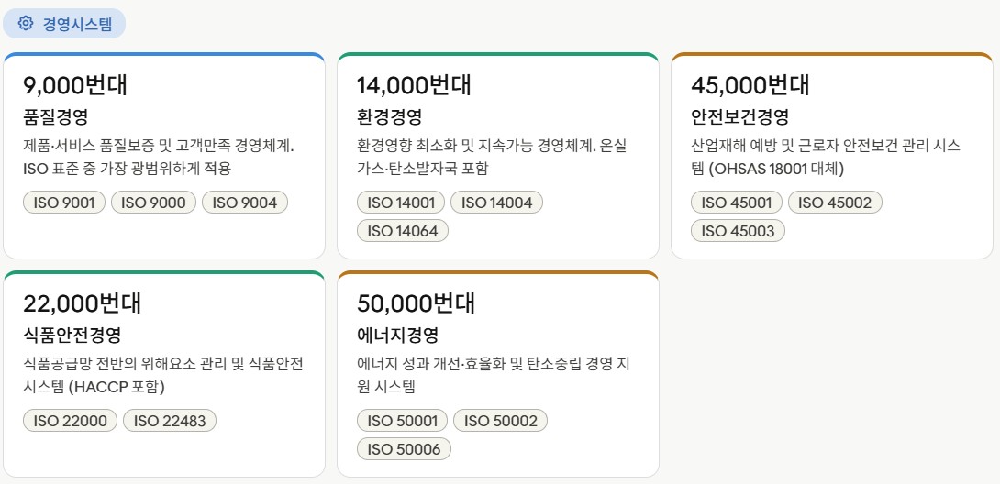
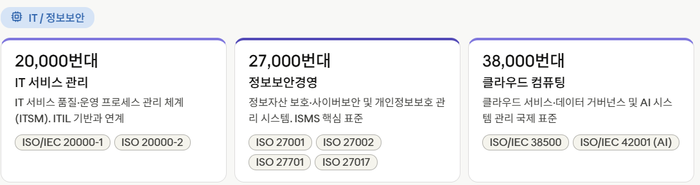
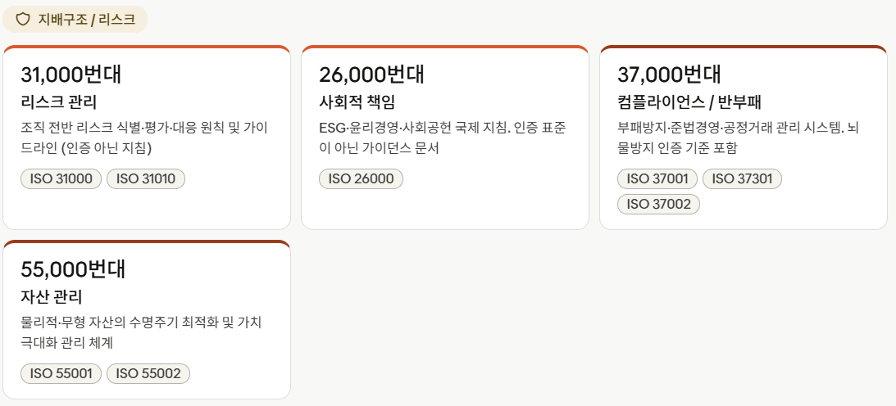
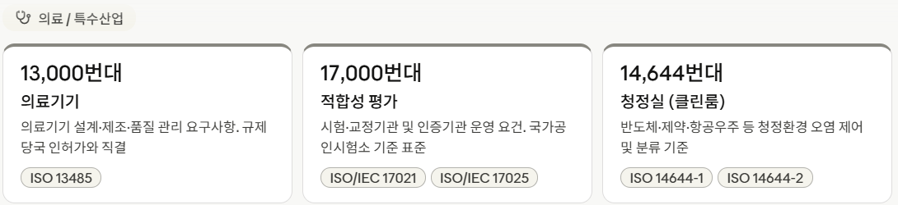
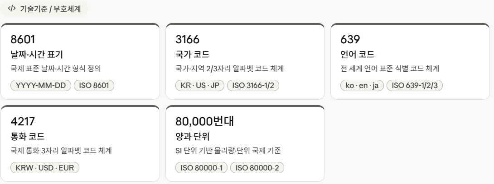
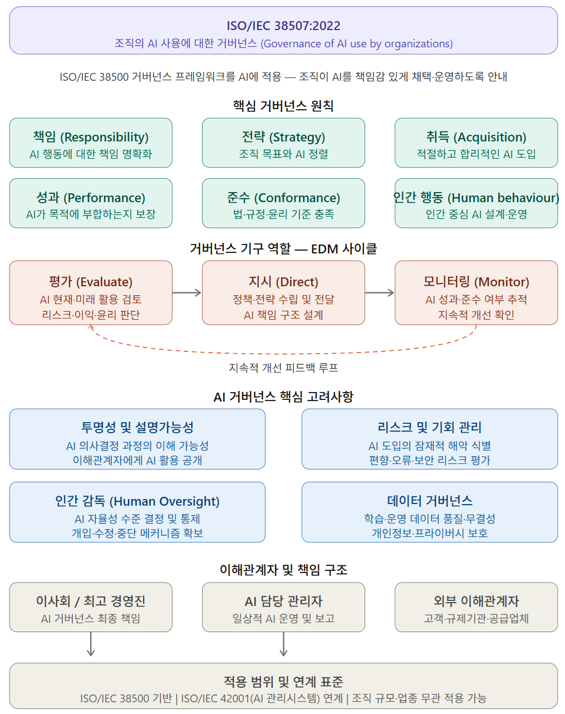
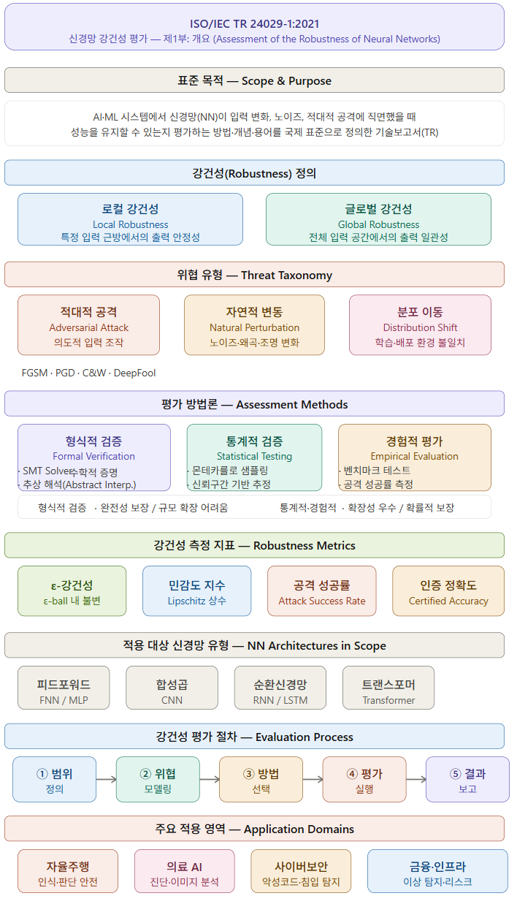
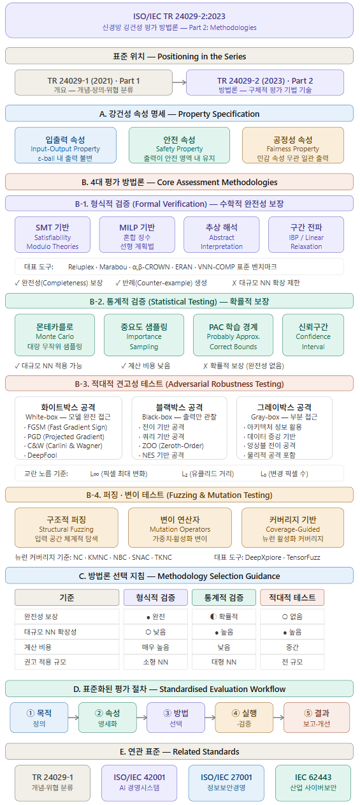

 

 

 

 

 

(ver1)

	1. 준비 단계 : ISO/IEC 22989 (개념 및 용어) 
                  ISO/IEC 23053 (ML 프레임워크)
	2. 방향 설정 : ISO/IEC 38507 (AI 거버넌스)
	3. 시스템 구축 : ISO/IEC 42001 (AI 경영시스템) 
                    ISO/IEC 25059 (AI 시스템 품질 모델)
	4. 실행 및 관리 : ISO/IEC 5259 (데이터 품질)
                     ISO/IEC 23894 (리스크 관리)
                     ISO/IEC 27090/27091 (정보 보호)
	5. 검증 및 개선 : ISO/IEC 24029 (분석적 평가)
                     ISO/IEC 24028 (신뢰성 편향)

(ver2)

	 [1] 준비 단계 (Preparatory)
	 [1-1] ISO/IEC 22989 (개념 및 용어) : 2022
	 [1-2] ISO/IEC 23053 (ML 포레임워크) : 2022

	 [2] 방향 설정 (Governance & Direction)
	 [2-1] ISO/IEC 38507 (AI 거버넌스 - 임원진 지침) : 2022

	 [3] 시스템 구축 (System Development)
	 [3-1] ISO/IEC 42001 (AI 관리시스템) : 2023
	 [3-2] ISO/IEC 42002 (AI 관리시스템 - 요구사항 추가 상세) : 2024
	 [3-3] ISO/IEC 42003 (AI 관리시스템 - 지침) : 2024
	 [3-4] ISO/IEC 42004 (AI 생명주기 프로세스) : 2023

	 [4] 위험·영향 평가 (Risk & Impact Assessment)
	 [4-1] ISO/IEC 23894 (위험 관리 지침) : 2023
	 [4-2] ISO/IEC 42005 (AI 시스템 영향평가) : 2025

	 [5] 감시·평가 (Monitoring & Assurance)
	 [5-1] ISO/IEC 27090 (정보 보호) : 2024
	 [5-2] ISO/IEC 27091 (정보 보호 - AI 시스템) : 2024
	 [5-3] ISO/IEC 25059 (AI 시스템 품질 모델) : 2023

	 [6] 감사·인증 (Audit & Certification)
	 [6-1] ISO/IEC 42006 (AIMS 감사 및 인증 기관 요구사항) : 2025
	 [6-2] ISO/IEC 42007 (AI 시스템 적합성 평가 프레임워크) : 2024
	 [6-3] ISO/IEC 42008 (AI 시스템 평가 및 대시보드) : 2026~2027
	 [6-4] ISO/IEC 42009 (AI 윤리 지침) : 2026~2027
	 [6-5] ISO/IEC 42010 (AI 시스템 설명가능성(XAI) 지침) 2026~2027

(ver3)

	[1] 개념·기술적 기초(Concepts & Technical Foundations)
	[1-1] ISO/IEC 22989:2022 인공지능 개념 및 용어
	[1-2] ISO/IEC 23053:2022 머신러닝 기반 AI 시스템 프레임워크
	[1-3] ISO/IEC 38507:2022 AI 사용에 대한 조직 거버넌스
	[1-4] ISO/IEC/IEEE 42010:2022 시스템·소프트웨어 공학 — 아키텍처 기술
	[1-5] ISO/IEC TR 24027:2021 AI 시스템 및 AI 의사결정의 편향
	[1-6] ISO/IEC TR 24028:2020 AI 신뢰성 개요
	[1-7] ISO/IEC TR 24029-1:2021 신경망 강건성 평가 개요
	[1-8] ISO/IEC TR 24029-2:2023 신경망 강건성 평가 방법론
	[1-9] ISO/IEC TR 24368:2022 AI 시스템의 윤리적·사회적 쟁점 개요
	[1-10] ISO/IEC TR 24030:2021 AI 유스케이스 및 애플리케이션

	[2] 시스템 구축(System Development)
	[2-1] ISO/IEC 42001:2023 AI 관리시스템 요구사항
	[2-2] ISO/IEC 42002:2024 AIMS 요구사항 적용 지침
	[2-3] ISO/IEC 42003:2024 AIMS 조직 구현 지침
	[2-4] ISO/IEC 8183:2023 AI 데이터 생명주기 프레임워크
	[2-5] ISO/IEC 5259-1:2023 데이터 품질과 ML 기반 — 개요, 용어 및 예시
	[2-6] ISO/IEC 5259-2:2024 데이터 품질 측정 지표
	[2-7] ISO/IEC 5259-3:2024 데이터 품질 요구사항 및 평가
	[2-8] ISO/IEC 5259-4:2024 데이터 품질 — 프로세스 프레임워크
	[2-9] ISO/IEC 5259-5:2025 데이터 품질 거버넌스 프레임워크
	[2-10] ISO/IEC 5338:2023 AI 시스템 생명주기 프로세스
	
	[3] 위험·품질 관리(Risk & Quality Management)
	[3-1] ISO/IEC 23894:2023 AI 위험 관리
	[3-2] ISO/IEC 27090:2025 AI 사이버보안
	[3-3] ISO/IEC 27091:2024 AI 시스템 특화 보안·개인정보보호 통제
	[3-4] ISO/IEC 25010:2011 기존 품질 모델, AI 품질의 기반
	[3-5] ISO/IEC 25059:2023 AI 시스템 품질 모델
	[3-6] ISO/IEC 25704:AWI AI 개발·운영 프로세스 능력 평가 모델
	[3-7] ISO/IEC TS 4213:2022 머신러닝 분류 성능 평가
	[3-8] ISO/IEC TS 5469:2024 인공지능 시스템의 기능 안전

	[4] 감사·인증·규정준수(Audit, Certification & Compliance)
	[4-1] ISO/IEC 42005:2025 AI 시스템 영향 평가
	[4-2] ISO/IEC 42006:2025 AI 관리시스템 — 감사 및 인증을 제공하는 기관에 대한 요구사항
	[4-3] ISO/IEC 42007:2024 AI 시스템 적합성 평가 프레임워크
	[4-4] ISO/IEC 42008:예정 AI 시스템 평가 결과 및 대시보드
	[4-5] ISO/IEC CD TS 22443:예정 AI 사회적·윤리적 쟁점 해결 지침
	[4-6] ISO/IEC TS 6254:2025 ML 설명가능성 및 해석가능성의 목표와 접근 방법

	[5] 도메인별 AI 표준 (Domain‑specific AI Standards)
	로봇공학(Robotics)
	[5-1] ISO 8373:2021 로봇 및 로봇 장치 — 용어
	[5-2] ISO 13482:2014 개인 서비스 로봇 안전 요구사항
	지능형 교통 시스템
	[5-3] ISO 21217:2020 지능형 교통 시스템 아키텍처
	[5-4] ISO 23150:2023 차량–외부 장치 간 데이터 통신
	보건의료(Health Informatics)
	[5-5] ISO 23903:2021 보건의료 정보 상호운용성·통합 참조 아키텍처
	[5-6] ISO/TR 24291:2021 보건의료 정보학 — 디지털 헬스에서의 머신러닝 적용
	제조 및 스마트 팩토리(Manufacturing & Industry 4.0)
	[5-7] ISO 23247-1:2021 제조용 디지털 트윈 프레임워크
	[5-8] ISO 22400-1:2018 제조 운영 성과 지표 — Part 1
	[5-9] ISO 22400-2:2018 제조 운영 성과 지표 — Part 2
	빅데이터(Big Data)
	[5-10] ISO/IEC 20546:2019 빅데이터 개요 및 용어
	[5-11] ISO/IEC TR 20547-1:2020 빅데이터 참조 아키텍처 — Part 1: 프레임워크 및 적용
	[5-12] ISO/IEC 20547-3:2020 빅데이터 참조 아키텍처 — Part 3: 참조 아키텍처

---

## ISO/IEC 국제표준

	1. 경영시스템
	2. IT
		2.1 AI
	3. 지배구조/리스크
	4. 산업군
		4.1 의료/건강
		4.2 에너지/환경
		4.3 교통/운송
		4.4 제조/소재
		4.5 건설/인프라
		4.6 소비자/생활
	5. 기술기준/부호체계
	
---

<!--

 

 

 

 

 
-->

## ISO/IEC 국제표준 종합 분류

|대분류|중분류|내용|주요 번호대|
|---|---|---|---|
|1. 경영시스템|품질경영|제품·서비스 품질경영 및 고객만족 중심 경영체계|9000번대|
||환경경영|환경영향 관리·지속가능성·온실가스·탄소발자국|14000번대|
||안전보건경영|산업안전·근로자 건강 보호 (OHSAS 대체)|45000번대|
||식품안전경영|식품공급망 위해요소 관리(HACCP 포함)|22000번대|
||에너지경영|에너지 효율·성과·탄소중립 경영|50000번대|
||연속성·회복탄력성|재난·위기 대응 및 조직 회복탄력성|22300번대|
||혁신경영|조직 혁신·아이디어·R&D 경영체계|56000번대|
|2. IT|IT 서비스 관리|IT 서비스 품질·운영·개선 체계(ITSM)|20000번대|
||정보보안·프라이버시|정보보안·사이버보안·개인정보 보호(ISMS/PIMS)|27000번대|
||소프트웨어·시스템 공학|SW·시스템 생명주기·아키텍처·프로세스|12000·15000·42010|
||소프트웨어 품질|제품·시스템 품질모델(SQuaRE)|25000번대|
||프로세스 성숙도|개발·운영 프로세스 역량 평가(CMMI 계열)|33000번대|
||클라우드 컴퓨팅|클라우드 개념·아키텍처·SLA·보안|17000·19000번대|
||데이터·상호운용성|데이터 교환·참조모델·메타데이터|11000·23000 일부|
|**AI**|**AI 개념·용어**|**AI 정의·용어·시스템 개념**|**22900번대**|
||**AI 시스템 프레임워크**|**ML 기반 AI 시스템 구조·생명주기**|**23000번대**|
||**신뢰할 수 있는 AI**|**편향·윤리·신뢰성·강건성·유스케이스**|**24000번대**|
||**AI 경영시스템**|**조직 차원의 AI 관리·책임·지속적 개선(AIMS)**|**42000번대**|
|3. 지배구조/리스크|IT·AI 거버넌스|이사회·경영진 관점 IT·AI 사용 책임·의사결정|38000번대|
||리스크 관리|조직 전반 리스크 관리 원칙·기법|31000번대|
||컴플라이언스·반부패|준법경영·반부패·내부고발 관리|37000번대|
||사회적 책임|ESG·윤리·사회적 책임 가이던스|26000번대|
||자산 관리|물리·무형 자산 수명주기 관리|55000번대|
||프로젝트·프로그램·포트폴리오 관리|21000번대|
||서비스·운영 우수성|조직 운영·성과·지속 개선|9004·41000|
|4. 산업군|의료기기|의료기기 품질·위험·SW 규제 대응|13000번대|
||적합성 평가|시험·교정·인증기관 운영 요건|17000번대|
||제조·로봇·자동화|산업용 로봇·제조 안전·스마트팩토리|10000·10218·299|
||교통·모빌리티|자동차·철도·항공·ITS·자율주행|20000·26000·TC204|
||에너지·환경 기술|신재생·수소·탄소포집·환경측정|14000·ISO/TC 다수|
||건설·인프라|BIM·시설관리·구조·에너지성능|19650·41000|
|5. 기술기준/부호체계|날짜·시간|국제 날짜·시간 표기|8601|
||국가·지역 코드|국가·지역 식별 코드|3166|
||언어 코드|언어 식별 코드|639|
||통화 코드|통화 식별 코드|4217|
||문자·문자집합|문자 코드·스크립트|15924|
||양과 단위|SI 기반 물리량·단위 체계|80000번대|
||통계·측정|통계 방법·측정 정확도|35000·57000|
||그래픽·안전표시|안전표지·기호·그래픽|7000·7010|
||용어·문서화|용어 정의·문서 작성 원칙|704·1087|

## ISO/IEC 국제표준 상세 분류

### 1. 경영시스템

| 분류 | 국제표준 |
|---|---|
| **품질경영** (TC 176) 제품·서비스 품질경영 및 고객만족 중심 경영체계 | ISO 9001:2015 품질경영시스템 요구사항 ISO 9000:2015 기본사항 및 어휘 ISO 9004:2018 조직의 지속적 성공 ISO/TS 9002 구현 지침 |
| **환경경영** (TC 207) 환경영향 관리·지속가능성·온실가스·탄소발자국 | ISO 14001:2015 환경경영시스템 ISO 14004:2016 구현 지침 ISO 14064-1 온실가스 정량화 ISO 14067 탄소발자국 ISO 14046 물발자국 |
| **안전보건경영** (TC 283) 산업안전·근로자 건강 보호 (OHSAS 대체) | ISO 45001:2018 안전보건경영시스템 ISO 45002 구현 지침 ISO 45003 심리적 건강·안전 |
| **식품안전경영** (TC 34) 식품공급망 위해요소 관리(HACCP 포함) | ISO 22000:2018 식품안전경영시스템 ISO/TS 22002 선행요건 프로그램 시리즈 ISO 22483 관광숙박업 식품안전 |
| **에너지경영** (TC 301) 에너지 효율·성과·탄소중립 경영 | ISO 50001:2018 에너지경영시스템 ISO 50002 에너지감사 ISO 50006 에너지 기준선·지표 |
| **연속성·회복탄력성** (TC 292) 재난·위기 대응 및 조직 회복탄력성 | ISO 22301:2019 사업연속성관리 ISO 22313 구현 지침 ISO 22316 조직 회복탄력성 |
| **교통안전경영** 도로교통 안전 중심 경영 | ISO 39001:2012 도로교통안전경영시스템 |
| **혁신경영** (TC 279) 조직 혁신·아이디어·R&D 경영체계 | ISO 56001:2024 혁신경영시스템 ISO 56002:2019 혁신경영 구현 지침 ISO 56003:2019 혁신 파트너십 도구 |

### 2. IT

| 분류 | 국제표준 |
|---|---|
| **IT 서비스 관리** (JTC 1/SC 40) IT 서비스 품질·운영·개선 체계(ITSM) | ISO/IEC 20000-1:2018 IT 서비스관리시스템 ISO/IEC 20000-2 서비스관리 적용 지침 ISO/IEC 20000-3 범위 정의 지침 |
| **정보보안·프라이버시** (JTC 1/SC 27) 정보보안·사이버보안·개인정보 보호(ISMS/PIMS) | ISO/IEC 27001:2022 정보보호 관리체계(ISMS) 요구사항 ISO/IEC 27002:2022 정보보안 통제 ISO/IEC 27005:2022 정보보안 리스크 관리 ISO/IEC 27017:2015 클라우드 보안 통제 ISO/IEC 27701:2019 개인정보보호 확장(PIMS) |
| **소프트웨어·시스템 공학** (JTC 1/SC 7) SW·시스템 생명주기·아키텍처·프로세스 | ISO/IEC 12207:2017 소프트웨어 생명주기 ISO/IEC 15288:2023 시스템 생명주기 ISO/IEC 42010:2011 아키텍처 설명 ISO/IEC 33000 프로세스 평가 |
| **소프트웨어 품질** (JTC 1/SC 7) 제품·시스템 품질모델(SQuaRE) | ISO/IEC 25000:2014 SQuaRE 개요·메타모델 ISO/IEC 25010 제품 품질 모델 ISO/IEC 25020 측정 참조 모델 ISO/IEC 25040 평가 프레임워크 |
| **프로세스 성숙도** (JTC 1/SC 7) 개발·운영 프로세스 역량 평가(CMMI 계열) | ISO/IEC 33001 프로세스 평가 개념·모델 ISO/IEC 33002 프로세스 수행 평가 ISO/IEC 33003 프로세스 역량 평가 ISO/IEC 33004 프로세스 평가 이행 지침 |
| **클라우드 컴퓨팅** (JTC 1/SC 38) 클라우드 개념·아키텍처·SLA·보안 | ISO/IEC 17788:2014 클라우드 개요·용어 ISO/IEC 17789 클라우드 참조 아키텍처 ISO/IEC 19086:2016 클라우드 SLA 프레임워크 ISO/IEC 27017:2015 클라우드 보안 통제 |
| **데이터·상호운용성** (JTC 1/SC 32) 데이터 교환·참조모델·메타데이터 | ISO/IEC 11179 시리즈 메타데이터 ISO/IEC 19115 지리정보 메타데이터 ISO/IEC 23000 미디어기술 시리즈 ISO/IEC 23091 플러그인 아키텍처 |
| **인간공학·UX** (TC 159) 사용자 중심 설계·접근성·사용성 | ISO 9241-210:2019 인간중심설계 과정 ISO 9241-11:2018 사용성 정의·측정 ISO 9241-171:2008 소프트웨어 접근성 ISO/IEC 40500 웹 접근성(WCAG) |

---

### 2.1 AI

| 분류 | 국제표준 |
|---|---|
| **AI 개념·용어** (JTC 1/SC 42) AI 정의·용어·시스템 개념 | ISO/IEC 22989:2022 AI 개념·어휘 ISO/IEC TR 24028:2020 AI 신뢰성 ISO/IEC 42010:2011 AI 시스템 아키텍처 설명 |
| **AI 시스템 프레임워크** (JTC 1/SC 42) ML 기반 AI 시스템 구조·생명주기 | ISO/IEC 23053:2022 머신러닝 기반 AI 시스템 프레임워크 ISO/IEC 23894:2023 AI 위험 관리 ISO/IEC 42010 AI 시스템 아키텍처 설명 |
| **신뢰할 수 있는 AI** (JTC 1/SC 42) 편향·윤리·신뢰성·강건성·유스케이스 | ISO/IEC 24027:2023 AI 시스템 편향(Bias) 영향 평가 ISO/IEC TR 24028:2020 AI 신뢰성 ISO/IEC TS 42001:2023 AI 관리시스템 신뢰성 ISO/IEC 42010:2011 AI 시스템 설명 가능성 |
| **AI 경영시스템** (JTC 1/SC 42) 조직 차원의 AI 관리·책임·지속적 개선(AIMS) | ISO/IEC 42001:2023 AI 관리시스템(AIMS) 요구사항 ISO/IEC TS 42002:2024 AI 관리시스템 구현 지침 ISO/IEC 42003 AI 관리시스템 감사 가이드 ISO/IEC 42004 AI 관리시스템 거버넌스 지침 |
| **AI 거버넌스** (JTC 1/SC 42) 이사회·경영진 관점 AI 사용 책임·의사결정 | ISO/IEC 38507:2022 AI 사용에 대한 조직 거버넌스 ISO/IEC 42001:2023 AI 관리시스템 (거버넌스 포함) ISO/IEC TS 24028:2024 AI 시스템 신뢰성 가이드 |

### 3. 지배구조 / 리스크

| 분류 | 국제표준 |
|---|---|
| **IT·AI 거버넌스** (JTC 1/SC 40, TC 287) 이사회·경영진 관점 IT·AI 사용 책임·의사결정 | ISO/IEC 38500:2015 조직을 위한 IT 거버넌스 ISO/IEC 38505:2017 IT 거버넌스 감시 ISO/IEC 38507:2022 AI 사용에 대한 조직 거버넌스 |
| **리스크 관리** (TC 262) 조직 전반 리스크 관리 원칙·기법 | ISO 31000:2018 리스크관리 원칙·지침 ISO 31010:2019 리스크 평가 기법 ISO 31022:2020 법률 리스크 관리 |
| **컴플라이언스·반부패** (TC 309) 준법경영·반부패·내부고발 관리 | ISO 37001:2016 반부패경영시스템 ISO 37301:2021 준법경영시스템(Compliance Management) ISO 37002:2021 내부고발 관리 시스템 ISO 37000:2021 조직 지배구조 지침 |
| **사회적 책임** (TC 260) ESG·윤리·사회적 책임 가이던스 | ISO 26000:2010 사회적 책임 지침 (ESG, 인증 아님) ISO 26001:2021 안티코러럽션 ISO 26010 지속가능 발전 지침 |
| **자산 관리** (TC 239) 물리·무형 자산 수명주기 관리 | ISO 55001:2014 자산관리시스템 ISO 55000:2014 자산관리 개요·원칙·용어 ISO 55002:2018 자산관리 구현 지침 |
| **혁신경영·프로젝트 관리** (TC 279, TC 258) 조직 혁신·R&D·프로젝트·프로그램·포트폴리오 관리 | ISO 56001:2024 혁신경영시스템 ISO 21502:2020 프로젝트 관리 ISO 21503:2017 프로그램 관리 ISO 21504:2015 포트폴리오 관리 |
| **인적자원관리** (TC 260) 조직 인재 관리·다양성·포용성 | ISO 30415:2021 다양성·포용성 ISO 30405:2016 채용 지침 ISO 30414:2018 HR 공시 지침 |
| **서비스·운영 우수성** (TC 176, TC 287) 조직 운영·성과·지속 개선 | ISO 9004:2018 조직의 지속적 성공 ISO/IEC 20000-1 IT 서비스관리시스템 ISO 41001:2018 시설관리시스템 |

### 4.1 의료 / 건강 (Healthcare)

| 분류 | 국제표준 |
|---|---|
| **의료기기** (TC 210) 의료기기 품질·위험·SW 규제 대응 | ISO 13485:2016 의료기기 품질경영시스템 ISO 14971:2019 의료기기 위험관리 ISO 10993 시리즈 생물학적 평가 IEC 62304:2015 의료기기 소프트웨어 생명주기 |
| **임상검사** (TC 212) 의료실험실 인정·현장검사·측정 추적성 | ISO 15189:2022 의료실험실 인정 ISO 22870:2016 현장검사(POCT) ISO 17511:2003 임상검사 교정·측정불확도 추적성 |
| **청정실** (TC 209) 청정실 분류·모니터링·설계·시공 | ISO 14644-1:2015 청정실 분류 ISO 14644-2:2015 모니터링·운영 ISO 14644-4:2001 설계·시공 및 시운전 |
| **멸균·소독** (TC 198) 산화에틸렌·방사선·습열 멸균 기술 | ISO 11135:2014 산화에틸렌 멸균 ISO 11137:2006 방사선 멸균 ISO 17665:2006 습열 멸균(고압증기) |
| **전통의학** (TC 249) 한의학·침술·한약재 안전·품질 | ISO 20498:2017 한의학 용어 ISO 23958:2021 침술 안전성 ISO 18662:2016 한약재 품질(중약) |
| **보건의료정보** (TC 215) 전자의료기록·개인건강기록 정보모델 | ISO/HL7 10781:2015 전자의료기록(EHR) 기능모델 ISO/TR 14292:2008 개인건강기록(PHR) 프레임워크 |

### 4.2 에너지 / 환경 (Energy & Environment)

| 분류 | 국제표준 |
|---|---|
| **신재생에너지** (TC 180) 태양에너지·태양전지 측정·품질 | ISO 9060:2018 태양에너지 복사 계측 ISO 15387:2017 우주용 태양전지 ISO 16348:2018 태양에너지 어휘·개념 |
| **수소기술** (TC 197) 수소 연료 품질·충전소·감지기 | ISO 14687:2019 수소 연료 품질 ISO 19880-1:2018 수소충전소 일반 요구사항 ISO 26142:2010 수소감지기 |
| **탄소포집·저장** (TC 265) CO₂ 저장장치·측정·용어 | ISO 27914:2016 CO₂ 저장장치 요구사항 ISO 27916:2016 저장량 측정 방법 ISO 27917:2015 CCS 어휘·개념 |
| **수질 관리** (TC 147) 물 샘플링·COD·탁도·pH 측정 | ISO 5667 시리즈 물 샘플링 전략 ISO 6060 COD(화학적 산소 요구량) 측정 ISO 7027:2016 수질 탁도 측정 ISO 10523:2008 pH 측정 |
| **대기질** (TC 146) 실내 공기질·입자상물질·질량농도 | ISO 16000 시리즈 실내 공기질 측정 ISO 10473:2000 입자상물질(PM) 측정 ISO 14956:2012 대기중 질량농도 측정 |
| **토양·폐기물** (TC 190) 토양 샘플링·원소 추출·생태독성 | ISO 10381 시리즈 토양 샘플링 전략 ISO 11466:2015 토양 원소 추출 방법 ISO 15799:2003 토양 생태독성 평가 |
| **고체 바이오연료** (TC 238) 연료 규격·용어·수분 측정 | ISO 17225 시리즈 바이오연료 규격 ISO 16559:2014 바이오연료 용어·정의 ISO 18134:2015 바이오연료 수분 함량 측정 |

### 4.3 교통 / 운송 (Transportation & Mobility)

| 분류 | 국제표준 |
|---|---|
| **자동차** (TC 22) 자동차 기능안전·SOTIF·사이버보안·진단통신 | ISO 26262:2018 자동차 기능안전(ASIL) ISO 21448:2022 SOTIF(의도된 기능 안전) ISO/SAE 21434:2021 도로차량 사이버보안 ISO 15765:2016 CAN 기반 OBD 진단통신 |
| **항공우주** (TC 20) 항공우주 품질경영·지상지원장비·비행역학 | AS 9100 Rev D 항공우주 품질경영 ISO 16082:2007 항공우주 지상지원장비(GSE) 안전 ISO 1151:2018 항공우주 비행역학 용어·기호 |
| **선박·해양** (TC 8) 해양 화재·폭발 안전·LNG 선박연료 | ISO 13702:2015 해양 화재·폭발 안전 ISO 20519:2017 선박 LNG 연료 공급 시스템 ISO 8468:2007 선박 교량 경보 시스템 관리 |
| **철도** (TC 269) 철도 품질경영(IRIS)·신뢰성(RAMS) | ISO 22163:2023 철도 품질경영시스템(IRIS) IEC 62278:2002 철도 시스템 신뢰성·가용성·유지보수성·안전성(RAMS) EN 50126:2017 RAMS 표준 적용 가이드 |
| **지능형교통** (TC 204) ITS 프레임워크·차량 원격측정·CALM 통신 | ISO 20077:2012 ITS 전체 프레임워크 ISO 15638 시리즈 차량 원격측정 ISO 21217:2010 CALM(통신·액세스·계층·관리) 아키텍처 |
| **물류·공급망** (TC 154) 공급망 보안경영·보안 모범사례 | ISO 28000:2022 공급망 보안경영시스템 ISO 28001:2007 공급망 보안 모범사례 ISO 9001 물류산업 적용 |

### 4.4 제조 / 소재 (Manufacturing & Materials)

| 분류 | 국제표준 |
|---|---|
| **철강·금속** (TC 17) 금속 인장시험·충격시험·용접절차·주조 | ISO 6892 시리즈 금속 인장특성 ISO 148:2016 금속 샤르피 충격시험 ISO 15614:2004 금속 용접절차 인정 시험 ISO 9444:2008 연속주조 스테인리스강 |
| **플라스틱·폴리머** (TC 61) 인장특성·용융유량지수·열변형·충격 | ISO 527 시리즈 플라스틱 인장특성 ISO 1133:2011 MFR/MVR(용융유량지수) 측정 ISO 75:2013 열변형온도(HDT) 측정 ISO 179:2016 플라스틱 샤르피 충격시험 |
| **나노기술** (TC 229) 나노기술 어휘·나노물질 분류·청정실 | ISO 80004 시리즈 나노기술 어휘 ISO/TR 11360:2014 나노물질 분류 ISO 14644-14:2016 나노입자 청정실 모니터링 |
| **적층제조 / 3D프린팅** (TC 261) AM 용어·설계 요구·금속 분말·시험법 | ISO/ASTM 52900:2021 적층제조(AM) 용어정의 ISO/ASTM 52910:2018 AM 설계 및 개발 요구사항 ISO/ASTM 52904:2016 금속 분말 규격 ISO/ASTM 52941:2023 금속 AM 시험법 |
| **용접·접합** (TC 44) 용접 품질 요구·용접사 자격·관리·절차 | ISO 3834 시리즈 용접 품질 요구사항 ISO 9606:2021 용접사 자격인증 ISO 14731:2019 용접 감시 및 관리 책임 ISO 15607:2003 금속재료 용접절차 시험 |
| **로보틱스** (TC 299) 산업용 로봇·협동로봇·개인보조 로봇 | ISO 10218-1:2011 산업용 로봇 안전 ISO/TS 15066:2016 협동로봇 안전성 요구사항 ISO 13482:2014 개인보조 로봇 안전 요구사항 ISO 18646:2020 서비스 로봇 성능평가 |

### 4.5 건설 / 인프라 (Construction & Infrastructure)

| 분류 | 국제표준 |
|---|---|
| **건설 일반** (TC 59) 건설 어휘·BIM·정보관리·시설관리 | ISO 6707:1989 건설 어휘 ISO 16739:2013 IFC(Industry Foundation Classes) 건설정보모델(BIM) ISO 19650 시리즈 BIM 정보관리 ISO 41001:2018 시설관리시스템 |
| **구조설계** (TC 98) 구조물 신뢰성·기존 구조물 평가·설계 | ISO 2394:2015 구조물 신뢰성 설계 원칙 ISO 13822:2010 기존 구조물 평가 ISO 22111:2007 기존 구조물 재설계 ISO 13786:2015 건축요소 열특성 계산 |
| **소방·방재** (TC 92) 화재 어휘·감지·경보·스프링클러 | ISO 13943:2017 화재 어휘·개념 ISO 7240 시리즈 화재감지 및 경보 장치 ISO 15371:2017 스프링클러 시스템 설계·설치 |
| **건물 에너지효율** (TC 163) 건물 에너지성능·열교 계산·사용량 계산 | ISO 52000 시리즈 건물 에너지성능 ISO 10211:2017 열교 계산 방법 ISO 13790:2008 에너지 사용 계산 방법 |
| **시설관리** (TC 267) 시설관리시스템·용어·아웃소싱 | ISO 41001:2018 시설관리시스템 ISO 41011:2017 시설관리 용어·정의 ISO 41012:2018 아웃소싱 지침 |

### 4.6 소비자 / 생활 (Consumer & Lifestyle)

| 분류 | 국제표준 |
|---|---|
| **식품·농업** (TC 34 / TC 23) 살모넬라 검출·미생물 검사·추적성 | ISO 6579:2017 살모넬라 검출 방법 ISO 7218:2007 미생물 검사 일반원칙 및 방법 ISO 22005:2007 식품 추적성 ISO 11290:2017 리스테리아 검출 및 계수 방법 |
| **섬유·의류** (TC 38) 색견뢰도·표준 대기 조건·직물 질량 | ISO 105 시리즈 색견뢰도 테스트 ISO 139:2005 표준 대기 조건 ISO 3801:1977 직물 질량 측정 방법 |
| **스포츠·레저** (TC 83) 체력단련기기·어드벤처 관광 안전·바닥재 | ISO 20957 시리즈 체력단련기기 ISO 21101:2014 어드벤처 관광 안전 관리 ISO 13287:2004 스포츠바닥재 미끄럼 저항성 |
| **개인보호구** (TC 94) 방화복·화학물질 보호장갑·안전화·혈액 침투 | ISO 11612:2015 방화복 요구사항 ISO 374:2016 화학물질 보호장갑 ISO 20345:2022 안전화 요구사항 ISO 16603:2013 혈액 침투 차단 성능 |
| **완구·어린이 안전** (TC 181) 물리·기계적 위험·인화성·원소 이행 | ISO 8124-1:2018 완구 물리·기계적 위험 ISO 8124-2:2014 완구 인화성 ISO 8124-3:2020 완구 특정 원소 이행 |
| **관광·서비스** (TC 228) 레크리에이션 다이빙·어드벤처 관광·승마관광 | ISO 13289:2000 레크리에이션 스쿠버 다이빙 ISO 21101:2014 어드벤처 관광경영시스템 ISO 17680:2010 승마관광 서비스 |

### 5. 기술기준 / 부호체계 (Technical Specifications & Code Systems)

| 분류 | 국제표준 |
|---|---|
| **날짜·시간** 국제 날짜·시간 표기 | ISO 8601:2019 날짜·시간 표기 (YYYY-MM-DD / T / Z 형식) ISO 8601-2:2019 날짜·시간 확장 표기 |
| **부호·코드 체계** 국가·지역·언어·통화·문자·음반 코드 | ISO 3166:2020 국가 코드 (KR·US·JP 등) ISO 639:2002 언어 코드 (ko·en·ja 등) ISO 4217:2021 통화 코드 (KRW·USD·EUR) ISO 15924:2018 문자 코드 (Hang·Latn 등) ISO 3901:2008 음반 ISRC 코드 |
| **양과 단위** (ISO 80000 시리즈) SI 기반 물리량·단위 체계 | ISO 80000-1:2009 일반 원칙·협약 ISO 80000-2:2019 수학 ISO 80000-3:2019 공간·시간 ISO 80000-4:2019 역학 및 열 ISO 80000-9:2009 물리화학·분자물리 ISO 80000-13:2008 정보과학·기술 |
| **통계적 방법** (TC 69) 통계 어휘·샘플링·측정 정확도 | ISO 3534 시리즈 통계 어휘·방법 ISO 2859 시리즈 계수형(속성) 샘플링 ISO 3951 시리즈 계량형 샘플링 ISO 5725 시리즈 측정 정확도(정밀도·정확성) |
| **그래픽 기호** (TC 145) 장비용 기호·안전 표지색·표식 | ISO 7000:2014 장비용 그래픽 기호 및 기호 도서 ISO 3864 시리즈 안전 표지색·표식 및 기호 ISO 7010:2019 안전 표지판 도형·크기·배치 |
| **문서·용어** (TC 37) 용어작업 원칙·조회·어휘 | ISO 704:2009 용어작업 원칙 및 방법 ISO 860:2007 용어 조회 원칙 ISO 1087:2019 용어학 및 용어 데이터베이스 어휘 |

---

## ISO/IEC 국제표준 유형
**PAS (Publicly Available Specification) :** 빠른 공개를 위한 임시 표준 
**TR (Technical Report) :** 특정 기술이나 주제에 대한 정보 제공 목적의 기술 보고서 
**TS (Technical Specification) :** 국제표준으로 발전하기 전 단계의 문서로, 합의는 되었지만 아직 충분히 성숙하지 않은 기술 기술 명세서 
**IS (International Standard) :** 국제적으로 합의된 공식 표준으로, 가장 권위 있고 완성된 형태의 국제표준 
 

## ISO/IEC 국제표준 생성절차(3~5년 소요) : ① AWI → ② WD → ③ CD → ④ DIS → ⑤ FDIS → ⑥ IS

**① AWI (Approved / Active Work Item)** : TC/SC 투표로 작업 항목 공식 등록 
새 표준 과제가 공식 승인된 상태, 아직 문서 초안조차 없는 경우도 있음 
표준의 “탄생 선언”, 범위(Scope), 목적, 작업반(WG)만 정의, 중단되면 그대로 사라질 수도 있음 
예) ISO/IEC AWI 25704 → AI 프로세스 평가 표준 (현재 개발 중) 
 
**② WD (Working Draft)** : 전문가 그룹(WG) 내부 초안 작성·수정 반복 
작업반 내부에서 작성 중인 비공개 초안, 기술적 실험·논쟁 단계 
외부 배포 안됨, 내용이 자주 바뀜 
 
**③ CD (Committee Draft)** : 회원국 기술 검토 및 의견 수렴 
위원회 차원의 공식 초안, 각국 전문가들이 본격적으로 코멘트 
기술적 쟁점이 가장 치열한 단계, 부결되면 다시 WD로 돌아갈 수 있음, "아직 합의가 불완전" 
 
**④ DIS (Draft International Standard)** : 전 회원국 공개 투표(75% 찬성 필요) 
국제표준 후보안, 모든 회원국이 투표 
구조와 방향은 거의 확정, 기술적 수정은 제한적, “곧 표준이 될 문서” 
예) ISO/IEC DIS 27090 (AI 사이버보안 표준, 2025년 기준) 
 
**⑤ FDIS (Final Draft International Standard)** : 최종 투표(75% 찬성 필요), 기술 내용 변경 불가 
최종 투표 단계 초안, 내용 수정 거의 불가 
사실상 IS 확정 직전, 형식·문구만 손보는 수준 
 
**⑥ IS (International Standard)** : FDIS 투표를 통과한 문서가 ISO 사무국에 의해 공식 출판되는 최종 단계 
정식 국제표준, 가장 중요한 단계이며 5년주기로 검 
법·정책·인증·조직 적용의 기준, 시험, 강의, 실무에서 가장 많이 사용 
 

---

## ISO/IEC 조직 구성

 

**<ins>JTC 1(Joint Technical Committee 1, 공동기술위원회)<ins>** 각각 독립된 국제표준화기구인 ISO와 IEC에서 정보기술 분야의 공동기술위원회 
ISO와 IEC가 IT 분야의 중복 작업을 피하기 위해 1987년 설립. 단일 위원회이지만 두 기구가 공동으로 운영하며, 산하에 다수의 SC와 WG 구성 
**<ins>TC (Technical Committee, 기술위원회)</ins>** 특정 기술 분야를 담당하는 최상위 위원회. ISO는 TC 1~350번대, IEC는 TC 1~120번대로 관리 
ISO TMB 또는 IEC SMB의 승인 아래 설립되며, 해당 분야의 표준화 전략을 수립. 예를 들어 ISO/TC 307은 블록체인, IEC/TC 57은 전력 시스템 관리, ISO/IEC JTC 1은 정보기술 전반을 담당 
**<ins>SC (Subcommittee, 소위원회)</ins>** TC 내에서 더 세분화된 전문 분야를 담당. TC의 지휘 아래 독립적으로 표준 개발 가능 
TC가 다루는 분야가 넓을 때, 더 세분화된 전문 영역을 맡아 독립적으로 표준을 개발. 예를 들어 JTC 1/SC 27은 정보보안, JTC 1/SC 42는 인공지능을 담당합니다. SC는 TC에 보고하며, 직접 WG를 산하에 둘 수 있음 
**<ins>WG (Working Group, 작업그룹)</ins>** 실제 표준 문서를 초안부터 작성하는 실무 단위. TC 또는 SC 아래에 설치 
각국 회원기관(한국의 경우 KATS)이 지명한 개인 전문가(Expert)들로 구성되며, 국가 대표가 아닌 개인 자격으로 참여. TC나 SC가 직접 WG를 설치할 수 있음 
**<ins>AG/AHG (Advisory/Ad Hoc Group)</ins>** 특정 이슈에 대한 자문이나 단기 과제를 위해 임시로 구성 
**<ins>PT (Project Team)</ins>** WG처럼 표준을 개발하지만 단일 프로젝트에 집중하는 소규모 팀 

### 소위원회(Subcommittees) : 24개

**SC 2: 부호화된 문자 집합(Coded Character Sets)**  
설립년도: 1987년 (JTC 1 설립시) 
주요 역할: 그래픽 문자 집합의 부호화 및 국제 교환을 위한 표준 개발  
핵심 표준: ISO 646(7비트 부호화 문자 집합), ISO/IEC 10646(유니코드 기반 범용 다중 옥텟 부호화된 문자 집합)  
범위: 문자 부호화, 문자열 정렬, 제어 함수의 부호화 표현 
 
**SC 6: 통신 및 정보 교환(Telecommunications and Information Exchange between Systems)**  
설립년도: 1987년  
주요 역할: 시스템 간 정보 교환 및 통신을 위한 프로토콜 표준 개발  
범위: 물리계층, 데이터링크계층, 네트워크계층, 전송계층 및 상위 계층의 프로토콜과 서비스  
활동: OSI 모델 관련 표준, 통신 프로토콜 및 인터페이스 
 
**SC 7: 소프트웨어 및 시스템 공학(Software and Systems Engineering)**  
설립년도: 1987년  
주요 역할: 소프트웨어 개발 및 시스템 공학의 생명주기, 품질, 문서화 관련 표준 개발  
핵심 표준: ISO/IEC/IEEE 12207(소프트웨어 및 시스템 엔지니어링 생명주기 프로세스)  
범위: 소프트웨어 프로세스, 시스템 공학 방법론, 문서화, 품질관리, 리스크관리  
특징: IT 분야에서 가장 광범위한 표준화 작업 중 하나 
 
**SC 17: 카드 및 개인 식별 보안 장치(Cards and Security Devices for Personal Identification)**  
설립년도: 1987년  
주요 역할: 신분증, 신용카드, IC 카드 등 개인 식별 카드 관련 표준 개발  
범위: 카드의 물리적 특성, 보안, 데이터 인터페이스, 기술 사양  
활동: 스마트 카드, 생체인식 카드, 보안 토큰 표준화 
 
**SC 22: 프로그래밍 언어, 환경 및 시스템 소프트웨어 인터페이스(Programming Languages, their Environments and System Software Interfaces)**  
설립년도: 1987년 (SC 5에서 통합)  
주요 역할: 프로그래밍 언어, 컴파일러, 개발환경 관련 표준 개발 
핵심 표준: COBOL, FORTRAN, C, C++, Ada, Java 등의 언어 표준 및 POSIX(Portable Operating System Interface)  
범위: 언어 정의, 의미론, 라이브러리, 개발 도구 
 
**SC 23: 디지털 기록 미디어(Digitally Recorded Media for Information Interchange and Storage)**   
설립년도: 1987년  
주요 역할: 자기테이프, 광디스크, 플래시 메모리 등 데이터 저장 미디어 표준 개발  
핵심 표준: CD, DVD, Blu-ray, USB 메모리, 자기 테이프 등의 물리적 및 기술적 표준  
범위: 미디어의 용량, 포맷, 데이터 구조, 신뢰성 
 
**SC 24: 컴퓨터 그래픽스, 이미지 처리 및 환경 데이터 표현(Computer Graphics, Image Processing and Environmental Data Representation)**  
설립년도: 1987년  
주요 역할: 그래픽스, 이미지 표준 개발  
핵심 표준: CGM(Computer Graphics Metafile), SVG(Scalable Vector Graphics) 관련 표준  
범위: 그래픽 표현, 이미지 인코딩, 지리정보 데이터 표준 
 
**SC 25: IT 장비 상호 연결(Interconnection of Information Technology Equipment)**  
설립년도: 1989년 (SC 13과 IEC SC 83 통합)  
주요 역할: 컴퓨터, 주변기기, 네트워크 장비 간 물리적 인터페이스 및 연결 표준 개발  
범위: 케이블, 커넥터, 전력 인터페이스, 신호 호환성 
 
**SC 27: 정보보안, 사이버보안 및 개인정보보호(Information Security, Cybersecurity and Privacy Protection)**  
설립년도: 1987년 (초기 SC 20 "암호화 기술"에서 발전)  
주요 역할: 정보보안, 암호, 접근제어, 개인정보보호 관련 표준 개발  
핵심 표준: ISO/IEC 27001(정보보안관리시스템), ISO/IEC 27002(정보보안 구현 가이드), ISO/IEC 27089(사물인터넷 보안)  
범위: 정보보안 정책, 암호화, 인증, 접근제어, 감사, 위험관리  
특징: JTC 1에서 가장 활발한 SC 중 하나 
 
**SC 28: 사무 기기(Office Equipment)**  
설립년도: 1987년  
주요 역할: 프린터, 복합기, 스캐너 등 사무자동화 장비의 기능 및 인터페이스 표준 개발  
범위: 문서 처리, 이미징, 통신 프로토콜, 페이페스 
 
**SC 29: 오디오, 사진, 멀티미디어 및 하이퍼미디어 정보 코딩(Coding of Audio, Picture, Multimedia and Hypermedia Information)**  
설립년도: 1991년 (SC 2에서 분리)  
주요 역할: 미디어 압축 및 코딩 표준 개발  
핵심 표준: JPEG(정지 이미지), MPEG(동영상), JPEG 2000(차세대 이미지), AV1(동영상)  
범위: 오디오 코딩, 이미지 압축, 동영상 인코딩, 멀티미디어 포맷 
 
**SC 31: 자동 식별 및 데이터 획득 기술(Automatic Identification and Data Capture Techniques)**  
설립년도: 1996년  
주요 역할: 바코드, RFID, NFC 등 자동 인식 기술 표준 개발  
범위: 1D/2D 바코드, RFID 태그, 자동 인식 시스템, 데이터 구조 
 
**SC 32: 데이터 관리 및 교환(Data Management and Interchange)**  
설립년도: 1997년 (SC 14에서 발전)  
주요 역할: 데이터베이스, SQL, 데이터 메타데이터 표준 개발  
핵심 표준: ISO/IEC SQL(Structured Query Language), 정보검색 표준  
범위: 데이터베이스 언어, 스키마, 메타데이터, 데이터 교환 포맷 
 
**SC 34: 문서 기술 및 처리 언어(Document Description and Processing Languages)**  
설립년도: 1998년  
주요 역할: 문서 포맷 및 처리 언어 표준 개발  
핵심 표준: ODF(Open Document Format), Office Open XML(OOXML), XML 관련 표준  
범위: 문서 마크업 언어, 문서 구조, 스타일, 메타정보 
 
**SC 35: 사용자 인터페이스(User Interfaces)**  
설립년도: 1998년 주요 역할: 사용자 인터페이스 설계, 접근성, 상호작용 표준 개발  
범위: UI 디자인 원칙, 웹 접근성, 다중 모달 인터페이스, 사용성 
 
**SC 36: 학습, 교육 및 훈련을 위한 정보기술(Information Technology for Learning, Education and Training)**  
설립년도: 1999년  
주요 역할: e-러닝, 교육 기술, 학습 데이터 표준 개발  
범위: 학습 관리 시스템(LMS), 교육 콘텐츠 포맷, 학습자 데이터, 디지털 교육 도구 
 
**SC 37: 생체인식(Biometrics)**  
설립년도: 2002년  
주요 역할: 지문, 얼굴, 홍채 등 생체정보 인식 및 검증 표준 개발  
범위: 생체정보 데이터 포맷, 인식 알고리즘, 성능 평가, 보안 및 개인정보보호 
 
**SC 38: 클라우드 컴퓨팅 및 분산 플랫폼(Cloud Computing and Distributed Platforms)**  
설립년도: 2009년  
주요 역할: 클라우드 서비스, 가상화, 분산 컴퓨팅 표준 개발  
핵심 표준: ISO/IEC 17788(클라우드 컴퓨팅 용어), ISO/IEC 17789(클라우드 컴퓨팅 참조 아키텍처)  
범위: 클라우드 서비스 정의, 성능, 보안, 상호 운용성 
 
**SC 39: 지속가능성, IT 및 데이터 센터(Sustainability, IT and Data Centres)**  
설립년도: 2012년  
주요 역할: IT 시스템의 에너지 효율, 환경 영향, 지속가능성 표준 개발  
범위: 데이터 센터 에너지 효율, IT 장비의 생명주기 평가, 탄소 발자국, 자원 효율성 
 
**SC 40: IT 서비스 관리 및 IT 거버넌스(IT Service Management and IT Governance)**  
설립년도: 2013년  
주요 역할: IT 서비스 제공, 운영, 거버넌스 표준 개발  
핵심 표준: ISO/IEC 20000(IT 서비스 관리), ISO/IEC 38500(IT 거버넌스)  
범위: 서비스 품질, 성과 측정, IT 위험관리, 변경관리 
 
**SC 41: 사물인터넷 및 디지털 트윈(Internet of Things and Digital Twin)**  
설립년도: 2015년  
주요 역할: IoT 시스템, 센서 네트워크, 디지털 트윈 기술 표준 개발  
범위: IoT 참조 모델, 센서 데이터 포맷, 디지털 트윈 프레임워크, 실시간 IoT 시스템  
중요성: 산업 4.0, 스마트 시티, 스마트 제조 표준화의 핵심 
 
**SC 42: 인공지능(Artificial Intelligence)**  
설립년도: 2017년  
주요 역할: AI 시스템의 개발, 관리, 위험평가, 신뢰성 관련 표준 개발  
핵심 표준: ISO/IEC 42001(AI 관리시스템), ISO/IEC 23894(AI 위험 관리), ISO/IEC 22989(AI 개념과 용어)  
범위: AI 거버넌스, 기계학습 품질, AI 윤리, 신뢰성, 설명가능성  
특징: 가장 최신의 신생 SC로 급속히 확장 중 
 
**SC 43: 뇌-컴퓨터 인터페이스(Brain-Computer Interfaces)**  
설립년도: 2022년 
주요 역할: 뇌와 컴퓨터 간의 직접 통신을 위한 표준 개발  
범위: BCI 신호 처리, 데이터 포맷, 성능 평가, 안전성, 개인정보보호  
특징: 신경과학과 정보기술의 교집합 분야, 의료 및 보조 기술 응용 
 
**SC 44: 개인정보 설계를 통한 소비자 보호(Consumer Protection in the Field of Privacy by Design)**  
설립년도: 2025년 (신설)  
주요 역할: 소비자 보호를 위한 개인정보 설계 원칙 표준 개발  
범위: 제품과 서비스의 프라이버시 설계, 데이터 생명주기, 소비자 권리 보호  
특징: 가장 최신에 설립된 SC로 GDPR, 개인정보보호법과의 연계 강화 
 

---

**ISO/IEC JTC1/SC42 :** ISO/IEC에서 AI만을 전담하는 공식 분과위원회(Subcommittee)로 모든 AI 국제표준의 기획·조정·개발 중심 
**Artificial Intelligence Standards :** SC42가 다루는 표준의 공통 범주로 단순 기술 규격이 아니라 기술+윤리+거버넌스를 모두 포함 

|① Concepts and Frameworks (개념·프레임워크)|② Trustworthiness and Ethics (신뢰성·윤리)|③ AI Governance  (조직·경영·의사결정)|
|---|---|---|
| AI를 어떻게 정의하고, 어떻게 구조화할 것인가 | AI를 믿을 수 있는가, 사회적으로 허용 가능한가 | 누가 책임지고, 어떻게 통제할 것인가 |
|ISO/IEC 22989—AI 개념·용어 ISO/IEC 23053—ML 기반 AI 시스템 프레임워크 ISO/IEC/IEEE 42010—AI 아키텍처 기술에 활용 |ISO/IEC TR 24028—AI 신뢰성 개요 ISO/IEC TR 24027—AI 편향 ISO/IEC TR 24029-1/2—신경망 강건성 ISO/IEC TR 24368—윤리·사회적 쟁점 | ISO/IEC 38507—조직의 AI 거버넌스 ISO/IEC 42001—AI 경영시스템 |

|Working Group|주요 담당 영역|표준 작업|공동 작업|
|---|---|---|---|
|WG 1|AI 개념, 용어, 기초 프레임워크|6개 표준 (제정 완료 5, 개발 중 1)|JWG1(SC40) 해산|
|WG 2|빅데이터·데이터 품질과 AI|12개 표준 (모두 제정 완료)|JWG1(SC7)|
|WG 3|AI 신뢰성, 윤리, 사회적 영향|14개 표준 (제정 완료 13, 개발 중 1)|JWG1(ISO/TC215)|
|WG 4|AI 시스템 참조구조, 아키텍처|4개 표준 (제정 완료 3, 개발 중 1)|JWG1(IEC/TC65A)|
|WG 5|사용 사례(Use case)|4개 표준 (모두 제정 완료)|JWG1(ISO/TC37)|
|WG 6|AI 연산·성능·벤치마킹 (신설·확장 영역)||JWG1(ISO/CASCO)|

## WG 1 — Foundational Standards (AI 기초 표준)

| 표준번호 | 제목 |
|---|---|
| ISO/IEC 22989:2022 | 인공지능 개념 및 용어 (Artificial intelligence concepts and terminology) |
| ISO/IEC 23053:2022 | 기계학습을 사용하는 AI 시스템 프레임워크 (Framework for AI systems using machine learning) |
| ISO/IEC 42001:2023 | AI 관리 시스템 (AI management system) |
| ISO/IEC 42005:2025 | AI 시스템 영향 평가 (AI system impact assessment) |
| ISO/IEC 42006:2025 | AI 관리 시스템 심사·인증기관 요건 (Requirements for bodies providing audit and certification of AI management systems) |
| ISO/IEC 42007:개발중 | AI 시스템 적합성 평가 체계 프레임워크 (Framework for conformity assessment schemes for AI systems) |

## WG 2 — Data (AI 데이터·빅데이터)

| 표준번호 | 제목 |
|---|---|
| ISO/IEC 20546:2019 | 빅데이터 개요 및 용어 (Big data — Overview and vocabulary) |
| ISO/IEC 20547-1:2020 | 빅데이터 참조 아키텍처 — 제1부: 프레임워크 및 응용 프로세스 (Big data reference architecture — Part 1: Framework and application process) |
| ISO/IEC TR 20547-2:2018 | 빅데이터 참조 아키텍처 — 제2부: 활용 사례 및 요건 (Big data reference architecture — Part 2: Use cases and derived requirements) |
| ISO/IEC 20547-3:2020 | 빅데이터 참조 아키텍처 — 제3부: 참조 아키텍처 (Big data reference architecture — Part 3: Reference architecture) |
| ISO/IEC TR 20547-5:2018 | 빅데이터 참조 아키텍처 — 제5부: 표준 로드맵 (Big data reference architecture — Part 5: Standards roadmap) |
| ISO/IEC 24668:2022 | 빅데이터 분석 프로세스 관리 프레임워크 (Process management framework for big data analytics) |
| ISO/IEC 8183:2023 | 데이터 생애주기 프레임워크 (Data life cycle framework) |
| ISO/IEC 5259-1:2024 | 분석 및 ML을 위한 데이터 품질 — 제1부: 개요, 용어 및 예시 (Data quality for analytics and ML — Part 1: Overview, terminology and examples) |
| ISO/IEC 5259-2:2024 | 분석 및 ML을 위한 데이터 품질 — 제2부: 데이터 품질 측정 (Data quality for analytics and ML — Part 2: Data quality measures) |
| ISO/IEC 5259-3:2024 | 분석 및 ML을 위한 데이터 품질 — 제3부: 데이터 품질 관리 요건 및 지침 (Data quality for analytics and ML — Part 3: Data quality management requirements and guidelines) |
| ISO/IEC 5259-4:2024 | 분석 및 ML을 위한 데이터 품질 — 제4부: 데이터 품질 프로세스 프레임워크 (Data quality for analytics and ML — Part 4: Data quality process framework) |
| ISO/IEC 5259-5:2025 | 분석 및 ML을 위한 데이터 품질 — 제5부: 데이터 품질 거버넌스 프레임워크 (Data quality for analytics and ML — Part 5: Data quality governance framework) |

## WG 3 — Trustworthiness (AI 신뢰성)

| 표준번호 | 제목 |
|---|---|
| ISO/IEC TR 24028:2020 | 인공지능 신뢰성 개요 (Overview of trustworthiness in artificial intelligence) |
| ISO/IEC TR 24027:2021 | AI 시스템 및 AI 지원 의사결정의 편향 (Bias in AI systems and AI aided decision making) |
| ISO/IEC TR 24029-1:2021 | 신경망 강건성 평가 — 제1부: 개요 (Assessment of the robustness of neural networks — Part 1: Overview) |
| ISO/IEC 24029-2:2023 | 신경망 강건성 평가 — 제2부: 형식적 방법론 (Assessment of the robustness of neural networks — Part 2: Methodology using formal methods) |
| ISO/IEC TR 24368:2022 | 윤리적·사회적 우려사항 개요 (Overview of ethical and societal concerns) |
| ISO/IEC TS 4213:2022 | 기계학습 분류 성능 평가 (Assessment of machine learning classification performance) |
| ISO/IEC 23894:2023 | AI 리스크 관리 지침 (Guidance on risk management) |
| ISO/IEC 25059:2023 | SQuaRE — AI 시스템 품질 모델 (SQuaRE — Quality model for AI systems) |
| ISO/IEC TS 25058:2024 | SQuaRE — AI 시스템 품질 평가 지침 (SQuaRE — Guidance for quality evaluation of AI systems) |
| ISO/IEC TS 8200:2024 | 자동화 AI 시스템의 제어가능성 (Controllability of automated AI systems) |
| ISO/IEC TS 12791:2024 | 분류 및 회귀 ML 작업의 의도치 않은 편향 처리 (Treatment of unwanted bias in classification and regression ML tasks) |
| ISO/IEC 12792:2025 | AI 시스템 투명성 분류체계 (Transparency taxonomy of AI systems) |
| ISO/IEC TS 6254:2025 | ML 모델 및 AI 시스템의 설명가능성·해석가능성 목표 및 방법론 (Objectives and approaches for explainability and interpretability of ML models and AI systems) |
| ISO/IEC 24029-3:개발중 | 신경망 강건성 평가 — 제3부: 통계적 방법론 (Assessment of the robustness of neural networks — Part 3: Statistical methods) |

## WG 4 — Use Cases and Applications (AI 활용 사례 및 응용)

| 표준번호 | 제목 |
|---|---|
| ISO/IEC TR 24030:2024 | AI 활용 사례 (AI use cases) |
| ISO/IEC 5338:2023 | AI 시스템 생애주기 프로세스 (AI system life cycle processes) |
| ISO/IEC 5339:2024 | AI 응용 프로그램 지침 (Guidelines for AI applications) |
| ISO/IEC 22440(multipart):개발중 | 인간-기계 협업 표준 (Human-machine collaboration standards) |

## WG 5 — Computational Approaches (AI 계산 접근법 및 특성)

| 표준번호 | 제목 | 상태 |
|---|---|---|
| ISO/IEC TR 24372:2021 | AI 시스템 계산 방법 개요 (Overview of computational methods for AI systems) | 제정완료 |
| ISO/IEC 5392:2024 | 지식 공학 참조 아키텍처 (Reference architecture of knowledge engineering) | 제정완료 |
| ISO/IEC 17903:2024 | 기계학습 컴퓨팅 장치 개요 (Overview of machine learning computing devices) | 제정완료 |
| ISO/IEC TR 20226:2025 | AI 시스템의 환경적 지속가능성 (Environmental sustainability aspects of AI systems) | 제정완료 |

## JWG — Joint Working Groups (공동 작업 그룹)

| 표준번호 | 제목 |
|---|---|
| ISO/IEC 38507:2022 | 조직의 AI 활용에 따른 IT 거버넌스 시사점 (Governance implications of the use of AI by organizations) JWG1(SC40) 제정완료 후 해산 |
| ISO/IEC 5469:2024 | 기능 안전 및 AI 시스템 (Functional safety and AI systems) JWG4(IEC/TC65A) 개발중 |
| ISO/IEC 18988 | AI 기반 시스템 테스팅 (Testing of AI-based systems) JWG2(SC7) 개발중 |
| ISO/IEC 22989-2 | 헬스 인포매틱스에서의 AI (AI in health informatics) JWG3(ISO/TC215) 개발중 |
| ISO/IEC 22440 (multipart) | 기능 안전 — AI 시스템 다부 시리즈 (Functional safety — AI systems multipart series) JWG4(IEC/TC65A) 개발중 |
| ISO/IEC 23281 | 자연어 처리 — AI 언어 모델 관련 표준 1 (Natural language processing standard 1) JWG5(ISO/TC37) 개발중 |
| ISO/IEC 23282 | 자연어 처리 — AI 언어 모델 관련 표준 2 (Natural language processing standard 2) JWG5(ISO/TC37) 개발중 |
| 적합성평가 프레임워크 | AI 시스템 적합성 평가 체계 (Conformity assessment framework for AI systems) JWG6(ISO CASCO) 개발중 |

---

# [1] 개념·기술적 기초(Concepts & Technical Foundations)

	[1-1] ISO/IEC 22989:2022 인공지능 개념 및 용어(Artificial intelligence — Concepts and terminology)
	[1-2] ISO/IEC 23053:2022 머신러닝 기반 AI 시스템 프레임워크(Framework for AI systems using machine learning)
	[1-3] ISO/IEC 38507:2022 AI 사용에 대한 조직 거버넌스(Governance of IT — Governance implications of the use of AI by organizations)
	[1-4] ISO/IEC/IEEE 42010:2022 시스템 및 소프트웨어 공학 — 아키텍처 기술(Systems and software engineering — Architecture description)
	[1-5] ISO/IEC TR 24027:2021 AI 시스템 및 AI 의사결정의 편향(Bias in AI systems and AI aided decision making)
	[1-6] ISO/IEC TR 24028:2020 AI 신뢰성 개요(Overview of trustworthiness in artificial intelligence)
	[1-7] ISO/IEC TR 24029-1:2021 신경망 강건성 평가 개요(Assessment of the robustness of neural networks — Part 1: Overview)
	[1-8] ISO/IEC TR 24029-2:2023 신경망 강건성 평가 방법론(Assessment of the robustness of neural networks — Part 2: Methodologies)
	[1-9] ISO/IEC TR 24368:2022 AI 시스템의 윤리적·사회적 쟁점 개요(Overview of ethical and societal concerns related to AI systems)
	[1-10] ISO/IEC TR 24030:2021 AI 유스케이스 및 애플리케이션(Artificial intelligence — Use cases)

## [1-1] ISO/IEC 22989:2022  인공지능 개념 및 용어(Artificial intelligence — Concepts and terminology)
**▣ 개요 :** 인공지능(AI) 분야 전반에서 사용되는 핵심 개념과 용어를 표준화한 국제표준으로, AI 기술·정책·거버넌스 논의의 공통 언어를 제공하는 최상위 기초 표준 
 
**▣ 표준의 특성 :** 비인증 표준 
기본 개념 표준(Foundational standard), 대부분의 AI 국제표준에서 참조되는 기준 표준 
 
**▣ 구성 요약 :**  
<ins>AI 기본 개념 체계 :</ins> AI, AI 시스템, 자동화된 지능 행위의 개념을 정의하고, 인간의 인지 기능(인식, 추론, 학습 등)을 시스템이 수행하는 범위를 명확히 규정 
<ins>AI 접근 방식 분류 :</ins> 규칙 기반 AI, 통계적 접근, 머신러닝 기반 접근을 구분하여 기술하고, 각 방식의 적용 맥락과 한계를 설명 
<ins>머신러닝·딥러닝 용어 정리 :</ins> 지도·비지도·강화학습, 신경망, 딥러닝 등 기술 용어를 일관되게 정의하여 표준 간 개념 혼선을 방지 
<ins>AI 생명주기 개념 :</ins> 설계–개발–학습–배포–운영–유지관리–폐기의 전 과정을 개념적으로 제시 
 
**▣ 관련되는 다른 국제 표준 :**  
<ins>ISO/IEC 23053:2022</ins> 머신러닝 기반 AI 시스템 프레임워크 (Framework for AI systems using machine learning) 
<ins>ISO/IEC 23894:2023</ins> 인공지능 위험관리 (Artificial intelligence — Risk management) 
<ins>ISO/IEC 42001:2023</ins> 인공지능 경영시스템 (Artificial intelligence — Management system) 
 
**▣ 전문 출처 :** https://www.iso.org/standard/74296.html 
 
**▣ 목차 :**  

	1. 적용 범위
	2. 인용 표준
	3. 용어 및 정의
	4. 개념
	4.1 인공지능 : 인간의 인지적 기능을 모사하거나 확장하여 목표 달성을 수행하는 기술적 접근 전반을 개념적으로 정의
	4.2 인공지능 시스템 : 알고리즘, 모델, 데이터, 하드웨어, 인간 상호작용 요소를 포함한 전체 시스템 단위로서의 AI를 설명
	4.3 인공지능 생명주기 : AI 시스템이 설계에서 폐기에 이르기까지 거치는 전 과정을 단계적·반복 가능한 개념으로 제시
	4.4 인공지능 행위자 및 역할 : AI 시스템의 개발, 제공, 운영, 사용에 관여하는 다양한 주체와 그 역할을 구분
	4.5 인공지능 시스템의 특성 : 투명성, 설명가능성, 강건성 등 AI 시스템이 가질 수 있는 주요 특성을 개념적으로 정리
	4.6 인공지능 기법 및 접근방식 : 머신러닝, 지식기반, 통계적 방법 등 AI 구현에 사용되는 대표적 기술 접근을 중립적으로 분류
	부속서 A. 인공지능 관련 개념 간 관계
	부속서 B. AI 시스템과 다른 시스템의 관계
	부속서 C. AI 개념의 활용 예
	
3.1 AI 기본 개념 (20개) 
■ 인공지능 (Artificial intelligence, AI): 주어진 목표에 대해 콘텐츠, 예측, 추천 또는 의사결정을 생성할 수 있는 능력을 연구·개발하는 분야 
■ 인공지능 시스템 (AI system): 인간이 정의한 목표에 대해 콘텐츠, 예측, 추천 또는 의사결정 등의 출력을 생성하는 공학적으로 구현된 시스템 
■ 인공지능 에이전트 (AI agent): 환경을 인식하고 그 상태에 기반하여 행동을 선택하여 목적을 달성하도록 동작하는 자동화된 개체 
■ 인공지능 구성요소 (AI component): 인공지능 시스템을 구성하는 기능적 요소로서, 시스템의 일부 기능을 수행하는 단위 
■ 인공지능 모델 (AI model): 데이터를 기반으로 학습되어 입력으로부터 출력을 생성하는 수학적 또는 계산적 표현 
■ 알고리즘 (Algorithm): 입력을 출력으로 변환하기 위해 정의된 유한한 계산 절차 
■ 자동화 (Automation): 인간의 개입 없이 사전에 정의된 규칙 또는 조건에 따라 기능이나 프로세스가 수행되는 것 
■ 자율성 (Autonomy): 외부의 직접적인 지시 없이 시스템이 스스로 결정을 내리고 행동할 수 있는 정도 
■ 타율성 (Heteronomy): 시스템의 행동이 외부의 지시나 제약에 의해 결정되는 상태 
■ 환경 (Environment): 시스템 또는 에이전트와 상호작용하며 입력을 제공하거나 영향을 받는 외부 조건의 집합 
■ 목표 (Goal, Objective): 시스템 또는 에이전트가 달성하고자 하는 의도된 상태 또는 결과 
■ 행동 (Action): 에이전트가 환경에 영향을 미치기 위해 수행하는 행위 
■ 지각 (Perception): 환경으로부터 입력을 획득하고 이를 해석하여 내부 상태로 변환하는 과정 
■ 상태 (State): 특정 시점에서 시스템 또는 환경의 조건을 나타내는 정보의 표현 
■ 신호 (Signal): 시스템 내부 또는 외부에서 전달되는 정보의 표현으로, 처리 또는 전달의 대상이 되는 데이터 
■ 의사결정 (Decision): 가능한 여러 대안 중에서 특정 행동 또는 결과를 선택하는 과정 
■ 추론 (Inference): 주어진 모델이나 지식을 이용하여 입력으로부터 결과를 도출하는 과정 
■ 학습 (Learning): 경험(데이터)을 통해 시스템의 성능 또는 동작 방식을 개선하는 과정 
■ 지식 표현 (Knowledge representation): 지식을 시스템이 활용할 수 있도록 구조화된 형태로 표현하는 방법 
■ 추론 (Reasoning): 지식 또는 규칙을 기반으로 논리적 결론을 도출하는 과정 
 
3.2 데이터 관련 (15개) 
■ 데이터 (Data): 사실, 개념 또는 지시를 표현하기 위해 정형 또는 비정형 형태로 표현된 값이나 기호의 집합 
■ 데이터셋 (Dataset): 특정 목적을 위해 수집되고 구성된 데이터의 집합 
■ 훈련 데이터 (Training data): 모델의 파라미터를 학습시키기 위해 사용되는 데이터 
■ 검증 데이터 (Validation data): 모델 학습 과정에서 성능을 평가하고 모델 설정을 조정하기 위해 사용되는 데이터 
■ 테스트 데이터 (Test data): 학습 과정에 사용되지 않으며, 학습된 모델의 성능을 최종적으로 평가하기 위해 사용되는 데이터 
■ 입력 데이터 (Input data): 시스템 또는 모델에 제공되어 처리를 위해 사용되는 데이터 
■ 출력 데이터 (Output data): 시스템 또는 모델에 의해 생성되는 결과 데이터 
■ 레이블 (Label): 데이터에 부여되는 목표값 또는 정답 값으로, 학습 과정에서 기준으로 사용되는 값 
■ 주석 (Annotation): 데이터에 의미를 부여하거나 구조를 나타내기 위해 추가된 정보 
■ 특징 (Feature): 모델 학습이나 예측에 사용되는 데이터의 개별 속성 또는 변수 
■ 메타데이터 (Metadata): 데이터의 특성, 구조 또는 관리 정보를 설명하는 데이터 
■ 데이터 품질 (Data quality): 데이터가 특정 목적에 적합한 정도를 나타내는 특성 (예: 정확성, 일관성 등) 
■ 데이터 전처리 (Data preprocessing): 데이터를 모델 학습 또는 처리에 적합하도록 변환하는 과정 
■ 데이터 증강 (Data augmentation): 기존 데이터를 변형하거나 확장하여 데이터의 다양성을 증가시키는 방법 
■ 편향 (Bias, data bias): 데이터의 수집, 구성 또는 표현에서 발생하는 체계적인 치우침으로 인해 결과에 영향을 미칠 수 있는 특성 
 
3.3 머신러닝 개념 (20개) 
■ 머신러닝 (Machine learning, ML): 데이터를 통해 패턴을 학습하고, 명시적으로 프로그래밍되지 않은 작업을 수행하도록 시스템의 성능을 향상시키는 방법 
■ 지도학습 (Supervised learning): 입력 데이터와 해당 정답(레이블)을 함께 사용하여 입력과 출력 간의 관계를 학습하는 머신러닝 방식 
■ 비지도학습 (Unsupervised learning): 정답 없이 데이터의 구조, 패턴 또는 분포를 스스로 찾아내는 학습 방식 
■ 강화학습 (Reinforcement learning): 환경과의 상호작용을 통해 보상 신호를 기반으로 최적의 행동 정책을 학습하는 방법 
■ 준지도학습 (Semi-supervised learning): 일부만 레이블이 있는 데이터와 대부분 레이블이 없는 데이터를 함께 활용하여 학습하는 방식 
■ 모델 학습 (Model training): 데이터를 이용하여 모델의 파라미터를 조정함으로써 특정 작업을 수행할 수 있도록 만드는 과정 
■ 모델 평가 (Model evaluation): 학습된 모델의 성능을 특정 기준(정확도 등)을 통해 측정하는 과정 
■ 모델 조정 (Model tuning): 모델의 성능을 개선하기 위해 하이퍼파라미터나 구조를 변경하는 과정 
■ 일반화 (Generalization): 학습에 사용하지 않은 새로운 데이터에도 모델이 잘 작동하는 능력 
■ 과적합 (Overfitting): 모델이 학습 데이터의 특성에 지나치게 맞춰져 새로운 데이터에서는 성능이 저하되는 현상 
■ 과소적합 (Underfitting): 모델이 데이터의 패턴을 충분히 학습하지 못해 학습 데이터와 새로운 데이터 모두에서 성능이 낮은 상태 
■ 하이퍼파라미터 (Hyperparameter): 학습 과정 중 모델 학습 이전 또는 학습 중에 설정되며, 학습 과정이나 모델 구조에 영향을 주는 매개변수 
■ 손실 함수 (Loss function): 모델의 예측 결과와 실제 값 간의 차이를 수치적으로 측정하는 함수 
■ 최적화 (Optimization): 손실 함수 값을 최소화하기 위해 모델의 파라미터를 조정하는 과정 
■ 경사하강법 (Gradient descent): 손실 함수의 기울기를 이용하여 반복적으로 파라미터를 갱신함으로써 최적값을 찾는 알고리즘 
■ 분류 (Classification): 데이터를 여러 개의 사전에 정의된 범주 중 하나로 할당하는 문제 유형 
■ 회귀 (Regression): 연속적인 수치 값을 예측하는 문제 유형 
■ 군집화 (Clustering): 데이터 간의 유사성을 기반으로 여러 그룹으로 나누는 비지도학습 기법 
■ 특징 공학 (Feature engineering): 원시 데이터로부터 모델 학습에 유용한 특징을 추출하거나 변환하는 과정 
■ 모델 배포 (Model deployment): 학습된 모델을 실제 운영 환경에 적용하여 서비스나 시스템에서 사용할 수 있게 하는 과정 
 
3.4 신경망 (15개) 
■ 인공신경망 (Artificial neural network, ANN): 인간 두뇌의 신경 구조를 모방하여, 여러 뉴런이 연결된 형태로 데이터를 처리하고 학습하는 머신러닝 모델 
■ 딥러닝 (Deep learning): 다층 구조의 인공신경망을 이용하여 데이터의 복잡한 패턴을 학습하는 머신러닝 방법 
■ 뉴런 (Neuron): 입력 값을 받아 가중치와 결합하고 활성화 함수를 적용하여 출력 값을 생성하는 신경망의 기본 계산 단위 
■ 레이어 (Layer): 여러 뉴런이 집합적으로 구성된 층으로, 입력을 받아 다음 층으로 전달하는 처리 단위 
■ 입력층 (Input layer): 외부로부터 데이터를 받아 신경망 내부로 전달하는 첫 번째 층 
■ 은닉층 (Hidden layer): 입력층과 출력층 사이에 위치하며, 데이터의 특징을 추출하고 변환하는 역할을 하는 층 
■ 출력층 (Output layer): 신경망의 최종 결과를 생성하여 외부로 제공하는 마지막 층 
■ 가중치 (Weight): 신경망에서 입력 값의 중요도를 나타내는 값으로, 학습 과정에서 조정되는 파라미터 
■ 편향 (Bias, parameter): 뉴런의 출력값을 조정하기 위해 추가되는 값으로, 모델의 표현력을 높이기 위한 파라미터 
■ 활성화 함수 (Activation function): 뉴런의 출력값을 비선형적으로 변환하여 복잡한 패턴을 학습할 수 있도록 하는 함수 
■ 역전파 (Backpropagation): 출력 오차를 기준으로 신경망의 가중치를 역방향으로 조정하여 학습하는 알고리즘 
■ 에폭 (Epoch): 전체 학습 데이터셋이 신경망을 한 번 통과하여 학습이 이루어지는 횟수 
■ 배치 (Batch): 학습 과정에서 한 번에 처리되는 데이터의 부분 집합 
■ 합성곱 (Convolution): 입력 데이터의 지역적 특징을 추출하기 위해 필터를 적용하여 계산하는 연산 
■ 순환 신경망 (Recurrent network): 이전 단계의 정보를 기억하여 순차 데이터(시간 흐름 데이터 등)를 처리하는 신경망 구조 
 
3.5 신뢰성 및 품질 (20개) 
■ 신뢰성 (Trustworthiness): 인공지능 시스템이 기댓값에 부합하며 안전하고 공정하게 동작한다고 신뢰할 수 있는 특성의 총합 
■ 설명가능성 (Explainability): 시스템의 결과나 동작 과정을 사람이 이해할 수 있도록 설명할 수 있는 능력 
■ 해석가능성 (Interpretability): 모델의 내부 구조나 동작 방식이 사람이 직접 이해 가능한 정도 
■ 투명성 (Transparency): 시스템의 구조, 데이터, 처리 과정 등이 외부에 공개되거나 이해 가능한 수준으로 제공되는 정도 
■ 공정성 (Fairness): 특정 개인이나 집단에 대해 편향 없이 공평하게 결과를 도출하는 특성 
■ 책임성 (Accountability): 시스템의 결과에 대해 책임 주체가 명확히 정의되고 그 결과에 대한 책임을 질 수 있는 상태 
■ 신뢰도 (Reliability): 시스템이 일정한 조건에서 일관되고 정확하게 동작하는 능력 
■ 견고성 (Robustness): 입력 변화, 노이즈, 환경 변화 등에도 성능 저하 없이 안정적으로 동작하는 능력 
■ 회복탄력성 (Resilience): 장애나 공격 등 문제가 발생한 이후에도 정상 상태로 복구하거나 계속 기능을 유지할 수 있는 능력 
■ 안전성 (Safety): 시스템 사용으로 인해 사람이나 환경에 피해가 발생하지 않도록 보호하는 특성 
■ 보안성 (Security): 시스템이 악의적인 공격, 접근, 변조 등으로부터 보호되는 능력 
■ 프라이버시 (Privacy): 개인 정보가 수집, 처리, 저장되는 과정에서 적절히 보호되는 특성 
■ 위험 (Risk): 시스템 사용으로 인해 발생할 수 있는 부정적 결과의 가능성과 그 영향의 조합 
■ 위해요소 (Hazard): 피해를 발생시킬 수 있는 잠재적인 원인이나 조건 
■ 피해 (Harm): 사람, 조직 또는 환경에 발생하는 실제적인 손해 또는 부정적 영향 
■ 편향 완화 (Bias mitigation): 데이터나 모델에서 발생하는 편향을 줄이거나 제거하기 위한 방법 또는 과정 
■ 검증 (Verification): 시스템이 설계된 요구사항이나 명세를 충족하는지를 확인하는 과정 
■ 타당성 검증 (Validation): 시스템이 실제 사용 목적과 요구사항에 적합하게 동작하는지를 확인하는 과정 
■ 추적가능성 (Traceability): 데이터, 모델, 의사결정 과정 등을 시간과 단계에 따라 추적할 수 있는 능력 
■ 감사가능성 (Auditability): 시스템의 설계, 데이터, 결과 등을 독립적으로 검사하거나 평가할 수 있는 능력 
 
3.6 자연어처리 (5개) 
■ 자연어처리 (Natural language processing, NLP): 인간이 사용하는 자연어(텍스트 또는 음성)를 컴퓨터가 이해, 해석, 생성할 수 있도록 하는 기술 분야 
■ 토큰 (Token): 텍스트를 처리하기 위해 분할한 최소 단위 (예: 단어, 형태소, 문자 등) 
■ 말뭉치 (Corpus): 자연어처리 모델을 학습하거나 평가하기 위해 수집된 대규모 텍스트 데이터 집합 
■ 언어 모델 (Language model): 단어 또는 문장의 확률적 분포를 학습하여 다음 단어를 예측하거나 문장을 생성할 수 있는 모델 
■ 텍스트 처리 (Text processing): 자연어 데이터를 분석하거나 모델에 입력하기 위해 정제, 변환, 구조화하는 과정 
 
3.7 컴퓨터 비전 (5개) 
■ 컴퓨터 비전 (Computer vision): 이미지나 영상과 같은 시각 데이터를 컴퓨터가 인식, 해석, 이해할 수 있도록 하는 기술 분야 
■ 이미지 처리 (Image processing): 이미지를 분석하거나 변환하기 위해 수행되는 일련의 연산 과정으로, 노이즈 제거, 크기 조정, 필터링 등이 포함됨 
■ 이미지 분류 (Image classification): 입력된 이미지를 사전에 정의된 범주(클래스) 중 하나로 분류하는 작업 
■ 객체 탐지 (Object detection): 이미지 또는 영상 내에서 특정 객체의 존재 여부를 식별하고, 해당 객체의 위치까지 함께 추정하는 작업 
■ 패턴 인식 (Pattern recognition): 데이터(이미지 포함)에서 규칙성이나 특징적인 구조를 찾아내어 이를 기반으로 분류하거나 판단하는 과정 
 

## [1-2] ISO/IEC 23053:2022  머신러닝 기반 AI 시스템 프레임워크(Framework for AI systems using machine learning)
**▣ 개요 :** 머신러닝을 사용하는 AI 시스템의 구성 요소와 상호작용 구조를 체계적으로 정리한 프레임워크 표준 
 
**▣ 표준의 특성 :** 비인증 표준 
프레임워크 표준, ISO/IEC 22989를 기반으로 한 구조 확장 표준 
 
**▣ 구성 요약 :**  
<ins>ML 기반 시스템 구성 요소 정의 :</ins> 데이터 수집·전처리, 학습 모델, 학습 프로세스, 추론 엔진 등 핵심 요소를 식별 
<ins>학습과 추론의 구조적 분리 :</ins> 모델 학습 단계와 운영 단계의 분리를 통해 성능, 책임, 보안 관리의 기반을 제공 
<ins>운영 및 모니터링 단계 :</ins> 배포 이후 모델 성능 저하, 데이터 드리프트, 재학습 필요성을 관리하는 운영 관점을 포함 
<ins>외부 환경 및 인터페이스 :</ins> 사용자, 조직, IT 인프라와의 상호작용을 고려한 실무 중심 구조를 제시 
 
**▣ 관련되는 다른 국제 표준 :**  
<ins>ISO/IEC 22989</ins> (개념·용어) 
<ins>ISO/IEC/IEEE 42010</ins> (아키텍처 기술) 
<ins>ISO/IEC TR 24029-1/2</ins> (강건성) 
 
**▣ 전문 출처 :** https://www.iso.org/standard/74438.html 
 
**▣ 목차 :**  

	1. 적용 범위 : 머신러닝을 사용하는 AI 시스템을 설명하기 위한 공통 프레임워크의 목적과 적용 범위를 규정
	2. 인용 표준 : 본 표준을 이해·적용하는 데 참고되는 관련 국제표준을 제시
	3. 용어 및 정의 : 머신러닝 기반 AI 시스템 프레임워크에서 사용되는 핵심 용어를 정의
	4. 머신러닝 기반 AI 시스템 개요 : 머신러닝을 활용하는 AI 시스템의 기본 구성과 작동 원리를 개괄적으로 설명
	5. 머신러닝 기반 AI 시스템 프레임워크 : 데이터, 모델, 학습, 추론, 인간 개입 요소로 구성된 ML 기반 AI 시스템의 전체 구조적 틀을 제시
	6. 머신러닝 기반 AI 시스템의 생명주기 : ML 기반 AI 시스템이 설계, 개발, 학습, 배포, 운영, 유지관리, 폐기로 이어지는 생명주기를 설명
	7. 데이터 관점 : 학습·검증·운영에 사용되는 데이터의 역할, 특성, 품질 관점에서 AI 시스템을 설명
	8. 모델 관점 : 머신러닝 모델의 선택, 학습 방식, 성능 특성 및 한계를 중심으로 AI 시스템을 관망
	9. 인간과 AI 시스템의 상호작용 : 인간의 개입, 감독, 통제, 사용 방식이 머신러닝 기반 AI 시스템에 미치는 영향을 설명
	10. 운영 및 환경 관점 : 실제 운영 환경에서 발생하는 변화, 제약 조건, 시스템 성능 유지 문제를 다룸
	부속서 A. 머신러닝 기반 AI 시스템 프레임워크 예시
	부속서 B. AI 시스템 생명주기와 프레임워크의 관계
	부속서 C. 다른 표준과의 관계

## [1-3] ISO/IEC 38507:2022  AI 사용에 대한 조직 거버넌스(Governance implications of the use of AI by organizations)
**▣ 개요 :** 조직에서 AI를 사용할 때 발생하는 이사회·임원 수준의 거버넌스 책임과 의사결정 원칙을 제시하는 표준 
 
**▣ 표준의 특성 :** 비인증 표준 
거버넌스 가이드라인 표준, ISO/IEC 38500(IT 거버넌스)의 AI 확장 표준 
 
**▣ 구성 요약 :**  
<ins>AI 거버넌스 원칙 제시 :</ins> 책임성, 투명성, 공정성, 인간 감독의 중요성을 경영진 관점에서 제시 
<ins>이사회·임원의 역할 정의 :</ins> AI 도입 승인, 위험 수용 여부 결정, 윤리 기준 설정 등 전략적 책임을 규정 
<ins>위험 및 영향 관리 :</ins> 법적·윤리적·사회적·평판 리스크를 식별하고 관리하도록 요구 
<ins>기존 IT 거버넌스와의 연계 :</ins> 기존 IT 거버넌스 체계에 AI를 통합하는 방향을 제시 
 
**▣ 관련되는 다른 국제 표준 :**  
<ins>ISO/IEC 38500</ins> (IT 거버넌스) 
<ins>ISO/IEC 42001</ins> (AI 경영시스템) 
<ins>ISO/IEC TR 24368</ins> (윤리·사회적 쟁점) 
 
**▣ 전문 출처 :** https://www.iso.org/standard/77493.html 
 
**▣ 목차 :**  

	1. 적용 범위 : 조직이 AI를 사용할 때 고려해야 할 거버넌스 관점의 범위와 적용 대상을 규정
	2. 인용 표준 : 본 표준을 이해·적용하는 데 필요한 관련 국제표준을 제시
	3. 용어 및 정의 : AI 거버넌스 논의에 사용되는 핵심 용어를 정의
	4. 개요 : 조직의 AI 사용이 의사결정, 책임, 위험, 가치 창출 방식에 미치는 거버넌스적 함의를 개괄
	5. AI 사용에 대한 거버넌스 원칙 : ISO/IEC 38500의 원칙을 기반으로, AI 사용에 적용되는 핵심 거버넌스 원칙을 설명
	6. 조직 내 AI 거버넌스 체계 : AI 사용을 감독하기 위한 조직 차원의 정책, 구조, 의사결정 체계를 제시
	7. 역할과 책임 : 이사회, 경영진, 관리조직 등 조직 내 주요 주체의 AI 관련 책임과 역할을 구분
	8. AI 사용에 대한 감독 및 의사결정 : AI 도입·운영·중단에 대한 감독, 평가, 승인 과정의 거버넌스 관점을 다룸
	9. 성과, 적합성 및 책임성 : AI 사용이 조직 목표, 법·윤리 요구사항에 부합하는지를 모니터링하고 책임을 확보하는 방법을 설명
	부속서 A. AI 사용에 대한 거버넌스 고려사항 예시
	부속서 B. ISO/IEC 38500 원칙과 AI 거버넌스의 관계
 

<!--  -->

 

## [1-4] ISO/IEC/IEEE 42010:2022  시스템 및 소프트웨어 공학 — 아키텍처 기술(Systems and software engineering — Architecture description)
**▣ 개요 :** 시스템 및 소프트웨어의 아키텍처를 일관되게 기술하기 위한 국제 공학 표준 
 
**▣ 표준의 특성 :** 비인증 표준 
기본 공학 표준, AI를 포함한 모든 복합 시스템에 적용 가능 
 
**▣ 구성 요약 :**  
<ins>아키텍처 이해관계자 식별 :</ins> 시스템에 영향을 받는 이해관계자와 그 관심사를 구조적으로 정의 
<ins>뷰(View)와 뷰포인트(Viewpoint) :</ins> 복잡한 시스템을 다양한 관점에서 설명할 수 있도록 지원 
<ins>아키텍처 기술 산출물 정의 :</ins> 문서, 모델, 다이어그램 등 표현 수단을 표준화 
<ins>시스템 생명주기 연계 :</ins> 설계부터 운영까지 아키텍처 기술의 지속적 활용을 규정 
 
**▣ 관련되는 다른 국제 표준 :**  
<ins>ISO/IEC 23053</ins> (AI 시스템 프레임워크) 
<ins>ISO/IEC 25010</ins> (시스템·소프트웨어 품질 모델) 
 
**▣ 전문 출처 :** https://www.iso.org/standard/74393.html 
 
**▣ 목차 :**  

	1. 적용 범위 : 시스템 및 소프트웨어 아키텍처를 기술하기 위한 개념, 원칙, 요구사항의 적용 범위를 정의
	2. 적합성 : 본 표준에 적합한 아키텍처 기술이 갖추어야 할 최소 조건을 설명
	3. 인용 표준 : 본 표준의 적용을 위해 참조되는 관련 국제표준을 나열
	4. 용어 및 정의 : 아키텍처 기술, 이해관계자, 관심사 등 핵심 아키텍처 개념 용어를 정의
	5. 약어 : 표준 전반에서 사용되는 약어 및 축약 표현을 정리
	6. 개념 : 시스템 아키텍처, 아키텍처 기술, 이해관계자와 관심사 간의 기본 개념적 관계를 설명
	7. 아키텍처 기술 : 아키텍처 기술의 목적, 내용, 구성요소를 정의하고 무엇을 기술해야 하는지를 제시
	8. 아키텍처 뷰포인트, 뷰 및 모델 : 이해관계자의 관심사를 반영하기 위한 뷰포인트 개념과 뷰, 모델의 역할과 관계를 설명
	9. 아키텍처 프레임워크 : 아키텍처 프레임워크의 개념과, 뷰포인트·뷰·모델을 조직화하는 방식을 설명
	부속서 A. 개요 및 배경 : 본 표준의 제정 배경과 다른 아키텍처 관련 표준과의 관계를 설명
	부속서 B. 다른 표준과의 관계 : ISO/IEC/IEEE 15288, 12207 등 시스템·소프트웨어 생명주기 표준과의 연계성을 제시
	부속서 C. 예시 및 설명 : 아키텍처 기술 개념을 이해하기 위한 비규범적 예시를 제공

---
표준의 핵심 온톨로지. 시스템·아키텍처·AD·이해관계자·관심사·뷰포인트·뷰·모델·대응·근거 10개 핵심 개념과 그 관계 

 

---
AD 문서의 해부도. 표준이 "아키텍처 기술 문서에 반드시 포함해야 한다"고 규정하는 6개 섹션(식별, 이해관계자, 뷰포인트 등록, 뷰, 대응/결정, 근거)의 계층 구조 

 

---
실제 작업 흐름. 이해관계자의 다양한 관심사가 뷰포인트 선택 → 뷰 생성 → AD 통합으로 이어지는 프로세스 

 

## [1-5] ISO/IEC TR 24027:2021  AI 시스템 및 AI 의사결정의 편향(Bias in AI systems and AI aided decision making)
**▣ 개요 :** AI 시스템 및 AI 기반 의사결정에서 발생하는 편향(bias)의 유형과 원인을 체계적으로 분석한 기술보고서(TR) 
 
**▣ 표준의 특성 :** 비인증 표준 
기술보고서(TR), 윤리·위험관리 표준의 보조 문서 
 
**▣ 구성 요약 :**  
<ins>편향의 개념 및 유형 분류 :</ins> 데이터, 알고리즘, 인간 개입 과정에서 발생하는 편향을 구분 
<ins>의사결정 영향 분석 :</ins> 채용, 신용평가, 의료 등에서의 차별 가능성을 설명 
<ins>편향 발생 원인 분석 :</ins> 기술적·조직적 원인을 함께 다룸 
<ins>완화 전략 개요 :</ins> 측정, 관리, 거버넌스 차원의 대응 방향을 제시 
 
**▣ 관련되는 다른 국제 표준 :**  
<ins>ISO/IEC TR 24368</ins> (윤리·사회적 쟁점) 
<ins>ISO/IEC 23894</ins> (AI 위험관리) 
 
**▣ 전문 출처 :** https://www.iso.org/standard/77607.html 
 
**▣ 목차 :**  

	1. 적용 범위 : AI 시스템 및 AI 지원 의사결정에서 발생할 수 있는 편향의 개념, 유형, 영향, 완화 접근을 설명하는 보고서의 범위를 정의
	2. 인용 표준 : 본 기술보고서의 이해를 돕기 위해 참고되는 관련 국제표준 및 문서를 제시
	3. 용어 및 정의 : 편향, 공정성, 차별, AI 지원 의사결정 등 편향 논의에 필수적인 핵심 용어를 정의
	4. 개요 : AI 시스템과 AI 지원 의사결정에서 편향이 왜 중요한 문제인지, 사회적·조직적 맥락에서 개괄
	5. AI 시스템과 AI 지원 의사결정에서의 편향 개념 : AI 시스템의 설계, 데이터, 학습, 사용 과정에서 편향이 발생·확대되는 일반적 메커니즘을 설명
	6. 편향의 유형 : 데이터 편향, 알고리즘 편향, 인간 편향 등 AI 관련 편향을 체계적으로 분류
	7. 편향이 미치는 영향 : AI 편향이 개인, 집단, 조직, 사회 전반에 미치는 법적·윤리적·사회적 영향을 설명
	8. 편향의 탐지 및 평가 : AI 시스템 및 의사결정 결과에서 편향을 식별하고 평가하는 접근 방법을 개념적으로 제시
	9. 편향 완화 접근 : 설계, 데이터 관리, 모델 개발, 운영, 거버넌스 차원에서 편향을 줄이기 위한 일반적 접근을 설명
	부속서 A. AI 생명주기 전반에서의 편향 고려사항 : AI 시스템의 설계–개발–학습–배포–운영–유지관리–폐기 전 단계에서 발생 가능한 편향 요소를 정리
	부속서 B. 이해관계자 관점에서의 편향 : 개발자, 사용자, 영향받는 개인·집단 등 이해관계자별로 편향이 인식·발생되는 방식을 설명
	부속서 C. AI 지원 의사결정 사례 : 채용, 신용평가, 의료, 공공행정 등 현실적 활용 맥락에서의 편향 사례를 설명
	부속서 D. 다른 표준 및 정책 프레임워크와의 관계 : ISO/IEC 22989, 23894, 38507 및 법·윤리 가이드라인과의 개념적 연계성을 제시

---
편향의 분류 체계 : 사회적·역사적, 데이터, 알고리즘, 상호작용 편향의 4대 유형을 중심으로, 표본·측정·레이블·집계·표현·역사적 편향(데이터 편향 세부), 목적함수·확인·자동화 편향(알고리즘 편향 세부), 닻내림·가용성·집단귀인 오류(인지 편향)를 망라 

 

---
생애주기 편향 지도 : 문제 정의→데이터 수집→모델 개발→배포→운영의 5단계에서 각각 어떤 편향이 유입되는지, 그리고 편향이 단계를 거칠수록 누적·증폭된다는 원리(공정성 기준 4종과 보호 속성 6종이 측정의 기준으로 제시) 

 

---
측정·완화·거버넌스. 4가지 공정성 지표, 전처리·중간처리·후처리 완화 기법, 편향 감사·투명성 보고·불복 절차·지속 모니터링의 거버넌스 체계, 그리고 표준이 강조하는 핵심 원칙 

 

## [1-6] ISO/IEC TR 24028:2020  AI 신뢰성 개요(Overview of trustworthiness in artificial intelligence)
**▣ 개요 :** 신뢰할 수 있는 AI의 개념과 구성 요소를 종합적으로 정리한 개요 성격의 기술보고서 
 
**▣ 표준의 특성 :** 비인증 표준 
개요형 기술보고서(TR), AI 거버넌스·경영시스템 표준의 기초 문서 
 
**▣ 구성 요약 :**
<ins>AI 신뢰성 개념 정립 :</ins> 기술적·사회적 신뢰성의 의미를 정의 
<ins>핵심 신뢰성 요소 :</ins> 안전성, 보안성, 설명가능성, 투명성, 강건성 등을 설명 
<ins>기술적 대응 접근 :</ins> 설계·개발 단계에서의 확보 방안을 개괄 
<ins>조직·정책적 대응 :</ins> 내부 통제와 표준 준수의 중요성을 강조 
 
**▣ 관련되는 다른 국제 표준 :**  
<ins>ISO/IEC 42001</ins> (AI 경영시스템) 
<ins>ISO/IEC TR 24029</ins> (강건성) 
 
**▣ 전문 출처 :** https://www.iso.org/standard/77608.html 
 
**▣ 목차 :**  

	1. 적용 범위 : 인공지능 시스템의 신뢰성(trustworthiness) 을 구성하는 개념과 요소를 개괄적으로 설명하는 기술보고서의 범위를 정의
	2. 인용 표준 : 본 보고서를 이해하는 데 참고되는 관련 국제표준 및 문서를 제시
	3. 용어 및 정의 : AI 신뢰성, 신뢰, 위험, 이해관계자 등 신뢰성 논의에 필요한 핵심 용어를 정의
	4. 개요 : AI 시스템에서 신뢰성이 왜 중요한지, 그리고 기술적·조직적·사회적 관점에서 신뢰가 어떻게 형성되는지를 개괄
	5. AI 신뢰성의 개념 : AI 신뢰성을 단일 속성이 아닌 여러 특성의 결합된 개념으로 설명
	6. AI 신뢰성 특성 : 공정성, 투명성, 설명가능성, 안전성, 강건성 등 AI 신뢰성을 구성하는 주요 특성들을 개념적으로 정리
	7. 이해관계자 관점에서의 신뢰 : 개발자, 사용자, 영향을 받는 개인·집단 등 이해관계자별로 신뢰가 형성·저해되는 방식을 설명
	8. AI 생명주기 전반에서의 신뢰성 고려 : 설계부터 운영·폐기에 이르기까지 AI 생명주기 각 단계에서 신뢰성 이슈가 어떻게 나타나는지를 설명
	9. 신뢰성과 위험, 거버넌스의 관계 : AI 신뢰성이 위험관리 및 조직 거버넌스와 어떻게 연결되는지를 개념적으로 제시
	부속서 A. AI 신뢰성 특성 간 관계 : 신뢰성 특성들이 서로 보완하거나 상충(trade-off)할 수 있는 관계를 설명
	부속서 B. AI 생명주기와 신뢰성 특성의 연계 : 각 신뢰성 특성이 AI 생명주기 단계별로 어떻게 고려될 수 있는지를 정리
	부속서 C. 신뢰성 고려 사례 : 다양한 AI 활용 맥락에서 신뢰성 문제가 어떻게 나타날 수 있는지를 예시로 설명
	부속서 D. 다른 표준 및 프레임워크와의 관계 : ISO/IEC 22989, 23053, 23894, 38507 등 AI 관련 국제표준과의 개념적 연결성을 제시

 

## [1-7] ISO/IEC TR 24029-1:2021  신경망 강건성 평가 개요(Assessment of the robustness of neural networks — Part 1: Overview)
**▣ 개요 :** 신경망(Neural Network) 기반 AI 시스템이 입력 변화, 노이즈, 공격 환경에서도 안정적으로 동작하는 능력, 즉 *강건성(robustness)*의 개념과 필요성을 설명하는 기술보고서 
 
**▣ 표준의 특성 :** 비인증 표준 
기술보고서(TR), ISO/IEC TR 24029-2(방법론)의 개념·이론 기반 부가 표준, 보안·안전·신뢰성 표준을 보조하는 설명 문서 
 
**▣ 구성 요약 :**  
<ins>강건성 개념 정의 :</ins> 입력 데이터의 작은 변화나 예기치 않은 환경에서도 모델의 성능과 판단이 유지되는 능력으로서 강건성을 정의 
<ins>위협 모델 개요 :</ins> 적대적 공격(adversarial attack), 입력 교란, 환경 변화 등 신경망이 취약해질 수 있는 위협 요인을 설명 
<ins>강건성 평가 필요성 :</ins> 안전·보안·신뢰성 요구사항을 충족하기 위해 강건성 검증이 필수적임을 강조 
<ins>평가 접근의 범위 :</ins> 정량적 평가와 정성적 평가를 포함하는 전체적인 평가 관점을 제시 
 
**▣ 관련되는 다른 국제 표준 :**  
<ins>ISO/IEC TR 24029-2:2023</ins> 신경망 강건성 평가 방법론 (Assessment of the robustness of neural networks — Part 2: Methodologies) 
<ins>ISO/IEC 23053:2022</ins> 머신러닝 기반 AI 시스템 프레임워크 (Framework for AI systems using machine learning) 
<ins>ISO/IEC TR 24028:2020</ins> AI 신뢰성 개요 (Overview of trustworthiness in artificial intelligence) 
 
**▣ 전문 출처 :** https://www.iso.org/standard/77609.html 
 
**▣ 목차 :**  

	1. 적용 범위 : 신경망의 강건성(robustness) 을 평가하기 위한 개념, 배경, 접근 범위를 개괄적으로 설명
	2. 인용 표준 : 본 기술보고서를 이해하는 데 참고되는 관련 국제표준 및 문서를 제시
	3. 용어 및 정의  : 신경망, 강건성, 교란, 적대적 입력 등 강건성 평가와 관련된 핵심 용어를 정의
	4. 개요 : 신경망 기반 AI 시스템에서 강건성 문제가 왜 중요한지와 본 시리즈 문서의 전체 구조를 설명
	5. 신경망 강건성의 개념 : 입력 변화나 환경 변화에 대해 신경망이 성능과 동작을 얼마나 안정적으로 유지하는지라는 강건성 개념을 설명
	6. 강건성 위협 요인 : 노이즈, 데이터 분포 변화, 적대적 공격 등 신경망 강건성을 저해하는 주요 요인을 개괄
	7. 강건성 평가의 관점과 접근 : 수학적 분석, 테스트 기반 평가, 경험적 평가 등 강건성을 평가하기 위한 대표적 접근 방식을 설명
	8. AI 시스템 생명주기와 강건성 : 설계, 학습, 배포, 운영 등 AI 생명주기 단계별로 강건성이 어떻게 고려되어야 하는지를 개괄
	9. 다른 표준 및 문서와의 관계 : ISO/IEC 22989, 23053, TR 24028 등 AI 개념·신뢰성·위험 관련 표준과의 연계성을 설명
	부속서 A. 강건성 관련 용어 추가 설명 : 본문에서 사용된 강건성 관련 용어를 비기술적·개념적으로 보완 설명
	부속서 B. 강건성 평가 예시 시나리오 : 현실적 AI 활용 맥락에서 강건성 문제가 어떻게 나타날 수 있는지를 개념적 시나리오로 설명

 

## [1-8] ISO/IEC TR 24029-2:2023  신경망 강건성 평가 방법론(Assessment of the robustness of neural networks — Part 2: Methodologies)
**▣ 개요 :** 신경망 기반 AI 시스템의 강건성을 실제적으로 평가·검증하기 위한 방법론을 제시하는 기술보고서로, Part 1의 개념을 기반으로 구체적인 평가 절차와 접근 방법을 제공 
 
**▣ 표준의 특성 :** 비인증 표준 
기술보고서(TR), ISO/IEC TR 24029-1의 실행·방법론 확장 표준, 연구·산업 환경에서의 시험·검증 참고용 표준 
 
**▣ 구성 요약 :**  
<ins>강건성 평가 절차 정의 :</ins> 모델 선택, 테스트 설계, 결과 분석에 이르는 단계적 평가 흐름을 설명 
<ins>적대적 공격 기반 평가 :</ins> 다양한 공격 시나리오를 활용하여 모델의 취약성을 검증하는 방법을 제시 
<ins>평가지표 및 기준 :</ins> 성능 저하율, 오류 발생 조건 등 평가 결과를 해석하기 위한 기준을 개괄 
<ins>실무 적용 관점 :</ins> 실제 AI 시스템 개발·운영 환경에서의 적용 가능성과 한계를 설명 
 
**▣ 관련되는 다른 국제 표준 :**  
<ins>ISO/IEC TR 24029-1:2021</ins> 신경망 강건성 평가 개요 
<ins>ISO/IEC 23894:2023</ins> 인공지능 위험관리 (Artificial intelligence — Risk management) 
<ins>ISO/IEC 23053:2022</ins> 머신러닝 기반 AI 시스템 프레임워크 
 
**▣ 전문 출처 :** https://www.iso.org/standard/86115.html 
 
**▣ 목차 :**  

	1. 적용 범위 : 신경망(neural networks)의 강건성을 평가하기 위한 방법론적 접근의 범위와 목적을 정의
	2. 인용 표준 : 본 기술보고서의 이해와 적용을 위해 참고되는 관련 국제표준 및 문서를 제시
	3. 용어 및 정의 : 강건성 평가, 교란, 시험 입력, 평가 기준 등 방법론 설명에 필요한 핵심 용어를 정의
	4. 개요 : 신경망 강건성 평가의 필요성과, 본 문서에서 다루는 방법론의 전체 구조와 위치를 설명
	5. 신경망 강건성 평가의 기본 개념 : 강건성 평가에서 사용되는 입력 공간, 출력 행동, 허용 오차, 평가 조건 등의 기본 개념을 정리
	6. 강건성 평가 접근 방식의 분류 : 강건성 평가 방법을 분석 기반, 테스트 기반, 경험적 접근 등으로 분류하여 개괄
	7. 입력 교란 기반 평가 방법론 : 노이즈 추가, 변형, 적대적 입력 등 입력 교란을 통해 신경망 반응을 평가하는 방법론을 설명
	8. 데이터 분포 및 환경 변화 기반 평가 : 학습 데이터와 다른 분포, 환경 조건 변화 하에서 신경망 성능 안정성을 평가하는 접근을 다룸
	9. 시스템 수준에서의 강건성 평가 고려사항 : 개별 신경망이 아닌 AI 시스템 맥락에서 강건성을 평가할 때 고려해야 할 요소를 설명
	10. 강건성 평가 결과의 해석과 활용 : 강건성 평가 결과를 의사결정, 개선, 위험관리 관점에서 어떻게 해석·활용할 수 있는지를 설명
	11. 다른 문서 및 표준과의 관계 : ISO/IEC TR 24029‑1, TR 24028, ISO/IEC 22989 등 관련 AI 표준과의 연계성을 제시
	부속서 A. 강건성 평가 시나리오 예시 : 현실적인 AI 활용 사례를 바탕으로 강건성 평가가 적용될 수 있는 시나리오를 설명
	부속서 B. 강건성 평가 지표에 대한 논의 : 정확도 변화, 오류율, 안정성 지표 등 강건성 평가에 활용 가능한 지표 개념을 설명
	부속서 C. AI 생명주기와 강건성 평가의 연계 : 설계, 학습, 배포, 운영 단계에서 강건성 평가가 어떻게 위치하는지를 정리

 

## [1-9] ISO/IEC TR 24368:2022  AI 시스템의 윤리적·사회적 쟁점 개요(Overview of ethical and societal concerns related to AI systems)
**▣ 개요 :** AI 시스템의 설계·개발·운영·활용 과정에서 발생하는 윤리적, 사회적, 인간 중심적 쟁점을 종합적으로 정리한 기술보고서 
 
**▣ 표준의 특성 :** 비인증 표준 
윤리 중심 기술보고서(TR), AI 거버넌스 및 정책 표준의 이론적·개념적 기반 문서 
 
**▣ 구성 요약 :**  
<ins>윤리 원칙 체계화 :</ins> 인간 존엄성, 자율성, 프라이버시 보호 등 핵심 윤리 원칙을 중심으로 AI의 영향을 분석 
<ins>사회적 영향 분석 :</ins> 차별, 불평등, 노동 변화, 사회 구조 변화 등 AI가 초래할 수 있는 사회적 영향을 다룸 
<ins>책임성과 설명책임 :</ins> AI 의사결정 결과에 대한 책임 주체와 설명 가능성의 중요성을 강조 
<ins>정책·거버넌스 연계 :</ins> 법·정책·조직 거버넌스 체계와의 연계 필요성을 제시 
 
**▣ 관련되는 다른 국제 표준 :**  
<ins>ISO/IEC 38507:2022</ins> AI 사용에 대한 조직 거버넌스 
<ins>ISO/IEC TR 24027:2021</ins> AI 시스템 및 AI 의사결정의 편향 
<ins>ISO/IEC TR 24028:2020</ins> AI 신뢰성 개요 
 
**▣ 전문 출처 :** https://www.iso.org/standard/80055.html 
 
**▣ 목차 :**  

	1. 적용 범위 : AI 시스템 사용과 관련된 윤리적·사회적 쟁점을 식별·이해하기 위한 기술보고서의 범위와 목적을 정의
	2. 인용 표준 : 본 보고서를 이해하는 데 참고되는 AI 및 관련 국제표준과 문헌을 제시
	3. 용어 및 정의 : 윤리, 사회적 영향, 이해관계자, AI 시스템 등 윤리·사회적 쟁점 논의에 필요한 핵심 용어를 정의
	4. 개요 : AI 시스템이 사회에 미치는 영향과, 윤리적·사회적 관점에서 AI를 고려해야 하는 이유를 총괄적으로 설명
	5. AI 시스템과 윤리적·사회적 쟁점의 관계 : AI 시스템의 기술적 특성이 윤리적·사회적 문제를 어떻게 유발·증폭할 수 있는지를 설명
	6. 윤리적 쟁점 : 공정성, 투명성, 설명가능성, 책임성, 인간의 자율성 존중 등 AI 시스템과 직접적으로 연관된 윤리적 이슈를 체계적으로 정리
	7. 사회적 쟁점 : 고용, 불평등, 디지털 격차, 사회적 신뢰, 민주주의, 인권 등 AI 시스템이 사회 구조에 미치는 영향을 설명
	8. 이해관계자 관점에서의 윤리·사회적 쟁점 : 개발자, 사용자, 영향받는 개인·집단, 사회 전반 등 이해관계자별로 쟁점이 어떻게 다르게 나타나는지를 분석
	9. AI 생명주기 전반에서의 윤리·사회적 고려사항 : 설계, 개발, 배포, 운영, 폐기 단계별로 윤리·사회적 쟁점이 어떻게 발생하고 관리되어야 하는지를 정리
	10. 윤리·사회적 쟁점과 거버넌스의 관계 : 윤리·사회적 쟁점이 조직 거버넌스, 책임 체계, 의사결정 구조와 어떻게 연결되는지를 설명
	부속서 A. 윤리 원칙 및 사회적 가치 프레임워크와의 관계 : 국제·국가·기관별 AI 윤리 원칙 및 가치 선언과의 개념적 연계성을 설명
	부속서 B. AI 활용 영역별 윤리·사회적 쟁점 예시 : 의료, 금융, 공공, 교육, 감시 등 활용 분야별로 나타나는 대표적 쟁점 사례를 정리
	부속서 C. 다른 표준 및 정책 프레임워크와의 관계 : ISO/IEC 22989, TR 24027, TR 24028, ISO/IEC 38507, EU AI 정책과의 개념적 위치 관계를 제시
 

 

 

## [1-10] ISO/IEC TR 24030:2021  AI 유스케이스 및 애플리케이션(Artificial intelligence — Use cases)
**▣ 개요 :** 다양한 산업 및 분야에서의 AI 활용 사례(use case)를 체계적으로 정리하여, AI 표준 개발과 적용을 지원하기 위한 기술보고서 
 
**▣ 표준의 특성 :** 비인증 표준 
사례 중심 기술보고서(TR), AI 프레임워크·거버넌스 표준의 참고·보조 문서 
 
**▣ 구성 요약 :**  
<ins>AI 활용 사례 분류 :</ins> 의료, 금융, 제조, 공공 등 산업별 AI 적용 사례를 체계적으로 정리 
<ins>적용 맥락 설명 :</ins> 데이터 활용 방식, 기술 선택 배경, 기대 효과를 사례 중심으로 설명 
<ins>공통 구조 및 패턴 도출 :</ins> 여러 사례에서 반복적으로 나타나는 시스템 구조와 문제점을 식별 
<ins>표준화 시사점 제시 :</ins> 향후 AI 국제표준 개발을 위한 참고 요소와 요구사항을 도출 
 
**▣ 관련되는 다른 국제 표준 :**  
<ins>ISO/IEC 23053:2022</ins> 머신러닝 기반 AI 시스템 프레임워크 
<ins>ISO/IEC 22989:2022</ins> 인공지능 개념 및 용어 
<ins>ISO/IEC 38507:2022</ins> AI 사용에 대한 조직 거버넌스 
 
**▣ 전문 출처 :** https://www.iso.org/standard/77611.html 
 
**▣ 목차 :**  

	1. 적용 범위 : AI 유스케이스와 애플리케이션을 식별·분류·기술하기 위한 프레임워크와 예시를 제공하는 보고서의 범위를 정의
	2. 인용 표준 : 본 기술보고서를 이해하고 활용하는 데 참고되는 관련 국제표준 및 문서를 제시
	3. 용어 및 정의 : AI 유스케이스, 애플리케이션, 이해관계자, 운영 맥락 등 사례 기술에 필요한 핵심 용어를 정의
	4. 개요 : AI 유스케이스를 표준적으로 정리할 필요성과, 본 문서의 목적·구성·접근 방식을 설명
	5. AI 유스케이스 개념 : AI 유스케이스를 문제 맥락, 목적, 시스템 특성, 이해관계자 관점에서 정의
	6. AI 유스케이스 기술 프레임워크 : AI 유스케이스를 일관되게 기술하기 위한 구성 요소와 기술 항목(메타구조) 을 제시
	7. AI 애플리케이션 분류 관점 : 적용 분야, 기능, 사용자, 위험 수준 등 다양한 기준에 따른 AI 애플리케이션 분류 관점을 설명
	8. AI 유스케이스와 시스템 특성의 관계 : AI 유스케이스가 데이터 의존성, 자율성, 학습성 등 시스템 특성과 어떻게 연결되는지를 설명
	9. AI 유스케이스와 이해관계자 : 개발자, 사용자, 영향받는 개인·조직 등 이해관계자별로 유스케이스가 어떻게 다르게 인식·영향을 미치는지를 다룸
	10. AI 유스케이스와 위험·신뢰성 고려 : 유스케이스 관점에서 위험, 신뢰성, 윤리·사회적 쟁점이 어떻게 달라지는지를 설명
	부속서 A. AI 유스케이스 기술 템플릿 예시 : AI 유스케이스를 문서화할 때 사용할 수 있는 표준화된 기술 항목 예시를 제공
	부속서 B. AI 애플리케이션 사례 예시 : 여러 산업·분야에서의 대표적인 AI 활용 사례를 구조적으로 제시
	부속서 C. 다른 표준 및 프레임워크와의 관계 : ISO/IEC 22989, 23053, TR 24027, TR 24028, 38507 등 AI 관련 표준과의 개념적 연계성을 설명
 

 

 

---

# [2] 시스템 구축(System Development)

	[2-1] ISO/IEC 42001:2023 AI 관리시스템 요구사항(AI Management System (AIMS) — Requirements)
	[2-2] ISO/IEC 42002:2024 AIMS 요구사항 적용 지침(AIMS — Guidance on the application of ISO/IEC 42001)
	[2-3] ISO/IEC 42003:2024 AIMS 조직 구현 지침(AIMS — Guidance for organizational implementation)
	[2-4] ISO/IEC 8183:2023 AI 데이터 생명주기 프레임워크(Artificial intelligence — Data life cycle framework)
	[2-5] ISO/IEC 5259-1:2023 데이터 품질과 ML 기반 — 개요, 용어 및 예시(Data quality for analytics and ML — Overview, terminology and examples)
	[2-6] ISO/IEC 5259-2:2024 데이터 품질 측정 지표(Data quality measures)
	[2-7] ISO/IEC 5259-3:2024 데이터 품질 요구사항 및 평가(Data quality requirements and evaluation)
	[2-8] ISO/IEC 5259-4:2024 데이터 품질 — 프로세스 프레임워크(Data quality for analytics and ML — Data quality process framework)
	[2-9] ISO/IEC 5259-5:2025 데이터 품질 거버넌스 프레임워크(Data quality for analytics and ML — Data quality governance framework)
	[2-10] ISO/IEC 5338:2023 AI 시스템 생명주기 프로세스(Artificial intelligence — AI system life cycle processes)

---

## [2-1] ISO/IEC 42001:2023 AI 관리시스템 요구사항(AI Management System (AIMS) — Requirements)
ISO/IEC 42001:2023은 AI를 개발·제공·사용하는 조직을 위한 국제 관리시스템 표준입니다. ISO 9001(품질), ISO 27001(정보보안)과 동일한 고수준구조(HLS) 방식을 채택하여, AI 거버넌스를 체계적으로 수립·운영·개선할 수 있도록 설계

중심 개념: PDCA 사이클
Plan (계획): AI 목표 및 프로세스 수립
Do (실행): 계획된 프로세스 구현
Check (점검): 성과 모니터링 및 평가
Act (개선): 지속적 개선 조치

4대 핵심 영역
(1) 조직 상황 및 리더십 (Context & Leadership)
조직의 내외부 이슈 파악
이해관계자 요구사항 분석
최고경영진의 리더십과 책임

(2) 계획 및 위험 관리 (Planning & Risk Management)
AI 시스템 위험 평가
목표 설정 및 계획 수립
법규 준수 및 윤리적 고려사항

(3) 지원 및 운영 (Support & Operation)
자원, 역량, 인식 제고
AI 시스템 개발 및 배포
문서화 및 운영 통제

(4) 성과 평가 및 개선 (Performance Evaluation & Improvement)
모니터링 및 측정
내부 감사
경영진 검토 및 지속적 개선

10개 조항 구성 (PDCA 기반)
Plan — 기획 단계 (4~6조)
4조 조직 맥락: 내외부 이슈 파악, 이해관계자 요구사항, AIMS 적용 범위 결정
5조 리더십: 최고경영진 책임, AI 정책 수립, 역할·책임 부여
6조 기획: AI 특화 리스크와 기회 파악, 목표 설정 및 달성 계획

Do — 실행 단계 (7~8조)
7조 지원: 자원·역량·인식·의사소통·문서화 관리
8조 운영: AI 시스템 생애주기(설계→개발→배포→운영→폐기), 영향 평가, 공급망 관리

Check/Act — 평가·개선 단계 (9~10조)
9조 성과 평가: 모니터링, 측정, 내부심사, 경영검토
10조 개선: 부적합 및 시정조치, 지속적 개선

## [2-2] ISO/IEC 42002:2024 AIMS 요구사항 적용 지침(AIMS — Guidance on the application of ISO/IEC 42001)
이 표준은 ISO/IEC 42001의 실무 적용을 위한 상세 가이드라인으로, 조직이 AI 관리시스템을 실제로 구축하고 운영할 때 필요한 구체적인 지침을 제공

6대 핵심 가이드라인 영역
조직 상황 분석 (Context Analysis)

내외부 환경 분석 방법론
AI 적용 범위 정의 기법
비즈니스 목표와 AI 전략 연계
이해관계자 관리 (Stakeholder Management)

이해관계자 식별 및 분류
요구사항 수집 및 관리 방법
의사소통 및 참여 전략
AI 생명주기 통제 (AI Lifecycle Controls)

설계 → 개발 → 배포 → 모니터링 → 폐기
각 단계별 관리 포인트
버전 관리 및 변경 통제
위험 평가 방법론 (Risk Assessment Methods)

AI 특화 위험 식별 기법
위험 평가 매트릭스 및 도구
완화 전략 수립 가이드
문서화 프레임워크 (Documentation Framework)

필수 문서 템플릿 및 체크리스트
기록 관리 및 추적성 확보
감사 증적 준비
실무 구현 도구 (Practical Implementation Tools)

구현 로드맵 및 단계별 체크리스트
모범 사례 및 사례 연구
측정 지표 및 KPI 설정

ISO/IEC 42001과의 관계
42001: "무엇을" 해야 하는지 요구사항 제시 (What)
42002: "어떻게" 구현하는지 실무 지침 제공 (How)
이 가이드라인은 조직이 AI 관리시스템을 실제로 구현하고 운영할 때 필요한 구체적이고 실용적인 방법론을 제공하여, 표준 준수를 보다 쉽게 달성할 수 있도록 돕습니다.

## [2-3] ISO/IEC 42003:2024 AIMS 조직 구현 지침(AIMS — Guidance for organizational implementation)
이 표준은 조직 차원의 실질적인 AIMS 도입에 초점

3단계 조직 레벨 구조
전략적 레벨 (Strategic Level) - 최상위
경영진의 의사결정 및 방향 설정
AI 거버넌스 정책 및 전략 수립
자원 배분 및 우선순위 결정
전술적 레벨 (Tactical Level) - 중간
부서별 실행 계획 수립
프로세스 설계 및 표준화
성과 측정 및 보고 체계
운영적 레벨 (Operational Level) - 기반
일상적인 AI 시스템 운영
실무자 교육 및 실행
데이터 수집 및 모니터링
🔧 4대 지원 기둥
거버넌스 구조 (Governance Structure)

AI 위원회 및 의사결정 체계
정책, 절차, 지침 수립
감독 및 통제 메커니즘
보고 라인 및 에스컬레이션 절차
역할 및 책임 (Roles & Responsibilities)

AI 거버넌스 담당자 (AI Officer)
데이터 과학자, 엔지니어, 윤리 전문가
RACI 매트릭스 (Responsible, Accountable, Consulted, Informed)
역량 및 자격 요구사항
조직문화 및 변화관리 (Culture & Change Management)

AI 윤리 및 책임의식 함양
직원 교육 및 인식 제고 프로그램
저항 관리 및 참여 유도
지속적 학습 문화 조성
통합 및 정렬 (Integration & Alignment)

기존 관리시스템과의 통합 (ISO 9001, 27001 등)
비즈니스 프로세스와의 정렬
IT 인프라 및 시스템 통합
전사적 목표와의 일관성 확보
시리즈 표준 간의 관계
ISO/IEC 42001: 무엇을 해야 하는가 (Requirements)
ISO/IEC 42002: 어떻게 구현하는가 (Implementation How-to)
ISO/IEC 42003: 조직에 어떻게 통합하는가 (Organizational Integration)
양방향 커뮤니케이션
다이어그램의 화살표가 보여주듯이:

하향식 (Top-Down): 전략 → 실행 지침 전달
상향식 (Bottom-Up): 현장 피드백 → 전략 개선
이 가이드라인은 조직이 AI 관리시스템을 단순한 문서화가 아닌 실제 조직 문화와 운영 방식에 깊이 내재화할 수 있도록 돕는 실용적인 프레임워크를 제공

## [2-4] ISO/IEC 8183:2023 AI 데이터 생명주기 프레임워크(Artificial intelligence — Data life cycle framework)
이 표준은 AI 시스템의 품질과 신뢰성을 결정하는 핵심 요소인 데이터를 체계적으로 관리하는 프레임워크를 제공

 8단계 데이터 생명주기
데이터 계획 (Data Planning)

데이터 요구사항 정의
데이터 소스 식별
수집 전략 수립
리소스 및 일정 계획
데이터 수집 (Data Collection)

내부/외부 데이터 확보
크롤링, API, 설문 등 수집 방법
동의 및 권리 확보
원시 데이터 취득
데이터 처리 (Data Processing)

데이터 정제 및 전처리
노이즈 제거 및 결측치 처리
정규화 및 변환
특징 추출 및 엔지니어링
데이터 레이블링 (Data Labeling)

주석(annotation) 작업
레이블 가이드라인 수립
레이블러 교육 및 관리
레이블 일관성 검증
데이터 품질 보증 (Data Quality Assurance)

정확성, 완전성, 일관성 검증
편향성(bias) 분석 및 완화
품질 메트릭 측정
데이터셋 검증 및 승인
데이터 저장 (Data Storage)

안전한 저장소 관리
버전 관리 및 추적성
백업 및 복구 전략
접근 권한 관리
데이터 사용 및 분석 (Data Usage & Analysis)

AI 모델 학습 및 검증
데이터 분석 및 인사이트 도출
모니터링 및 성능 평가
재사용 및 공유
데이터 보관 및 삭제 (Data Archiving & Deletion)

보존 정책 적용
장기 보관 또는 폐기
법적 요구사항 준수
안전한 데이터 삭제
🛡️ 3대 횡단 관리 계층
모든 생명주기 단계에 걸쳐 적용되는 관리 요소:

보안 및 개인정보 보호 (Security & Privacy)

데이터 암호화 및 접근 통제
개인정보 보호 (GDPR, CCPA 등)
민감정보 처리 및 익명화
보안 위협 모니터링
거버넌스 및 규정 준수 (Governance & Compliance)

데이터 정책 및 절차 수립
법규 및 규제 준수
감사 추적 및 문서화
책임 소재 명확화
윤리 및 공정성 (Ethics & Fairness)

편향성 모니터링 및 완화
투명성 및 설명가능성
윤리적 데이터 사용
공정성 및 차별 방지
핵심 원칙
순환적 프로세스: 데이터는 지속적으로 개선되고 재사용됨
품질 중심: AI 품질은 데이터 품질에서 시작
전체 관점: 수집부터 삭제까지 전 과정 관리
책임성: 각 단계별 명확한 책임과 추적성
AI 관리시스템과의 연계
ISO/IEC 42001 AIMS의 데이터 관리 부분을 구체화
AI 시스템의 신뢰성과 책임성 확보의 기반
데이터 중심 AI 개발 방법론의 표준 프레임워크
이 프레임워크는 조직이 AI 시스템의 핵심 자산인 데이터를 체계적이고 책임감 있게 관리할 수 있도록 지원하며, 고품질 AI 서비스 제공의 토대를 마련

## [2-5] ISO/IEC 5259-1:2023 데이터 품질과 ML 기반 — 개요, 용어 및 예시(Data quality for analytics and ML — Overview, terminology and examples)
이 표준은 "쓰레기가 들어가면 쓰레기가 나온다(Garbage In, Garbage Out)" 원칙에 따라 ML 시스템의 품질 향상을 위한 데이터 품질 관리 체계를 제공

4대 핵심 영역
1. 데이터 특성 (Data Characteristics) - 6가지 품질 차원
정확성 (Accuracy)

데이터가 실제 값이나 참값을 올바르게 반영하는 정도
예: 이미지 레이블이 실제 객체와 일치하는지
완전성 (Completeness)

필요한 모든 데이터가 존재하는 정도
예: 결측치(missing values)가 없고 모든 필수 필드가 채워져 있는지
일관성 (Consistency)

데이터가 모순 없이 일관되게 표현된 정도
예: 동일한 개념이 데이터셋 전체에서 동일하게 표현되는지
적시성 (Timeliness)

데이터가 현재 상황을 반영하고 최신 상태인 정도
예: 시간에 민감한 데이터(주가, 날씨 등)의 최신성
유효성 (Validity)

데이터가 정의된 형식과 규칙을 준수하는 정도
예: 날짜 형식, 값의 범위, 데이터 타입 등이 규격에 맞는지
유일성 (Uniqueness)

중복 없이 각 데이터가 고유한 정도
예: 동일한 데이터 포인트가 불필요하게 중복되지 않는지
2. 품질 측정 (Quality Measurement)
정량적 메트릭: 수치로 표현 가능한 품질 지표
결측치 비율, 중복률, 오류율 등
품질 스코어카드: 종합 품질 점수 산출
벤치마킹: 업계 표준 또는 모범 사례와 비교
자동화 도구: 데이터 프로파일링 및 품질 측정 도구
3. 품질 평가 방법 (Quality Assessment Methods)
탐색적 데이터 분석 (EDA): 통계적 분석 및 시각화
데이터 프로파일링: 데이터 구조, 내용, 관계 분석
샘플링 검증: 대표 샘플 추출 및 품질 검사
교차 검증: 여러 소스 간 데이터 일치성 확인
전문가 리뷰: 도메인 전문가의 품질 평가
4. 품질 개선 활동 (Quality Improvement Actions)
데이터 정제 (Cleansing): 오류 수정, 결측치 처리
데이터 보강 (Augmentation): 부족한 데이터 확충
이상치 처리 (Outlier Handling): 비정상 데이터 탐지 및 조치
재레이블링 (Re-labeling): 잘못된 레이블 수정
표준화 (Standardization): 형식 및 단위 통일
🔄 ML 생명주기와의 통합
외곽 링이 보여주는 ML 생명주기 각 단계에서의 품질 관리:

데이터 수집 (Data Collection): 소스 신뢰성, 수집 방법 검증
데이터 준비 (Data Preparation): 정제, 변환, 품질 검증
모델 학습 (Model Training): 학습 데이터 품질 모니터링
모델 검증 (Model Validation): 검증 데이터 품질 확인
배포 (Deployment): 운영 데이터 품질 지속 모니터링
💡 핵심 원칙
"데이터가 모델을 결정한다": 고품질 데이터가 고성능 모델의 전제조건
측정 가능한 품질: 주관적 판단이 아닌 객관적 메트릭 기반
지속적 모니터링: 한 번의 검증이 아닌 생명주기 전반의 품질 관리
맥락 의존적: ML 사용 목적과 도메인에 따라 품질 기준이 달라짐
📊 실무 적용 예시
이미지 분류 모델 예시:

정확성: 레이블이 이미지 내용과 일치 (고양이 사진에 '고양이' 레이블)
완전성: 모든 이미지에 레이블 존재
일관성: '고양이', 'cat', '냥이' 등 용어 통일
유효성: 정의된 카테고리 범위 내의 레이블만 사용
유일성: 동일 이미지가 학습셋에 중복 포함되지 않음
🔗 관련 표준과의 관계
ISO/IEC 8183: 데이터 생명주기 전반의 관리
ISO/IEC 5259-1: 데이터 품질의 개념과 측정 (본 표준)
ISO/IEC 42001: AI 관리시스템 내 데이터 품질 요구사항
이 표준은 ML 프로젝트의 성공을 위한 데이터 품질 관리의 공통 언어와 체계를 제공하며, 데이터 과학자, 엔지니어, 관리자 간의 효과적인 커뮤니케이션을 가능하게 합니다.

## [2-6] ISO/IEC 5259-2:2024 데이터 품질 측정 지표(Data quality measures)
이 표준은 ISO/IEC 5259-1에서 정의한 데이터 품질 개념을 실제로 측정하고 정량화하는 구체적인 지표와 방법론을 제공
이 표준은 ISO/IEC 5259-1의 품질 개념을 실제 숫자로 변환하는 방법을 제공합니다.

📊 6대 품질 차원별 측정 지표
1. 정확성 지표 (Accuracy Metrics)
데이터가 실제 값을 얼마나 정확히 반영하는지 측정:

정확도 (Accuracy Rate): 정확한 데이터 / 전체 데이터 × 100%

예: 1000개 레이블 중 950개가 정확 → 95% 정확도
오류율 (Error Rate): 오류 데이터 / 전체 데이터 × 100%

예: 50개 오류 / 1000개 = 5% 오류율
정밀도/재현율 (Precision/Recall)

Precision: 예측한 것 중 맞은 비율
Recall: 실제 것 중 찾아낸 비율
F1-Score: 정밀도와 재현율의 조화 평균
평균 절대 오차 (MAE, Mean Absolute Error)

예측값과 실제값 차이의 평균
2. 완전성 지표 (Completeness Metrics)
필요한 데이터가 얼마나 존재하는지 측정:

결측치 비율 (Missing Data Ratio)

결측 값 개수 / 전체 값 개수 × 100%
예: 10,000개 필드 중 500개 누락 → 5% 결측률
커버리지 비율 (Coverage Percentage)

채워진 필드 / 필수 필드 × 100%
예: 10개 필수 항목 중 9개 완료 → 90% 커버리지
필드별 완전성 (Field-level Completeness)

각 컬럼/속성별 완전성 측정
예: 이름 100%, 이메일 95%, 전화번호 80%
레코드 완전성 (Record Completeness)

완전한 레코드 수 / 전체 레코드 수 × 100%
3. 일관성 지표 (Consistency Metrics)
데이터가 모순 없이 일관되는지 측정:

충돌 탐지율 (Conflict Detection Rate)

상호 모순되는 데이터 항목 비율
예: 나이 25세 & 생년월일 1980년 → 충돌
교차 검증 일치율 (Cross-validation Match Rate)

여러 소스 간 데이터 일치 비율
예: 3개 DB의 고객 정보 일치도 88%
표준편차 (Standard Deviation)

데이터 분산 정도 (형식, 단위 등)
낮을수록 일관성 높음
중복 형식 탐지 (Duplicate Format Detection)

동일 개념의 다양한 표현 비율
예: "서울", "Seoul", "SEOUL" → 3가지 형식 존재
4. 적시성 지표 (Timeliness Metrics)
데이터가 얼마나 최신인지 측정:

데이터 나이 (Data Age)

현재 시각 - 데이터 생성/갱신 시각
예: 3일 전 데이터 → Age = 3 days
갱신 빈도 (Update Frequency)

단위 시간당 업데이트 횟수
예: 일 1회, 실시간 스트리밍 등
신선도 점수 (Freshness Score)

시간 경과에 따른 가중치 적용 점수
최신일수록 높은 점수
지연 시간 (Latency)

이벤트 발생 후 데이터 반영까지 소요 시간
예: 거래 발생 5초 후 DB 반영
5. 유효성 지표 (Validity Metrics)
데이터가 정의된 규칙을 준수하는지 측정:

형식 준수율 (Format Compliance Rate)

올바른 형식 / 전체 데이터 × 100%
예: 이메일 형식 검증 통과율 98%
범위 검증 통과율 (Range Validation Rate)

허용 범위 내 값의 비율
예: 나이 0~120세 범위, 통과율 99.5%
제약조건 위반율 (Constraint Violation Rate)

비즈니스 규칙 위반 건수
예: NOT NULL 제약 위반, 외래키 무결성 위반
데이터 타입 정합성 (Data Type Conformity)

예상 타입과 실제 타입 일치율
예: 숫자 필드에 문자 혼입 0.1%
6. 유일성 지표 (Uniqueness Metrics)
데이터가 중복 없이 고유한지 측정:

중복률 (Duplicate Rate)

중복 레코드 수 / 전체 레코드 수 × 100%
예: 10,000건 중 200건 중복 → 2% 중복률
중복 제거 점수 (Deduplication Score)

중복 제거 후 남은 고유 데이터 비율
고유 레코드 / 전체 레코드 × 100%
유일성 비율 (Uniqueness Percentage)

특정 필드의 고유값 비율
예: 고객ID는 100% 유일, 도시명은 30% 유일
키 충돌률 (Key Collision Rate)

기본키/고유키 충돌 발생 비율
🛠️ 3가지 측정 접근법
다이어그램 하단에 표시된 측정 방법론:

1. 자동화 도구 (Automated Tools)
장점: 대규모 데이터 신속 처리, 일관성, 반복성
도구 예시:
Great Expectations (Python)
Apache Griffin
Talend Data Quality
AWS Deequ
적용: 정형 데이터, 규칙 기반 검증
2. 통계 분석 (Statistical Analysis)
장점: 패턴 발견, 이상치 탐지, 트렌드 분석
기법 예시:
기술 통계 (평균, 중앙값, 분산)
분포 분석 (히스토그램, 박스플롯)
상관관계 분석
이상치 탐지 (Z-score, IQR)
적용: 수치 데이터, 탐색적 분석
3. 수동 검사 (Manual Inspection)
장점: 맥락 이해, 미묘한 오류 발견, 정성적 평가
방법 예시:
도메인 전문가 샘플 리뷰
엣지 케이스 검증
의미론적 정확성 확인
적용: 비정형 데이터, 복잡한 판단 필요 케이스
📈 측정 지표 활용 예시
실전 시나리오: 고객 데이터 품질 측정

품질 차원	측정 지표	목표	실제	평가
정확성	주소 검증 통과율	≥95%	97%	✅ 통과
완전성	이메일 결측률	≤5%	3%	✅ 통과
일관성	전화번호 형식 통일	≥90%	85%	⚠️ 개선 필요
적시성	데이터 평균 나이	≤7일	12일	❌ 불합격
유효성	생년월일 범위 검증	100%	99.8%	✅ 통과
유일성	고객ID 중복률	0%	0.2%	⚠️ 개선 필요
종합 품질 점수: 83/100 (가중 평균) 판정: 조건부 승인 (일관성, 적시성 개선 후 재평가)

💡 핵심 가치
객관성: "좋다/나쁘다"가 아닌 구체적 숫자
비교 가능성: 시간 경과, 프로젝트 간 비교
실행 가능성: 측정 결과 → 구체적 개선 조치
추적성: 품질 개선 추이 모니터링
🔗 ISO/IEC 5259 시리즈 내 역할
5259-1: 품질 차원 정의 (What) - "정확성이란 무엇인가?"
5259-2: 측정 지표 제공 (How) ← 본 표준 - "정확성을 어떻게 측정하는가?"
5259-3: 요구사항 설정 (How Much) - "정확성이 얼마나 필요한가?"
이 표준은 추상적인 데이터 품질 개념을 실행 가능한 숫자로 변환하여, 데이터 과학자와 엔지니어가 품질을 체계적으로 관리하고 개선할 수 있게 합니다!

## [2-7] ISO/IEC 5259-3:2024 데이터 품질 요구사항 및 평가(Data quality requirements and evaluation)
이 표준은 ML 프로젝트의 특정 목적에 맞는 데이터 품질 요구사항을 정의하고, 그 충족 여부를 평가하는 체계적인 프로세스를 제공
이 표준은 **"어떤 데이터가 좋은 데이터인가?"**라는 질문에 대해 맥락에 맞는 답을 제공하는 프레임워크입니다.

🔄 5단계 품질 관리 프로세스
1단계: 사용 맥락 정의 (Define Use Case Context)
프로젝트의 구체적 상황을 명확히 정의:

비즈니스 목표: 무엇을 달성하려 하는가?

예: 고객 이탈 예측, 제품 추천, 이상 거래 탐지
ML 애플리케이션 유형: 어떤 종류의 ML인가?

분류, 회귀, 클러스터링, 강화학습 등
위험 수준: 얼마나 중요한 결정인가?

고위험: 의료 진단, 자율주행, 금융 심사
중위험: 콘텐츠 추천, 가격 최적화
저위험: 마케팅 캠페인, 시장 분석
2단계: 품질 요구사항 수립 (Establish Quality Requirements)
구체적이고 측정 가능한 품질 기준 설정:

임계값 (Threshold Values)

예: "결측치 비율 < 5%", "레이블 정확도 > 95%"
수용 기준 (Acceptance Criteria)

필수(Must-have): 반드시 충족해야 하는 조건
선호(Should-have): 충족이 바람직한 조건
선택(Nice-to-have): 추가 가치를 주는 조건
우선순위 수준

중요도에 따른 품질 차원 순위 결정
예: 의료 AI → 정확성 > 완전성 > 적시성
3단계: 평가 계획 수립 (Design Assessment Plan)
체계적인 평가 전략 설계:

테스트 방법 (Test Methods)

자동화된 데이터 검증 스크립트
샘플 기반 수동 검사
교차 검증 및 벤치마킹
샘플링 전략 (Sampling Strategy)

전수 검사 vs. 표본 추출
계층적 샘플링, 무작위 샘플링
샘플 크기 결정
도구 선택 (Tools Selection)

데이터 프로파일링 도구
품질 모니터링 플랫폼
시각화 및 리포팅 도구
4단계: 품질 평가 실행 (Execute Quality Assessment)
계획에 따른 평가 수행:

자동화 테스트 (Automated Testing)

스크립트 기반 품질 검증
CI/CD 파이프라인 통합
지속적 모니터링
수동 리뷰 (Manual Review)

도메인 전문가의 샘플 검토
엣지 케이스 분석
정성적 평가
검증 프로세스 (Validation Process)

독립적 검증팀의 확인
크로스 체크 및 재검증
이상 사례 심층 분석
5단계: 보고 및 의사결정 (Report and Decide)
평가 결과의 종합 및 조치 결정:

품질 스코어카드 (Quality Scorecard)

각 품질 차원별 점수 및 종합 점수
시각화된 대시보드
트렌드 분석
합격/불합격 판정 (Pass/Fail Decision)

요구사항 충족 여부 명확한 판단
조건부 승인 또는 거부
근거 및 증적 문서화
개선 권고사항 (Improvement Recommendations)

구체적 개선 조치 제안
우선순위별 액션 플랜
재평가 일정 수립
📥 입력 요소 (Input Factors)
품질 요구사항 수립 시 고려할 요소:

이해관계자 요구 (Stakeholder Needs)

비즈니스 팀, 데이터 과학자, 규제 당국의 기대사항
규제 요구사항 (Regulatory Requirements)

GDPR, HIPAA, 금융규제 등 법적 준수 사항
위험 평가 (Risk Assessment)

잘못된 데이터로 인한 영향 분석
리스크 수준에 따른 품질 기준 조정
📤 산출물 (Output Deliverables)
평가 프로세스의 결과물:

품질 보고서 (Quality Report)

종합 평가 결과 및 상세 분석
시각화된 차트 및 통계
이슈 및 발견사항 목록
인증/승인 (Certification)

품질 기준 충족 확인서
승인 스탬프 및 서명
액션 플랜 (Action Plan)

개선 작업 로드맵
담당자 및 일정
추적 메커니즘
💡 핵심 원칙
맥락 의존성: "좋은 데이터"는 사용 목적에 따라 다름

의료 진단 AI: 정확성이 최우선
추천 시스템: 다양성과 적시성 중요
측정 가능성: 모호한 기준이 아닌 명확한 메트릭

"높은 품질" ❌ → "정확도 95% 이상" ✅
위험 기반 접근: 리스크 수준에 비례하는 품질 기준

고위험 애플리케이션 → 엄격한 기준
저위험 애플리케이션 → 실용적 기준
지속적 개선: 일회성 평가가 아닌 반복적 프로세스

📊 실무 적용 예시
의료 영상 진단 AI 프로젝트:

맥락: 폐암 조기 발견 (고위험)
요구사항:
영상 레이블 정확도 ≥ 98%
결측 메타데이터 < 1%
전문의 검증 100%
평가 계획: 전수 검사 + 이중 전문의 리뷰
실행: 자동화 + 방사선 전문의 수동 검증
결과: 합격 시 배포, 불합격 시 재레이블링
🔗 ISO/IEC 5259 시리즈 통합 관계
5259-1: 무엇을 측정할 것인가? (품질 차원 정의)
5259-2: 어떻게 측정할 것인가? (측정 지표)
5259-3: 얼마나 좋아야 하는가? (요구사항 및 평가) ← 본 표준
이 표준은 조직이 "충분히 좋은" 데이터를 객관적으로 정의하고 검증할 수 있게 하며, ML 프로젝트의 성공 확률을 높이고 리스크를 최소화하는 데 기여

## [2-8] ISO/IEC 5259-4:2024 데이터 품질 — 프로세스 프레임워크(Data quality for analytics and ML — Data quality process framework)
이 표준은 데이터 품질을 지속적으로 관리하고 개선하기 위한 체계적인 프로세스 프레임워크를 제공

이 표준은 **"일회성 품질 검사가 아닌 지속적 품질 관리 시스템"**을 구축하는 방법을 제공합니다.

🔄 중심: PDCA 지속 개선 사이클
데이터 품질 관리의 핵심 원칙:

Plan (계획): 품질 목표 및 전략 수립
Do (실행): 품질 관리 활동 수행
Check (점검): 품질 측정 및 평가
Act (개선): 개선 조치 실행 및 표준화
🎯 4대 핵심 프로세스 그룹
1. 데이터 품질 계획 (Data Quality Planning) - 청색 영역
품질 관리의 방향과 기준 설정:

전략 수립 (Strategy Development)

조직의 데이터 품질 비전 및 미션 정의
장기 로드맵 및 단계별 목표 설정
자원 배분 및 우선순위 결정
목표 설정 (Goal Setting)

SMART 원칙에 따른 구체적 목표
Specific: 명확한 목표
Measurable: 측정 가능한 지표
Achievable: 달성 가능한 수준
Relevant: 비즈니스 목표와 연계
Time-bound: 기한 설정
예: "2024년 Q4까지 고객 데이터 정확도를 95%로 개선"
이해관계자 분석 (Stakeholder Analysis)

주요 이해관계자 식별 (비즈니스, IT, 규제 등)
각 그룹의 품질 요구사항 파악
의사소통 계획 수립
품질 기준 정의 (Quality Criteria Definition)

품질 차원별 수용 기준 설정
임계값 및 허용 범위 결정
우선순위 및 가중치 부여
2. 데이터 품질 통제 (Data Quality Control) - 녹색 영역
실시간 품질 모니터링 및 관리:

모니터링 (Monitoring)

실시간 품질 지표 추적
대시보드 및 알림 시스템 운영
트렌드 분석 및 조기 경보
예: 결측치율이 임계값 초과 시 자동 알림
검사 (Inspection)

정기적 데이터 품질 점검
샘플링 기반 상세 검증
자동화 검증 스크립트 실행
체크리스트 기반 수동 검사
검증 게이트 (Validation Gate)

파이프라인 단계별 품질 게이트 설정
기준 미달 시 다음 단계 진행 차단
예: ML 학습 전 데이터 품질 검증 통과 필수
품질 메트릭 대시보드 (Quality Metrics Dashboard)

실시간 KPI 시각화
드릴다운 상세 분석 기능
다차원 리포팅 (시간, 부서, 데이터셋별)
3. 데이터 품질 보증 (Data Quality Assurance) - 보라색 영역
체계적 품질 검증 및 준수 확인:

인증 프로세스 (Certification Process)

데이터셋 품질 인증 절차
독립적 검증팀의 승인
품질 인증서 발행
감사 (Audit Process)

정기적 내부/외부 감사
프로세스 준수 여부 확인
감사 발견사항 추적 관리
시정조치 검증
규정 준수 점검 (Compliance Check)

법규 및 규제 요구사항 검증
GDPR, CCPA (개인정보 보호)
산업별 규제 (의료, 금융 등)
내부 정책 및 표준 준수 확인
표준 절차 (Standard Procedures)

품질 관리 SOP (Standard Operating Procedures) 문서화
작업 지침서 및 체크리스트
모범 사례 및 가이드라인
역할 및 책임 명확화 (RACI)
4. 데이터 품질 개선 (Data Quality Improvement) - 주황색 영역
지속적 품질 향상 활동:

시정 조치 (Corrective Actions)

발견된 문제의 즉각 해결
임시 조치 (workaround) 및 영구 해결책
조치 효과 검증
재발 방지 메커니즘
근본 원인 분석 (Root Cause Analysis)

5 Whys 기법
Fishbone (Ishikawa) 다이어그램
Pareto 분석 (80/20 법칙)
시스템적 원인 파악
예: "왜 주소 데이터 오류율이 높은가?" → 수작업 입력 → 자동화 필요
개선 이니셔티브 (Enhancement Initiatives)

프로세스 재설계 프로젝트
자동화 및 도구 도입
데이터 거버넌스 강화
교육 프로그램 개발
최적화 (Optimization)

품질 관리 프로세스 효율화
비용 대비 효과 분석
리소스 최적 배분
지속 가능한 개선
🏗️ 3대 지원 계층
모든 프로세스를 받쳐주는 기반 요소:

거버넌스 및 역할 (Governance & Roles) - 하단 계층
데이터 거버넌스 위원회: 의사결정 및 방향 설정
데이터 소유자 (Data Owner): 비즈니스 책임
데이터 관리자 (Data Steward): 일상적 품질 관리
데이터 품질 분석가: 측정 및 분석
RACI 매트릭스: 명확한 역할 분담
도구 및 기술 (Tools & Technologies) - 중간 계층
데이터 품질 플랫폼:
Informatica Data Quality
Talend Data Quality
IBM InfoSphere QualityStage
AWS Glue DataBrew
자동화 도구:
데이터 프로파일링
이상치 탐지
자동 정제
모니터링 및 알림 시스템
문화 및 교육 (Culture & Training) - 상단 계층
품질 문화 조성:
"데이터는 자산" 인식 확산
품질 우선 가치 내재화
책임감 및 주인의식
교육 프로그램:
데이터 리터러시 교육
품질 관리 도구 교육
모범 사례 공유
인식 제고 활동:
품질 캠페인
성공 사례 홍보
인센티브 제도
🔁 프로세스 간 연계 흐름
다이어그램의 화살표가 보여주는 순환 흐름:

계획 (Planning) → 품질 목표 및 기준 수립
통제 (Control) → 일상적 모니터링 및 관리
보증 (Assurance) → 체계적 검증 및 감사
개선 (Improvement) → 문제 해결 및 최적화
계획으로 회귀 → 학습 내용 반영하여 재계획
💡 핵심 원칙
지속성: 일회성이 아닌 지속적 활동
체계성: 임시방편이 아닌 프로세스 기반
예방 중심: 사후 대응보다 사전 예방
데이터 주도: 추측이 아닌 측정 기반 의사결정
전사적 참여: 특정 팀이 아닌 조직 전체의 책임
📊 실무 적용 시나리오
제조업 예측 유지보수 AI 프로젝트

계획 단계:

목표: 센서 데이터 품질 95% 이상 유지
기준: 결측률 <2%, 이상치 비율 <1%
통제 단계:

실시간 센서 데이터 모니터링
5분마다 품질 지표 계산
임계값 초과 시 알림
보증 단계:

주간 품질 감사 실시
월간 준수 점검 리포트
분기별 외부 인증
개선 단계:

센서 오류 근본 원인 분석
자동 보정 알고리즘 개발
센서 교체 주기 최적화
결과:

품질 개선: 89% → 97%
예측 정확도 향상: 85% → 92%
비계획 중단 감소: 60%
🔗 ISO/IEC 5259 시리즈 통합
5259-1: 품질 개념 정의 (What)
5259-2: 측정 지표 (How to Measure)
5259-3: 요구사항 및 평가 (How Much)
5259-4: 프로세스 프레임워크 (How to Manage) ← 본 표준
🎯 기대 효과
예측 가능성: 체계적 프로세스로 품질 안정화
효율성: 자동화 및 표준화로 비용 절감
신뢰성: 지속적 모니터링으로 리스크 최소화
민첩성: 빠른 문제 발견 및 대응
확장성: 조직 성장에 따라 확장 가능한 구조
이 표준은 데이터 품질을 일시적 프로젝트가 아닌 지속적인 운영 체제로 자리잡게 하여, ML/AI 시스템의 장기적 성공과 신뢰성을 보장합니다

## [2-9] ISO/IEC 5259-5:2025 데이터 품질 거버넌스 프레임워크(Data quality for analytics and ML — Data quality governance framework)
이 표준은 조직 차원에서 데이터 품질을 전략적으로 관리하고 통제하기 위한 거버넌스 체계를 제공

이 표준은 **"누가, 어떻게 데이터 품질에 대한 의사결정을 하고 책임지는가"**를 체계화합니다.

🏛️ 거버넌스 계층 구조
최상위 계층: 경영진 및 이사회 (Executive Leadership & Board)
조직의 최고 의사결정 기구:

역할 및 책임:

전략적 방향 설정: 데이터를 전략 자산으로 위치 부여
자원 승인: 품질 개선 투자 및 예산 배정
최종 책임: 데이터 품질 리스크에 대한 궁극적 책임
성과 감독: 주요 KPI 모니터링 및 평가
주요 활동:

데이터 품질 전략 승인
중대한 품질 이슈 에스컬레이션 처리
연간 품질 보고서 검토
규제 준수 감독
구성원:

CEO, CFO, CTO, CIO
이사회 멤버
최고 데이터 책임자 (CDO - Chief Data Officer)
제2 계층: 데이터 거버넌스 위원회 (Data Governance Council)
전사적 데이터 품질 정책 및 표준 수립:

역할 및 책임:

정책 수립: 데이터 품질 정책, 표준, 가이드라인 제정
우선순위 결정: 품질 개선 이니셔티브 우선순위 설정
갈등 조정: 부서 간 데이터 품질 이슈 중재
투자 검토: 품질 관련 프로젝트 및 도구 승인
성과 측정: 전사 품질 지표 모니터링
주요 활동:

월간/분기별 정례 회의
품질 정책 및 표준 승인
주요 이니셔티브 검토 및 승인
크로스 부서 이슈 해결
경영진 보고
구성원:

데이터 거버넌스 리더 (의장)
주요 비즈니스 부서 대표
IT 및 데이터 팀 리더
법무/컴플라이언스 담당자
품질 전문가
🏗️ 3대 거버넌스 기둥
1. 전략적 거버넌스 (Strategic Governance) - 로열 블루
장기적 방향과 비전 제시:

비전 및 미션 (Vision & Mission)

데이터 품질의 조직적 의미 정의
장기 목표 및 야심찬 비전 설정
예: "2030년까지 업계 최고 수준의 데이터 품질 달성"
정책 프레임워크 (Policy Framework)

품질 정책 (Quality Policy):

품질에 대한 조직의 약속 선언
원칙 및 가치 명시
예: "모든 의사결정은 신뢰할 수 있는 데이터에 기반"
데이터 거버넌스 정책:

소유권, 접근권한, 사용 규칙
개인정보 보호 및 보안 정책
규정 준수 정책:

법규 및 규제 준수 방침
윤리 및 책임 원칙
목표 정렬 (Objectives Alignment)

비즈니스 전략과 품질 목표 연계
부서별 목표의 일관성 확보
OKR (Objectives and Key Results) 프레임워크
예: 비즈니스 목표 "고객 만족도 향상" → 품질 목표 "고객 데이터 정확도 98%"
로드맵 수립

3~5년 장기 로드맵
단계별 마일스톤
투자 계획 및 ROI 예측
2. 운영적 거버넌스 (Operational Governance) - 청록색
일상적 품질 관리 실행:

조직 구조 및 역할 (Organizational Structure & Roles)

데이터 소유자 (Data Owner)

정의: 특정 데이터 도메인에 대한 비즈니스 책임자
역할:
데이터 품질 요구사항 정의
품질 이슈에 대한 최종 의사결정
자원 배분 및 우선순위 결정
예: 마케팅 부문장 → 고객 데이터 소유자
데이터 스튜어드 (Data Steward)

정의: 일상적 데이터 품질 관리 실무 담당자
역할:
품질 모니터링 및 이슈 발견
정제 및 개선 작업 수행
메타데이터 관리
데이터 소유자에게 보고
예: 고객 데이터 스튜어드, 제품 데이터 스튜어드
품질 분석가 (Quality Analyst)

정의: 품질 측정 및 분석 전문가
역할:
품질 메트릭 계산 및 리포팅
데이터 프로파일링
근본 원인 분석
개선 권고사항 제시
데이터 엔지니어/아키텍트

품질 도구 및 인프라 구축
자동화 파이프라인 개발
기술적 지원
책임 매트릭스 (Responsibility Matrix - RACI)

## [2-10] ISO/IEC 5338:2023 AI 시스템 생명주기 프로세스(Artificial intelligence — AI system life cycle processes)
이 표준은 AI 시스템을 기획부터 폐기까지 체계적으로 개발하고 운영하기 위한 생명주기 프로세스를 정의
이 표준은 ISO/IEC 12207(소프트웨어 생명주기)과 ISO/IEC 15288(시스템 생명주기)을 AI 시스템에 맞게 확장한 것입니다.

🔄 핵심 생명주기 6단계
1단계: 기획 및 타당성 분석 (Planning & Feasibility) - 하늘색
AI 프로젝트의 시작점:

비즈니스 케이스 개발

해결하려는 문제 명확화
AI가 적합한 솔루션인지 평가
예상 효과 및 ROI 분석
예: "고객 이탈률 20% 감소 목표"
타당성 분석

기술적 타당성: AI 기술로 해결 가능한가?
데이터 타당성: 충분한 양질의 데이터가 있는가?
경제적 타당성: 투자 대비 효과가 있는가?
운영 타당성: 조직이 운영할 역량이 있는가?
윤리적 타당성: 윤리적으로 문제가 없는가?
이해관계자 식별

프로젝트 스폰서, 사용자, 규제 당국
요구사항 수집
기대사항 관리
초기 위험 평가

기술적 위험 (모델 성능 불확실성)
데이터 위험 (품질, 가용성)
운영 위험 (조직 변화 저항)
규제 위험 (법규 준수)
프로젝트 계획

범위, 일정, 예산 수립
팀 구성
성공 기준 정의
2단계: 설계 및 아키텍처 (Design & Architecture) - 청록색
AI 시스템의 청사진 작성:

시스템 아키텍처 설계

AI 컴포넌트와 기존 시스템의 통합 구조
데이터 파이프라인 아키텍처
모델 서빙 인프라
클라우드 vs. 온프레미스 결정
AI 모델 설계

문제 유형 정의 (분류, 회귀, 클러스터링 등)
모델 접근법 선택 (전통적 ML, 딥러닝, 하이브리드)
모델 구조 초안
성능 목표 설정 (정확도, 속도, 자원 효율)
데이터 전략 설계

필요한 데이터 식별
데이터 수집 계획
레이블링 전략
데이터 보안 및 프라이버시 설계
인터페이스 설계

사용자 인터페이스 (UI/UX)
API 설계
시스템 간 통합 인터페이스
윤리 및 책임 설계

공정성(Fairness) 고려사항
설명가능성(Explainability) 메커니즘
투명성(Transparency) 요구사항
인간 개입(Human-in-the-loop) 설계
3단계: 데이터 및 모델 개발 (Data & Model Development) - 녹색
AI의 핵심 자산 구축:

데이터 개발 프로세스

데이터 수집

내부 데이터 수집
외부 데이터 획득
합성 데이터 생성
데이터 동의 및 권리 확보
데이터 준비 (ISO/IEC 8183 준수)

데이터 정제 (중복 제거, 오류 수정)
데이터 변환 및 정규화
특징 엔지니어링
데이터 분할 (학습/검증/테스트)
데이터 레이블링

레이블링 가이드라인 작성
레이블러 교육
레이블링 수행
품질 검증 (ISO/IEC 5259 준수)
데이터 품질 관리

6가지 품질 차원 측정
품질 이슈 해결
메타데이터 관리
모델 개발 프로세스

모델 선택 및 실험

여러 알고리즘 후보 실험
하이퍼파라미터 튜닝
교차 검증
모델 비교 및 선정
모델 학습

학습 데이터로 모델 훈련
학습 과정 모니터링 (loss, 메트릭)
과적합 방지 (regularization, dropout)
체크포인트 및 버전 관리
모델 최적화

성능 최적화 (정확도 향상)
효율성 최적화 (모델 압축, 양자화)
지연 시간 최적화
자원 사용 최적화
모델 문서화

모델 카드 (Model Card) 작성
학습 데이터셋 설명
성능 메트릭
한계 및 제약사항
편향성 분석 결과
4단계: 검증 및 확인 (Verification & Validation) - 노란색
"제대로 만들었는가? 올바른 것을 만들었는가?"

검증 (Verification): "제품이 명세를 만족하는가?"

기능 테스트

모델이 의도한 대로 작동하는가?
입력-출력 정확성
엣지 케이스 처리
성능 테스트

목표 정확도 달성 여부
추론 속도
확장성 (scalability)
자원 사용량
보안 테스트

적대적 공격(Adversarial attacks) 방어
데이터 유출 방지
접근 권한 통제
확인 (Validation): "제품이 사용자 요구를 만족하는가?"

실세계 성능 검증

테스트 데이터에서의 성능
Out-of-distribution 데이터 대응
다양한 시나리오 테스트
사용자 수용 테스트 (UAT)

실제 사용자 피드백
사용성 평가
업무 적합성 확인
공정성 및 편향성 검증

인구통계학적 패리티
차별적 결과 분석
윤리적 이슈 검토
규제 준수 확인

법적 요구사항 충족 (GDPR, AI Act 등)
산업 표준 준수
감사 대비
독립 검증

제3자 평가
인증 획득 (필요 시)
5단계: 배포 및 통합 (Deployment & Integration) - 주황색
AI를 실제 운영 환경에 투입:

배포 준비

배포 계획 수립
롤백 전략 마련
배포 체크리스트 준비
배포 전략

카나리 배포 (Canary Deployment): 소수 사용자에게 먼저 배포
블루-그린 배포: 신구 버전 병렬 운영 후 전환
점진적 롤아웃: 단계적 확대
A/B 테스트: 기존 vs. 신규 버전 비교
시스템 통합

기존 IT 인프라와 통합
API 연결
데이터 파이프라인 연결
사용자 인터페이스 통합
사용자 교육 및 문서화

사용자 매뉴얼 작성
교육 세션 진행
FAQ 및 지원 자료 준비
마이그레이션

기존 시스템에서 새 AI 시스템으로 전환
데이터 마이그레이션
병렬 운영 (필요 시)
6단계: 운영 및 모니터링 (Operation & Monitoring) - 빨간색
AI 시스템의 지속적 운영 및 관리:

일상 운영

시스템 가동률 유지
사용자 지원 (헬프데스크)
인시던트 대응
백업 및 복구
성능 모니터링

모델 성능: 정확도, 정밀도, 재현율 지속 추적
시스템 성능: 응답 시간, 처리량, 가용성
비즈니스 성과: KPI 달성도, ROI
데이터 드리프트 모니터링

데이터 드리프트: 입력 데이터 분포 변화 감지
개념 드리프트 (Concept Drift): 입력-출력 관계 변화 감지
예: 고객 행동 패턴 변화로 모델 성능 저하
모델 재학습 (Retraining)

성능 저하 감지 시 재학습 트리거
새로운 데이터로 모델 업데이트
재검증 및 재배포
지속적 개선

사용자 피드백 수집
개선 기회 식별
버그 수정 및 기능 개선
새 버전 개발 및 배포
감사 및 규제 대응

운영 로그 관리
감사 추적 (audit trail)
규제 기관 보고
컴플라이언스 유지
사고 관리

모델 오작동 대응
윤리적 이슈 발생 시 조치
긴급 중단 메커니즘 (kill switch)
종료 단계: 폐기 및 해체 (Retirement & Decommissioning)
AI 시스템의 생명 종료:

폐기 결정

기술 노후화
비즈니스 요구사항 변화
더 나은 솔루션 출현
비용 대비 효과 저하
폐기 계획

대체 시스템 준비
사용자 전환 계획
데이터 마이그레이션
안전한 폐기

데이터 아카이빙 또는 안전한 삭제
모델 폐기
시스템 비활성화
문서 보관
사후 평가

프로젝트 회고
교훈 정리
지식 전수
🎯 3개 동심원: 프로세스 계층
내부 링: 기술 프로세스 (Technical Processes)
실제 AI 시스템 구축 활동:

데이터 엔지니어링
모델 개발 및 학습
시스템 통합
테스트 및 검증
배포 및 운영
담당: 데이터 과학자, ML 엔지니어, 소프트웨어 개발자

중간 링: 관리 프로세스 (Management Processes)
프로젝트 및 자원 관리:

프로젝트 관리

일정, 예산, 범위 관리
팀 조율
이슈 및 변경 관리
리스크 관리

위험 식별 및 평가
완화 전략 수립
위험 모니터링
품질 관리

품질 계획 수립
품질 보증 (QA)
품질 통제 (QC)
구성 관리

버전 관리
변경 통제
릴리스 관리
담당: 프로젝트 매니저, 품질 관리자, 리스크 관리자

외부 링: 조직 프로세스 (Organizational Processes)
조직 차원의 지원 활동:

거버넌스

AI 정책 및 지침
윤리 위원회
의사결정 권한
교육 및 역량 개발

팀원 교육
전문성 개발
지식 관리
지속적 개선

프로세스 개선
모범 사례 공유
혁신 촉진
자원 관리

인력 배치
인프라 제공
예산 배분
담당: 경영진, HR, IT 인프라팀

🧩 4대 지원 프로세스 (코너 박스)
1. 이해관계자 관리 (Stakeholder Management)
이해관계자 식별 및 분석
요구사항 수집 및 관리
의사소통 계획 및 실행
기대사항 관리
2. 위험 관리 (Risk Management)
AI 특화 위험 식별
모델 편향성
데이터 프라이버시 침해
성능 저하
윤리적 이슈
위험 평가 및 우선순위
완화 전략 실행
3. 품질 보증 (Quality Assurance)
데이터 품질 (ISO/IEC 5259)
모델 품질
시스템 품질
프로세스 품질
4. 지속적 개선 (Continuous Improvement)
성과 측정 및 분석
개선 기회 식별
개선 조치 실행
PDCA 사이클
💡 ISO/IEC 5338의 특징
1. AI 특화 요소

전통적 소프트웨어와 다른 AI의 특성 반영
데이터 중심적 접근
확률적 행동 및 성능 저하 고려
2. 반복적 (Iterative) 특성

선형적이 아닌 순환적 프로세스
지속적 학습 및 개선
빠른 실험 및 피드백
3. 윤리 및 책임 통합

생명주기 전반에 걸친 윤리 고려
투명성 및 설명가능성
공정성 및 편향성 관리
4. 다학제적 협업

데이터 과학자, 엔지니어, 도메인 전문가, 윤리 전문가 협력
다양한 역할 간 조율
🔗 다른 표준과의 관계
ISO/IEC 42001: AIMS의 생명주기 프로세스 요구사항 충족
ISO/IEC 8183: 데이터 생명주기 상세화
ISO/IEC 5259: 데이터 품질 관리 통합
ISO/IEC 23894: 위험 관리 프레임워크 적용
📊 실무 적용 예시
금융 대출 승인 AI 시스템

단계	주요 활동	산출물	기간
기획	대출 승인 자동화 타당성 분석	비즈니스 케이스	1개월
설계	리스크 평가 모델 아키텍처 설계	시스템 설계서	2개월
개발	고객 데이터 수집 및 모델 학습	학습된 모델	4개월
검증	공정성 및 규제 준수 검증	검증 리포트	2개월
배포	일부 지점 시범 배포	가동 시스템	1개월
운영	지속 모니터링 및 분기별 재학습	운영 리포트	지속
이 표준은 AI 시스템을 체계적이고 책임감 있게 개발하고 운영하기 위한 포괄적인 프레임워크를 제공하여, 프로젝트 성공률을 높이고 위험을 최소화합

---	

	[1] 개념·기술적 기초(Concepts & Technical Foundations)
	[1-1] ISO/IEC 22989:2022 인공지능 개념 및 용어(Artificial intelligence — Concepts and terminology)
	[1-2] ISO/IEC 23053:2022 머신러닝 기반 AI 시스템 프레임워크(Framework for AI systems using machine learning)
	[1-3] ISO/IEC 38507:2022 AI 사용에 대한 조직 거버넌스(Governance of IT — Governance implications of the use of AI by organizations)
	[1-4] ISO/IEC/IEEE 42010:2022 시스템·소프트웨어 공학 — 아키텍처 기술(Systems & software engineering — Architecture description)
	[1-5] ISO/IEC TR 24027:2021 AI 시스템 및 AI 의사결정의 편향(Bias in AI systems and AI aided decision making)
	[1-6] ISO/IEC TR 24028:2020 AI 신뢰성 개요(Overview of trustworthiness in artificial intelligence)
	[1-7] ISO/IEC TR 24029-1:2021 신경망 강건성 평가 개요(Assessment of the robustness of neural networks — Part 1: Overview)
	[1-8] ISO/IEC TR 24029-2:2023 신경망 강건성 평가 방법론(Assessment of the robustness of neural networks — Part 2: Methodologies)
	[1-9] ISO/IEC TR 24368:2022 AI 시스템의 윤리적·사회적 쟁점 개요(Overview of ethical and societal concerns related to AI systems)
	[1-10] ISO/IEC TR 24030:2021 AI 유스케이스 및 애플리케이션(Artificial intelligence — Use cases)

	[2] 시스템 구축(System Development)
	[2-1] ISO/IEC 42001:2023 AI 관리시스템 요구사항(AI Management System (AIMS) — Requirements)
	[2-2] ISO/IEC 42002:2024 AIMS 요구사항 적용 지침(AIMS — Guidance on the application of ISO/IEC 42001)
	[2-3] ISO/IEC 42003:2024 AIMS 조직 구현 지침(AIMS — Guidance for organizational implementation)
	[2-4] ISO/IEC 8183:2023 AI 데이터 생명주기 프레임워크(Artificial intelligence — Data life cycle framework)
	[2-5] ISO/IEC 5259-1:2023 데이터 품질과 ML 기반 — 개요, 용어 및 예시(Data quality for analytics and ML — Overview, terminology and examples)
	[2-6] ISO/IEC 5259-2:2024 데이터 품질 측정 지표(Data quality measures)
	[2-7] ISO/IEC 5259-3:2024 데이터 품질 요구사항 및 평가(Data quality requirements and evaluation)
	[2-8] ISO/IEC 5259-4:2024 데이터 품질 — 프로세스 프레임워크(Data quality for analytics and ML — Data quality process framework)
	[2-9] ISO/IEC 5259-5:2025 데이터 품질 거버넌스 프레임워크(Data quality for analytics and ML — Data quality governance framework)
	[2-10] ISO/IEC 5338:2023 AI 시스템 생명주기 프로세스(Artificial intelligence — AI system life cycle processes)

	[3] 위험·품질 관리(Risk & Quality Management)
	[3-1] ISO/IEC 23894:2023 AI 위험 관리(Artificial intelligence — Risk management)
	[3-2] ISO/IEC 27090:2025 AI 사이버보안 (Cybersecurity — Artificial Intelligence)
	[3-3] ISO/IEC 27091:2024 AI 시스템 특화 보안·개인정보보호 통제(Cybersecurity and privacy — AI system-specific security controls)
	[3-4] ISO/IEC 25010:2011 기존 품질 모델, AI 품질의 기반(Systems and software quality model)
	[3-5] ISO/IEC 25059:2023 AI 시스템 품질 모델(SQuaRE — Quality model for AI systems)
	[3-6] ISO/IEC 25704:AWI AI 개발·운영 프로세스 능력 평가 모델(Artificial intelligence — Process assessment)
	[3-7] ISO/IEC TS 4213:2022 머신러닝 분류 성능 평가(Assessment of machine learning classification performance)
	[3-8] ISO/IEC TS 5469:2024 인공지능 시스템의 기능 안전(Artificial intelligence — Functional safety and AI systems)

	[4] 감사·인증·규정준수(Audit, Certification & Compliance)
	[4-1] ISO/IEC 42005:2025 AI 시스템 영향 평가(Artificial intelligence — Impact assessment)
	[4-2] ISO/IEC 42006:2025 AI 관리시스템 — 감사 및 인증을 제공하는 기관에 대한 요구사항(AIMS — Requirements for bodies providing audit and certification)
	[4-3] ISO/IEC 42007:2024 AI 시스템 적합성 평가 프레임워크(Conformity assessment framework for AI systems)
	[4-4] ISO/IEC 42008:예정 AI 시스템 평가 결과 및 대시보드(Evaluation results and dashboards for AI systems) 
	[4-5] ISO/IEC CD TS 22443:예정 AI 사회적·윤리적 쟁점 해결 지침(Guidance on addressing societal concerns and ethical considerations of AI systems)
	[4-6] ISO/IEC TS 6254:2025 ML 설명가능성 및 해석가능성의 목표와 접근 방법(Objectives and approaches for explainability and interpretability of machine learning (ML) models and artificial intelligence (AI) systems)

	[5] 도메인별 AI 표준 (Domain‑specific AI Standards)
	로봇공학(Robotics)
	[5-1] ISO 8373:2021 로봇 및 로봇 장치 — 용어(Robotics — Vocabulary) 
	[5-2] ISO 13482:2014 개인 서비스 로봇 안전 요구사항(Robots and robotic devices — Safety requirements for personal care robots)
	지능형 교통 시스템(Intelligent Transport Systems)
	[5-3] ISO 21217:2020 지능형 교통 시스템 아키텍처(Intelligent transport systems — Station and communication reference architecture)
	[5-4] ISO 23150:2023 차량–외부 장치 간 데이터 통신(Road vehicles — Data communication between vehicles and external equipment) 
	보건의료(Health Informatics)
	[5-5] ISO 23903:2021 보건의료 정보 상호운용성·통합 참조 아키텍처(Health informatics — Interoperability and integration reference architecture)
	[5-6] ISO/TR 24291:2021 보건의료 정보학 — 디지털 헬스에서의 머신러닝 적용(Health informatics — Applications of machine learning in digital health)
	제조 및 스마트 팩토리(Manufacturing & Industry 4.0)
	[5-7] ISO 23247-1:2021 제조용 디지털 트윈 프레임워크(Automation systems and integration — Digital twin framework for manufacturing — Part 1: Overview and general principles)
	[5-8] ISO 22400-1:2018 제조 운영 성과 지표 — Part 1(Key performance indicators (KPIs) for manufacturing operations management — Part 1: Overview, concepts and terminology)
	[5-9] ISO 22400-2:2018 제조 운영 성과 지표 — Part 2(Key performance indicators (KPIs) for manufacturing operations management — Part 2: Definitions and descriptions)
	빅데이터(Big Data)
	[5-10] ISO/IEC 20546:2019 빅데이터 개요 및 용어(Big data — Overview and vocabulary)
	[5-11] ISO/IEC TR 20547-1:2020 빅데이터 참조 아키텍처 — Part 1: 프레임워크 및 적용(Big data reference architecture — Part 1: Framework and application guidance)
	[5-12] ISO/IEC 20547-3:2020 빅데이터 참조 아키텍처 — Part 3: 참조 아키텍처(Big data reference architecture — Part 3: Reference architecture)
